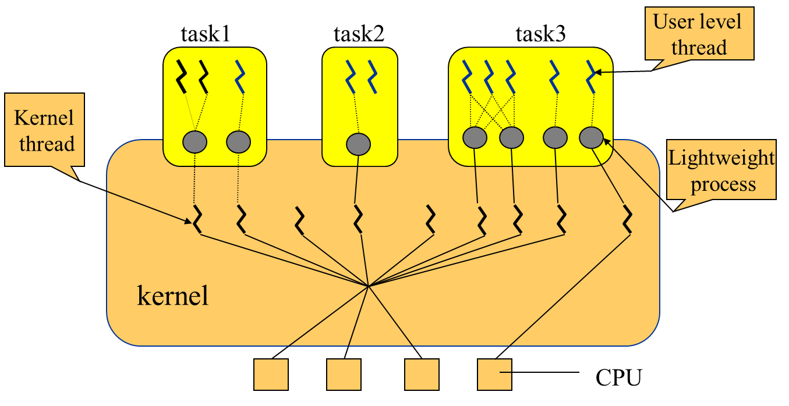
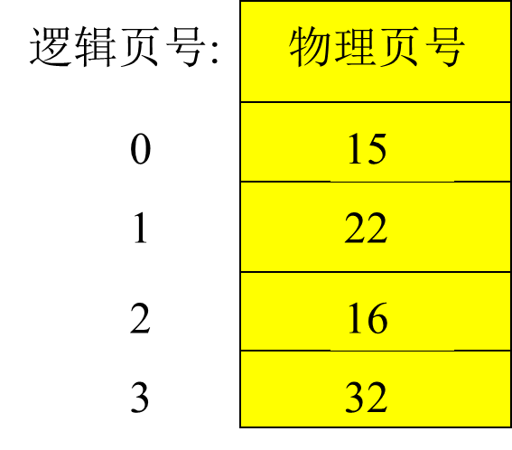
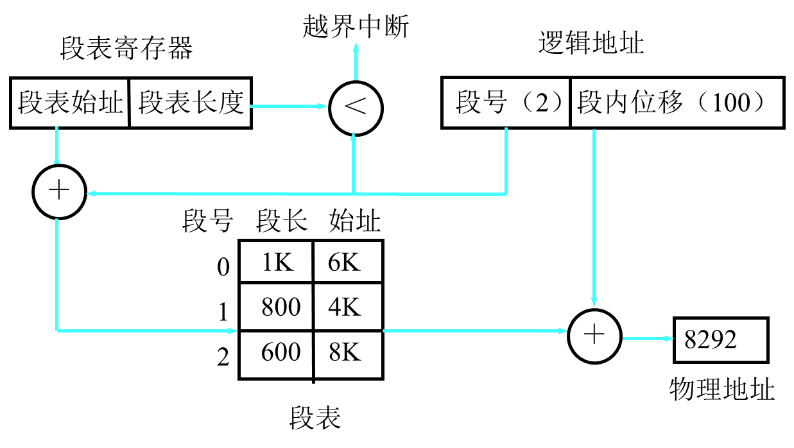
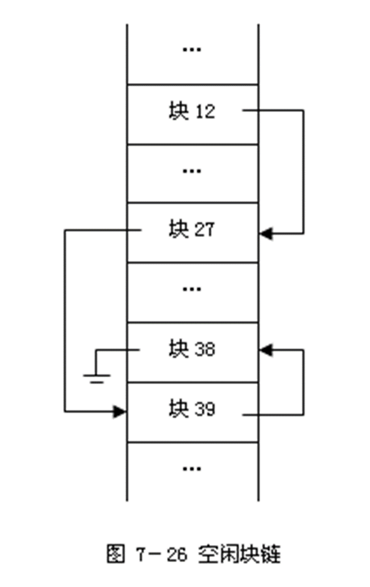

<center><font size ="36"><b>操作系统期末复习资料</b></font></center>


<div align = middle></div>


<div STYLE="page-break-after: always;"></div>

[TOC]

# 第一章 操作系统概述

## 1.1 操作系统的概念

### 1.1.2 操作系统的作用

操作系统有以下两个重要的作用：

1. 管理系统中的各种资源

   一个多道计算机系统可以同时为多个用户服务，在计算机系统中同时有多个程序在执行。这些程序在执行的过程中会要求使用系统中的各种资源。
   多个程序的资源需求经常会产生冲突，如果对程序的这些资源需求不加以管理，就会造成混乱甚至损坏设备。

   操作系统作为资源仲裁者，由它负责资源在各个程序中的调度，保证系统中的各种资源得以有效利用。

2. 为用户提供友好的界面

   随着硬件成本不断下降，计算机已经走进了家庭和办公自动化领域，计算机的使用者大多不是计算机专业人员，界面的友好性比资源的利用效率更加具有实际意义。目前商业化操作系统提供的图形用户界面（GUI）就是在此背景下的产物。

### 1.1.3 操作系统的定义

操作系统是位于硬件层之上、所有其他系统软件层之下的一个系统软件，通过它管理系统中的各种软件和硬件资源，使他们能够被充分利用，方便用户使用计算机系统。

## 1.2 操作系统的历史

作业：是用户向计算机提交任务的任务实体。

1. 作业是用户向计算机提交的任务实体。在用户向计算机提交作业完成后，系统将它放入外存中的作业等待队列等待执行。进程则是完成用户任务的执行实体。是向系统申请分配资源的基本单位。
2. 一个作业由多个进程组成，必须至少由一个进程组成，反过来不是。
3. 作业概念主要用于批处理系统中。

### 1.2.1 操作系统的产生

计算机操作系统从无到有的产生过程中经历了以下几个阶段：

#### 1.2.1.1 手动操作阶段（1940s）无操作系统

计算机诞生的初期没有操作系统，人们采用手动操作的方式使用计算机，典型的作业处理步骤如下：

1. 将程序和数据通过手动操作记录在穿孔纸带上；
2. 将程序穿孔纸带放到光电输入机上，出做事显示错误地址并修改指令；
3. 在电传打印机上输出运行结果。

显然这种操作方式有以下两个缺点：

1. 用户在作业处理的整个过程中独享系统中的全部资源；
2. 手动操作时间很长（人机矛盾）。

这种操作方式在计算机速度较慢的情况下是可以容忍的，但是当计算机速度大幅度提高之后，就会暴露出严重的缺点：手动操作时间远远大于程序运行时间。

因而，缩短手动操作时间在以晶体管为代表的第二代计算机出现后便成为亟待解决的问题。

汇编语言和汇编系统的出现在一定程度上减轻了用户使用计算机的负担。

#### 1.2.1.2 批处理阶段（1950s）批处理系统

**什么是批处理技术？**

批处理技术就是计算机对一批作业进行处理。
是把一批作业编成一个作业执行序列。
每一批作业将有专门编程的监督程序自动依次处理。
在这个时期的批处理是指单道批处理。

**单道批处理工作过程及单道批处理的概念**

监督程序将磁带（外存）上的第一个作业装入内存，把运行控制权交给该作业。
当作业处理完毕，又将控制权交给监督程序，再由监督程序把磁带（外存）上的第二个作业调入内存。
由于内存中始终只有一道作业。因此称为单道批处理系统。

**批处理技术有两种：**

1. 联机批处理：慢速的输入/输出设备直接和主机打交道。
2. 脱机批处理：这个方式的特征是增加一台不与主机直接相连，并且直接用于和输入/输出设备打交道的外围机，也叫卫星机。

**单道系统特点：自动性，顺序性，单道性**


为了缩短手动操作的时间，人们想到使作业到作业之间的过渡摆脱人为干预，实现自动化，如此便出现了批处理。
批处理经历了两个阶段，即联机批处理阶段和脱机批处理阶段。（是指I/O设备是否和主机相连）

1. 联机批处理

   操作员将若干作业合成一批，将其卡片依次放到读卡机上，监督程序（Monitor）通过内存将这批作业传送到磁带机上，大量作业在磁带机上排队等待处理。输入完毕，监督程序开始处理这一批作业。它自动将第一个作业读入内存，并对其进行汇编（或编译）、连接、执行、输出。第一个作业处理完立即开始处理第二个作业，如此重复，直至所有作业处理完，再处理第二批作业。

   优点：

   1. 作业自动转换，大大缩短了手动操作的时间。
   2. 出现了Monitor及相关软件的支持。

   缺点：作业由读卡机到磁带机的传输需要**处理机**完成，由于设备的传输速度远低于处理机的速度，在此传输过程中处理机仍会浪费较多时间。即I/O设备与CPU直接相连，CPU(主机)浪费。实际上还是处理机利用monitor程序来处理I/O。

   为克服联机批处理的缺点，引入了脱机批处理。基本思想是把**输入/输出操作**交给一个功能较为单纯的**卫星机**去做，使主机从繁琐的输入输出操作中解脱出来。

2. 脱机批处理

   待处理的作业由**卫星机**负责经读卡机传送到输入磁带上，主机从输入磁带读入作业、加以处理，并把处理结果送到输出磁带上，最后由**卫星机**负责将输出磁带上的结果在打印机上输出。

   优点：

   1. 卫星机与主机分工明确
   2. **并行**工作，提高了CPU的利用率。

   缺点：单任务系统；人工拆装磁带。

   批处理系统是操作系统的**雏形**。

为什么要产生脱机技术？
主要是解决CPU和外围设备之间速度不匹配的矛盾，CPU快，外围设备慢，读盘写盘都是机械方式慢。
因此把外围设备的输入输出处理和主机脱离，这样使得主机不用等待外围设备的输入输出。

特点：
减少处理机的空闲时间（因为处理机不管输入输出只负责数据处理）。
提高了输入输出速度（因为专门有一个外围机负责输入输出了）。

#### 1.2.1.3 执行系统阶段（1960s初期）多道程序设计

60年代初，硬件的重要进展：通道、中断技术

**通道：（channel）**

通道，也称**I/O处理机**，它具有自己的指令系统和运控部件，可接受处理机的委托执行通道程序，完成I/O操作。通道的I/O操作可与处理机的计算工作完全**并行**，并在I/O操作完成时向处理机发出中断请求。

**中断：（Interrupt）**

中断是指当主机接到某种外部信号(如I/O设备完成信号)时，马上暂停原来的工作，转去处理这一事件，处理完毕再回到原来的断点继续工作。

**假脱机(Spooling)**：

作业由读卡机到存储区的传输以及运行结果由存储区到打印机的传输由**通道**完成，这种方式既非联机，也非脱机（也不是依靠卫星机），称为“假脱机”或“伪脱机”。 优点：通道取代卫星机，免去了手工装卸磁带的麻烦。

执行系统阶段，Monitor常驻内存，是OS的**初级阶段**。

### 1.2.2 操作系统的完善

**多道系统工作流程：**

1. 用户所提交的作业都先存放在外存上并排成一个队列，称为“后备队列”；
2. 然后，由作业调度程序按一定的算法从后备队列中选择若干个作业调入内存，使它们共享 CPU 和系统中的各种资源。

**多道系统的基本原理：**本质上是同时把若干道程序放入内存，并使它们交替的执行。内存中同时存放几道相互独立的程序。

**多道的特点：**从它的定义中，我们就可以知道它的特点：

1. 多道：内存中同时存放几道相互独立的程序。
2. 宏观并行：多个作业调入内存，同时占有资源各自运行，但都未完成。
3. 微观串行：轮流占有处理机，交替执行。

**单道和多道的比较：**

根据单道和多道批处理系统的比较和特点，总结表格如下：

| **比较项**    | **单道批处理**                                      | **多道批处理**                                               |
| ------------- | --------------------------------------------------- | ------------------------------------------------------------ |
| **CPU利用率** | 当作业完成，而下一个作业还没被调入内存时，CPU空闲。 | 充分利用CPU，多道程序放入内存，并交替执行，使CPU始终处于忙状态。 |
| **复杂度**    | 相对简单。                                          | 比单道批处理复杂得多。                                       |
| **优点**      | -                                                   | 资源利用率高，系统对作业的吞吐能力提高。                     |
| **缺点**      | -                                                   | 平均周转时间长，无交互能力。                                 |
| **技术发展**  | -                                                   | 出现了分时系统、实时系统、个人计算机上的操作系统、网络操作系统、分布式操作系统、智能化操作系统等。 |

说明：在技术发展的过程中，严格用时间区分阶段没有意义，有些技术早已出现，只是后来才得到广泛应用和发展。

**分时系统**

- 基本原理：分时系统就是把处理机的运行时间分成很短的时间片（如几个毫秒)，按照时间片轮流把处理机分配给各个联机作业使用。每个用户在使用这些联机终端，好像自己独占机器一样。如：我用过的VAX8350小型机。一个小型机带几十个终端，每个用户使用终端，就像独占这个小型机一样。
- 分时系统中实现的关键问题：
  1. 及时接受：就是要及时的接受用户输入的数据或命令。首先采用多路卡，多路卡的作用是使主机能同时接收用户从各个终端上的输入。其次为每个终端配置一个缓冲区，用来暂存用户的键入。
  2. 及时处理：就是及时处理用户的键入和控制自己作业的运行。解决方法，首先，使所有用户的作业都直接进入内存，这样不用在外存驻留等待；其次，在不长的时间内，使每个作业都运行一次。

**分时系统的特征**：

-  多路性：一个主机与多个终端相连，系统按分时原则为每个用户服务。宏观上，多个用户同时工作，共享系统资源；微观上，每个用户轮流运行一个时间片。
-  交互性：以对话的方式为用户服务。
-  独占性：每个终端用户仿佛拥有一台虚拟机。

多道批处理系统和分时系统的出现标志OS已进入**完善阶段**

实时操作系统

实时系统是指系统能即时响应外部事件的请求，在规定时间内完成对事件的处理，并控制所有实时任务协调一致地运行。它分为实时信息处理系统和实时控制系统两大类。实时信息处理系统由一台或多台主机通过通信线路连接成百上千个远程终端，计算机接收从远程终端发来的服务请求，根据用户提出的问题，对信息进行检索和处理，并在很短时间内为用户做出正确的回答。

| 实时系统与分时系统的区别 | 实时系统                                       | 分时系统                                        |
| :------------- | ------------------------------------------------ | ------------------------------------------------- |
| 多路性 | 体现在对多路的现场信息进行采集、对多个对象或多个执行机构进行控制。 | 按分时原则为多个终端用户服务。                               |
| 独立性 | 每个终端用户向系统提出服务请求时，彼此独立操作，互不干扰；对信息的采集和对象的控制也彼此互不干扰。 | 每个用户各占一个终端，彼此互不干扰，独立操作。               |
| 及时性 | 以控制对象所要求的开始截止时间或完成截止时间来确定，一般为秒级。 | 用户的请求能在短时间（用户能接受的）内获得响应。             |
| 交互性 | 人与系统的交互，仅限于访问系统中某些特定的专用服务程序。     | 用户与系统进行广泛的人机对话，系统能向终端用户提供数据处理服务，资源共享等服务。 |
| 可靠性 | 高度可靠                                                     | 可靠程度较低                                                 |

传统操作系统的三大类别：

1. 多道批处理操作系统
2. 分时操作系统
3. 实时操作系统。

一个实际的操作系统可能兼具三者或其中两者的功能。

通用操作系统(60年代后期)：将多道批处理、分时和实时等功能结合在一起构造出的多功能的操作系统，称为通用操作系统。

### 1.2.3 操作系统的发展

目前，较优秀的实用操作系统：UNIX(美国Bell Labs)、Windows(美国微软)、Linux(自由软件)。
近30年来，OS取得了很大发展，主要表现在：

1. 硬件体系结构由集中向分散发展，出现计算机网络，为此网络操作系统和分布式操作系统应运而生。
2. 微处理机的发展使家庭和商用的微型机得到了普及。为方便非计算机专业人员使用，OS提供了友好的操作界面。
3. 在科学和军事领域，大型计算任务要求极强的计算处理能力，多处理机并行成为必然，由此产生并行操作系统。
4. 随着处理机芯片和各种存储介质在各种控制领域的广泛应用，嵌入式和智能卡操作系统应运而生。为降低开发代价，尝试从不同应用中抽取具有共性的东西，并做成很小的操作系统核心，由此产生了微内核操作系统体系结构。

## 1.3 操作系统的特性

### 1.3.1 并发性

程序并发指计算机系统中同时存在多个程序，宏观上，这些程序同时向前推进。

**并发**：指在计算机系统中同时存在着多道运行的程序（进程）。

宏观上：多道程序同时在执行
微观上：任何时刻只有一道程序在执行，即微观上多道程序在CPU上轮流（交替）执行（单机）

**并行**(parallel)：与并发相似，指多道程序在同一时刻执行，但需多个硬件支持。

程序并发与程序并行的区别：

1. **程序并行**要求微观上的同时，即在绝对同一时刻有多个程序同时向前推进；
2. **程序并发**并不要求微观上的同时，只需要在宏观上看来多个程序都在向前推进。

注意：在单处理机操作系统中，通常使用并发这个术语，尽管处理机与设备之间、设备与设备之间可以并行工作。
注意：并发是操作系统最重要的特征，其他特征都是以**并发为前提**。

### 1.3.2 共享性

**资源共享**是指操作系统程序与多个用户程序共用系统中的各种**资源**，这种共享是在操作系统的控制下实现的。

资源包括：：中央处理器，内外存储器，外部设备等。

共享有两种形式：**互斥共享**和**同时共享**。

互斥共享：系统中有一些资源，当一个进程正在访问该资源时，其他进程必须等待，直到该进程访问完并释放这些资源时，其他进程才能访问这些资源。这就是互斥共享，互斥共享的资源叫**临界资源**。如：打印机等物理设备或者表格就是临界资源，它们要求互斥共享。

同时共享：系统中有一类资源，允许在一段时间内，由多个进程同时对其访问。这就是同时共享，**本质还是宏观上时同时，微观上是交替分时的**。如，磁盘，同时可以多个进程访问磁盘。


**注意：并发和共享是OS的两个最基本特征，它们互为存在条件。**这是因为：

- 只有进程的并发执行，才可能要求资源共享。
- 也只有资源能够合理的实现共享，进程才能并发执行

### 1.3.3 异步性

**概念：**有些课本叫做不确定性或随机性。是指操作系统控制下的多个作业的运行顺序和每个作业的运行时间是不确定的，也就是进程在执行中，其执行时间、顺序、向前推进的速度和完成的时间等都是不可预知的。因此先进入内存的作业可能比后进入的作业后完成。

**原因：**造成不确定性的原因，并发进程中资源限制等原因。例如，在单处理机环境下，由于系统中只有一个处理机，因此每次只允许一个进程占有其执行，其余进程只能等待，造成异步，这样先得到处理机或其他资源的进程先完成。

### 1.3.4 虚拟性

虚拟(virtual)的本质含义是把物理上的一个变成逻辑上的多个。也就是把一个物理实体映射为若干个对应的逻辑实体——分时或分空间。
物理上是实际存在的；逻辑上是虚拟的。

如：多道分时技术能把一台物理CPU虚拟为多台逻辑上的CPU。还有虚拟存储器技术和虚拟设备技术等。

## 1.5 操作系统的硬件环境

### 1.5.1 定时装置

为实现系统管理和维护，硬件必须提供**定时装置，即实时时钟**。硬件时钟通常有两种：绝对时钟和相对时钟

根据绝对时钟和间隔时钟的定义和特点，总结表格如下：

| **时钟类型**     | **绝对时钟**                                                 | **间隔时钟**                                                 |
| ---------------- | ------------------------------------------------------------ | ------------------------------------------------------------ |
| **定义**         | 记载实际时间，不发中断。                                     | 定时发生中断，也称为闹钟，每隔固定时间（如10ms）发生一次时钟中断。 |
| **时间表示**     | 年、月、日、时、分、秒。                                     | 不直接表示时间，按固定时间间隔发生中断。                     |
| **时间值保存**   | 硬件寄存器中，开机时由电源供电，关机时由机内电池供电。       | 不适用。                                                     |
| **修改方式**     | 通过特权指令设定和修改，程序可以读取值。                     | 不适用。                                                     |
| **用途**         | 记录作业进入系统时间和处理时间、文件的修改和存取时间、资源占用时间、日志记录时间等。 | 每次中断OS获得控制权，运行系统管理和实现程序并发。           |
| **事件引发**     | 不发中断。                                                   | 定时中断，间隔时钟是现代操作系统（多道程序设计）的基础。     |
| **实现逻辑时钟** | 不适用。                                                     | 通过设定变量和每次中断减值实现逻辑时钟。                     |

**解释**

1. **绝对时钟**：记录实际的时间，**不会引发中断**，主要用于记录和追踪系统中的各种时间数据，如作业处理时间、文件修改时间等。
   时间值保存在硬件寄存器中，依靠电源和电池维持计时。
2. **间隔时钟**：也称为闹钟，会**定时引发中断**（例如每10ms），使操作系统可以在固定时间间隔获得控制权，便于进行系统管理和实现程序并发。
   间隔时钟可以通过设定变量和每次中断减值的方式实现逻辑时钟。

通过上表和解释，可以更清楚地理解绝对时钟和间隔时钟的功能和用途。

### 1.5.2 系统栈

**系统栈**是内存中操作系统空间的一个固定区域（在操作系统空间）
系统栈的主要用途：

1. 中断响应时**保存中断现场**。对于嵌套中断，被中断程序的现场信息依次压入系统栈，中断返回时逆序弹出；
2. 保存操作系统子程序间相互调用的参数、返回值、返回点以及子程序的局部变量。

注意：

1. 每个运行程序都有一个对应的系统栈；
2. 进程切换的同时伴随系统栈的切换；
3. 但硬件只有一个系统栈指针作用。

### 1.5.3 寄存器

硬件系统提供一套寄存器，由运行进程使用。程序切换时，一般需要把寄存器的当前值保存起来，再次运行前再恢复，这些寄存器如下：

1. **程序状态字（PSW）**

   **程序状态字**由16B组成，表示当前程序的运行环境，每个X表示1B（4b）：

   1. 前8位为**系统屏蔽位**，0~6位分别对应7个通道，第7位对应外中断；
   2. 12~15位为**CMWP**；
   3. 16~31为**中断码**，用于保存中断字（详细中断信息）；
   4. 36~38为**程序屏蔽位**，分别对应定点溢出、十进溢出、阶下溢。

   有些中断是**不可屏蔽**的，如时钟、地址越界、缺页、非法指令。

   **注意：**PSW与PSW寄存器是两个东西

   PSW寄存器包括以下内容：

   - 程序基本状态：
     1. 下一条指令的地址；
     2. 条件码；
     3. 处理器状态；

   - 中断码：**保存程序执行时当前发生的中断事件**；

   - 中断屏蔽位：指明程序执行中发生中断事件时，是否响应出现的中断事件；

2. **指令计数器（PC）**

   记载运行下一条指令的地址。

3. **栈指令（SP）**

   **管态**和**目态**各一个，分别保存系统栈和用户栈的栈顶位置。

4. **通用寄存器（regs）**

   若干个，用于存数和计算，还可以用来保存系统调用时传给操作系统的参数，以及由操作系统传给用户的返回值。

5. **浮点寄存器（fregs）**

   同上。

6. **地址映射寄存器**

   一般有一对，分别记录内存区域的起始地址和长度，分别称为**基础寄存器（base）**和**限长寄存器（limit）**。

### 1.5.4 特权指令与非特权指令

现代计算机的指令系统由特权指令集和非特权指令集两部分组成，它们的使用与系统状态有关。

1. **特权指令**（privileged instruction）

   只有在**管态**才能执行的指令。

   特权指令的执行**不仅影响运行程序本身，也影响其他程序和OS**。例如，开关中断、**置程序状态字**、修改地址映射寄存器、停机等。

   注意：一般只有OS能执行特权指令，用户程序不能执行。

2. **非特权指令**（non-privileged instruction）

   在管态和目态下均可执行的指令。

   非特权指令的执行**只与运行程序本身有关，不影响其它程序和OS**。例如数据传送指令、算术运算指令等。


### 1.5.5 处理器状态及状态转换

处理机状态也称机器状态。处理机状态有两种：管态和目态。它由程序状态字PSW中的一位标识。

根据管态和目态的定义和特点，总结表格如下：

| **状态**       | **管态 (supervisor mode)**                         | **目态 (object mode)**                                 |
| -------------- | -------------------------------------------------- | ------------------------------------------------------ |
| **别名**       | 系统态、核心态                                     | 用户态                                                 |
| **适用范围**   | 操作系统运行时所处的状态                           | 一般用户程序运行时所处的状态                           |
| **可执行指令** | 可执行硬件提供的全部指令，包括特权指令和非特权指令 | 只能执行非特权指令                                     |
| **权限**       | 可以修改PSW（程序状态字），因此可以改变机器状态    | 不能执行“置程序状态字”指令，不能将运行状态改为管态     |
| **安全性**     | 具有最高权限，可以执行所有系统操作                 | 受限权限，不能修改系统关键状态，防止用户侵入系统       |
| **用途**       | 系统管理和控制，操作系统需要的特权操作             | 用户应用程序运行，保护系统不受用户程序的影响           |
| **状态转换**   | 可以通过修改PSW转换为目态                          | 无法直接转换为管态，必须通过操作系统提供的服务请求转换 |

- **管态 (supervisor mode)**：操作系统运行时所处的状态，具有最高权限。机器处于管态时，可以执行所有的硬件指令，包括特权指令和非特权指令。通过修改程序状态字（PSW），可以改变机器状态，使其转换为目态。管态用于系统管理和控制，执行需要特权的操作。

- **目态 (object mode)**：用户程序运行时所处的状态，权限受限。处理机处于目态时，只能执行非特权指令，不能执行“置程序状态字”指令，因此不能将运行状态改为管态。这种设计是为了保护系统，防止用户程序有意或无意地侵入和破坏系统。目态用于用户应用程序的运行。

管态与目态之间的状态转换

在系统运行过程中，处理机的状态处于动态变化之中，时而运行于目态，时而运行于管态。

1. 管态 :arrow_right: 目态 

   管态到目态的转换由**修改程序状态字（PSW）**来实现。

   由于操作系统运行于管态，用户程序运行于目态，因而该状态转换伴随着由操作系统程序到用户程序的转换。
   
2. 目态 :arrow_right: 管态

   处理机状态由目态转为管态的**唯一途径**是**中断**。

   中断发生时，中断向量中的PSW应标识处于**管态**，这一标识由操作系统初始化程序设置。

用户程序在目态下运行时不能直接使用I/O指令等特权指令。只有当用户程序执行到访管指令产生一次中断后，使机器在原来的目态下执行用户程序变成在管态下执行操作系统的系统调用程序。所以从目态转换成管态的唯一途径是中断。

**产生中断意味着当前程序不能继续执行，处理机需分配执行中断服务例程，而分配CPU则是管态才能执行的**

访管指令的操作原理：

- 当源程序中有需要操作系统服务的要求时，编译程序就会在由源程序转换成的目标程序中安排一条“访管指令”并设置一些参数。当目标程序执行时，中央处理器若取到了“访管指令”就产生一个中断事件，**中断装置就会把中央处理器转换成管态，并让操作系统处理该中断事件。**
- 操作系统分析访管指令中的参数，然后让相应的“系统调用”子程序为用户服务。系统调用功能完成后，操作系统把中央处理器的管态改为目态，并返回到用户程序。
- 从程序调用的角度来看，用户应用程序中要调用一些子程序。子程序可以分为用户自己编写的子程序和软件提供的子程序，**对后者的访问即被称为访问系统程序（访管）指令，又称为陷阱（TRAP）指令。**
- 访管指令并不是特权指令。所谓特权指令，是指用于操作系统或其他系统软件的指令，一般不提供给用户使用。

### 1.5.6 地址映射机构

在多道程序系统中，内存中同时存在多个程序，一个程序在内存中的存放位置是随机确定的，因此程序不能采用物理地址，只能采用逻辑地址。

为使每个程序的每个基本单位都能从0开始编址，硬件需要提供**地址映射机构**，它负责将运行程序产生的逻辑地址变换为内存物理地址。

地址映射机构在不同硬件环境中不尽相同。

### 1.5.7 存储保护设施

在多道程序系统中，一个程序有意或无意产生的错误地址可能会侵犯其它程序空间甚至操作系统空间；一个程序对公共存储区域可能试图执行非法操作(越权)，这些都可能影响其他程序甚至整个系统。为防止这些情况的发生，硬件必须提供**存储保护设施**。

存储保护设施的作用：

进行地址越界检查和越权检查(对共享区域)，防止应用程序侵犯操作系统空间或其它应用程序空间。

### 1.5.8 中断装置

发现并响应中断的硬件机构。
中断装置具有两个功能：

1. **发现中断**：中断发生时能识别，有多个中断事件同时发生时，能按优先级别响应最高者。
2. **响应中断**：先将当前进程的中断向量(PSW和PC)压入**系统栈**，再根据中断源到指定内存单元将新的中断向量取来并送到**中断向量寄存器**中，从而转到对应的中断处理程序。

### 1.5.9 通道与DMA控制器

#### 1.5.9.1 通道
负责I/O操作的处理机，具有自己的指令系统和运控部件，可以执行通道程序，完成CPU委托的I/O操作任务。
#### 1.5.9.2 DMA (Direct Memory Access，直接内存访问)
DMA是与通道相似的I/O方式，DMA控制器接受CPU的委托完成数据在内存与块型设备之间的传输。与通道相比，DMA没有独立的指令系统，只能进行简单的块传输。　

## 1.7 操作系统的运行机理

<div align = left></div>

操作系统是**中断驱动**的，考虑系统中并发执行的两个程序P1和P2，假若时刻t1程序P1执行，时刻t2程序P2执行，t1<t2，则在时刻(t1，t2)之间一定发生过中断，即**中断是程序切换的必要条件**。

实际上，程序P1不可能将CPU的使用权直接交给程序P2，将处理机的使用权由P1转交给P2只能由操作系统完成，而操作系统要完成CPU的重新分配必须首先获得CPU的使用权。**目态到管态的唯一途径是中断**

操作系统如何取代P1获得CPU的使用权？

**唯一的途径是通过中断。**

中断将引出新的PSW并导致系统由目态转到管态，即进入操作系统。操作系统在执行完中断例程之后，也可能继续执行P1，也可能决定执行P2，这与CPU的调度原则有关。在后一种情况下，操作系统将保存P1的状态信息，然后恢复P2的状态信息并通过置PSW使系统转到目态运行P2。

引起中断的事件有些与运行程序有关，如访管、地址越界、非法指令、溢出等；有些与运行进程无关，如系统时钟、I/O设备完成信号等。

## 1.8 研究操作系统的几种观点

根据进程观点、资源管理观点和虚拟机观点，总结表格如下：

| **观点**         | **描述**                                                     | **核心问题/特点**                                            | **操作系统的角色**                                           |
| ---------------- | ------------------------------------------------------------ | ------------------------------------------------------------ | ------------------------------------------------------------ |
| **进程观点**     | 将系统看成由若干个可以独立运行的程序和一个对这些程序进行协调管理的核心组成，这些运行的程序称为进程。 | 互斥、同步、通信、死锁、饥饿等。                             | 协调进程之间的相互作用，使各进程正常结束并得到正确的执行结果。 |
| **资源管理观点** | 计算机系统中配备有多种软硬件资源，这些资源通常是独占型的，并发执行的进程在运行过程中会使用这些资源。操作系统负责管理这些资源。 | 资源分配冲突，如两个进程同时申请某一独占型设备。             | 资源管理程序，管理硬件资源（处理器、内存、设备等）和软件资源（文件、数据等）。 |
| **虚拟机观点**   | 操作系统是硬件上运行的第一层系统软件，对硬件功能进行第一次扩充，使计算机系统功能强大、使用方便。 | 构造虚拟设备、实现虚拟存储、利用分时技术将一个处理器改造成多个虚拟处理器等。 | 提供虚拟机功能，扩展硬件功能，构造虚拟设备和虚拟处理器等。   |

**解释**

1. **进程观点**：操作系统被视为一个核心，负责协调多个独立运行的进程。每个进程完成特定任务，但进程之间可能发生互斥、同步、通信、死锁和饥饿等相互作用问题。操作系统的主要职责是协调这些相互作用，确保进程正常完成任务并获得正确的执行结果。

2. **资源管理观点**：操作系统是资源管理程序，负责管理计算机系统中的各种硬件和软件资源。由于资源通常是独占型的，多个并发进程可能会在运行过程中发生资源冲突。操作系统需要制定策略公平而高效地分配资源，解决资源冲突问题。

3. **虚拟机观点**：操作系统是硬件上运行的第一层系统软件，负责扩展硬件功能，构造虚拟设备和虚拟处理器等，使计算机系统功能更强大、使用更方便。通过虚拟化技术，操作系统提供了一种增强的计算机使用体验。

通过上表和解释，可以更清晰地理解操作系统的不同观点及其核心问题和特点。

# 第二章 进程、线程与作业

## 2.1 多道程序设计

多道程序设计是OS所采用的最基本、最重要的技术，其根本目标是提高系统的效率。衡量系统效率的一个尺度是吞吐量。

吞吐量：单位时间内系统所处理的作业的道数。

$吞吐量=\frac{作业道数}{全部处理时间}$

### 2.1.1 单道程序设计的缺点

1. 设备资源利用率低：

   单道程序系统中，内存中仅存在一个程序，该程序仅能用到设备集中的一个子集，未被用到的外设资源便被浪费。

2. 内存资源利用率低：

     随着硬件技术的提高，内存容量不断增加，目前已达上百兆或几个G，而一般程序的长度远小于内存容量。若采用单道程序设计，则内存空间的浪费很大。

3. 处理器资源利用率低：

     中断，通道，DMA控制器的引入，使处理器与I/O设备的可以并行。

     如下图所示，t2时刻CPU启动了设备，t5时刻设备发出完成数据传输中断。若CPU的工作不需要等待数据传输完成，则可以提前安排在t2\~t5期间内做；若CPU进行的工作需等待I/O传输结果，在t5\~t6期间内做，则t2\~t5期间内CPU将空闲此时**应该并行提高效率**。

<div align = left></div>

### 2.1.2 多道程序设计的提出

如果允许多个程序同时进入系统，即增加资源使用者的数量，则资源利用率应能得到提高，这就引入了多道程序系统。

多道程序设计对资源利用率的影响：

1. 设备资源利用率提高

   若允许若干个搭配合理的程序同时进入内存，这些程序分别使用不同的设备资源，则系统中**各种设备资源都会被用到并经常处于忙碌状态，设备利用率将得到明显提高。**

2. 内存资源利用率提高

   允许多道程序同时进入系统可避免单道程序过短而内存空间很大所造成的存储空间浪费。

3. 处理器资源利用率提高

   在单道程序系统中，处理机资源利用率低的主要原因是当运行程序等待I/O操作完成时，处理机被闲置。若将两道程序同时放入内存，在一个程序等待I/O操作期间，处理机执行另一个程序，便可提高处理机的利用率。

如下图所示，t2时刻程序A放弃处理机，但程序B暂不具备运行条件，t3时刻程序B获得CPU并运行，t4时刻程序B启动I/O设备2，然后等待I/O传输完成。

<div align = left></div>

如果增加内存中程序的道数，处理机资源的利用率可进一步提高。理论上，当内存中程序的道数充分多时，处理机的利用率可达到100%。

综上分析，多道程序设计可有效地提高系统资源的利用率，从而提高系统吞吐量。那么内存的程序数量是否越多越好呢？也就是道数是不是越多越好呢？

答案是否定的。

首先，**内存容量**限制了系统可同时处理的程序数量；

其次，**物理设备的数量**也是一个制约条件。如果内存中同时运行的程序过多，这些程序可能会相互等待被其它程序占用的设备资源，反而会影响系统效率；

另外，内存中过多的程序会形成对**处理机资源的激烈竞争**，既可能影响系统的响应速度，也会增加因处理机分配而带来的系统开销。

一般地，确定内存中同时容纳程序的数量，应考虑机器的配置情况。

**结论：增加同时运行程序的道数可提高系统资源利用率，从而提高系统效率，但道数应与系统资源数量相当。道数过少，系统资源利用率低；道数过多，系统开销增大，程序响应速度下降。**

### 2.1.3 多道程序设计的问题

多道程序设计改善了系统资源的利用率，增加了吞吐量，提高了系统效率，但同时也带来了新的问题：即资源竞争。

需解决以下问题：

1. 处理机资源管理问题

   如果可运行程序的个数多于处理机的个数，则需解决可运行程序与处理机资源的竞争问题，即需要对处理机资源加以管理，实现处理机资源在各个程序之间的分配和调度。

2. 内存资源管理问题

   1. 内存划分问题
   2. 逻辑地址映射到内存物理地址，即重定位
   3. 存储空间的保护。

3.  设备资源管理问题

   尽管操作系统在选择程序进入系统时可以使进入系统的程序搭配相对合理，但**由于程序使用资源的不确定性以及程序推进速度的不确定性，内存中的多道程序在使用设备时经常发生冲突**，即多个程序同时要求使用同一资源，这就要求操作系统确定适当的**分配策略**，并据此对资源加以管理。

## 2.2 进程的引入

多道程序系统中一个程序的活动规律是：

推进→暂停→推进→暂停→…

**程序暂停时需将现场信息作为断点保存起来；**

**程序推进时需恢复上次暂停时的现场信息，并从断点处继续执行。**

可见，在多道系统中运行的程序需要一个保存断点现场信息的区域，这个区域保存的正在运行程序的现场信息。因此，**需要一个能更准确地描述多道系统中正在执行中的程序的术语**，这就是进程(process)。

### 2.2.1进程的概念

进程是操作系统乃至并发程序设计中一个非常重要的概念。什么是进程？目前尚无统一定义。确切地说，关于进程有许多解释，这些解释并不完全等价，比如：

1. 进程是程序的一次执行；
2. 进程是可参与并发执行的程序；
3. 进程是一个程序与数据一道通过处理机的执行所发生的活动；
4. 所谓进程，就是一个程序在给定的空间和初始环境下，在一个处理机上的执行过程。

定义：**进程是具有一定独立功能的程序关于一个数据集合的一次运行活动。**可并发执行的程序在一个数据集合上的运行过程。

上述这些定义都强调了程序的执行，这是进程的动态特性，是进程与程序之间的本质差异。

进程具有并发性，可与其它进程同时运行。

### 2.2.2 进程状态及状态转换

进程在其生存期内可能处于三种基本状态之一：

1. **运行态(RUN)：**

   进程占有CPU，正在向前推进。
   显然，单处理机系统中任一时刻只能有一个进程处于运行态。

2. **就绪态(READY)：**

   进程本身具备运行条件，但未得到CPU。

   进程被创建时处于就绪态，进程创建成功，此时把该进程插入到就绪队列中。

3. **等待态(WAIT)阻塞：**

   进程正等待某一个事件的发生，即使给它分配处理机也不能运行。

   进程等待态，也称挂起态(Suspended)、阻塞态、封锁态(Blocked)、睡眠态(Sleep)。

   进程处于等待态时，本身不具备运行条件，即使给它分配处理机也不能运行。

   此时，进程正等待某一个事件的发生，比如，等待某一资源被释放，等待与该进程相关的I/O传输完成等。

**运行、就绪、等待是进程的三种最基本的状态。对于一个具体系统来说，为了实现某种设计目标，进程状态的数量可能多于三个。**

就绪:arrow_right:运行：获得处理机

运行:arrow_right:就绪：剥夺处理机

运行:arrow_right:等待：申请资源未得到，启动I/O传输未完成

等待:arrow_right:就绪：得到所申请资源，I/O传输完成

<div align = left></div>

进程状态转换由操作系统完成，对用户透明。

**注意：**对于不同的处理机调度算法，上述进程转换图可能略有不同。例如**对于非剥夺调度，不存在由运行到就绪的状态转换。**

### 2.2.3 进程控制块

多道系统中运行的程序需有一个断点现场保存区域，该区域设在进程控制块中。

进程控制块是进程存在的标志，它由一组信息构成，这些信息是系统对进程进行管理所需要的。

**定义：进程控制块是标志进程存在的数据结构，其中包含系统对进程进行管理所需要的全部信息。**

**是进程实体的一部分，是描述和控制、管理进程的记录型数据结构，是进程存在的唯一标志。**

对不同的操作系统，PCB中信息的数量和内容不尽相同。一般地，系统规模越大，功能越强，其PCB中信息的数量也越多。

一般操作系统中PCB所包含的项目如图2-4所示：

1. **进程标识：**通常为一整数，称为进程号，用于区分不同的进程。

2. **用户标识：**通常也为一整数，称作用户号，用于区别不同的用户。
   一个进程号与唯一一个用户号对应，而一个用户号可与多个进程号对应，即一个用户可同时有多个进程。

3. **进程状态：**在就绪、运行、等待之间动态变化。

4. **调度参数：**用于确定下一个运行的进程。

5. **现场信息：**用于保存进程暂停的断点信息，包括通用寄存器、地址映射寄存器、PSW、PC

6. **家族联系：**记载本进程的父进程。

7. **地址信息：**记载进程所对应程序的存储位置和所占存储空间大小，具体内容与存储管理方式有关。

8.  **当前打开文件：**用于记载进程当前使用的文件，通过它与内存文件管理表目建立联系，通过该表可找到保存在外存中的文件。

9. **消息队列指针：**指向本进程由其它进程接收到的消息所构成的消息队列的链头。

10. **资源使用情况：**记载该进程生存期内所使用的系统资源和使用时间，用于记帐，对同一用户，他的全部进程所使用的资源都记载在该用户的帐目下。

11. **进程队列指针：**用于构建PCB队列，它是系统管理进程所需要的。


<div align = left></div>

### 2.2.4 进程的组成与上下文

进程由两部分组成：进程控制块PCB和程序，其中程序包括代码和数据等，**进程由三部分构成，PCB，操作集，数据集**。

1. 进程控制块PCB

   PCB是进程的“灵魂”。由于PCB中包含程序的地址信息，通过它可找到程序在内存或外存的存放地址。

   PCB存于**系统空间**，只有操作系统能够对其存取，用户程序不能访问。实际上用户甚至感觉不到PCB的存在。

   Linux的进程控制块为一个由结构task_struct所定义的数据结构，task_struct存放在/include/linux/sched.h

2. 程序

   **程序**是进程的“躯体”，其中包括**代码**和**数据**两部分。

   **代码**在运行期间不修改自身，以支持程序共享。另外，在多道系统中，内存中同时存在多个程序，这些程序在内存中的存放位置**随机确定**，且在运行过程中可能会发生变化，因而代码必须能够浮动，即**不采用绝对地址**。

   **数据**一般包括静态变量、动态堆和动态栈。**堆**用来保存动态变量，**栈**用来保存用户子程序相互调用时的参数、局部变量、返回值、断点等。

   数据一般归进程私用，当然也有系统提供进程间数据共享功能，以实现进程间的信息交换。

进程有两种表记方法，表记1将代码和数据看作一个整体，表记2强调代码部分的可共享性。

<div align = left></div>

**注意：PCB属于操作系统空间，而程序属于用户空间。进程代码与数据也称为进程映像。**

进程运行时OS需为其设置相应的**运行环境**，如系统堆栈、地址映射寄存器、打开文件表、PSW与PC、通用寄存器等。

**进程上下文：在UNIX System Ⅴ中，将进程的物理实体(PCB+程序)与支持进程运行的物理环境称为进程上下文。**

**进程切换过程就是进程上下文切换的过程。**进程切换所需时间是系统为实现并发而付出的额外代价，属于系统开销的一部分。

**系统开销**：系统开销一般指运行操作系统程序，对系统进行管理而花费的时间和空间。

### 2.2.5 进程的队列

为实现对进程的管理，系统需按照某种策略将进程排成若干队列，由于PCB是进程的代表，因而，进程队列实际上是由进程PCB构成的队列。该队列也称PCB链，可单向，也可双向。单向链如图2-6所示：

<div align = left></div>

注意，虽然用“队列”这一术语，PCB入队列和出队列不一定完全按FIFO的次序，这与系统对进程的管理策略有关。

通常，进程队列分为如下三类：

1. 就绪队列
   **整个系统一个**。所有处于就绪状态的进程按某种组织方式排在这一队列中，进程入队列和出队列的次序与处理机调度算法有关。
   **注意：**某些系统中就绪队列可能有多个，用以对就绪进程分类，以方便某种调度策略的实施。
2. 等待队列
   **每个等待事件一个**。当进程等待某一事件时，进入与该事件相关的等待队列中；
   当某事件发生时，与该事件相关的一个或多个进程离开相应的等待队列，进入就绪队列。
3. 运行队列
   在单CPU系统中只有一个，在多CPU系统中**每个CPU各有一个**。
   每个队列中只有一个进程，指向运行队列头部的指针被称作**运行指示字**。

### 2.2.6 进程的种类和特性

从OS角度，进程可分为**系统进程**和**用户进程**。

#### 2.2.6.1系统进程

系统进程属于OS的一部分，它们运行OS程序，完成OS的某些功能。一个系统进程所完成的任务一般是相对独立和具体的，且在进程的生存期内不变，因而**它们通常对应一个无限循环程序**，在系统启动后便一直存在，直到系统关闭。

现代操作系统内设置很多系统进程，完成不同的系统管理功能。**系统进程运行于管态**，可执行包括特权指令在内的所有机器指令。由于系统进程负担系统管理和维护任务，**其优先级通常高于一般用户进程的优先级。**

#### 2.2.6.2 用户进程

用户进程运行用户程序，直接为用户服务。

所谓“用户程序”，不一定是用户自己编写的程序，例如，用户在编译一个C程序时，需要运行C语言的编译程序，该**程序在目态运行**，但并不是用户自己编写的。在操作系统之上运行的所有应用程序都被称为**用户进程**。

#### 2.2.6.3 进程的特性

1. **并发性：**可与其它进程一道在宏观上同时向前推进。
2. **动态性：**进程是执行中的程序。进程的动态性还体现在如下两个方面：首先，进程是动态产生、动态消亡的；
   其次，在进程的生存期内，其状态处于动态变化之中。
3. **独立性：**进程是调度的基本单位，它可以获得处理机并参与并发执行。
4. **交往性：**进程在运行过程中可能会与其它进程发生直接或间接的相互作用。
5. **异步性：**每个进程都以其相对独立、不可预知的速度向前推进。
6. **结构性：**每个进程有一个控制块PCB。

### 2.2.7 进程间的相互联系与相互作用

1. 相关进程：在逻辑上具有某种联系的进程称作相关进程。
   例如，进程P0在运行过程中创建了子进程P1和P2，进程P1产生的输出作为P2的输入，则P1和P2是相关进程。
   **进程P1和P2与进程P0之间存在父子关系，也是相关进程。一般地，属于同一进程家族内的所有进程都是相关的。**
2. 无关进程：**在逻辑上没有任何联系的进程称作无关进程。**
   例如，对于两个相互之间没有交往的用户来说，其进程是不相关的。
   **无关进程间虽没有逻辑关系，但有资源竞争关系，如互斥、死锁、饿死等。*

进程间的相互作用：并发进程之间存在的相互制约关系称作进程间的相互作用。

进程间相互作用的方式有两种：

1. 直接相互作用**直接制约**：
   进程之间不需通过中间媒介而发生的相互作用，这种相互作用通常是有意识的。例如，进程P1将一个消息发送给进程P2，进程P1的某一步骤S1需要在进程P2的某一步骤S2执行完毕之后才能继续，等等。
   直接相互作用只发生在**相关进程之间**。
2. 间接相互作用**间接制约**：
   进程之间需通过某种中间媒介而发生的相互作用，这种相互作用通常是无意识的。例如，进程P1欲使用打印机，该设备当前被另一进程P2所占用，此时P1只好等待，待P2用完并释放该设备时，将P1唤醒。
   间接相互作用可能发生在**任意进程之间**。

### 2.2.8 进程的创建、撤销与汇聚

用户进程常通过系统调用创建，一般至少包括两个相关的系统调用：创建进程、撤销进程。

在UNIX系统中的命令格式如下：

1. 进程创建：pid = fork()
   创建子进程所完成的工作如下：
   1. 建立一个PCB，并对其内容进行初始化。
   2. 为该进程分配必要的存储空间，并加载所要执行程序。(在UNIX系统中需通过另外一个系统调用execl实现)
   3. 将PCB送入就绪队列。
2. 进程结束**：** exit(status)
   完成使命的进程需终止自己并告知OS。这在UNIX系统中通过exit系统调用实现。
   exit命令的执行将进入OS，系统将对进程进行善后处理(收集进程状态信息、通知其父进程等)，再收回进程所占有的所有资源，最后撤销其PCB。
   除正常终止外，地址越界、非法指令、来自用户或父进程的kill信号等可能导致进程的非正常终止，非正常终止也将进入OS进行善后处理。

体现生灭过程的进程状态转换图如图所示：

<div align = left></div>

**注意：进程的创建与结束属于OS中的系统调用，而其它状态转换条件对应OS核心中的内部函数。**

### 2.2.9 进程与程序的联系和差别

根据进程和程序的定义、理解以及区别，总结表格如下：

| **比较项**    | **进程**                                                     | **程序**                                                 |
| ------------- | ------------------------------------------------------------ | -------------------------------------------------------- |
| **定义**      | 一个可并发执行的程序对某个数据集在处理机上的执行过程和分配资源的基本单位。 | 一个在时间上严格次序前后相继的操作，是一个静态的概念。   |
| **实例**      | 应用程序的一次动态执行。                                     | 要实现功能的顺序步骤。                                   |
| **存在条件**  | 只有在内存里才有意义。                                       | 在内存中或硬盘上都有意义。                               |
| **动态/静态** | 动态概念。                                                   | 静态概念。                                               |
| **并发性**    | 有并发性。                                                   | 无并发性。                                               |
| **资源分配**  | 计算机资源分配的基本单位。                                   | 不是资源分配的单位。                                     |
| **关系**      | 程序在内存中运行的实例，是一次动态执行。多个进程可讨论并发性。 | 静态概念，不讨论并发执行。                               |
| **实例关系**  | 不同的进程可以包含同一程序，只要数据集不同。一个进程可顺序执行多个程序，一个程序可由多个进程共用。 | 一个程序对应的多个进程可能在不同时间、不同数据集上执行。 |

**解释**

1. **进程**：是程序的动态执行实例，是资源分配的基本单位。只有在运行时，操作系统才会为其分配处理机、存储器等资源。
2. **程序**：是静态的代码和指令，是要实现功能的顺序步骤，不涉及资源分配。
3. **区别**：进程是动态、并发性、资源分配的基本单位；程序是静态的代码和指令，不能并发执行，也不是资源分配的单位。
4. **关系**：多个进程可以运行同一个程序，每个进程可能处理不同的数据集；一个进程可以依次执行多个程序。

## 2.3 线程与轻进程

### 2.3.1 线程的引入

进程的情况：**早期的OS**基于进程，一个进程只包含**一个执行流**，进程是处理机调度的基本单位。

进程切换时，**整个上下文都需要变化**，**系统开销较大**，**相关进程间的耦合关系差**。

执行流间的关系：许多应用中，一些执行流之间具有内在的逻辑关系，涉及相同的代码或数据。
如果将这些执行流放在同一进程的框架下，则执行流之间的切换**不涉及地址空间的变化**，这就**引入了线程**。

线程的情况：同一进程中的多个线程可以执行相同的代码段，也可以执行不同的代码段(逻辑上有合作关系)，这些**合作的线程可利用共享的数据成分**相互交往。  

### 2.3.2 线程的概念

**线程(thread)也可称轻进程(LWP)，是进程内的一个相对独立的执行流。**

- 线程是进程中的实体，
- 一个进程可以拥有多个线程，一个线程必须有一个父进程，
- 这些线程执行同一程序中的相同代码段或不同代码段，共享数据区和堆。

一般认为，**进程是资源的分配单位，线程是CPU的调度单位**。线程是比进程更小的能独立运行的基本单位

<div align = left></div>

#### 2.3.2.1 线程的属性

1. 轻型实体。线程只拥有必须的资源，只要能保证其运行。
2. 独立调度和分派的基本单位。因线程是能独立运行的基本单位，因为线程拥有能保证其独立运行的最小的其他资源，因此只有一旦获得CPU就可独立运行，故其是cpu调度、分派的基本单位。
3. 可并发执行。在一个进程的多个线程之间，可以并发执行。不同进程中的线程也能并发执行。
4. 共享进程资源。从前面的讲述我们就能理解，在同一进程中的各个线程，共享该进程所拥有的资源。

**共享进程的用户地址空间和其他资源，只拥有必不可少的资源，如，线程状态、寄存器上下文和栈。**

#### 2.3.2.2 线程的状态

状态参数：每个线程用线程标识符和一组状态参数描述

线程运行状态，三种基本状态：执行状态，就绪状态，阻塞状态。

#### 2.3.2.3 线程的创建和终止

线程的创建：进程在启动运行时，首先给它创建一个被称为“初始化线程”，运行的线程可根据需要再去创建若干个线程**由初始化线程创建**。

创建过程：在创建新线程时，需要利用一个线程创建函数(或系统调用)，并提供相应的参数（如主程序的入口指针、堆栈的大小、优先级等），在线程创建函数执行完后，将返回一个线程标识符供以后使用。

终止线程的方式有两种：

1. 在线程完成了自己的工作后自愿退出；
2. 线程在运行中出现错误或由于某种原因而被其它线程强行终止。

#### 2.3.2.4 线程的优点

与进程相比，线程具有如下优点：

1. 上下文切换速度快。由同一进程中的一个线程切换到另一个线程只需改变寄存器和栈，程序和数据的**地址空间不变**。
2. 系统开销小。创建线程比创建进程所需完成的工作少，因而对于客户请求，服务器动态创建线程比动态创建进程具有更高的响应速度。
3. 通讯容易。由于同一进程中的多个线程地址空间共享，一个线程写到数据空间的信息可直接被该进程中的另一线程读取。（共享数据空间）

### 2.3.3 线程的结构

多**进程**结构（用户视图）

<div align = left></div>

如果两个进程具有一定逻辑联系，比如**二者是执行相同代码的服务程序**，则可用多线程结构实现，如图所示：

<div align = left></div>

### 2.3.4 线程控制块

为实现线程的并发和管理，需要一个与进程控制块PCB相似的数据结构，称为线程控制块。

**定义：线程控制块是标志线程存在的数据结构，其中包含系统对线程进行管理所需要的全部信息。**

TCB中的内容一般较少，因为有关资源分配等多数信息已记录于所属进程的PCB中。
TCB中的主要信息包括：**线程标识、线程状态、调度参数、现场、链接指针**。
其中，现场信息主要包括**通用寄存器、指令计数器PC以及用户栈指针**。
OS支持的线程的TCB中还包含**系统栈指针**。

### 2.3.5 线程的实现

线程的实现方式有两种，决定了TCB属于操作系统空间还是属于用户进程空间：

- 用户级线程：在目态实现，TCB处于用户空间，比如，运行系统
- 核心级线程：在管态实现，TCB处于系统空间。

注意：TCB可以在系统空间也可在用户空间

#### 2.3.5.1 用户级别线程 (user level thread)
1. 用户级线程由**系统库library**支持；
2. 线程的创建、线程的撤销、线程状态的变化都由**库函数控制**并在**目态**完成；
3. TCB保存在用户空间并由运行系统维护。
4. **用户级线程对操作系统不可见**，系统调度仍以**进程**为单位，核心栈个数与进程个数相对应，即**每个进程对应一个核心栈**。

**用户级线程需借助与中间系统才能取得内核的服务**。中间系统实现的两种方式：一，运行时系统；二，内核控制线程

运行时系统：
是用于管理和控制线程的函数(过程)的集合，其中包括用于创建和撤消线程的函数、线程同步和通信的函数以及实现线程调度的函数等。
正因为有这些函数，才能使用户级线程与内核无关。运行时系统中的所有函数都驻留在用户空间，并作为用户级线程与内核之间的接口。

下图是运行时系统用户级线程

<div align = left></div>

用户级别线程的优点：

1. **线程不依赖于操作系统**。可采用与问题相关的调度策略，灵活性好；
2. **线程之间的切换速度快**。同一进程中的线程之间进行切换不需进入OS（内核），因而效率较高。

缺点：

1.  **同一进程中的多个线程不能真正并行**，即使在多处理机环境中；
2. 由于线程对操作系统不可见，**调度在进程级别进行，若某进程中的一个线程通过系统调用进入OS受阻，则该进程的其它线程也不能运行。**

用户级别线程的优势是核心级别线程所不具备的，因而多数现代操作系统都在提供了核心级别线程之后，仍支持用户级别线程。

#### 2.3.5.2 核心级别线程 (Kernel-level thread)

核心级别线程的实现方法：

1. 通过**系统调用**实现；
2. **TCB保存于操作系统空间**；
3. 线程的创建、撤销、状态转换由**操作系统完成**。

**线程是CPU调度的基本单位。**
由于系统调度以线程为单位，操作系统需为**每个线程保持一个核心栈**。

核心级线程的优点：并发性好，在多CPU环境中同一进程中的多个线程可以真正并行执行。
核心级别线程的缺点：线程控制和状态转换需要进入OS（内核）完成，**系统开销**较大。

核心级别线程示意图如下：

<div align = left></div>

以下是用户级线程和系统级线程的差异表格：

| **差异**        | **用户级线程**                                          | **系统级线程**                                               |
| --------------- | ------------------------------------------------------- | ------------------------------------------------------------ |
| **创建速度**    | 用户级线程由系统库（library）在用户态创建，创建速度快。 | 系统级线程由操作系统通过系统调用创建，创建速度较慢。         |
| **切换速度**    | 用户级线程之间的切换不需要进入操作系统，切换速度快。    | 系统级线程之间的切换需要进入操作系统，系统开销较大，切换速度慢。 |
| **并行性**      | 对用户级线程，同一进程中的多个线程不能真正并行运行。    | 系统级线程在多CPU环境中可以真正并行运行。                    |
| **TCB存储位置** | 用户级线程的TCB（线程控制块）保存在用户空间。           | 系统级线程的TCB保存在系统空间。                              |

#### 2.3.5.3 混合线程(hybrid thread)

Solaris系统采用了混合线程结构。
用户级线程系统不可见，系统级线程用户不可见。
用户级线程与系统级线程（内核）之间通过轻进程(LWP)建立联系。轻进程是用户和系统都可见的实体。

Solaris中的进程被称为任务(task)。一个任务中至少包含一个轻进程，可以通过多路复用使多个用户级线程与同一个轻进程建立联系，
但只有当前与LWP相联系的线程才能与核心通讯，其余线程或阻塞或等待LWP。

每个LWP都与一个核心级线程相对应，所有核心级线程由系统统一调度。
在多CPU环境中，核心级线程可并行执行。

Solaris中的线程与轻进程之间的关系：

<div align = left></div>

用户可通过**运行库**动态确定用户级线程与LWP之间的联系，而只有与LWP相联系的线程才与核心级线程相对应并通过调度获得处理机运行，因而用户可显式调度同一任务中的多个线程。

### 2.3.6 线程的应用

**许多任务在逻辑上涉及多个控制流，这些控制流具有内在的并发性，当其中一些控制流被阻塞时，另外一些控制流仍可继续。采用单进程不能表达多控制流；采用多进程开销大；采用多线程一方面可提高应用程序的并行性，另一方面也使程序设计简洁明晰。**

例如，**考虑Word字处理程序。输入、词法检查、定时保存**。易见，该应用程序涉及三个相对独立的控制流，这三个控制流共享内存缓冲区中的文本信息。单进程或多进程模式都难于恰当地描述和处理这一问题，而同一进程中的三个线程是最恰当的模型。

**考虑Web服务器的服务模式。一个Web服务器可同时为多个Web用户服务，对应每个Web请求，Web服务器将为其建立一个相对独立的控制流。**

**以进程模式实现，则开销大、响应速度慢；**

**以线程模式实现更为方便快捷。**对应每个Web请求，系统可动态弹出一个**线程**。为使响应速度更快，可事先将线程建立起来，当请求到来时选派一个服务线程。这些服务线程执行相同的程序，因而对应同一个进程。

**引入多线程程序设计的原因：**

1. **某些应用具有内在的多控制流结构，这些控制流具有合作性质，需要共享内存。采用多线程易于对问题建模。**
2. **在需要多控制流的应用中，多线程比多进程在速度上具有绝对优势。统计表明，线程的建立速度约比进程的建立速度快100倍。**
3. **采用多线程可提高处理机与设备之间的并行性。**
4. **在多处理机的硬件环境中，多线程可并行执行，从而可提高资源利用率和进程推进速度。**

# 第三章 ⭐中断与处理器调度

## 3.1 中断与中断系统

中断是与处理机管理密切相关的一个重要概念，确切地说，**中断是实现多道程序设计的必要条件**。
没有中断，OS就无法获得系统的控制权，就不能将处理机资源分派给不同的进程。

**操作系统是中断驱动的（Interrupt driven）**

- 在计算机与外设交换信息时，存在高速CPU和慢速外设之间的矛盾，采用软件查询方式，则不但占用CPU的操作实践，而且响应速度慢。
  此外对CPU外部随机或定时（定时器发出的信号）出现的紧急事件，也常需要CPU马上响应。为解决这一问题，在计算机中引入“中断”技术

- 中断技术是计算机中重要的技术之一，它既和硬件有关，又和软件有关。正因为有了“中断”才使计算机的工作更加灵活。

### 3.1.1 中断概念

什么是中断？

定义：在程序运行过程中，出现了某种紧急事件，处理机必须中止当前正在运行的程序，转去处理此事件，然后再恢复原来运行的程序，这个过程称作**中断**。

中断的实现需要软件和硬件：

1. 硬件部分称作中断装置，
2. 软件部分称作中断处理程序。

什么是中断系统？
定义：中断装置和中断处理程序的统称。

**中断的作用**：

1. CPU与I/O设备并行工作：设备传输结束发中断硬件故障处理：出现故障发中断
2. 实现人机交互：干预机器运行，了解机器状态，下达临时命令
3. **实现多道程序和分时系统：进程切换**
4. 实现实时处理：以中断方式传送实时信号
5. 实现应用程序与OS联系：如软中断
6. 多处理机间的联系：以中断方式实现多处理机间的信息交流和任务切换

### 3.1.2 中断装置

中断装置是用于发现并响应中断的**硬件机构**。

中断装置的工作过程：**发现并响应中断的步骤**：
1. **识别中断源。**
   引起中断的事件称为**中断源**。
   当有多个中断源同时存在时，中断装置可选择优先级最高的中断源并响应之。如：I/O操作的完成，用户键盘的输入等事件
2. **保存中断现场。**
    将运行进程的PSW及PC 中的内容压入系统栈(内存中)。
    **可看出保存PSW和PC是中断装置硬件干的。*
3.  **转入中断处理程序。**
    将与中断事件对应的中断向量从内存指定单元取出送入PSW及PC中，如此便转入对应的中断处理程序。

中断向量：中断源的识别标志，可用来形成相应的中断服务程序的**（入口地址或存放中断服务程序的首地址)**称为**中断向量**

**程序计数器PC**：

计算机的基本功能是执行程序，最终被执行的程序是存储在内存中的机器指令程序。

程序计数器功能：

- 处理器根据程序计数器(PC)从内存中取指令到指令寄存器并执行它。
- PC将自动增长或改变为转移地址指明下条执行的指令。

**寄存器**
计算机系统的处理器包括一组寄存器，其个数根据机型的不同而不同，它们构成了一级存储，比主存容量小，但访问速度快。
这组寄存器所存储的信息与程序的执行有很大关系，构成了处理器现场。

**中断源**：引起中断的事件称为中断源；

**中断请求**：中断源向CPU提出处理的请求；

**断点**：发生中断时被打断程序的暂停点；

**中断处理程序**：处理中断源的程序；

**中断处理**：CPU执行有关的中断处理程序；

**中断返回**：返回断点的过程；

**中断响应**：CPU暂停现行程序而转为响应中断请求的过程；

通常在中央处理器**执行完一条指令后**，硬件的中断装置立即检查有无中断事件发生，若系统中有某一个中断源提出中断申请时，则暂停现行进程的运行，而让**操作系统中中断处理程序**占用处理器，这一**过程**称为“中断响应”。
**缺页中断在指令执行中响应**

中断响应过程：

1. 中断装置(硬件)发现中断事件（源），置当前PSW的中断码，即将中断事件存入程序状态字寄存器中当前PSW的中断码位置上；
2. 保存当前PSW到约定的单元成为旧PSW把当前的PSW保存到系统栈；
3. 新PSW成为当前PSW，根据“旧PSW”中保存的中断码来分析发生的具体中断事件（原因），找出对应的新PSW，将它送入程序状态字寄存器，转相应中断处理程序进行处理。

PSW和PC由中断装置硬件保存，在此时保存！

中断处理程序

1. 保护被中断程序的现场信息：把中断时的通用寄存器内容、控制寄存器内容以及已被中断装置保护的旧PSW保存到被中断程序的进程控制块中；
   PSW和PC已由中断装置硬件保存，在上面保存了。
2. 根据旧PSW分析中断原因：通过分析旧的PSW中的中断码，可知中断的具体原因；
3. 处理发生的中断事件：针对不同事件，进行不同的例行中断处理，即执行相应的中断服务程序。

系统栈区保存的内容除PSW和PC的值外，还有其它现场信息，如**通用寄存器**的内容等。

**其它现场信息**在中断响应后由**中断处理程序根据需要保存**，也就是说，**中断装置只保存了最基本的现场信息**。

<div align = left></div>

中断响应的工作由计算机系统的硬件和软件共同协作完成。它的核心内容是**交换新旧PSW**。
即当发生中断时，系统保存当前运行PSW，引出中断处理程序的PSW，并根据“旧PSW”中保存的中断码来分析发生的具体中断事件（原因），转相应中断处理程序进行处理。

首先，区分三种PSW：

1. “当前PSW”：存放在程序状态字寄存器中的PSW是当前正占用处理器的进程的PSW。
2. “新PSW”：被引出的中断处理程序的PSW，存入该类中断处理程序的入口地址。
3. “旧PSW”：**保护起来的被中断进程的PSW**。

 中断装置响应中断后，通过**中断向量**转入中断处理程序。中断处理程序需根据**中断码**进一步分析**中断源**，再进行相应的处理，最后根据情况决定**是否需要切换进程**。

**完整的中断响应和处理的过程**：

<div align = left></div>

**前面是中断响应的过程。下面是中断处理程序的过程**   

进入中断处理程序后一般需进一步保存现场，中断处理程序的结构如下：

​    **关中断**（屏蔽所有中断）

​    进一步保存现场(地址寄存器、通用寄存器等)

​    **开中断**

​    ……

​    中断处理

​    ……

​    恢复现场

​    中断返回

#### 3.1.2.1 中断类型与中断向量

  中断分为两大类：强迫性中断、自愿性中断
  1. **强迫性中断**
     强迫性中断是正在运行程序所不期望的，运行程序事先无法预知它们是否发生、何时发生。
     强迫性中断大致可分为如下几种：

       1.  时钟中断：如硬件实时时钟到时等
       2.  I/O中断：如设备出错、传输结束等 
       3.  控制台中断：如系统操作员通过控制台发出命令等
       4.  硬件故障中断：如掉电、内存校验错误等
       5.  程序性中断：如目态程序执行特权指令、地址越界、缺页故障、溢出、除零等    

     强迫性中断与中断装置之间的关系如图所示：

     <div align = left></div>

  2. **自愿性中断**
     自愿性中断是正在运行程序有意识安排的，它们通常由于正运行程序执行访管指令访管指令是一条可以在目态下执行的指令，用户程序中凡是要调用操作系统功能时就安排一条访管指令。即‘系统调用’而引起，目的是要求系统为其提供某种服务。
     **自愿性中断的发生具有必然性，而且发生位置确定。**

     自愿性中断与中断装置之间的关系如图所示：

     <div align = left></div>

#### 3.1.2.2 中断向量

同类中断事件的处理方法相同，因此每**类**中断事件对应一个中断处理程序。例如，系统中有4个类型相同的通道，每个通道为一个中断源，但它们可共用一个中断处理程序。

中断处理程序的入口地址(PC)及运行环境(PSW)统称为**中断向量**。

每个中断处理程序有一个入口地址(PC)及运行环境(PSW)（就是中断向量），它们**存于内存中的固定单元**。
当中断发生时，**中断装置**根据中断类别自动将对应的PSW和PC送入程序状态字寄存器和指令计数器，如此便转移到对应的中断处理程序。

中断向量与中断处理程序的存储方法如下：

<div align = left></div>

<div align = left></div>

注意：

1. 每**类**中断事件有一个中断向量。
2. 中断向量的存放位置是由**硬件**规定的。
3. 中断向量的内容是**OS在系统初始化时设置**的。

有一部分中断向量是系统写的，用户可以自己更改和完善系统已有的中断向量；

一部分是系统为用户保留的，用户可以将自己的中断服务程序写入这些中断向量中。

####  3.1.2.3 中断优先级与中断屏蔽

**中断优先级**：根据引起中断的事件的重要性和紧迫程度，硬件将中断源分为若干个级别，称作中断优先级。

当有多个中断同时发生时，将首先响应优先级最高的中断请求。若同时发生的多个中断优先级相同，则按事先规定好的次序依次响应。

中断嵌套是必要的，但如果不加以控制，中断嵌套的层数会无限增长，直至系统栈溢出。
为此，**硬件提供了中断屏蔽指令**。

利用**中断屏蔽**指令可暂时**屏蔽**一个或多个中断源向CPU发出的中断请求。

中断处理过程中，程序通常**屏蔽**包括该级在内的所有低优先级的中断，但允许更高优先级的中断中途插入。
这样，发生中断嵌套时，嵌套中断事件的优先级按照响应的顺序依次递增。

**中断优先级由硬件规定**，因而不可改变，但程序可根据需要适当调整中断的响应次序。
例如，要想先响应级别为5的中断，可将优先级高于5的中断源暂时屏蔽掉。

说明：

- 在OS内核中，有些程序段的执行不允许任何中断事件的打扰，此时应屏蔽所有的中断源。
- 屏蔽所有的中断源相当于**关中断**。
- 处于关中断状态下执行的程序段应尽量短，否则会影响系统的并发性。(为什么？)
- 中断是进程切换的必要条件，如果关了中断，则操作系统无法获得处理机的控制权，也就无法使多个进程分时共享处理机。在关中断期间，一个进程独占处理机。所以说“关中断”会影响系统的并发性


### 3.1.3 中断处理萝莉

中断装置响应中断后，通过中断向量转入中断处理程序。
中断处理程序需根据中断码进一步分析中断源，再进行相应的处理，最后根据情况决定是否需要切换进程。

中断**处理**的整个过程

中断处理程序主要工作：

1. **保护CPU现场；**
2. 处理发生的中断事件；
3. 恢复正常操作；

如下图所示：

<div align = left></div>

上图所示的中断处理过程中：

1. “返回上层中断”和“返回目态程序”，需将系统栈中的PSW和PC送入程序状态字和指令计数器；
2. “转CPU分派程序”，需将系统栈中的PSW和PC送入被中断进程的PCB中，新选中进程的PSW和PC由对应的PCB中取出，送入程序状态字和指令计数器。

无论何种情况，“将PSW和PC送入程序状态字和指令计数器”必须由一条指令完成。(为什么?)

**这样才能保证系统状态由管态转到目态的同时，控制转到上升进程的断点处继续执行**。
如果不同时恢复，则只能

1. 先恢复PSW再恢复PC，再恢复PSW后已经转到目态，操作系统恢复PC的使命无法完成；
2. 先恢复PC再恢复PSW，PC改变后转到操作系统另外区域（因为PSW仍为系统状态），PSW无法恢复。

### 3.1.4 现场级别与保存位置

在操作系统中，现场保存和恢复（context saving and restoring）是一个关键的过程，用于在任务切换时保存当前任务的状态，并在切换回该任务时恢复其状态。操作系统中的不同级别现场保存涉及不同种类的寄存器和数据，保存的位置也各不相同。以下是详细的说明：

#### 3.1.4.1 用户级现场（User-Level Context）
用户级现场保存指的是用户态程序运行时的上下文信息。主要包括：

- **程序计数器（PC）**：保存当前正在执行的指令地址。
- **通用寄存器（General Purpose Registers）**：保存用户态程序使用的所有通用寄存器的值。
- **浮点寄存器（Floating Point Registers）**：保存浮点运算相关的寄存器值（如果有）。
- **程序状态字（PSW）或状态寄存器**：保存当前程序的状态信息，如条件码和控制位。

**保存位置**：
用户级现场信息通常保存在进程控制块（PCB，Process Control Block）中。每个进程都有一个PCB，用于存储与该进程相关的所有信息。

#### 3.1.4.2 内核级现场（Kernel-Level Context）
内核级现场保存涉及在内核态运行的任务的上下文信息。除了用户级上下文之外，还包括内核态相关的信息：

- **内核态的程序计数器（PC）**
- **内核态的通用寄存器**
- **内核态的栈指针（SP）**：指向内核态栈顶，用于保存函数调用和局部变量。
- **内核态的状态寄存器**：保存内核态运行时的状态。

**保存位置**：
内核级现场信息也保存在进程控制块（PCB）中，但通常与用户态的信息分开存储。此外，内核态信息还可能存储在专门的内核栈中。

#### 3.1.4.3 中断级现场（Interrupt-Level Context）
中断级现场保存用于处理中断时的上下文信息。当一个中断发生时，当前运行的任务必须暂停，并保存其状态以处理中断请求。

- **程序计数器（PC）**：保存发生中断时的指令地址。
- **通用寄存器**
- **状态寄存器**
- **中断号**：指示中断的类型或来源。
- **堆栈指针（SP）**：保存当前的堆栈指针，切换到中断处理程序的堆栈。

**保存位置**：
中断级现场通常保存在内核的中断栈中。每个中断可能有专用的中断栈，用于存储中断处理过程中的上下文信息。

#### 3.1.4.4 特权级现场（Privilege-Level Context）
特权级现场保存涉及特权指令和操作的上下文信息，主要在特权级别切换时使用。

- **特权级寄存器**：特定于特权级别的寄存器，如控制寄存器、系统控制寄存器等。
- **系统状态字**：保存特权级别的系统状态信息。

**保存位置**：
特权级现场信息保存在内核专用的数据结构中，通常与内核态和中断级信息一起管理。

#### 3.1.4.5 线程级现场（Thread-Level Context）
线程级现场保存涉及线程切换的上下文信息。线程是进程的细分，具有独立的执行流。

- **线程局部存储（TLS）**：线程特有的局部数据。
- **线程栈指针（SP）**：指向线程的栈顶位置。
- **通用寄存器和浮点寄存器**

**保存位置**：
线程级现场信息通常保存在线程控制块（TCB，Thread Control Block）中，每个线程有一个TCB，用于存储与该线程相关的所有信息。

#### 3.1.4.6 总结
- **用户级现场**：存储在PCB中，包含程序计数器、通用寄存器、浮点寄存器、状态寄存器。
- **内核级现场**：存储在PCB和内核栈中，包含内核态的程序计数器、通用寄存器、状态寄存器、栈指针。
- **中断级现场**：存储在中断栈中，包含程序计数器、通用寄存器、状态寄存器、中断号、堆栈指针。
- **特权级现场**：存储在内核的数据结构中，包含特权级寄存器、系统状态字。
- **线程级现场**：存储在TCB中，包含线程局部存储、线程栈指针、通用寄存器、浮点寄存器。

通过以上方式，操作系统能够在任务切换、中断处理和特权级别转换时正确保存和恢复各级别的现场信息，保证系统的稳定和高效运行。

### 3.1.5 嵌套中断与系统栈

**中断嵌套：**系统在处理一个中断事件的过程中又响应了新的中断，则称发生了**中断嵌套**。

理论上，中断嵌套的层数没有限制；实际上，在中断事件的处理过程中，一般只容许更紧迫的(优先级更高的)中断事件打断它，而硬件中断优先级的个数有限，
因此，**中断嵌套的实际层数**一般不会超过中断优先级的个数。

中断嵌套的一般情形如图所示：

<div align = left></div>

中断响应时需保存被中断程序的现场；中断返回时需恢复被中断程序的现场。

对于嵌套中断，现场恢复的次序与现场保存的次序相反，故采用**栈**来保存现场。

**系统栈** 

由于OS需要访问保存中断现场的栈区，故中断现场**栈**设在**系统空间**中。

中断发生时，被中断程序的PSW和PC的值由**硬件中断装置**压入系统栈，因而**系统栈的位置由硬件确定**。

系统栈区的内容如图所示：

<div align = left></div> 

说明：

1. 系统栈区保存的内容除PSW和PC的值外，还有其它现场信息，如通用寄存器的内容等。
   **其它现场信息**在中断响应后由**中断处理程序根据需要保存**，也就是说，**中断装置只保存了最基本的现场信息**。
2. 系统栈还有一个重要用途：**传送OS子程序间相互调用的参数、返回值及返回地址**。这与用户程序使用用户栈的用途类似。可见，中断相当于一种特殊的子程序调用，只不过它的发生时刻具有不确定性。

### 3.1.6 进程状态转换的分解图

<div align = left></div>

**创建**：当一个新程序被创建时，系统为其分配必要的资源（如内存、I/O设备等），但尚未将其加入到就绪队列中。此状态表明程序还未准备好接受调度。

**就绪**：程序已经准备好执行，等待CPU调度。此时，程序具备了所有运行所需的资源，只需等待CPU分配即可开始执行。

**执行**：程序获得了CPU资源，正在执行其指令。此状态下，程序占用CPU并运行，进行计算或其他操作。

**阻塞**：程序在执行过程中，因等待某些事件（如I/O操作完成、获取所需资源等）而暂停执行。在此状态下，程序不再占用CPU，等待事件发生后才能继续执行。

**挂起**：程序由于某种原因被暂停执行，且从内存中移至外存。挂起状态可分为就绪挂起和阻塞挂起。

**就绪挂起**：程序被挂起但具备执行条件，等待被重新调入内存以便进入就绪状态。在此状态下，程序虽然具备了执行条件，但由于内存不足等原因，被暂时存储在外存中。

**阻塞挂起**：程序被挂起且处于等待某事件发生的状态。只有当等待的事件发生后，程序才能被调入内存并进入阻塞状态，继续等待调度执行。

**终止**：程序执行完毕或被强制终止，系统回收其占用的资源。此状态表示程序生命周期的结束，程序从系统中消失。

| 事件             | 状态转换                      | 操作系统动作                                                 |
| ---------------- | ----------------------------- | ------------------------------------------------------------ |
| 创建进程         | 无:arrow_right:就绪           | 建立PCB，分配内存等必要的资源，初始化为PCB（地址映射寄存器，PSW为目态，PC=0，管态SP=栈底，目态SP=栈底，通用寄存器regs=0，浮点寄存器fregs=0） |
| 首次被调度选中   | 就绪:arrow_right:核心运行     | PCB切换，由PCB恢复地址映射寄存器、通用寄存器、浮点寄存器、目态SP、管态SP |
| 首次返回到目态   | 核心:arrow_right:运行目态运行 | 恢复PSW和PC                                                  |
| 目态发生中断     | 目态运行:arrow_right:核心运行 | 目态现场压入系统栈                                           |
| 等待某事件发生   | 核心运行:arrow_right:等待     | 保存核心级别现场到PCB（地址映射寄存器，regs，fregs，SP，PSW，PC） |
| 所等待事件发生   | 等待:arrow_right:就绪         | PCB出等待队列，入就绪队列                                    |
| 再次被调度选中   | 就绪:arrow_right:核心运行     | 由PCB恢复核心级别现场（地址映射寄存器，regs，fregs，SP，PSW，PC） |
| 非嵌套中断返回   | 核心运行:arrow_right:目态运行 | 由系统栈恢复现场，先按保存相反次序恢复中断处理程序用到的寄存器，最后恢复PSW和PC |
| 目态运行发生中断 | 目态运行:arrow_right:核心运行 | 目态级别现场压入系统栈                                       |
| 发生嵌套中断     | 核心运行:arrow_right:核心运行 | 核心级别现场压入系统栈                                       |
| 嵌套中断返回     | 核心运行:arrow_right:核心运行 | 由系统栈恢复现场，先按保存相反次序恢复中断处理程序用到的寄存器，最后恢复PSW和PC |
| 剥夺处理器       | 核心运行:arrow_right:就绪     | 保存核心级别现场到PCB（地址映射寄存器，regs，fregs，SP，PSW，PC） |
| 进程结束         | 核心运行:arrow_right:终止     | 收回占用内存等资源，撤销PCB                                  |


### 3.1.7 中断处理例程

#### 3.1.7.1 输入/输出中断的处理

I/O中断一般由**通道**发出，通常分两种情况：

1. I/O正常结束
   I/O正常结束后，若需继续传输，则准备好数据后启动通道。若发出I/O请求的进程正等待I/O传输完成，则将其唤醒。
2. I/O传输错误
   I/O传输出现错误后，通常需进行**I/O复执**。若I/O错误由于外部干扰等因素引起，则通过一两次复执便可成功；
   若I/O错误由于设备故障引起，则任意多次复执也无效。
   因此，可规定一个复执次数的上界，比如，三次复执不成功便认为是设备故障，需通知系统操作员。

以下是具体类型的中断处理

#### 3.1.7.2 时钟中断的处理

1. **时钟类型**
   时钟分为硬件时钟和软件时钟两类。

   1. 硬件时钟。
      硬件时钟分为：绝对时钟与间隔时钟。
      1. **绝对时钟不发中断信号；**
      2. 间隔时钟定时(如每隔20ms)**产生中断信号**。
   2. 软件时钟。软件时钟利用硬件定时机构及程序实现。
      **软件时钟也不发中断信号。**

2. **时钟中断处理**

   时钟中断发生时，中断处理程序要做许多与系统管理及维护有关的工作，主要包括：

   1. 进程管理。
      采用时间片轮转调度算法的系统中，时钟中断处理程序记录进程已占用CPU时间并判断时间片是否用完；
      采用可抢占CPU、动态优先数调度算法的系统中，重新计算各进程的优先数并判断是否有高优先数进程出现。
   2. 作业管理。
      记录作业在输入井中的等待时间以及目前的优先级别，以便作业调度程序据此决定下一个将要进入系统执行的作业。
   3. 资源管理。
      动态统计运行进程占用和使用处理机等资源的时间等。 
   4. 事件处理。
      实时系统中，定时向被控制对象发控制信号等。
   5. 系统维护。
      定时运行死锁检测程序等、定时运行系统记帐程序等。
   6. 实现**软件时钟**。
      利用硬件间隔时钟和一个存储单元可实现软件时钟。

#### 3.1.7.3 控制台中断的处理

系统操作员可利用控制台向系统发出中断请求。
当按下控制台上某一个按键后，就会产生一个中断信号，该中断信号相当于一个操作命令，操作系统将转到相应的处理程序，中断请求内容及处理方法与具体系统有关。

#### 3.1.7.4 硬件故障的处理

硬件故障由硬件本身引起，排除这类故障必须有人工的干预。
中断处理程序所能做的工作是保存现场、向系统操作员报告故障信息、估价故障造成的破坏并对系统进行可能的恢复。

1. **电源故障的处理**

   电源故障发生时，如**掉电**，硬件设备能保证继续

   工作一段时间。OS利用这段时间做如下工作：

   1. 将**寄存器内容**及**内存信息**写至外存；
   2. 停止**外设**工作；
   3. 停止**处理机**工作。

   硬件故障排除后，可进行如下系统恢复工作：

   1. 启动处理机执行恢复程序；
   2. 启动外设工作；
   3. 将断电时保存到外存中的信息取回到对应的寄存器和内存中。

   上述处理掉电中断的方法会丢失信息。理想的解决方案是预防，即保证不发生电源故障。

   不间断电源UPS

2. **内存故障的处理**

   内存故障是由于内存校验线路发现奇偶校验错误或海明校验错误而引起的中断。
   中断处理程序对错误单元进行检测并在确认其错误后可将其所在区域永久性地划分为不可用区域。

#### 3.1.7.5 程序错误性中断的处理

若中断事件只影响正运行进程自身，不影响其它进程和OS，则既可由OS处理，也可由用户自行处理；
若中断事件可能影响其它进程或OS，则只能由OS处理。

可见，程序性中断的处理策略有两种：

1. 只能由系统处理的中断
   内存**地址越界**、**执行非法特权指令**、缺页故障、缺段故障等中断由OS统一处理。
   若中断由于程序错误引起，则向系统汇报出错的进程号、出错位置和错误性质等，并要求系统的干预，如终止进程、调试；
   若错误由于缺页故障或缺段故障引起，则将所需的页或段**动态调入**内存。

2. 可由用户处理的中断
   浮点溢出、阶码下溢、除数为零等。
   这类错误可由**用户自行处理**或**由OS按标准处理方法处理**。

   用户如何编制中断处理程序? 中断发生后系统如何转到用户自编的中断处理程序？
   **用户自编的中断处理程序**称为**中断续元**；
   中断续元的入口地址称为**中断续元入口**。

   一般高级语言中的转到中断处理程序的调试语句：on <中断条件> <中断续元入口>

   例如，on <devide_zero> goto LA；			// LA：除0中断续元
				on <devide_zero> goto LB；			// LB：除0中断续元

   相同中断发生在不同位置可采用不同处理方法。

   编译时，**生成**中断续元入口表：

   <div align = left></div>

   运行时，执行调试语句，**填写**中断续元表。**用调试语句填表**

   中断时，根据中断原因查中断续元表，

   - 为0，用户未规定中断处理方法，由OS按标准方法处理；
   - 非0，用户规定了中断处理方法，由用户处理。

    说明：

   1. 中断续元入口表的**表长**为系统允许用户处理中断的个数。
   2. **每个中断事件与入口表哪个表目对应是事先规定好的。**
   3. **入口表的内容初始时只有中断续元运行环境一项，且均标明为目态**，中断续元入口均为0。
   4. **执行到调试语句**时，与中断事件对应的中断续元入口才被填写到对应的表目中。

当发生可由用户自己处理的中断事件时，OS根据中断事件查中断续元入口表，若其值为0其实就是地址为0，则表明用户未规定中断处理方法，由OS按标准方法进行处理；
若其值不为0其实就是地址不为0，有实际的中断处理程序入口地址，则用户规定了中断处理方法，应根据表中查到的中断续元入口转到用户自编的中断事件处理程序。

有两个重要的实现细节问题需解决：

1. 如何转到中断续元？
   OS将中断续元运行环境和中断续元入口一并送入硬件寄存器PSW和PC，至此，中断续元的执行如同执行一个普通的用户子程序。
2. 中断续元执行完后如何返回被中断的用户程序?
   中断发生时，被中断程序的现场信息被压入系统栈；
   而中断续元运行于目态，它执行完毕将由用户栈区中恢复现场。
   为此，OS在转到中断续元之前需将**系统栈中的现场信息**弹出并压入**用户栈**。

**一个可由用户处理的程序错误性中断的例子，用户自行处理中断的全过程**：

1. 目态程序在运行时发生溢出中断；
2. PSW和PC之值压入**系统栈**；
3. 与中断源对应的**中断向量**送入程序状态字寄存器和指令计数器；
4. 执行对应的OS中断处理程序；
5. OS根据中断事件查中断续元入口表。
   其值为0，由OS处理；
   不为0由用户处理。**假定不为0**；
6.  **系统栈中的现场信息弹出并压入用户栈**；
7. **中断续元运行环境及入口**送入程序状态字寄存器和指令计数器；（OS中断处理完成）
8. 控制转到中断续元；
9. 中断续元执行完，遇RET指令由**用户栈**弹出现场，并送入程序状态字寄存器和指令计数器；
10. 返回断点处继续执行。

#### 3.1.7.6 自愿性中断的处理

 自愿性中断是由用户程序在目态执行访管指令引起的。
**访管指令**由指令码和访管中断号两部分组成，即 SVC  *n*	:one:

 其中，SVC(SuperVisor Call)为指令码，n为访管中断号（整数）。

 实际使用时，用户程序与OS之还需相互传递参数和返回值。用户使用访管指令的一般形式:

​	准备参数
​	SVC *n*
​	取返回值	:two:

根据具体访管要求，参数及返回值可通过寄存器传递，也可通过内存传递。对于后者，OS必须能访问进程空间。

通常将:two:称为**系统调用命令**

为使用方便，高级语言中常将其写为与过程调用类似的形式：

 返回值＝系统调用名(参数1，…，参数m)；:three:

  有些书中将:three:称为:two:的**宏指令**或**广义指令**。

**访管指令**通常分为如下几类：

1. 与**文件**有关的系统调用：如建立文件、撤消文件、打开文件、关闭文件、读写文件、文件指针定位等。
2. 与**进程**有关的系统调用：如创建进程、撤消进程、创建线程、监督进程运行状况等。
3. 与**通讯**有关的系统调用：如发送消息、接收消息等。
4. 与**同步**有关的系统调用：如P操作、V操作等

访管指令的执行将引起自愿性中断，由**中断向量**引导进入**系统调用总控程序**。
该程序由旧的PSW中取出中断码*n*，根据*n*的值查**系统调用驱动表**，转到访管指令对应的服务程序。

<div align = left></div>

## 3.2 处理器调度

**处理机调度**指CPU资源在可运行实体之间的分配。
**不支持线程的OS将CPU分配给进程；**
**支持线程的OS，若线程是系统级的，OS将CPU分配给线程，若线程是用户级的，OS将CPU分配给进程。**

处理机资源管理**需解决三个问题：** 

1. 按什么原则分配处理机——确定**调度算法**
2. 何时分配处理机——确定**调度时机**
3. 如何分配处理机——给出**调度过程**

### 3.2.1 处理器调度算法

计算机系统中，处于可运行状态进程的个数通常比处理机的个数多，所以当处理机空闲时，需从就绪进程中选择一个使其投入运行。
选择哪个进程呢? 这需要按照某种算法进行。

从**资源角度**看，该算法确定了处理机的分配策略，故称其为**处理机调度算法**；
从**资源使用者角度**看，该算法确定了进程运行的次序，故称其为**进程调度算法**。

处理机调度算法的选择与系统的性能、效率等有直接关系，需根据系统的设计目标认真选择。
不同类型系统的设计目标差别较大。

例如，批处理系统希望处理尽量多的计算任务，即希望吞吐量大；
分时系统要求响应及时；
实时系统要求满足任务的开始截止期和(或)完成截止期等。

一些处理机调度指标及概念：

处理机调度啥具体考虑如下指标：

1) PU利用率：使CPU尽量处于忙碌状态；max
2) 吞吐量：单位时间处理计算任务的数量；max
3) 周转时间：从计算任务就绪到处理完毕所需的时间；min
   **带权周转时间：作业的周转时间除以运行时间。*
4) 响应时间：从计算任务就绪到开始处理所需的时间；min
5) 系统开销：系统在进行进程调度过程中所付出的时间、空间代价。min

**进程运行**需要处理机资源，**I/O操作**需要设备资源，这两类资源往往交替使的。

对处理机的一次连续使用称为**CPU阵发期**。
在CPU burst cycle，进程(线程)使用CPU计算。

对设备的一次连续使用称为**I/O阵发期**。
在I/O burst cycle，进程(线程)启动并等待I/O完成。

进程运行行为：
CPU阵发期→I/O阵发期→CPU阵发期
                   →…→I/O阵发期→CPU阵发期
**就是执行暂停执行暂停*

处于CPU阵发期的进程所需要的处理时间称为**阵发时间**(Burst Time，BT)
**在其他教材中，也叫做要求CPU服务时间，执行时间。*
阵法时间的性质：

1. 不同进程的CPU阵发时间不同；
   同一进程在不同CPU阵发期的阵发时间亦不同。
2. CPU调度考虑当前处于CPU阵发期内的进程集合，根据各个进程的CPU阵发时间，按照某种策略安排进程的执行次序。
3. 由于阵发时间只能在阵发期结束时才能确知，因而CPU调度时只能根据以前的阵发时间推断本次阵发时间，即CPU阵发时间根据以前行为推定。

 衡量**就绪任务处理效率**的度量标准：

1. **周转时间**(turnaround time)：由就绪开始时刻到处理完毕时刻的时间；
2. **平均周转时间**(average …)：所有进程的周转时间之和与进程个数的比值；
3. **等待时间**：周转时间与处理时间之差；
4. **平均等待时间**：所有进程的等待时间之和与进程个数的比值。

**非剥夺式调度与剥夺式调度**

1. **非剥夺式**(non-preemptive)
   非剥夺式调度也叫**非抢占式**调度。
   所谓**非剥夺式**，是指一个进程不能从正在运行进程那里抢占CPU。
   采用非剥夺式调度方式时，一个进程一旦被选中运行，将一直运行下去，直至出现如下情形：

   1. 该进程因某种事件而等待；
   2. 该进程运行完毕。

   优点：系统开销较小。
   缺点：不能保证当前正在运行的进程永远是系统内当前可运行进程中优先级最高的进程。

2. **剥夺式**(preemptive) 
   也叫抢占式调度。
   所谓**剥夺式**，是指一个进程**可以**从正在运行进程那里**抢占**CPU。
   采用剥夺式调度方式时，发生如下情形可能导致进程切换：**就是导致剥夺发生*

   1. **该运行进程因某种事件而等待**；
   2. **该进程运行完毕**；
   3. **出现了新的、优先级高于正在运行进程的就绪进程或时间片到**。新的就绪进程可能是某进程被唤醒，也可能是动态创建的新进程。

   优点：能保证正在运行的进程永远是系统内当前可运行进程中优先级最高的进程。
   缺点：CPU在进程间频繁切换，系统开销较大。

常用的处理机调度算法：

1. 先到先服务算法 (First-Come，First-Served，FCFS)
2. 短作业优先算法 (Shortest Job First，SJF)
3. 最高响应比优先算法 (Highest Response Ratio Next，HRN)
4. 优先数算法 (Highest Priority First，HPF)
5. 循环轮转算法 (Round Robin，RR)
6. 分类排队算法 (Multi Level Queues，MLQ)
7. 最短剩余时间算法 (Shortest Remaining Time Next，SRTN)
8. 反馈排队算法 (Feed Back，FB)

#### 3.2.1.1 先到先服务算法（FCFS）

FCFS算法的基本思想：
按照进程申请CPU的次序(即进程进入就绪状态的次序)进行调度。
例如：

<div align = left></div>

若进程到达次序为P1，P2，P3，则Gantt图如下：**进程进度图*

<div align=left></div


平均等待时间=(0+27+30)/3=19 (ms)

若进程到达次序为P2，P3，P1，则Gantt图如下：

<div align = left></div>

平均等待时间 = (0+3+8) / 3 = 3.67 (ms)

**FCFS算法的优点：**具有公平性，不会出现饿死情况。
**FCFS算法的缺点：**短进程(线程)等待时间长，从而导致平均等待时间较长。

有利于长作业进程，而不利于短作业进程
这是因为若一个长作业先到达系统，就会使许多短作业等待很长的时间，从而引起许多短作业用户的不满。

#### 3.2.1.2 短作业优先算法（SJF）

SJF算法的基本思想：

按**CPU阵发时间**由小到大的次序调度。

例如，

<div align = left></div>

Gant chart:

<div align = left></div>

平均等待时间为：$(0+3+8+15)/4=6.5(ms)$

**SJF算法的优点：**所有任务同时到达时，其平均周转(等待)时间最短，从而最大限度地降低了平均等待时间。
**SJF算法的缺点：**具有不公平性。一个较长的就绪任务可能由于短任务的不停到达而长期得不到运行机会，甚至被饿死。 

#### 3.2.1.3 最高响应比优先算法（HRN）

最高响应比算法是FCFS算法和SJF算法的折中。
HRN算法基本思想：**按响应比由大到小的次序调度。**
响应比计算公式如下：

$RR = \frac{BT+WT}{BT}=1+\frac{WT}{BT}$

其中，$RR$表示响应比，$BT$为CPU阵发时间，$WT$为等待时间。

可以看出，优先权随等待时间的增加而提高，因此长作业在等待一定时间后，就有机会分配到处理机执行。
对于同时到达的任务，处理时间短的将被优先调度，处理时间较长的作业将随其等待时间的增加而动态提升其响应比，因而不会出现饿死现象。

#### 3.2.1.4 最高优先数算法（HPF）

优先数法的基本思想：每个进程的PCB中有一个用数字表示的优先数。当需要进行处理机分配时，系统在可运行进程中选择优先数最高者使其投入运行。

进程优先数的大小应与进程所对应事件的紧迫程度相对应。
如果一个进程所对应事件比较紧迫，则其优先数应较高；
如果一个进程所对应事件不太紧迫，则其优先数可较低。
可见，进程的优先数反映了进程运行的优先级别，故又称为优先级法。

优先数算法尚有**两个问题**需要解决：

- **如何确定进程的优先数**
- **何时进行处理机调度**

1. **确定进程优先数的方法**有两种：

   1. 静态优先数(static priority)
      每个进程在创建时被赋予一个优先数，该优先数在进程的整个生存期内固定不变。

      优点：比较简单，开销较小；
      缺点：公平性差，可能造成低优先数进程的长期等待。

      **静态优先数法适合于批处理进程。**

   2. 动态优先数(dynamic priority)
       每个进程在创建时被赋予一个优先数，该优先数在进程的生存期内可以动态变化。
       
       比如，当进程获得某种资源时，其优先级应增高。
       又如，当进程处于就绪状态时，其优先级应随着等待时间的增长而提高等。
       因此，**动态优先数算法适用于实时系统。**
       
       优点：资源利用率高，公平性好；
       缺点：开销较大，实现较为复杂。
   
1. 处理机的调度时刻有两种：

   1. 非剥夺式静态优先数：
      获得CPU的进程一直运行，直至**终止、等待**

   2. 剥夺式动(静)态优先数：
   
   获得CPU的进程运行，直至**终止、等待、出现高优先级的进程**

优先数法举例：UNIX系统：preemptive+dynamic priority（可抢占CPU、动态优先数）

#### 3.2.1.5 循环轮转算法（RR）

循环轮转算法的基本思想：系统为每个进程规定一个**时间片(time slice)**，所有进程按其时间片的长短轮流地运行。

采用循环轮转算法时：
所有就绪进程排成一个队列，当处理机空闲时便选择队列头部的进程使其投入运行，同时分给它一个时间片，当此时间片用完时，**如果此进程既未结束**，其CPU阵发也未因某种原因而等待，则**剥夺**此进程所占有的处理机，将其排在就绪队列的尾部，并选择就绪队列中队头的进程运行。 **可以看出是剥夺式调度*

循环轮转法在实现时分为基本轮转和改进轮转。

1. 基本轮转：
   基本轮转法分给所有进程的时间片的**长度是相同的，而且是不变的**。
   采用基本轮转法的系统，若不考虑I/O等待，所有进程以基本均等的速度向前推进。
2. 改进轮转：
   改进轮转法分给不同进程的时间片的**长度是不同的，而且(或者)是可变的**。
   采用改进轮转法的系统，可根据不同进程的不同特性为其动态地分配不同长度的时间片，以达到更灵活的调度效果。 

分时轮转法的时间片长短问题？

分时轮转中时间片的长短需认真加以考虑。
如果**时间片过长**，则会影响系统的响应速度；
如果**过短**，则会频繁地发生进程切换，增加系统的开销。
通常，时间片的长度为几十毫秒至几百毫秒。

循环轮转法特别**适用于分时系统**，具有**公平性且响应及时**等特点。

#### 3.2.1.6 分类排队算法（MLQ）

分类排队法又称多级队列法，它以**多个就绪进程**队列为特征。

基本原理：多个就绪队列将系统中所有可运行进程按某种原则加以分类，进程被分入不同的就绪队列中。

例如，在通用操作系统中，可将所有就绪进程排成如下三个队列：

- Q1: 实时就绪进程队列

- Q2: 分时就绪进程队列

- Q3: 批处理就绪进程队列

当处理机空闲时，
**首先选择Q1中的进程，若Q1为空，则选择Q2中的进程；**
**若Q1，Q2均为空，则选择Q3中的进程。**
每个队列内部又可分别采用不同的调度算法。

#### 3.2.1.7 最短剩余时间算法（SRTN）

SRTN算法实质上是**可剥夺**的**短作业优先**调度算法

**注意：是抢占式**

SRTN算法为**剥夺式**调度算法:

- 当CPU空闲时，选择剩余时间最短的进程或线程。

- 当一个新进程或线程到达时，若新进程比当前运行进程的的剩余运行时间短则切换运行进程**可剥夺**。

#### 3.2.1.8 反馈排队算法（FB）

**反馈排队算法的引入：**一般的分类排队法中，尽管系统中有多个进程就绪队列，但一个进程仅属于一个就绪队列，即**进程不能在不同的就绪队列之间移动**。不灵活

**反馈排队法原理：**也叫作多级反馈队列

- **有多个进程就绪队列**，每个队列中通常采用时间片轮转调度算法。
- 每个队列的时间片不同。

- **进程可以在不同的就绪队列之间移动**。

多级反馈队列调度算法可能产生‘饿死’的解决：

问题：在反馈排队法中，如果高优先级队列一直不为空，则低优先级队列中的进程可能长时间得不到运行的机会，如此便可能会发生“饿死”现象。

解决：为解决这一问题，常根据某种原则允许将低优先级队列中的进程移到高优先级队列中去。

### 3.2.2 处理器调度时机

什么时候会发生处理机调度？

**显然，当要调度一个进程占用处理机执行时，也就是进程切换的时候。**

什么是进程切换？

- 如果在时刻T1进程P1在运行，在时刻T2进程P2在运行，且P1≠P2，则称在时刻T1和时刻T2**之间**发生了**进程切换**，并称P1为**下降进程**，称P2为**上升进程**。
- 中断并不一定会进程切换，即中断是进程切换的必要条件而不是充分条件。
  中断发生，有可能会进行进程切换也有可能不会。

**处理机调度程序的调用方式：**
**处理机调度程序是操作系统低层中的一个模块，在系统运行过程中，除非显式调用该模块，否则系统不会发生进程切换**。
**必须显式调用处理机调度程序*

何时可能调用到处理机调度程序呢? 

- 进程切换的前提：**中断是进程切换的必要条件。**
  必须进入操作系统，即处于系统态，因为处于用户态运行的用户程序不可能直接调用操作系统中的任何模块。
  中断是系统由用户态转换为系统态的必要条件。

- 据此，假如在**时刻T1与时刻T2之间发生了进程切换，则在时刻T1与时刻T2之间一定发生过中断**。
  **中断是进程切换的前提**，也可以说，**操作系统是中断驱动的**。

中断可以嵌套，且嵌套层数原则上没有限制。
若发生中断嵌套，系统将一直处于管态。
中断返回逐层进行，仅当返回到最外层时，才退回到目态。
如图所示：

<div align = left></div>

中断是否一定会导致进程切换呢? 

- 回答是否定的，就是说，**中断不是进程切换的充分条件**。

- 例如，一个进程执行一个系统调用命令将一个消息发给另一个进程。
  该命令的执行将通过中断进入操作系统，操作系统处理完消息的发送工作后可能返回原调用进程，也可能选择一个新的进程。
  在上图中，如果Pi＝Pj，则中断未导致进程切换；如Pi≠Pj，则中断导致了进程切换。

**何时可能调用到处理机调度程序呢**? 

- **首先要中断，进入到管态。**
  **其次要发生进程切换**

**何种情况下中断可能导致进程切换，何种情况下中断不会导致进程切换呢? 何种情况会发生进程切换呢？**

- 该问题与系统选择的进程调度策略等因素有关。
- 若中断处理完后，原进程不再具备继续运行的条件，则一定会发生进程切换；如执行完或进入阻塞
  若中断处理完后，原进程仍具备继续运行的条件，则可能发生进程切换，也可能不发生进程切换，这与处理机调度策略有关。
- 例如，一个进程欲读取文件内容，通过读文件系统调用进入管态，OS做完必要的准备后启动设备进行I/O传输。
  因原进程需等待I/O传输完成，此时CPU可转去运行其它进程，发生了进程切换。
  **进程由于等待I/O而进入阻塞状态，这样就会发生进程切换。** 

再如，在采用时间片轮转处理机调度算法的系统中，一个进程在运行过程中发生了时钟中断进入管态，OS完成与时间有关的维护工作后，若原进程的时间片已用完，则发生进程切换，否则不发生进程切换。

**一定能引起进程切换的中断原因**有：

- 进程运行终止、进程等待资源、进程等待I/O传输完成等，即当前运行进程一定不能接着执行了

**可能引起进程切换的中断原因**有：

- 时钟中断、设备I/O中断信号、系统调用等

### 3.2.3 处理器调度过程

处理机调度过程有三个主要步骤（**在关中断下完成**）：

1. **保存下降进程现场**
   **就是保存下降进程现场到其进程控制块PCB中。** (系统栈:arrow_right:PCB)
   **详细过程：**
   1. **中断响应时**，中断装置将被中断进程的中断向量压入系统栈。
   2. **中断响应后**，中断处理程序将被中断进程的其它断点信息，如寄存器内容等压入系统栈。
   3. **中断处理后，若需进程切换，则将系统栈中的现场信息弹出，送入下降进程的PCB**。

   两种特殊情形：

   - 系统初启时无下降进程，这步不执行；
   - 下降进程为终止进程时，只需将系统栈中的现场信息弹出，不需保存。

2. **选择将要运行的进程**
     按处理机调度算法在就绪队列中选择一个进程，将其投入运行。
     闲逛进程的引入：为防止就绪队列为空，系统通常安排一个特殊进程，该进程永远也进行不完，且其调度级别最低(**闲逛进程**)。
     当系统中无其它进程可运行时，就运行该闲逛进程。闲逛进程很容易构造，如一个死循环程序、一个计算π值的程序等对应的进程都可作为**闲逛进程**

3.  **恢复上升进程现场**
     由于进程下降时已将其现场信息保存在对应的PCB中，故进程上升时**由其PCB中的信息恢复现场(PCB:arrow_right:寄存器)。**
     **恢复进程现场的步骤：**

     - **先恢复通用寄存器等内容，**
     - **再恢复中断向量，**

     而且**中断向量中的PSW与PC的内容必须由一条指令同时恢复**。(为什么?)
     因为只有用一条指令同时恢复PSW和PC的内容，才能保证系统由管态转到目态时，能正确转到上升进程的断点处继续执行。

 进程调度的三个步骤需执行一定数量的CPU指令才能完成，这些指令通常用**汇编语言**编写，而且经过认真优化，以尽量节省处理机时间。

## 3.3 调度级别与多级调度

现代OS中，有低级调度，中级调度，高级调度，它们构成多级调度。
理论上，调度可以有更多级别。
实际上，多级调度以两级和三级为主。

**处理机调度**也称**低级调度**或**微观调度，进程调度。**
它将处理机资源分配给进程或线程使其真正向前推进。

中级调度，也叫中程调度，交换调度

高级调度，也叫作业调度。

<div align = left></div>

### 3.3.1 交换与中级调度

什么是中级（交换）调度？
**交换**(swapping)是**进程在内存与外存之间的调度**。

为什么引入中级调度？即中级调度目的

- 一是缓解内存空间等资源紧张的矛盾。

- 二是减小并发度以降低系统开销。

**一个问题，**为什么说中级调度能减少并发度从而降低系统开销？

- **中级调度**是系统**控制并发度**的一个调度级别。系统并发度过高时，将内存中的某些进程暂时**交换**到外存，待系统并发度较低时再调回内存。   
- 提高并发度可提高系统资源利用率从而提高系统效率，但**并发度并不是越高越好**。
  **并发度过高**会导致激烈的资源竞争而使进程经常等待其它进程占有的资源，从而降低进程推进速度，甚至可能导致死锁；
  **并发度过高**还会导致CPU资源在进程或线程间的频繁切换，从而增加系统开销。

具有中级调度的进程状态转换关系如图所示：

<div align = left></div>

### 3.3.2 作业与高级调度

**作业调度**又称**高级调度**或宏观调度，其职能是将作业由**输入井**调入内存，并为其建立相应的进程，使其具有运行的资格。

一般地，作业的处理可分为若干相对独立的执行步骤，称为作业步。每个**作业步**可能对应一个进程或线程。

例，一个用C语言和汇编语言书写的程序，作为批作业处理大致包括如下步骤：**编译、汇编、连接、执行**，这四步需运行不同的程序，故需四个进程，其中步骤(1)与(2)可并行进行。

**作业一般经历五个状态**：

1. **提交状态**：由输入机向输入井传输的作业处于提交状态；
2. **后备状态**：已进入输入井但未调入内存的作业处于后备状态；
3. **执行状态**：被作业调度选中进入内存处理的作业处于执行状态；(作业分解为进程)
4. **完成状态**：处理完毕、结果在输出井的作业处于完成状态；
5. **退出状态**：由输出井向打印设备传送的作业处于退出状态。

**作业状态之间的转换**：

- 提交:arrow_right:后备：由SPOOLing输入进程完成；
- 后备:arrow_right:执行：由作业调度(1)完成；
- 执行:arrow_right:完成：由作业调度(2)完成；
- 完成:arrow_right:退出：由SPOOLing输出进程完成。

**作业状态之间的转换关系如图所示**：

<div align = left></div>

作业调度使作业以进程的形式进入内存，并获得运行资格。
但真正获得CPU运行还需经过进程调度或线程调度。

作业调度、中级调度、进程调度构成调度的三个主要级别。

## 3.4 实时调度

实时系统对每个实时任务都有时间约束要求。

- **实时任务**：具有明确时间约束的计算任务，如某时刻前必须开始处理，某时刻前必须处理完毕等。
- **实时调度**：满足实时任务各自时间约束条件的调度称为**实时调度**。
- **实时调度的目标**：合理地安排任务的执行次序，使之满足每个实时任务的时间约束条件。 

 **实时任务的分类：**

1. **按其发生规律可分为**：
   1. 随机性实时任务：由随机事件触发，其发生时刻不确定；
   2. 周期性实时任务：每隔固定时间发生一次。
2. **按对时间约束强弱的程度可分为**：
   1. **硬实时**：**必须满足**任务截止期要求，错过截止期可能导致严重后果；
   2. **软实时**：**期望满足**截止期要求，但错过截止期一般可以容忍。

  目前支持硬实时的系统不多。

**与实时调度相关的几个概念**：

- **就绪时间**(ready time)：实时任务产生并**可以开始处理**的时间称为就绪时间；
- **开始截止期**(starting deadline)：实时任务最迟开始处理时间称为开始截止期；

- **处理时间**(processing time)：实时任务处理所需要的处理机时间称为处理时间；
- **完成截止期**(completion deadline)：实时任务最迟完成时间称为完成截止期；
- **发生周期**(occurring period)：周期性实时任务的发生间隔时间称为发生周期；
- **发生频率**(Occurring frequency)：单位时间内实时周期性任务发生的次数称为发生频率。

- **优先级：**实时任务的相对紧迫程度。

对于**周期性实时任务**，令$C_i$为任务$P_i$的处理时间，$T_i$为任务$P_i$的发生周期，则任务$P_1，\ldots，P_n$可调度的**必要条件**为：
$$
\sum_{i=1}^n \frac{C_i}{T_i}\leq1
$$

小于1说明：处理时间小于调度的时间间隔（发生周期），这样就能在时间间隔内调度别的任务，可以调度开了。因此就可以调度开其他任务
等于1说明：处理时间等于时间间隔，说明没有剩余时间执行其他任务，处理机达到最大利用率(100%)，这是调度算法可达到的最好结果。

**注意**，对有些算法，该式**不是可调度的充分条件**。因此说，即使满足该式，也只是可能可以调度，因为这并不是对于所有算法都是充分条件。 

对非周期性实时任务，如果其到达时间服从参数为$\lambda$的泊松分布，$\lambda$为单位时间内任务到达系统的次数，则任务的平均到达时间间隔为$\frac{1}{\lambda}$。以$\frac{1}{\lambda}$作为非周期性任务的平均周期。如果非周期性任务的$\frac{1}{\lambda}$的值较小，小于等于某一阈值，即发生频率较高，则可将其视为周期性任务处理。

**例1：**设三个周期性实时任务的发生周期分别为T~1~=100ms，T~2~=200ms，T~3~=500ms，
它们的处理时间分别为C~1~=50ms，C~2~=30ms，C~3~=100ms

试分析这三个周期性实时任务是否可调度。
$$
\begin{align*}
&\sum_{i=1}^n \frac{C_i}{T_i}\\
=&\frac{C_1}{T_1}+\frac{C_2}{T_2}+\frac{C_3}{T_3}\\
=&0.5+0.15+0.2\\
=&0.85<1
\end{align*}
$$
**故对某些算法**，可调度。

 **例2** 两个周期性实时任务如下表所示：

<div align = left></div>

试分析这两个周期性实时任务是否可调度。
$$
\begin{align*}
&\sum_{i=1}^n \frac{C_i}{T_i}\\
=&\frac{C_1}{T_1}+\frac{C_2}{T_2}\\
=&\frac{10}{20}+\frac{25}{50}=1\\
\end{align*}
$$
**故对某些算法**，可调度。

实时调度也有**剥夺式**与**非剥夺式**之分：

- **剥夺式调度**灵活，在满足调度约束条件的前提下可充分发挥处理机利用率，但实现略复杂；
- **非剥夺式调度**实现简单，但为满足约束条件处理机往往不能满负荷运行。

<div align =left></div>

### 3.4.1 最早截止期优先调度(Earliest Deadline First)

**最早截止期优先调度**(**EDF**)优先选择完成截止期最早的实时任务。**就是最早的最晚完成时间算法*

**思想：**新到达的实时任务，如果其完成截止期先于正在运行任务的完成截止期，则重新分派处理机，即**抢占CPU。注意：是抢占式。**

可证明，对最早截止期优先调度算法，下述公式是实时任务可调度的**充分条件**：
$$
\sum_{i=1}^{n}\frac{C_i}{T_i}\leq 1
$$

<div align =left>  </div>

按最早截止期优先、可抢占原则调度的结果如下：

<div align =left></div>

### 3.4.2 单调速率调度(Rate Monotonic Scheduling)

**速率单调调度**(RMS)于1973年提出，面向周期性实时事务，属**非剥夺式**调度。

RMS算法将任务的周期作为调度参数，优先调度**发生周期最短(频度最高)**的实时任务。

RMS算法可调度的条件：**n 是任务个数**
$$
\sum_{i=1}^{n}\frac{C_i}{T_i}\leq n(2^{\frac{1}{n}}-1)
$$
对应不同的n值，RMS算法可调度的上限值不同，随着任务数的增加，调度限制趋近于$\ln2 \approx 0.693$。
$$
\begin{align*}
&\lim_{n\to\infty}n(2^{\frac{1}{n}}-1)\\
=&\lim_{t\to0}{\frac{2^t-1}{t}}\\
=&\lim_{t\to0}\frac{2^t\times\ln2}{1}\\
=&\ln2\approx0.693
\end{align*}
$$
例如，三个**周期性**实时任务如表所示：

<div align = left></div>

$$
\begin{align*}
&\sum_{i=1}^{n}\frac{C_i}{T_i}\\
=&\frac{C_1}{T_1}+\frac{C_2}{T_2}+\frac{C_3}{T_3}\\
=&0.2+0.267+0.286\\
=&0.753<3(2^{\frac{1}{3}}-1)=0.779
\end{align*}
$$

故可调度。具体调度结果如下：

<div align = left></div>

以下是RMS调度算法与EDF调度算法的比较生成的表格：

| 比较项     | RMS调度算法                           | EDF调度算法 |
| ---------- | ------------------------------------- | ----------- |
| 可调度条件 | RMS算法的可调度条件强                 | 相对较弱    |
| 调度类型   | 非剥夺式                              | 剥夺式      |
| 实现复杂度 | 实现较简单                            | 实现较复杂  |
| CPU利用率  | 稍低，但对具体任务集合，常可达90%左右 | 稍高        |
| 效率差异   | 效率相差不明显                        | 效率稍高    |

### 3.4.3 最小裕度优先调度(Least Laxity First)

**最低松弛度算法**，根据任务紧急(或松弛)的程度，来确定任务的优先级。任务的紧急程度愈高，为该任务所赋予的优先级就愈高，以使之优先执行。

$松弛度 = 完成时间-处理时间-当前时间$

注意：这里的处理时间是**所需的运行时间**

一个任务在200ms时必须完成，它本身所需的运行时间有100ms，因此，调度程序必须在100 ms之前调度执行，该任务的紧急程度(松弛程度)为100 ms。
任务在400 ms时必须完成，它本身需要运行 150 ms，则其松弛程度为 250 ms。

只有当**松弛度为0时发生抢占**，**可抢占**调度

算法要求

1. 系统中有一个按松弛度排序的实时任务就绪队列，
2. 松弛度最低的任务排在队列最前面
3. 调度程序总是选择就绪队列中的队首任务执行。

该算法主要用于可抢占调度方式中。

该假如在一个实时系统中，有两个周期性实时任务A和B，
任务A要求每 20 ms执行一次，执行时间为 10 ms；
任务B要求每 50 ms执行一次，执行时间为 25 ms。

<div align = left></div>

1. 在刚开始时(t1=0)，A1必须在20ms时完成，而它本身运行又需 10 ms，可算出A1的松弛度为10ms；
   B1必须在50ms时完成，而它本身运行就需25 ms，可算出B1的松弛度为25 ms，故调度程序应先调度A1执行。
2. 在t2=10 ms时，A2的松弛度可按下式算出：
   A2的松弛度=必须完成时间-其本身的运行时间-当前时间 
                       =40 ms-10 ms-10 ms=20 ms 
   类似地，可算出B1的松弛度为15ms
   故调度程序应选择B1运行。

<div align = left>
    
    
</div>

## 3.5 多处理机调度

单机系统中，就绪进程与CPU之间为多对一的关系，较简单。目前，多处理机已成为服务器的普遍配置，一些PC机主板也增加了CPU插槽。

存在问题：

- M processes (threads)

- N processors

故需考虑多处理机调度。在多处理机OS中，存在**并发控制**问题。例如，不能使两个CPU选择相同的进程，不能在**并发访问**调度队列时丢失进程等。

多个CPU完全相同的系统，称为**对称多处理**系统，否则为**非对称多处理**系统。

- **对称多处理(Symmetric Multi-Process，SMP)**：多处理器单元在结构和功能上都是相同的。是当前大多数采用的系统。
- **非对称多处理系统**。一般为主/从式，也就是一个主处理机多个从处理机。

### 3.5.1 自调度(self scheduling)

自调度也称均衡调度**(balanced scheduling)**。

**自调度的基本思想**：
系统中保持唯一的**一个就绪队列**，新创建的线程或被唤醒的线程都进入该就绪队列。
系统中某处理机空闲时，便按调度算法从该就绪队列中选择下一个要运行的线程。

自调度必须基于专门的**互斥**机制，以保证多个处理机**不同时访问**系统中唯一的就绪队列。

<div align = left></div>

**自调度算法的优点**：

1. 不需专门的处理机从事任务分派工作；
2. 任务分配均衡。只要公共就绪队列不空，就不会出现处理机空闲的情况，也没有处理机忙闲不均的现象。

**自调度算法的缺点**：

1. 当处理机个数较多时，对就绪队列的访问可能成为系统的瓶颈。
2. 线程的两次相继调度可能被不同处理机选择，使得局部缓冲信息失效；
3. 不能保证**同一进程中的多个线程**被同时调度。对于**协同线程**，同时调度可减少相互等待，从而提高处理效率。

Mach系统采用了一种改进的**自调度**策略。系统在保持**一个全局调度队列**的同时，为每个处理机设置一个**局部调度队列**。
局部队列用以保持与对应处理机捆绑的线程。调度时首先考虑局部队列。

例如，操作系统线程，它们只在确定处理机上运行。

### 3.5.2 组调度(gang scheduling)

进程级别的组调度是**将一组相关进程同时分派到多台处理机上运行**，以减少进程之间相互等待而引起的进程切换，从而降低系统开销。

线程级别的组调度是**将同一进程中的多个线程同时分派到多个处理机上运行**，以减少相关线程之间的相互等待而引起的切换，提高线程推进速度，从而提高系统处理效率。

例如，Cm＊系统的Co-scheduling是组调度，系统将一组相关的计算任务称为task force，调度对同一个task force中的多个任务同时选派处理机。

# 第四章 ⭐互斥、同步与通信

## 4.1 并发进程(concurrent processes)

### 4.1.1 前驱图的定义

前驱图（precedence graph）

**有向无环图**，图中每个结点表示一个语句、一个计算步骤、或一个进程。

结点间的有向边表示偏序或前驱（precedence relation)关系“$→$” 。
$→=\{(P_i，P_j)| P_j启动之前P_i必须已经完成\}$。
$(P_i，P_j)∈→$可记作$P_i→P_j$, 称$P_i$是$P_j$的前驱，$P_j$是$P_i$的后继。

在前驱图中，没有前驱的结点称为**初始结点**，没有后继的结点称为**终止结点**。

每个结点可以有一个**权重(weight)**，它可以表示该结点所包含的程序量或计算时间。

前驱图的例子：

$P_1→P_2, P_1→P_3, P_1→P_4, P_2→P_5, P_3→P_5, P_4→P_5, P_4→P_6, P_5→P_7, P_6→P_7$

<div align = left></div>

### 4.1.2 顺序程序及其特性

程序的顺序执行：

1. 内部顺序性：对于一个进程来说，它的所有指令是按序执行的。
   $S_1：a:=x+y$
   $S_2：b:=a-z$
   $S_3：c:=a+b$
   $S_4：d:=c+5$
   $S_1→S_2→S_3→S_4$
2. 外部顺序性：对于多个进程来说，所有进程的活动是依次执行的。
   例：输入(I)、计算(C)、打印(P)三个活动构成的进程，每个进程的内部活动是顺序的，即$Ii→Ci→Pi，$多个进程的活动也是顺序的。
   $I1→C1→P1→I2→C2→P2→\ldots$

**顺序程序的特性**：

1. **顺序性**：处理机严格按指令次序依次执行，仅当一条指令执行完才开始执行下一指令；
2. **封闭性**：程序在执行过程中独占系统的全部资源。该程序的运行环境只与其自身动作有关，不受其它程序及外界因素影响；
3. **可再现性**：程序的执行结果只与初始条件有关，与执行速度无关。给定相同的初始条件，程序的任意多次执行一定得到相同结果。

**程序的并发执行**

1. 内部并发性：指一个程序内部的并发性。例：
   $S1：a:=x+2；\\
   S2：b:=y+4；\\
   S3：c:=a+b；\\
   S4：d:=c+6；\\
   S5：e:=c-d；$

   <div align = left></div>

2. 外部并发性：指多个程序之间的并发性。
   <div align = left></div>

### 4.1.3 并发进程及其特性

**并发程序的特性**：

1. **交叉性**：一个进程的某些指令可交叉执行，不同的进程亦可交叉执行；程序并发执行时，不同的交叉可能导致不同的计算结果。OS应保证只产生导致正确结果的交叉，去除那些可能导致不正确结果的交叉。
2. **非封闭性**：封闭性是指程序运行时独占资源，只有本程序能改变它。但是在并发执行时，各程序都可共享资源，因此失去封闭性。
3. **不可再现性**：并发程序的多次执行可能对应不同的交叉，因而不能期望重新运行的程序能够再现上次运行的结果。
4. **间断性：**是指程序在执行中一般是“执行—暂停执行—执行”，间断执行的。可以说**间断性导致了交叉性**

$$
\begin{matrix}
\begin{align*}
&生产者 &&消费者\\
&Counter:Counter+1; &&Counter:=Counter-1;\\
&\qquad\qquad \Downarrow &&\qquad\qquad \Downarrow	\\
&1\quad register1:=Counter;&&4\quad register2:=Counter;\\
&2\quad register1:=register1+1;&&5\quad register2:=register2-1;\\
&3\quad Counter:=reigster1;&&6\quad Counter:=register2;
\end{align*}
\end{matrix}
$$

现在我们来看结果，由于生产者和消费者并发执行，并共享$Counter$，因此有：

假设$Counter$的当前值是5，正确的结果应该是5。

<div align = left></div>

不可再现性的例子
$$
\begin{matrix}
\begin{align*}
&进程P：              &&进程Q：\\
&A1：N:=0；           &&B1： PRINT(N)；\\
&A2：N:=N+1；         &&B2： N:=0；\\
&A3：GOTO\quad A2；        &&B3： GOTO\quad B1；\\


\end{align*}
\end{matrix}
$$
并发执行结果不唯一

### 4.1.4 程序并发执行的条件

$R(p_i)=\{a_1, a_2, \ldots, a_m\}$表示程序$p_i$在执行期间所需读取的所有变量的集合，称为“读集”；
$W(p_i)=\{b_1, b_2, …, b_n\}$表示程序$p_i$在执行期间所需改变的所有变量的集合，称为“写集”。

若有两条语句$c=a+b$和$v=c-1$，则它们的“读集”和“写集”分别为：
$$
\begin{align}
&R(c:=a+b)=\{a,b\},&R(v:=c-1)=\{c\}\\
&W(c:=a+b)=\{c\},&W(v:=c-1)=\{v\}
\end{align}
$$
若两个程序$p_1，p_2$满足如下条件，则能够保持可再现性，因而可以并发执行。
该条件是1966年首先由Bernstein提出的，称为Bernstein条件。 
$$
R(p_1)∩W(p_2)∪R(p_2)∩W(p_1)∪W(p_1)∩W(p_2)=\emptyset
$$
**交并交并交*

例如，有如下四条语句：
$$
\begin{align}
&S_1: a:=x+y\\
&S_2: b:=z+1\\
&S_3: c:=a-b\\
&S_4: w:=c+1\\
&R(S_1)={x,y}，R(S_2)={z}，R(S_3)={a,b}，R(S_4)={c}\\
&W(S_1)={a}，W(S_2)={b}，W(S_3)={c}，W(S_4)={w}\\
\end{align}
$$
可见，$R(S_1)∩W(S_2)∪R(S_2)∩W(S_1)∪W(S_1)∩W(S_2)=\emptyset$，因而$S_1$和$S_2$可以并发执行；
$S_1$和$S_3$不能并发执行，因为$W(S_1)∩R(S_3)=\{a\};$
$S_2$和$S_3$不能并发执行，因为$W(S_2) ∩R(S_3)=\{b\};$
$S_3$和$S_4$不能并发执行，因为$W(S_3)∩R(S_4)=\{c\}$。

### 4.1.5 并发程序的表示

### 4.1.6 与时间有关的错误

例如 图书借阅系统 (设$x$：某种书册数，当前$x=1$)

<div align = left></div>

若一种错误的发生与进程的推进速度有关，则称这种错误为**与时间有关的错误**。

发生**与时间有关错误**的原因：

1. 进程执行交叉(interleave)。
2. 涉及公共变量(x)。

**与时间有关错误的发生根本原因：若两个进程同时对变量x进行操作**(就是并发进程对共享资源产生竞争)，其中一个进程对x的操作仅做了一部分时，另一个进程中途插入，则可能使变量x处于一种不确定状态，从而失去其数据完整性这另一个方面来说就是数据的完整性定义。

**OS必须防止这种情况的发生。**

## 4.2 进程互斥(mutual exclusion)

**进程互斥**是进程间发生的一种间接相互作用，这种相互作用是进程本身不希望的，也是运行进程感觉不到的。
**也就是间接制约引起的是进程互斥*

**进程互斥可能发生在相关进程之间，也可能发生在无关进程之间**。

### 4.2.1 共享变量与临界区(shared variable & critical region)

1. **共享变量与临界区的概念**：

   - **共享变量**：可以被多个进程访问的变量。
     也称公共变量。**临界资源** 

   - **临界区**：访问共享变量的程序段。
     也称为临界段(critical section，critical region)

     共享变量与临界区的关系：
     <div align = left></div>

2. **共享变量与临界区的表示**

   共享变量用于在多个进程或线程之间共享数据，以便它们能够相互通信或协作。然而，必须谨慎处理共享变量，以避免数据不一致和竞争条件。

   **共享变量的表示**：
   共享变量用关键字 `shared` 声明，后面跟随一组变量名。例如：
   ```plaintext
   shared <一组变量>
   ```
   例如，声明两个共享变量 `x1` 和 `x2`：
   ```plaintext
   shared x1, x2;
   ```

   **临界区的表示**：
   临界区是指那些对共享变量进行访问的代码段。为了确保数据的一致性和避免竞争条件，只有一个进程或线程在某一时刻能够进入临界区。临界区用 `region` 关键字表示，后面跟随一组变量名和一个代码块。例如：
   ```plaintext
   region <一组变量> do <语句>
   ```
   例如，对共享变量 `x1` 和 `x2` 进行访问的临界区表示如下：
   ```plaintext
   region x1, x2 do {
       // (访问x1, x2的代码)
   }
   ```

   再如，具体的代码实现可能如下：
   ```plaintext
   shared int counter;
   
   region counter do {
       counter = counter + 1;
   }
   ```

   在上述示例中，`counter` 是一个共享变量，临界区中的代码块对 `counter` 进行操作。在实际操作系统或多线程编程中，临界区通常通过锁、信号量或其他同步机制来实现，以确保同一时刻只有一个线程可以进入临界区。

### 4.2.2 临界区与进程互斥

**进程互斥**：两个或两个以上的进程不能同时进入(就是使用，访问)关于同一组共享变量的临界区，否则可能发生**与时间有关的错误（间接制约）**，这种现象被称作**进程互斥**。

**进程互斥有两层含义**：
**一句话就是互斥的使用共享资源，不能同时使用**

1. 不容许多个进程同时进入关于同一组共享变量的相同的临界区；
2. 不容许多个进程同时进入关于同一组共享变量的不同的临界区。

注意：进程互斥是相对于共享变量而言的。

当然，**若容许多个进程同时进入关于同一组共享变量的临界区，也不是一定会发生错误。**
是否会发生错误与进程并发执行时的推进速度有关。**恰好按顺序执行，没有交叉*

**不容许多个进程同时进入关于同一组共享变量的临界区，是保证正确性的要求。**
这件事的实现应由OS及并发程序设计者在编写程序时保证，这需要必要的互斥机制。

### 4.2.3 进程互斥原则

**进程互斥的实现原理**：

**就是实现对临界区的管理**。

**对临界区的管理**应满足如下**管理原则**：(进程互斥的Requirements)

1. **互斥性原则**(correctness)：mutual exclusion
   一次只允许一个进程活动在关于同一组公共变量的临界区中。
   即任意时刻最多只能有一个进程处于关于同一组共享变量的临界区中；
2.  **有限等待性原则**(fairness)：bounded waiting
   一个请求进入临界区的进程应在有限时间内获得进入该临界区的机会；
3. **进展性原则**(progress)：
   临界区空闲时，竞争进入临界区的多个进程在有限时间内确定下一个进入临界区的进程。

以上原则是对**互斥的实现**而言的。
临界区的管理实现后，**使用时**，如果不慎可能会违背上述原则。例如，临界区中的程序出现了死循环。 

临界区相当于一个独占型资源。

对临界区资源的管理应满足如下**调度原则**：

1. 当关于某一组共享变量的所有临界区均为空闲时，一个要求进入该组共享变量某一临界区的进程应能立即进入;
2. 当关于某一组共享变量的某一临界区域被占用时，一个要求进入该组共享变量某一临界区域的进程应等待;
3. 当一个进程离开关于某一组共享变量的某一临界区时，应容许某一个等待进入关于该组共享变量某一临界区域的进程进入。**其实如下表**

| 原则     | 描述                                                         |
| -------- | ------------------------------------------------------------ |
| 空闲让进 | 当无进程处于临界区内时，必须让一个要求进入临界区的进程立即进入，以有效地利用临界资源。 |
| 忙则等待 | 当已有进程处于临界区内时，其他试图进入临界区的进程必须等待，以保证它们互斥地进入临界区。 |
| 有限等待 | 对要求进入临界区的进程，应在有限时间内使之进入，以避免陷入**“死等”**状态。 |
| 让权等待 | 对于等待进入临界区的进程而言，它必须立即释放处理机，以避免进程**“忙等”**。 |
| 驻留有限 | 进入临界区的进程要在有限的时间内退出。                       |

### 4.2.4 进程互斥的软件实现

**进程互斥既能用用软件实现也能用硬件实现**： 

**进程互斥的软件实现**：是指完全用程序实现进程的互斥，不需特殊硬件指令的支持。

- 进程互斥的软件实现方法可用于单CPU和多CPU环境中。
- 进程互斥的软件实现存在**忙式等待**问题。         

临界区的进入：
要互斥的进入临界区，就可以实现对临界资源的互斥访问。
要做到这点，必须在进入临界区之前对欲访问的临界资源进行检查，若此刻临界资源未被访问，则该进程进入临界区，对该资源访问，并设置它正被访问的标志；
否则，该进程不能进入临界区。
因此描述如下：

- 进入区：增加在临界区前面的一段代码，用于检查欲访问的临界资源此刻能否被访问。
- 推出区：增加在临界区后面的一段代码，用于将临界资源的访问标志恢复为为防备访问标志。
- 剩余区：进程中除了进入区、临界区及退出区之外的其余代码。

实现进程互斥的软件的**结构框架**：
实现进程互斥的软件结构框架需要确保多个进程不会同时进入临界区，从而避免竞争条件。下面是一个简单的结构框架，使用信号量或锁来实现进程互斥。

1. 使用信号量实现进程互斥

```C++
initialize semaphore(mutex, 1)

process(i):
    while (true):
        wait(mutex)
        critical_section()
        signal(mutex)
        non_critical_section()

main:
    create process(process1)
    create process(process2)
    ...
```

2. 使用锁实现进程互斥

```C++
initialize lock(mutex)

process(i):
    while (true):
        acquire(mutex)
        critical_section()
        release(mutex)
        non_critical_section()

main:
    create process(process1)
    create process(process2)
    ...
```

解释

1. **信号量实现**：
   - `wait(mutex)`：等待信号量。
   - `signal(mutex)`：释放信号量。
   - `critical_section()`：进入临界区，执行关键代码。
   - `non_critical_section()`：执行非关键代码。

2. **锁实现**：
   - `acquire(mutex)`：获取锁。
   - `release(mutex)`：释放锁。
   - `critical_section()`：进入临界区，执行关键代码。
   - `non_critical_section()`：执行非关键代码。

进程互斥的软件实现算法：

- $Lamport$面包房算法
- $Eisenberg$算法

两种算法均假定系统中进程的个数有限，如$n$个

#### 4.2.4.1 Dekker互斥算法

**基本思想**：
Dekker算法是最早提出的用于实现进程互斥的软件算法之一。
它通过使用标志变量和一个指示轮流的变量，来实现两个进程间的互斥访问。
该算法解决了临界区访问中的冲突，确保每次只有一个进程可以进入临界区。

Dekker算法的步骤：
假设有两个进程$P_0$ 和 $ P_1$，它们共享以下变量：

- `flag[0]` 和 `flag[1]`：标志变量，表示对应进程是否希望进入临界区。`flag[i]` 为 `true` 表示进程 $ P_i$想进入临界区。
- `turn`：轮流变量，表示当前轮到哪个进程进入临界区。

初始状态为：

```c++
flag[0] = false;
flag[1] = false;
turn = 0;
```

Dekker算法的伪代码实现：

```C++
// 进程 P0 的代码
while (true) {
    flag[0] = true;  // 表示 P0 想进入临界区
    while (flag[1]) {  // 如果 P1 想进入临界区
        if (turn != 0) {
            flag[0] = false;  // 让出，等待轮到自己
            while (turn != 0) {
                // busy wait 等待轮到自己
            }
            flag[0] = true;  // 再次表明自己想进入临界区
        }
    }
    
    // 临界区
    critical_section();
    
    // 退出临界区
    turn = 1;  // 轮到 P1
    flag[0] = false;  // 表示 P0 不再想进入临界区
    
    // 非临界区
    non_critical_section();
}

// 进程 P1 的代码
while (true) {
    flag[1] = true;  // 表示 P1 想进入临界区
    while (flag[0]) {  // 如果 P0 想进入临界区
        if (turn != 1) {
            flag[1] = false;  // 让出，等待轮到自己
            while (turn != 1) {
                // busy wait 等待轮到自己
            }
            flag[1] = true;  // 再次表明自己想进入临界区
        }
    }
    
    // 临界区
    critical_section();
    
    // 退出临界区
    turn = 0;  // 轮到 P0
    flag[1] = false;  // 表示 P1 不再想进入临界区
    
    // 非临界区
    non_critical_section();
}
```

解释：

1. **想进入临界区**：进程 \( P_0 \) 和 \( P_1 \) 通过将各自的 `flag` 变量设置为 `true`，表示它们想进入临界区。
2. **检查对方标志变量**：进程 \( P_0 \) 和 \( P_1 \) 检查对方的 `flag` 变量，如果对方也想进入临界区，则检查 `turn` 变量。
3. **轮流机制**：如果 `turn` 变量的值不等于当前进程的编号，当前进程会让出，等待轮到自己。如果 `turn` 变量的值等于当前进程的编号，则可以进入临界区。
4. **进入临界区**：当满足条件时，当前进程进入临界区。
5. **退出临界区**：退出临界区时，将 `turn` 变量设置为另一个进程的编号，并将自己的 `flag` 变量设置为 `false`。

特点：

- **互斥性**：通过标志变量和轮流机制，保证了每次只有一个进程可以进入临界区。
- **公平性**：使用 `turn` 变量确保进程轮流进入临界区，防止某个进程长时间等待。
- **忙等待**：如果另一个进程在临界区内，当前进程会进行忙等待（busy waiting），这可能导致CPU资源浪费。

Dekker算法通过巧妙的标志和轮流机制实现了两个进程间的互斥访问，是操作系统中互斥问题解决方案的经典例子之一。

可以看出Dekker算法是强制$P_0$，$P_1$，轮流进入临界区。

出现的问题：

- 进程强制交替进入临界区，容易造成资源利用不充分。
- 当turn = 0时，即使此时CS空闲，$P_1$也必须等待$P_0$进入CS执行、退出后才能进入CS，**不符合空闲让进的原则**。
- 进程不能进入自己的临界区时，没有立即释放处理机，陷入忙等，**不符合让权等待的原则**。
- 任何进程在CS区内、CS区外失败，其他进程可能因为等待使用CS而无法向前推进。

1. **为何是“强制交替”？**
   Turn=0时，无论CS空闲与否，即使$P_1$就绪想要进入CS也【不会成功】，必须等待$P_0$进入CS执行，退出后才能进入CS。
   【关键】turn=0时$P_1$：while（turn!=1）；会一直陷入循环【忙等】，直至$P_0$运行一次，turn值改为1，$P_1$进程才可以运行。
   （一般turn=0是$P_1$执行的结果，即$P_1$执行后$P_1$不能再次执行，必须换到$P_0$执行。所以是“强制交替”） 
2. **为何不满足“前进要求”，任何进程在CS 区内外失败，其他进程都可能因为等待使用CS而无法向前推进？** 
   可能恰恰是因为“强制交替”，假若$P_0$和$P_1$两个进程交替，$P_0$进程如果没有修改turn=1就死了，那么$P_1$就永远无法运行。

#### 4.2.4.2 Lamport面包房算法

Lamport面包房算法是一个经典的算法，用于解决进程互斥问题。该算法模拟了面包房中的取号系统，确保每个进程在进入临界区之前获得一个唯一的号码，并按号码顺序进入临界区。

计算机系统中，顾客相当于进程，每个进程有一个唯一的标识，用$P_i, i=1, 2, \ldots$表示。
对于$P_i$和$P_j$，若有$i<j$，即$P_i$先进入临界区，则先为$P_i$服务。**$P_i$就是进程名，顾客名**。

**基本思想**：Lamport面包房算法模拟了现实生活中的面包房取号系统，每个进程在进入临界区之前需要取一个唯一的号码，并按照号码的顺序进入临界区。这种机制确保了进程按照先来先服务的原则进入临界区，从而避免了进程间的冲突。

- **取号机制**：每个进程在**进入临界区之前需要选择一个号码，该号码是目前所有进程中最大的号码加1**。
- **顺序进入**：进程根据**号码大小和进程ID的顺序进入临界区**，保证了互斥访问。
  **多个进程抓到相同的号码，则按进程编号依次进入。*
- **等待机制**：如果一个进程正在选择号码，其他进程需要等待，确保所有进程都能正确地获得号码。

```C++
// 初始化
boolean choosing[n] = {false, false, ..., false}; // 记录每个进程是否正在选择号码
int number[n] = {0, 0, ..., 0}; // 记录每个进程的号码

process(i):
    while (true):
        // 选择号码
        choosing[i] = true;
        number[i] = max(number[0], number[1], ..., number[n-1]) + 1;
        choosing[i] = false;
        
        // 检查是否可以进入临界区
        for (j = 0; j < n; j++) {
            while (choosing[j]) { /* 等待其他进程选择号码 */ }
            while (number[j] != 0 && (number[j] < number[i] || (number[j] == number[i] && j < i))) {
                /* 等待 */
            }
        }
        
        // 进入临界区
        critical_section();
        
        // 退出临界区
        number[i] = 0;
        
        // 非临界区
        non_critical_section();
    }
```

解释：

- 每个进程在进入临界区前选择一个号码，并按号码顺序进入临界区。
- 使用 `choosing` 数组来标记每个进程是否正在选择号码。
- 使用 `number` 数组来记录每个进程的号码。
- 进程按号码顺序（以及进程ID顺序）进入临界区，保证互斥。

变量`choosing`的作用：

- choosing的本质是去申请费进入临界区，表现为去要号码，因为只有得到号码，才有资格去竞争临界区的使用。
- number相同的发生情况：
  当进程$P_i$计算完$max(\ldots)+1$但尚未将值赋给$number[i]$时，进程$P_j$中途插入，计算$max(\ldots)+1$，得到相同的值因为此时这两个$max$是一样的。
  在这种情况下，$choosing[j]$保证编号较小的进程先进入临界区。

**忙式等待**：

上述Lamport面包房算法中，若while循环的循环条件成立，则进程将重复测试，直到条件为假。
实际上，当while循环条件成立时，进程$P_i$不能向前推进，而在**原地踏步**，这种原地踏步被称为忙式等待(busy waiting)。

忙式等待空耗CPU资源，因而是低效的。

**验证面包房算法是否满足临界区管理原则：**

1. **正确性：**若进程$P_j$已在CS，而进程$P_i(i\neq j)$拥有与$P_j$不同的号，则$(number[j], j)<(number[i], i))$。
   此时进程$P_i$若试图进入该临界区，则忙式等待，直至进程$P_j$离开临界区。

2. **公平性：**因进程按$FIFO$次序进入临界区，且进程个数有限，故进程不会无限等待进入临界区。

3. **进展性：**当多个进程竞争进入临界区时，下述条件之一成立：

   1. 一个进程抓到最小号码；
   2. 若干进程抓到最小号码。

   情形1抓到最小号码的进程获准进入临界区；
   情形2抓到最小号码且编号最小的进程获准进入临界区。
   因而能在有限时间内确定进入临界区的进程。

#### 4.2.4.3 Eisenberg算法

Eisenberg算法是一种改进的进程互斥算法，用于减少Lamport面包房算法的复杂性。它通过一个数组标记每个进程的状态，并确保每个进程按顺序进入临界区。

**基本思想**：Eisenberg算法通过使用状态数组和一个轮次变量来管理进程的访问顺序。该算法减少了复杂性，同时确保了进程的公平性和互斥性。

- **状态标记**：每个进程有三种状态：空闲（idle）、想进入临界区（want_in）和在临界区（in_cs）。进程在进入临界区之前会标记自己的状态。
- **轮次变量**：使用一个轮次变量 `turn` 来记录当前轮到哪个进程。如果轮次与当前进程不匹配，则进程等待。
- **顺序检查**：进程在进入临界区之前，会检查其他进程的状态，确保没有其他进程正在临界区内。
- **循环更新**：在退出临界区时，进程会更新轮次变量，确保下一个等待的进程能有机会进入临界区。

```C++
// 初始化
enum {idle, want_in, in_cs} state[n] = {idle, idle, ..., idle};
int turn = 0;

process(i):
    while (true):
        // 请求进入临界区
        state[i] = want_in;
        int j = turn;
        while (j != i) {
            if (state[j] != idle) {
                j = turn;
            } else {
                j = (j + 1) % n;
            }
        }
        state[i] = in_cs;
        
        // 检查是否可以进入临界区
        for (j = 0; j < n; j++) {
            if (j != i && state[j] == in_cs) {
                state[i] = want_in;
                while (turn != i) { /* 等待 */ }
                state[i] = in_cs;
            }
        }
        
        // 进入临界区
        critical_section();
        
        // 退出临界区
        j = (turn + 1) % n;
        while (state[j] == idle) {
            j = (j + 1) % n;
        }
        turn = j;
        state[i] = idle;
        
        // 非临界区
        non_critical_section();
    }
```

解释：
- 使用 `state` 数组记录每个进程的状态（空闲、想进入、在临界区）。
- 使用 `turn` 变量记录当前进程的轮次。
- 进程按轮次顺序进入临界区，保证互斥。
- 通过调整 `turn` 和 `state`，确保每个进程都有机会进入临界区，不会出现饥饿。

### 4.2.5 进程互斥的硬件支持

用硬件方法实现互斥通常比软件方法简单。

#### 4.2.5.1 基于TS指令的互斥算法

**硬件提供“测试并建立”(Test and Set, TS)指令**
“测试并建立”指令实质上是取出内存某一单元的值，再给该单元赋一个新值。
该指令在执行时不可被分割，**是原子的**。
**“测试并建立”指令的定义**如下：

```C++
int TS(int &target) {
    int TS(int &target) {
        int temp;
    	temp:= *target;
        *target = 1;
        return (temp);
    }
}
```

若硬件提供了“测试并建立”指令，则可按如下方法实现进程互斥：
对每组共享变量，定义一个全局变量：

``` C++
 int lock; // lock初值为0, 表示无进程在临界区
```
基于TS指令的互斥算法：
``` C++
 do{
     while (TS(lock))
         skip;
     临界区;
     lock = 0;
     其余部分
 } while (1);
```

 若`lock`当前值为0，则赋为1，进入临界区；
 若`lock`当前值为1，则**反复测试**直到`lock`变为0，存在**忙式等待**。(不公平)
 **实际上就是在进入临界区前，测试锁，若是0，则没加，那么加锁=1，进入临界区执行，退出时重置为0.*

#### 4.2.5.2 基于swap指令的互斥算法

**硬件提供“交换”(swap)指令：**

交换指令将两个内存单元中的内容相互交换。交换指令**也是原子的**。
**交换指令的定义**如下：

``` C++
void swap(int &a, &b) {
    int temp;
    temp = *a;
    *a = *b;
    *b = temp;
}
```
交换指令在执行时也是不可分割的，即要求在一个指令周期内执行完。
若硬件提供了“交换”指令，则可按如下方法实现进程互斥：
对每组共享变量，定义一个全局变量：

``` C++             
int lock;  // lock初值为0
```

对每个要求进入关于该组共享变量的临界区的进程，定义一个局部变量：

``` c++
int key;
```

key=1表示未用过钥匙开锁，所以资源是被锁住的，不能用；否则相反

基于swap指令的互斥算法：
``` c++
do {
    key = 1;
    do {
        swap(&lock, &key);
    } while (key = = 1)
        临界区;
    lock = 0;
    其余部分;
} while (1);
```

#### 4.2.5.3 公平性硬件互斥算法

上述两个互斥算法均不满足有限等待原则。正在等待进入临界区的进程在进入临界区之前，原进入临界区的进程继续要求进入临界区，则会造成不满足有限等待原则。
为满足有限等待原则，需引入新的全局变量：

```C++
int waiting[n];		//值为0表示没有等待进入临界区，1表示等待进入临界区
int lock;    		//初值为0，也和前面的意义一样
```
每一进程亦需引入新的局部变量：
``` C++
int j; 		//表示哪个进程
int key;	// 和前面一样 
```

**公平性硬件互斥算法：**

``` C++
do {
    waiting[i] = 1;
    key = 1;
    while (waiting[i] && key)
        key = TS(&lock);	// 忙式等待
    waiting[i] = 0;
    临界区;
    j = (i + 1) % n;                  	// mod，为了表明是哪个进程，即下一个进程j不是当前进程i
    while ((j != i) && (!waiting[j]))	// 若j不是i，且j并没有等待进入临界区，则继续找一个j不是i，并且正在等待进入临界区的j，
        								// 去唤醒它，让它进入临界区,此注释解释下面三条语句
        j = (j + 1) % n;              	// 此语句就是继续找j
    if (j == i)
        lock = 0;			// 若是刚用完临界区的进程，则lock=0
    else
        waiting[j] = 0; 	// 若j不是刚用完临界区的进程i，则让j从忙等中退出。即主动唤醒正在忙等的进程。
    其余部分
} while (1);

```

#### 4.2.5.3 开/关中断互斥算法

开/关中断是实现进程互斥的一种特殊硬件方法。若硬件提供了开/关中断指令，则进程进入临界区前只需执行一条关中断指令，离开临界区时只需执行一条开中断指令。

**开/关中断互斥算法**

``` C++
do {
    关中断;
    临界区;
    开中断;
    其余部分;
} while (1)
```

由于**中断是进程切换的必要条件**，关中断后不会发生进程切换，故进入临界区的进程将连续不断地执行完临界区的全部指令，因而满足互斥性。易证，它亦满足公平性。

**用开关中断法实现进程互斥的优点**：

1. 实现效率高。
2. 不存在忙式等待问题。
3. 简单易行。

**用开关中断法实现进程互斥的缺点**：

1. 仅在单CPU系统中有效。**因为在多CPU系统中，关中断不能阻止代表不同进程的多个CPU同时对关于同一组共享变量的临界区进行访问*
2. 影响系统的并发性。

## 4.3 进程同步(synchronization)

进程同步是进程之间的**直接相互作用**，是合作进程之间**有意识**的行为，这种相互作用**只发生在相关进程之间**。
例如，司机-售票员问题

<div align = left></div>


### 4.3.1 进程同步的概念

**进程同步：**一组进程，为了协调其推进速度，在某些点处需要**相互等待**与**相互唤醒**，进程之间的这种相互制约关系称为进程同步。
**注意：进程同步**仅发生于有逻辑关系的进程之间；**进程互斥**可能发生于任意两个进程之间。

与进程同步相关的另一概念是**进程合作**。
**进程合作：**一组进程单独不能正常进行，但并发可以正常进行的现象称为**进程合作**。
参与合作的进程称为**合作进程**。
进程同步是合作进程之间的**直接相互作用**。

### 4.3.2 进程同步机制

**同步机制**：用于实现进程间同步的工具称作同步机制，亦称同步设施。
**典型的同步机制：**

1. **信号量与PV操作(semaphore and PV operations)**
   **信号量又译信号灯*
2. 管程(monitor)
3. 条件临界区(conditional critical region)
4. 路径表达式(path expression)
5. 会合(rendezvous)(用于分布式系统）
6. 事件(traditional UNIX)

**同步机制应满足的基本要求：**

1. 描述能力够用。即用此种同步机制应能描述操作系统及并发程序设计中所遇到的各种同步问题 
   **例如，生产者消费者问题、读者写者问题、哲学家就餐问题；*
2. 可以实现；
3. 效率高；
4. 使用方便。

### 4.3.3 信号量与PV操作

迪杰斯特拉(荷兰，$E.W.Dijkstra$)于1965年提出。
这种同步机制包括一种信号灯变量及对此种变量所能进行的操作：P操作和V操作。

#### 4.3.3.1 信号量与PV操作的定义
信号灯类型定义以及信号灯变量说明如下：

``` c++
typedef semaphore struct {
	int value;
	pointer_to_PCB queue;
};				// 信号灯类型定义
semaphore  s; 	// 信号灯变量
```

可见，一个信号灯变量包括两部分：值部分`s.value`和指针部分`s.queue`。
在任意时刻，`s.queue`可能指向空，也可能指向一个PCB队列的首部。初始时`s.queue`指向空。

<div align = left></div>

**P操作原语**的定义：
``` c++
void P(semaphore *s) {
    s->value--;
    if (s->value < 0)
        asleep(s->queue);
}
```
**V操作原语**的定义

``` C++
void V(semaphore *s) {
    s->value++;
    if (s->value <= 0)
        wakeup(s->queue);
}
```

1. `asleep(s->queue)`：将执行此操作的进程的PCB插入`s->queue`所指PCB队列的尾部，其状态由**运行转为等待**，系统转到处理机调度程序；
2. `wakeup(s->queue)`：将队列`s->queue`头部进程的PCB由该队列中取出，并将其排入 就绪队列，其状态由**等待转为就绪**。

**原语(primitive)**：一段不可间断执行的程序称为原语。

- P操作对应申请资源。
- V操作对应释放资源 

**使用信号灯变量的规定**：

1. 必须置一次初值，只能置一次初值，且初值必需为非负整数；
2. 只能执行P操作和V操作，其它操作均非法。

**关于信号灯变量的几个有用结论**：

1. 当$s\rightarrow value<0$时，$|s\rightarrow value|$为$s\rightarrow queue$中等待进程的个数；
2. 当$s\rightarrow value\geq 0$时，$s\rightarrow queue$为空；
3. 当$s\rightarrow value$**初值为1**，可用来实现**进程互斥**。
   这只需在进入CS时执行一次P操作，离开CS时执行一次V操作。
4. 当$s\rightarrow value$**初值为0**，可用来实现**进程同步**。
   这只需在**后进行的动作前**执行一次P操作，**即P原语放在后执行动作之前。**
   在**先进行的动作后**执行一次V操作，**即V原语放在先执行动作之后**。
5. 当$s\rightarrow value$**初值为正整数**，可用来**管理同种组合资源**。使用资源前执行一次P操作(申请)，用完后执行一次V操作(归还)。

组合资源：若干相对**独立的资源**构成的资源集合，其中每个相对独立的资源称为子资源。

同种组合资源：**相同类型**子资源构成的组合资源.

对**同种组合资源**进行管理时

``` c++
semaphore S=资源个数;  // 初值
```

#### 4.3.3.2 信号量与PV操作的应用

例如，2台打印机：

``` C++
semaphore S=2;
P(S);	// 申请
...		// 使用
V(S);	// 释放
```

**用信号灯变量实现进程互斥**

<div align = left></div>

```C++
semaphore  mutex = 1;
```

<div align = left></div>

例：图书馆借阅系统

``` C++
#include <iostream>
#include <thread>
#include <semaphore.h>

std::binary_semaphore mutex(1);  // 初始化为1的二元信号量
int x = 10; // 书的数量

void terminal1() {
    while (true) {
        std::this_thread::sleep_for(std::chrono::seconds(1)); // 模拟等待借书者
        mutex.acquire(); // P(mutex)
        if (x >= 1) {
            x -= 1;
            mutex.release(); // V(mutex)
            std::cout << "Terminal 1 borrowed a book. Books left: " << x << std::endl;
        } else {
            mutex.release(); // V(mutex)
            std::cout << "Terminal 1: No books available." << std::endl;
        }
    }
}

void terminal2() {
    while (true) {
        std::this_thread::sleep_for(std::chrono::seconds(1)); // 模拟等待借书者
        mutex.acquire(); // P(mutex)
        if (x >= 1) {
            x -= 1;
            mutex.release(); // V(mutex)
            std::cout << "Terminal 2 borrowed a book. Books left: " << x << std::endl;
        } else {
            mutex.release(); // V(mutex)
            std::cout << "Terminal 2: No books available." << std::endl;
        }
    }
}

int main() {
    std::thread t1(terminal1);
    std::thread t2(terminal2);

    t1.join();
    t2.join();

    return 0;
}

```

例：司机-售票员问题

``` C++
#include <iostream>
#include <thread>
#include <semaphore.h>

std::binary_semaphore s1(0);  // 初始化为0的二元信号量
std::binary_semaphore s2(0);  // 初始化为0的二元信号量

void driver() {
    while (true) {
        s1.acquire(); // P(s1)
        std::cout << "Driver: Start vehicle" << std::endl;
        std::this_thread::sleep_for(std::chrono::seconds(2)); // 模拟正常行驶
        std::cout << "Driver: Stop at station" << std::endl;
        s2.release(); // V(s2)
    }
}

void conductor() {
    while (true) {
        std::cout << "Conductor: Close the door" << std::endl;
        s1.release(); // V(s1)
        std::cout << "Conductor: Selling tickets" << std::endl;
        std::this_thread::sleep_for(std::chrono::seconds(1)); // 模拟售票时间
        s2.acquire(); // P(s2)
        std::cout << "Conductor: Open the door" << std::endl;
    }
}

int main() {
    std::thread driverThread(driver);
    std::thread conductorThread(conductor);

    driverThread.join();
    conductorThread.join();

    return 0;
}
```

说明：

- **P操作**：使用`s1.acquire()`和`s2.acquire()`模拟P操作，即等待信号量。
- **V操作**：使用`s1.release()`和`s2.release()`模拟V操作，即释放信号量。
- **司机活动**：司机等待信号量`s1`，然后启动车辆，模拟正常行驶，停车后释放信号量`s2`。
- **售票员活动**：售票员关车门，释放信号量`s1`，然后模拟售票时间，等待信号量`s2`，最后开车门。

# 第五章 死锁与饥饿

**死锁(deadlock)**是程序并发带来的另一重要问题，也是操作系统及并发程序设计中最难处理的问题。

## 5.1 死锁的概念

例，设$r_1$ 和$ r_2$为可再用资源：
$$
\begin{align*}
P_1:&\ldots \qquad &P_2:&\ldots \\
&申请r_1;& &申请r_2;\\
&\ldots& &\ldots\\
&申请r_2;①& &申请r_1;②\\
&\ldots& &\ldots\\
&释放r_2;& &释放r_1;\\
&\ldots& &\ldots\\
&释放r_1;& &释放r_2;\\
\end{align*}
$$
**说明：**进程$P_1$执行到①处，进程$P_2$执行到②处，均因得不到资源而无法推进。

**死锁：**一组进程中的每个进程均等待此组进程中某一其它进程占有的、因而永远无法得到的资源，这种因进程竞争资源而引起的僵持现象称**进程死锁**。这种由于进程竞争资源而引起的僵持称为**死锁**。

死锁发生后，参与死锁的进程将一直等待下去，除非有外来干预。

**关于死锁的几个有用结论**：

1. 参与死锁的进程数至少为二；
2. 参与死锁的所有进程均等待资源；
3. 参与死锁的进程至少有两个已占有资源；
4. 参与死锁的进程是系统中当前正在运行进程集合的一个子集。

## 5.2 死锁的类型

### 5.2.1 竞争资源引起的死锁

由于进程争夺系统中有限资源引起的死锁称为资源竞争引起的死锁。
以后如未特别指明，均假定死锁是由于进程竞争资源引起的。

### 5.2.2 进程间通信引起的死锁

$$
P_1: receive(P_2, M_1); \\P_2: receive(P_3, M_2); \\P_3: receive(P_1, M_3);
$$

三个进程，$P_1$等待$P_2$的消息，$P_2$等待$P_3$的消息，$P_3$等待$P_1$的消息导致死锁。
**其根本原因**：是系统提供的资源个数少于并发进程所要求的该类资源数。

### 5.2.3 其他原因引起的死锁

**“After You/After You”问题**
这种可能的互相谦让，导致死锁。

## 5.3 死锁的条件

**死锁发生的必要条件**(Coffman条件)：

1. **资源独占**(mutual exclusion)，即一个资源在同一时刻只能分配给一个进程。
   如果进程申请某一资源，而该资源正被另一进程占用，则申请者需等待，直到占有者释放该资源。也叫**互斥条件**
2. **不可剥夺**(non-preemption)，即资源申请者不能从资源占有者手中抢夺资源。  
3. **保持申请**(hold-while-applying)，即进程占有部分资源后还可申请新的资源，且申请新资源时并不释放已占有资源。**也叫请求保持条件。**
4. **循环等待**(circular wait)，即存在一个进程等待序列$\{p_1, p_2, \ldots, p_n\}$，其中$p_1$等待$p_2$占用的某一资源，$p_2$等待$p_3$占用的某一资源，…，$p_n$等待$p_1$占用的某一资源。

死锁发生当且仅当**四个条件同时满足**。

因此：只要破坏一个条件，死锁就不会发生. 

## 5.4 死锁的处理

处理死锁的策略可分为两大类：

1. 不让死锁发生：
   1. **死锁预防**(prevention)：静态
   2. **死锁避免**(avoidance)：动态
2. 允许死锁发生，但当死锁发生时能将死锁**检测**出来并加以消除。
   1. **死锁检测**(prevention)：动态
   2. **死锁恢复**(avoidance)：动态

所谓**静态**是指对进程有关资源的活动按某种协议加以限制，若所有进程都遵守此协议，则可保证死锁不发生。**在未申请时限制*

所谓**动态**是指对进程有关资源的申请命令加以实时检测，拒绝不安全的资源申请命令，以保证死锁不发生。**在进程申请时*

死锁所要研究的问题：

1. **静态死锁预防策略**(deadlock prevention)
2. **动态死锁避免策略**(deadlock avoidance)
3. **动态死锁检测策略**(deadlock detection)
4. **动态死锁恢复策略**(deadlock recovery)

目前处理死锁的基本方法由四种：

- 预防死锁：指通过设置某些限制条件，去破坏产生死锁的四个必要条件中的一个或几个条件，来防止死锁的发生。
- 避免死锁：指在资源动态分配过程中，用某种方法去防止系统进入不安全的状态，从而避免死锁的发生。
- 检测死锁：允许系统在运行过程中发现死锁，但可设置检测机构及时检测死锁的发生，并采取适当措施加以清除。
- 解除死锁：当检测出死锁后，便采取适当措施将进程从死锁状态中解脱出来。

## 5.5 资源分配图

### 5.5.1 资源分配图的定义

资源分配图是一个二元组$G=(V, E)$，其中, 
$V$是结点集，$V=P∪R, P=\{p_1, p_2, \ldots, p_n\}$为系统中所有**进程**的集合，
$R=\{r_1, r_2, \ldots, r_m\}$为系统中所有**资源类**的集合。
$E$是边集，$E=\{(p_i, r_j)\}∪\{(r_j, p_i)\}, p_i\in P, r_j\in R$。$(p_i, r_j)$表示$p_i$**申请**$r_j$中的一个资源, $(r_j, p_i)$表示$r_j$中的一个资源被$p_i$占用。
$(p_i, r_j)$称为**申请边**，$(r_j, p_i)$称为**分配边**。

### 5.5.2 资源分配图的约简

资源分配图中

- 进程：**圆圈**
- 资源类：**方框**，**表示一类资源*
- 资源类中的子资源：**圆点**

**申请资源：**$p_i$申请$r_j$中的一个资源时，由$p_i$向$r_j$画一申请边，若可满足，则改为分配边。

**释放资源：**进程释放一个资源时，去掉相应的分配边。

设进程集*P，* 资源类集*R*及边集*E*如下：
$$
\begin{align*}
P=\{&p1, p2, p3\}\\
R=\{&r1(1),r2(2),r3(1),r4(3)\}\\
E=\{&(r1,p2),(r2,p2),(r2,p1),(r3,p3),\\
&(p1,r1),(p2,r3),(p2,r4),(r4,p3)\}
\end{align*}
$$
资源分配图如下：

<div align = left></div>

$p_1$占有$r_2$中的一个实例，申请$r_1$中的一个实例；
$p_2$占有$r_1$和$r_2$中各一个实例，申请$r_3$中的一个实例；
$p_3$占有$r_3$和$r_4$中各一个实例。
资源分配图中**无环路**，**故不存在死锁**。

假设上面例子中$p_3$申请$r_2$中的一个实例。
由于无空闲资源，故增加一申请边$(p_3, r_2)$。
此时出现了两个环路：
$p_1\rightarrow r_1\rightarrow p_2\rightarrow r_3\rightarrow p_3\rightarrow r_2\rightarrow p_1\\
p_2\rightarrow r_3\rightarrow p_3\rightarrow r_2\rightarrow p_2$

<div align = left></div>

**有环路，有死锁**, 且$p_1, p_2, p_3$都参与了死锁。

图中有一个环路，但无死锁：

<div align = left></div>

图中$p_2$可能会释放$r_1$中的一个资源，该资源可分配给$p_3$，环路断开。

**结论**：

1. 若资源分配图中不存在环路，则系统中不存在死锁; 
2. 若资源分配图中存在环路，则系统中可能存在死锁，也可能不存在死锁。
3. 若每个资源类均只有一个资源，则环路的存在意味着死锁的存在；
   若每个资源类含多个资源，则环路的存在不一定意味着死锁的存在。

若算法结束时所有结点均为孤点，则称资源分配图是**可完全约简的**，否则称是**不可完全约简的**。
已证明，系统处于死锁状态的**充分必要条件**是资源分配图不可完全约简。
**死锁定理**：S为死锁状态的充分必要条件是S的资源分配图不可完全约简。

## 5.6 死锁的预防

就是**破坏死锁发生的四个必要条件**

1. **破坏互斥条件**：即允许多个进程同时访问资源。
   但由于资源本身固有特性限制，有的资源根本不能同时访问，只能互斥访问，所以破坏互斥条件来预防死锁不大可能。
2. **破坏请求和保持条件**：可采用预先静态分配方法，即要求进程在运行之前一次申请它所需要的全部资源，在它的资源未满足前，不把它投入运行。
   一旦运行后这些资源未满足前，不把它投入运行。一旦运行后，这些资源全部归其所有，同时它也不再提出其他资源要求。
   这样可以保证系统不会死锁，此方法虽然简单安全，但降低了资源利用率，同时必须预知进程所需要的全部资源。
3. **破坏不可剥夺条件**：即一个已经获得某些资源的进程，若又请求新的资源时不能得到满足，则它必须释放出已获得的所有资源，以后需要资源时再请求。
   也即一个进程已获得的资源在运行过程中可被剥夺。从而破坏了条件。
   但这种方法实现较复杂，会增加系统开锁，降低系统吞吐量。
4. **破坏环路条件**可采用有序资源分配方法，即将系统中的所有资源都按类型赋予一个编号，要求每一个进程均严格按照编号递增的次序来请求资源，同类资源一次申请完。也就是，只要进程提出请求资源$R_i$，则在以后的请求中，只能请求$R_i$后的资源，这样不会出现几个进程请求资源而形成环路。**就是所有进程对资源的请求必须严格按照资源编号地政的顺序提出，从高到低申请。**该方法虽然提高了资源的利用楼，但编号难，家中进程负担及有使用资源顺序预申请顺序不同而造成资源浪费。

**死锁预防的基本思想：破坏死锁发生的四个必要条件**
对于进程有关资源的申请命令规定某种协议，如果所有进程都遵守这一协议，则系统不会进入死锁状态。**按事先约定分配资源**
优点：简单，系统不需要做什么。
缺点：违反对进程的约束仍可能死锁。

**常见的死锁预防策略**有两种：

- 预先分配策略（**静态分配**）
- 有序分配策略（**按序分配**）

### 5.6.1 预先分配策略

进程：运行前申请所需全部资源；
系统：若能满足，则全部分配，否则，一个也不分配。
破坏“请求保持”条件
缺点：

1. 资源利用率低。
2. 进程在运行前可能并不知道它所需的全部资源。

### 5.6.2 有序分配策略

资源类集合：$R=\{r_1, r_2, …, r_m\}$

函数$f:R\rightarrow \N$

**事先将所有资源类全排序**，即赋予每一个资源类一个唯一的整数。

例：资源集$R=\{driver, scanner, printer\}$

函数$f$:
$$
\begin{align*}
&f(driver)=1\\\
&f(scanner)=5\\
&f(printer)=12
\end{align*}
$$
有序分配法规定**进程必须按照资源编号由小到大的次序申请资源**。
即进程**不占用资源时**可申请$r_i$的多个资源，此后它申请$r_j$中资源的**充要条件**是：$f(r_i)<f(r_j)$；
**若进程需同一资源类中的若干资源，它必须一次申请。**
换言之，进程可申请某一资源类$r_i$中资源的充要条件是它已释放了资源类$r_j$中的所有资源，这里$f(r_i)<f(r_j)$。
**也就是进程没有编号大的资源才能申请编号小的资源**

结论：若所有进程申请资源时都遵守上述规定，则系统不会发生死锁。

证明：(反证法)
$$
假定存在死锁(p_1\rightarrow p_2\rightarrow \ldots \rightarrow p_n\rightarrow p_1)\\
t_1时刻: p_1无限等待r_{k1}中的资源,被p_2占有；\\
t_2时刻: p_2无限等待r_{k2}中的资源,被p_3占有；\\
\cdots\\
t_n时刻: p_n无限等待r_{kn}中的资源,被p_1占有;\\
根据有序申请规定,可推知：\\
f(r_{k1})<f(r_{k2})<…<f(r_{kn})<f(r_{k1}) 矛盾
$$

## 5.7 死锁的避免

### 5.7.1 安全状态与安全进程序列

死锁预防存在问题：在死锁预防的几种方法中，都施加了较强的限制条件，严重降低了系统性能。细节前面有提到过。
在死锁避免的方法中，所施加的限制条件较弱，则可获得让人满意的系统性能。在该方法中把系统的状态分为**安全状态**和**不安全状态**。

在某一时刻，系统能按某种进程顺序$(p_1, p_2, \ldots，p_n)$来为每个进程$P_i$分配其资源，直到满足每个进程对资源的最大需求，使每个进程都可顺利地完成，则称此时的系统状态为**安全状态**。

序列$(p_1, p_2, \ldots，p_n)$为**安全序列**。

若某一时刻系统中不存在这样一个安全序列，则称此时的系统状态为**不安全状态**。

<div align = left></div>

系统处于安全状态：存在安全进程序列$<p_1, p_2, \ldots, p_n>$

进程序列$<p_1, p_2, \ldots, p_n>$安全，$p_1, p_2, \ldots, p_n$可依次进行完。

<div align = left></div>

假定系统中有三个进程$P_1, P_2, P_3$，共有12台磁带机，$T_0$时刻，三个进程对磁带机的需求和占有情况如下表所示：

| 进程  | 最大需求 | 已分配 | 可用 |
| ----- | -------- | ------ | ---- |
| $P_1$ | 10       | 5      | 3    |
| $P_2$ | 4        | 2      | -    |
| $P_3$ | 9        | 2      | -    |

$T_0$时刻存在一个安全序列$(P_2, P_1, P_3)$或$(P_2, P_3, P_1)$, 所以系统是安全的。

### 5.7.2 银行家算法

$Banker’s\ algorithm, E.W. Dijkstra.$

银行家算法（$Banker's\  Algorithm$）是一种用于多道处理系统中防止死锁的算法，由 $Edsger W. Dijkstra$ 在1965年提出。
其核心思想是银行家在向客户发放贷款前，会先判断在满足客户贷款请求后，系统是否仍然处于安全状态。
如果系统能确保在所有客户最终都能还清贷款的前提下仍然有足够的资源给其他客户，那么该系统就是安全的。

进程：事先申明所需资源最大量（并不分配）
系统：对每个可满足的资源申请命令进行安全性检查。
$$
P={p1,p2,…,pn};\\
R={r1,r2,…,rm};
$$
数据结构：

``` c++
Available:	array[1..m]		of integer; //系统可用资源
Claim: 		array[1..n,1..m]of integer;	//进程最大需求
Allocation: array[1..n,1..m]of integer;	//当前分配
Need: 		array[1..n,1..m]of integer; //尚需资源
Request: 	array[1..n,1..m]of integer;	//当前请求
```

临时变量：

```C++
Work: 	array[1..m]of integer;	// 记录可用资源。开始时，Work = Available
Finish: array[1..n]of boolean; 	// 表示进程是否完成
```

**资源预/试分配：**

<div align = left></div>

**安全性检测算法**

<div align = left></div>

**主要概念：**

1. **安全状态**：如果系统能够按某种顺序分配资源，使得每个进程最终都能完成并释放资源，则该系统处于安全状态。
2. **不安全状态**：如果不存在上述的安全顺序，则系统处于不安全状态，但不一定会导致死锁。
3. **分配矩阵（Allocation Matrix）**：记录了每个进程当前已经获得的资源数量。
4. **需求矩阵（Need Matrix）**：记录了每个进程还需要的资源数量。
5. **可用资源向量（Available Vector）**：记录了当前系统中剩余的可用资源数量。

**算法步骤：**

1. **初始化**：计算出所有进程的最大需求和已分配资源，以及系统的可用资源。
2. **请求资源**：进程请求资源时，检查请求是否小于等于进程的最大需求以及当前可用资源。
3. **试探分配**：暂时分配请求的资源，更新系统的状态。
4. **安全性检查**：判断新状态是否安全，即检查是否存在一个进程序列，使得每个进程可以完成并释放资源。如果安全，则实际分配资源，否则拒绝请求。

举例：假设系统有以下资源和进程：

- 系统共有3类资源A、B、C，数量分别为10, 5, 7。
- 有5个进程$P_0, P_1, P_2, P_3, P_4$。

初始的资源分配如下：

| 进程  | 分配矩阵 (Allocation) | 最大需求矩阵 (Claim) | 需求矩阵 (Need) = 最大需求 - 分配 | 可用资源向量 (Available) |
| ----- | --------------------- | -------------------- | --------------------------------- | ------------------------ |
| $P_0$ | (0, 1, 0)             | (7, 5, 3)            | (7, 4, 3)                         | (3, 3, 2)                |
| $P_1$ | (2, 0, 0)             | (3, 2, 2)            | (1, 2, 2)                         |                          |
| $P_2$ | (3, 0, 2)             | (9, 0, 2)            | (6, 0, 0)                         |                          |
| $P_3$ | (2, 1, 1)             | (2, 2, 2)            | (0, 1, 1)                         |                          |
| $P_4$ | (0, 0, 2)             | (4, 3, 3)            | (4, 3, 1)                         |                          |

假设进程$P_1$请求资源(1, 0, 2)。银行家算法的步骤如下：

1. **检查请求是否满足**：
   
   - $P_1$的请求(1, 0, 2)小于等于P1的需求(1, 2, 2)。
   - $P_1$的请求(1, 0, 2)小于等于可用资源(3, 3, 2)。
   
2. **试探分配**：
   
   假设分配后，更新状态如下：
   - 分配矩阵：$P_1(3, 0, 2)$
   - 需求矩阵：$P_1(0, 2, 0)$
   - 可用资源：$Available(2, 3, 0)$
   
3. **安全性检查**：
   
   - 根据新的状态，检查是否存在一个安全序列。安全序列的检查可以通过尝试找到一个顺序，使得每个进程在获得其需要的资源后能够完成并释放资源。
   - 在这个例子中，可以找到安全序列为$[P_1, P_3, P_4, P_0, P_2]$。

由于找到了一个安全序列，因此P1的请求可以被批准。

**总结：**

银行家算法通过不断地检查系统的安全状态来防止死锁。
它确保在任何时刻都能找到一个进程序列，使得所有进程都能最终完成。
如果在试探分配资源后系统仍然处于安全状态，则分配资源；否则，拒绝请求。

**银行家算法的保守性的原因：**是指银行家算法只给出了进程需要资源的最大量，而所需资源的具体申请和释放顺序仍是未知的，因而银行家只能往最坏处设想 

## 5.8 死锁的发现

数据结构：

``` C++
Available: 	array[1..m]		of integer; // 可用资源个数
Allocation: array[1..n,1..m]of integer;	// 已分配资源个数
Request: 	array[1..n,1..m]of integer;	// 请求资源个数
```

临时变量：

``` C++
Work: 	array[1..m]of integer; // 记录可用资源。开始时，Work= Available
Finish: array[1..n]of boolean; // 表示进程是否完成，布尔型
```

### 5.8.1 死锁检测算法

死锁检测算法用于在系统中检测死锁的存在。
死锁是指一组进程互相等待彼此释放资源而无法继续执行的状态。
死锁检测算法主要应用于系统中资源分配和释放的管理。

<div align = left></div>

1.  上述算法可以检测到参与死锁的全部进程，包括占有资源和不占有资源的进程。
2. 如果希望只检测占有资源的进程，初始化时：$Finish[i]=true, for\ Allocation[i]=0$

基本步骤：

1. **构建资源分配图**：使用资源分配图来表示系统中进程和资源的关系。图中有两类节点：进程节点和资源节点。边表示资源的请求和分配关系。
2. **执行死锁检测算法**：
   - 使用工作向量（Work Vector）和标记数组（Finish Array）来跟踪资源的分配和进程的状态。
   - 初始化工作向量为当前可用资源，标记所有没有请求的进程为完成（True）。
   - 寻找一个未完成的进程，该进程所需的资源小于等于工作向量。
   - 假设找到这样的进程，将其资源释放到工作向量中，并标记为完成。
   - 重复上述步骤，直到没有更多进程可以完成为止。
3. **检测死锁**：
   - 如果所有进程都被标记为完成，则系统中没有死锁。
   - 如果有未完成的进程，则这些进程处于死锁状态。

例：假设系统中有3类资源$A、B、C$，数量分别为$7, 2, 6$，有4个进程$P_0, P_1, P_2, P_3$。

初始的资源分配如下：

| 进程  | 分配矩阵 (Allocation) | 请求矩阵 (Request) | 可用资源向量 (Available) |
| ----- | --------------------- | ------------------ | ------------------------ |
| $P_0$ | (0, 1, 0)             | (2, 0, 0)          | (3, 0, 1)                |
| $P_1$ | (2, 0, 0)             | (1, 0, 1)          |                          |
| $P_2$ | (3, 0, 3)             | (0, 0, 0)          |                          |
| $P_3$ | (2, 1, 1)             | (1, 1, 1)          |                          |

**资源分配图表示**：

- $P_0 \rightarrow A, B, C (0, 1, 0)$
- $P_1 \rightarrow A, B, C (2, 0, 0)$
- $P_2 \rightarrow A, B, C (3, 0, 3)$
- $P_3 \rightarrow A, B, C (2, 1, 1)$
- 可用资源 (Available): $(3, 0, 1)$

**检测步骤**：

1. **初始化**：
   - 工作向量 $Work = Available = (3, 0, 1)$
   - $Finish = [False, False, False, False]$
2. **寻找可完成的进程**：
   - 检查 $P_0，Request = (2, 0, 0) \leq Work$，满足条件。执行 $P_0$，释放资源到 $Work$。
   - 更新$ Work = Work + Allocation(P_0) = (3, 0, 1) + (0, 1, 0) = (3, 1, 1)$
   - 标记$ P_0 $完成，$Finish[0] = True$
3. **继续寻找**：
   - 检查 $P_1，Request = (1, 0, 1) \leq Work$，满足条件。执行 $P_1$，释放资源到 $Work$。
   - 更新 $Work = Work + Allocation(P_1) = (3, 1, 1) + (2, 0, 0) = (5, 1, 1)$
   - 标记 $P_1$ 完成，$Finish[1] = True$
4. **继续寻找**：
   - 检查 $P_2，Request = (0, 0, 0) \leq Work$，满足条件。执行 $P_2$，释放资源到 $Work$。
   - 更新 $Work = Work + Allocation(P2) = (5, 1, 1) + (3, 0, 3) = (8, 1, 4)$
   - 标记 $P_2$ 完成，$Finish[2] = True$
5. **继续寻找**：
   - 检查 $P_3，Request = (1, 1, 1) \leq Work$，满足条件。执行 $P_3$，释放资源到 $Work$。
   - 更新 $Work = Work + Allocation(P3) = (8, 1, 4) + (2, 1, 1) = (10, 2, 5)$
   - 标记 $P_3$ 完成，$Finish[3] = True$

所有进程都被标记为完成，因此系统没有死锁。

### 5.8.2 死锁检测时刻

何时执行死锁检测，主要考虑两个因素：

- 死锁发生的频度；**如死锁发生频率较高，则检测频率也较高**
- 死锁所涉及的进程数。

一般的检测时刻：

1.  进程等待时检测。**这是因为仅当进程发出资源申请命令且申请不能满足时，才可能发生死锁，因此每当进程等待时就进行死锁检测。**
   发现早，恢复代价小，开销大。
2. 定时检测：**每隔一段时间检测一次**
3. 资源（eg. CPU）利用率下降时检测。**死锁导致系统的资源利用率降低，因此在资源利用率降低时检测**

## 5.9 死锁的恢复

1. 重新启动
   简单，代价大，涉及未参与死锁的进程。

2. 终止进程(process termination)
   环路上占有资源的进程。
   1. 一次性全部终止所有进程；
   2. 逐一撤销参与死锁进程（优先级，代价函数）

3. 剥夺资源(resource preemption)+进程回退(rollback)
   1. select a victim；
   2. rollback.**选择一个死锁的进程回滚**

## 5.12 饥饿与饿死

**饥饿**：没有时间上界的等待

- **排队等待**
- **忙式等待**，注意两种等待时，进程状态不同

**饿死**：当一个进程等待时间超过极限(deadline)，即使完成也没有实际意义。则称该进程被饿死

**与资源的分配策略有关**
**分配打印机，短文件优先，长文件可能会饥饿或饿死；**

**饿死 vs 死锁**
饿死与死锁有一定联系：二者都是由于竞争资源而引起的，但又有明显差别，饿死和死锁的差

- **死锁进程处于等待状态，饿死则不然；**
  从进程状态考虑，死锁进程都处于等待状态，忙式等待(处于运行或就绪状态)的进程并非处于等待状态，但却可能被饿死。
- **死锁可以检测，饿死不然；死锁一定有循环等待，而饿死不然；**
  这也表明通过资源分配图可以检测死锁存在与否，但却不能检测是否有进程饿死。
- **死锁一定涉及多个进程，而饥饿或饿死的进程可能只有一个；**
- **死锁等待的资源不会释放，而饿死等待的资源会释放但却不会分配给它，其等待无上届；**

再看定义：当等待时间给进程推进和响应带来明显影响时，称发生了进程**饥饿**(starvation)，
当饥饿到一定程度的进程所赋予的任务即使完成也不再具有实际意义时称该进程被**饿死**(starve to death). 

**定义：在忙式等待条件下发生的饥饿，称为活锁。**

## 5.16 同种组合资源死锁的必要条件

假设某种资源共有$M$个实例，使用这种资源的进程共有$N$个，这$N$个进程中的每个进程至少需要一个资源实例。
现在推导这$N$个进程并发执行时发生死锁的必要条件，假设已经发生死锁。
假定此时有$n(2\leq n \leq N)$个进程被卷入死锁，
由于死锁已经发生，系统$M$个资源已被$n$个死锁进程所占有，每个死锁进程至少还需要一个资源实例，因此：
$$
死锁进程所需要的资源总量\geq M+n
$$
每个未死锁（已经执行完毕）进程至少需要一个资源实例，则
$$
未死锁进程所需要的资源总量\geq N-n
$$
合并上面两个式子：
$$
所有进程所需资源总量\Sigma \geq M+n+N-n=M+N
$$
当$\Sigma<M+N$时一定没有死锁。反之，当$\Sigma\geq M+N$时，至少有一个交叉死锁。

# 第六章 主存储器管理

**存储器的层次结构：**

| 存储层次         | 速度 | 容量     | 成本 |
| ---------------- | ---- | -------- | ---- |
| 寄存器           | 最快 | 最小     | 最高 |
| 高速缓存 (Cache) | 很快 | 小       | 较高 |
| 主存储器         | 中等 | 适中     | 适中 |
| 磁盘缓存         | 较慢 | 较大     | 较低 |
| 磁盘             | 慢   | 大       | 低   |
| 可移动介质       | 最慢 | 通常较大 | 最低 |

- 高速缓存（*Cache*）：少量的、非常快速、昂贵、易变的。
- 内存（*RAM*）：若干兆字节、中等速度、中等价格、易变的。
- 磁盘：数百兆或数千兆字节、低速、廉价、不易变的。

由操作系统协调这些存储器的使用。
重要性：直接存储要求内存速度尽量快到与CPU取值速度相匹配，大到能装下当前运行的程序与数据，否则CPU执行速度就会受到内存速度和容量的影响而得不到充分发挥。

内存：是由存储单元（字节或字）组成的一维连续的地址空间，简称**内存空间**。
用来存放当前**正在运行程序**的代码及数据，是 程序中指令本身地址所指的，亦即程序计数器所指的存储器。
内存可以分为：

1. 系统区：用于存放操作系统。
2. 用户区：用于装入并存放用户程序和数据。

**存储器管理的目的：**

1. 充分利用内存，为多道程序并发执行提供存储基础。
2. 尽可能方便用户使用。
   1. 自动装入用户程序
   2. 用户程序中不必考虑硬件细节
3. 系统能够解决程序空间比实际内存空间大的问题。
4. 程序在执行时可以动态伸缩；即动态链接
5. 内存存取速度快；
6. 存储保护与安全；
7. 共享与通信；
8. 了解有关资源的使用情况；
9. 实现性价比。

## 6.1 存储系统的功能

### 6.1.1 存储分配

- 记录内存的使用情况
  - 设置相应的内存分配表（内存分配回收的依据）记录已经分配的区域
  - 设置相应的空闲表（内存分配回收的依据）记录尚未分配的区域

注：在具有虚拟存储管理的系统中，内存和外存各需要一个分配表，一个空闲表。

- 内存空间的划分问题？
  静态或动态，等长或不等长(变长)
- 确定分配算法
- 实施内存分配
- 回收内存
  分配回收方式：静态分配与动态分配

### 6.1.2 存储共享

**概念：两个或多个进程共用内存中相同的区域**

**目的：**节省内存，**提高内存效率**、相互通讯（**数据共享**）

**内容**：代码共享要求代码为**纯代码**、数据共享
**注：**代码共享必须是纯代码（(pure code)，以保证“可再入”，**即它在运行过程中不修改自身**。

### 6.2.3 存储保护

**类别：**

- 防止地址越界
- 防止操作越权

**目的：**为多个程序共享内存提供保障，使在内存中的各道程序，只能访问它自己的区域，避免各道程序间相互干扰，特别是当一道程序发生错误时，不至于影响其它程序的运行。通常**由硬件完成保护功能，由软件辅助实现**。

**含义：**

1. 保护系统程序不被用户侵犯
2. 不允许用户程序读写不属于自己地址空间的数据

**保护过程**：每个进程都有自己独立的进程空间，如果一个进程在运行时所产生的地址在其地址空间之外，**则发生地址越界**。
即当进程要访问某个内存单元时，由硬件检查是否允许，如果允许则执行，否则产生地址越界中断，由操作系统进行相应处理。

一般由**硬件**提供**一对**寄存器

- 基址寄存器：存放起始地址
- 限长寄存器：存放长度（上下界寄存器，界限寄存器）

### 6.1.4 存储扩充

- 内存、外存结合，形成虚拟存储体系

- 速度接近内存，容量相当外存

通过虚拟存储技术实现。**内存、外存结合，形成虚拟存储体系**

用户在编制程序时，不应该受内存容量限制，所以要采用一定的技术来“扩充”内存容量，使用户得到比实际内存容量大得多的内存空间。
**速度接近内存，容量相当外存**

**具体实现：**在硬件的支持下，软硬件相互协作，将内存和外存结合起来统一使用。
通过这种方法把内存扩充，使用户在编制程序时不受内存限制。即**请求分页（虚拟页式），请求分段（虚拟段式），虚拟段页式**

### 6.1.5 地址映射

逻辑地址:arrow_right:物理地址，称为**地址映射，重定位**

- 硬件支持：**基址寄存器(base)、限长寄存器(limit)、快表**；
  使用上述寄存器完成地址映射过程；
- 不能正常完成地址映射时产生中断；
- 需软硬件相结合来完成。

<div align = left></div>

1. 内存空间（或物理空间）
   内存是由若干个存储单元组成的，内阁存储单元有一个编号，这种编号可唯一表示一个存储单元，称为**内存地址**（或**物理地址**）
   内存地址的集合称为内存地址空间（或物理地址空间），简称**内存空间**（或**物理空间**）。
2. 逻辑空间
   1. 用汇编语言或高级语言编写程序时，常常用符号名来访问某一存储单元，我们把程序中有符号名组成的程序空间称为**符号名空间**，简称**名空间**。
   2. 源程序经过编译后，形成目标程序，每个目标程序都是以0为基址顺序进行编址的，原来用符号名访问的单元用具体的数据——单元号，这样生成的目标程序占据一定的地址空间，称为作业的**逻辑地址空间**，简称**逻辑空间**。
      在逻辑空间中要访问的操作数地址称为**逻辑地址**。

下图为一个作业在编译前、编译后及装入内存后不同空间的情形。

<div align = left></div>

[SI] 表示寄存器间接寻址

**多道程序环境下，要使程序运行，必须创建进程，而创建进程的第一件事就是将程序和数据装入内存。**
**一个用户源程序要变为在内存中可执行的程序**，通常要进行以下处理：

1. **编译：**由编译程序将用户源程序编译成若干个**目标**模块
2. **链接：**由链接程序将目标模块和相应的库函数链接成**装入**模块，**就是所谓链接为可执行模块**
3. **装入：**由装入程序将装入模块装入内存。**即意味着运行**

由于用户的逻辑地址空间都是从0开始的，而当该程序装入**内存运行**时又不是从0开始，因此就需要将逻辑地址转换成实际的内存地址。

<div align = left></div>

装入方式三种

- 绝对装入方式
- 静态重定位装入方式
- 动态重定位装入方式

下面是绝对装入方式、静态重定位装入方式和动态重定位装入方式的比较表格：

| 特性                 | 绝对装入方式           | 静态重定位装入方式   | 动态重定位装入方式     |
| -------------------- | ---------------------- | -------------------- | ---------------------- |
| **地址绑定时间**     | 编译时                 | 装入时               | 执行时                 |
| **地址转换**         | 无需转换，使用绝对地址 | 装入时转换成绝对地址 | 执行时动态转换         |
| **灵活性**           | 最低                   | 中等                 | 最高                   |
| **存储器利用率**     | 低                     | 较高                 | 高                     |
| **实现复杂度**       | 简单                   | 中等                 | 复杂                   |
| **内存碎片问题**     | 可能严重               | 较少                 | 动态管理，较少         |
| **性能**             | 快（无转换开销）       | 较快（仅装入时转换） | 较慢（执行时转换开销） |
| **适应多道程序设计** | 差                     | 较好                 | 最好                   |

**程序的链接：**

由链接程序将目标模块和相应的库函数链接成装入模块。
按照链接时间不同分为两种：

- 静态链接
  我们常说静态链接是在生成可执行文件时进行的。
  是一种事先链接方式，即**在程序运行之前**，先将各目标模块及它们所需的库函数，链接成一个完整的装入模块(执行文件)，以后不再拆开。
  **实现静态链接应解决的问题：**

  1. 相对地址的修改。每个模块中所有相对地址的修改。比如，原起始地址为0，现在为L。则模块中所有相对地址都要加L。
  2. 变换外部调用符号。每个模块中所用的外部调用符号也都要变换。

  **存在问题：**

  1. 不便于对目标模块的修改和更新
  2. 无法实现对目标模块的共享

  <div align = left></div>

- 动态链接
  在**装入**或**运行时**进行链接。
  通常被链接的共享代码称为动态链接库(DLL, Dynamic-Link Library)或共享库(shared library)。
  优点

  1. 共享：多个进程可以共用一个DLL，节省内存，减少文件交换。
  2. 部分装入：一个进程可以将多种操作分散在不同的DLL中实现，而只将当前操作相应的DLL装入内存。
  3. 便于局部代码修改：即便于代码升级和代码重用；
     只要函数的接口参数（输入和输出）不变，则修改函数及其DLL，无需对可执行文件重新编译或链接。
  4. 便于运行环境适应：调用不同的DLL，就可以适应多种使用环境和提供不同功能。
     如：不同的显示卡只需厂商为其提供特定的DLL，而OS和应用程序不必修改。

**装入时动态链接**
**思想：**指将一组目标模块在装入内存时，边装入边链接的方式。
具有便于修改和更新、便于实现对目标模块的共享。
存在问题：由于程序运行所有可能用的目标模块在装入时均全部链接在一起，**所以将会把一些不会运行的目标模块也链接进去**。如程序中的错误处理模块

**运行时动态链接**
**思想：**在程序**真正**运行中需要某些目标模块时，才对它们进行链接的方式。
具有高效且节省内存空间的优点。

## 6.2 内存资源管理

### 6.2.1 内存分区

**就是内存空间的划分方法*

1. 按**分区时刻**划分

   - 静态分区：系统初始化时划分；
     即在系统运行之前就将内存空间划分为若干个区域。
     当给进程分配内存时，系统按某个分配原则为进程分配一个或多个满足要求的内存区域。
     一般实际分配的空间要大于进程实际需要的空间。

   - 动态分区：进程申请时划分。
     即在系统运行的过程中划分内存空间。
     一般系统按照**进程所需存储的大小为其分配恰好满足要求的一个或多个区域**。

2. 按**分区大小**划分

   - 等长分区：即将存储空间划分为长度相同的区域。
     当进程需要时，系统给其分配一个或多个区域。
   - 异长分区：依程序、程序单位、对象大小，将存储空间分为若干个长度不同的区域。
     当进程需要时，系统给其分配一个或多个区域。

3. 通常做法

   - 静态+等长（页式、段页式）
   - 动态+异长（段式、界地址**起始地址和长度，称作一个对界，一维连续地址**）

### 6.2.2 内存分配

#### 6.2.2.1 静态等长分区的分配

这种分配方式常用于**页式、段页式**存储管理中。

基本思想：存储空间**静态**分为若干个长度相等的区域，称作一个页面。每个页面长$2^{i}B$

分配算法：

- **位示图**（bit map）
  用一个bit代表一页状态，0表空闲，1表占用。（ 多单元）

  <div align = left></div>

  n个页面（0—n-1）为记录所有页面状态，需要一个表，形式如上图，即**位示图**

  **分配：**自头寻找第一个为0的位，改为1，返回页号；

  **回收：**页号对应的位(bit)置为0。

- **空闲页面表：**
  包括首页面号，页面个数。**即**若干个**连续**的空闲页面作为一组登记在**空闲页面表**中。
  

  <div align = left>
  
  
  </div>
  特点：可以分配连续页面。
  
- **空闲页面链：**
  所有的空闲页面连成一个链。
  **分配时**，取链头的页面；
  **回收时**，将被释放的页面连入链头。
  <div align = left></div>

  优点：节省空间。（不适合管理外存）

#### 6.2.2.2 动态异长分区的分配

分区方法：在作业装入时，根据它对内存空间实际的需求量来划分主存空间，在系统运行过程中，内存中分区的数目和大小可以改变。

这种存储分配方式常用于**界地址、段式存储管理**中。

**数据结构：**需要一张**空闲区域表**，来管理当前的空闲区域。如下表

<div align = left></div>

**三个分配算法：**

1. **最先适应(First Fit)**
   算法思想：

   - 先将空闲分区（链）按地址递增的次序排列。
   - 进行内存分配时，从空闲分区表/链首开始顺序查找，直到找到第一个满足其大小要求的空闲分区为止。
   - 再按照作业大小，从该分区中划出一块内存空间分配给请求者，余下的空闲分区仍留在空闲分区表（链）中。

   算法的特点

   - 优先利用内存低地址部分的空闲分区，从而保留了高地址部分的大空闲区。
   - 由于低地址部分不断被划分，致使低地址端留下许多难以利用的很小的空闲分区(碎片或零头)，
   - 每次查找均从低地址部分开始，增加了查找可用空闲分区的开销

   <div align = left></div>

   **空闲区**：首址递增排列；
   **申请**：取第一个可满足区域；
   **优点**：尽量使用低地址空间，高区保持大空闲区域。
   **缺点**：可能分割大空闲区。$Eg.$ 申请32将分割第一个区域。**然而我们希望能分配第二个区域**

   **循环首次适应算法**

   **算法过程：**由首次适应算法发展而来，

   - 先将空闲分区（链）按**地址递增**的次序排列。
   - 每次为进程分配内存空间时，**不是从链首开始**，而是**从上次找到的空闲分区的下一个空闲分区开始查找**，直到找到一个满足要求的空闲分区。

   **说明**：该算法要设置一个起始查寻指针。用于标识下一次起始查寻的空闲分区。

   **算法特点**：使存储空间的利用更加均衡，不致使小的空闲区集中在存储区的一端，会导致缺乏大的空闲分区。

2. **最佳适应(Best Fit)**
   **算法过程：**

   - 算法要求空闲分区表/链按容量大小递增的次序排列。
   - 内存分配时，从空闲分区表/链的首开始顺序查找，直到找到第一个满足其大小要求的空闲分区为止。

   **说明**：该算法能把既满足作业要求又与作业大小最接近的空闲分区分配给作业。
   如果该空闲分区大于作业的大小，则与首次适应算法相同，将剩余空闲分区仍留在空闲分区表/链中。

   **算法特点**：

   - 若存在与作业大小一致的空闲分区，则它必然被选中
   - 若不存在与作业大小一致的空闲分区，则只划分比作业稍大的空闲分区，从而保留了大的空闲分区
   - 但空闲区一般不可能正好和它申请的内存空间大小一样，因而将其分割成两部分时，往往使剩下的空闲区非常小，从而在存储器中留下许多难以利用的小空闲区（碎片或零头）。

   <div align = left></div>

   **空闲区**：递增排列；
   **申请**：取最小可满足区域；
   **优点**：尽量使用小空闲区，保持大空闲区。
   **缺点**：可能形成碎片 (fragment)。$Eg.$ 申请30将留下长度为2的空闲区。       

3. **最坏适应(Worst Fit)**
   <div align = left></div>

   **空闲区**：长度递减排列；
   **申请**：取最大可满足区域；
   **优点**：防止形成碎片。
   **缺点**：分割大空闲区域。当遇到较长存储空间的申请时，则无法满足

下面是最先适应、最佳适应和最坏适应三种内存分配算法的对比表格：

| 特性             | 最先适应 (First Fit)                                         | 最佳适应 (Best Fit)                                          | 最坏适应 (Worst Fit)                                         |
| ---------------- | ------------------------------------------------------------ | ------------------------------------------------------------ | ------------------------------------------------------------ |
| **算法思想**     | 空闲分区按地址递增排序<br>从空闲分区表/链首开始查找<br>找到第一个满足要求的分区<br>分配后剩余部分继续保留在表/链中 | 空闲分区按容量大小递增排序<br>从空闲分区表/链首开始查找<br>找到与作业大小最接近的分区<br>分配后剩余部分继续保留在表/链中 | 空闲分区按长度递减排序<br>从空闲分区表/链首开始查找<br>找到最大的满足要求的分区<br>分配后剩余部分继续保留在表/链中 |
| **优点**         | 优先利用低地址部分的空闲分区<br>保留高地址部分的大空闲区     | 优先利用与作业大小最接近的空闲分区<br>保留大的空闲分区       | 优先利用最大的空闲分区<br>防止形成碎片                       |
| **缺点**         | 低地址部分会留下许多小碎片<br>查找可用空闲分区的开销较大     | 分配后可能会留下非常小的碎片<br>需要对空闲分区按容量排序     | 大空闲区容易被分割<br>可能导致大作业无法找到足够大的空闲分区 |
| **内存碎片问题** | 低地址部分容易产生碎片                                       | 会产生很多小碎片                                             | 碎片较少                                                     |
| **查找效率**     | 从头开始查找，查找效率较低                                   | 按大小排序，查找效率中等                                     | 按长度排序，查找效率高                                       |
| **适用场景**     | 适用于内存空闲区相对分散且较大的情况                         | 适用于内存空闲区大小相差不大的情况                           | 适用于内存空闲区较大且不希望产生碎片的情况                   |
| **示例**         | 空闲区按地址递增排列<br>申请32时分割第一个区域，可能形成低地址小碎片 | 空闲区按容量递增排列<br>申请30时分割最接近的区域，可能留下很小的空闲区 | 空闲区按长度递减排列<br>申请32时分割最大区域，防止碎片产生   |
| **循环首次适应** | 从上次找到的空闲分区的下一个开始查找<br>查找效率更高，内存利用更均衡 | 不适用                                                       | 不适用                                                       |

### 6.2.3 碎片与紧凑

动态异长分区存储分配可能形成很小的空闲区域，称为**碎片(fragment)**

**紧凑/拼凑**：**移动**占用区域，使所有空闲区域连成一片（开销很大）。
如下，P1，P2是两个程序占用区域

<div align = left></div>

## 6.3 单一连续区存储管理

**注意：**因为此时**并未考虑虚拟存储**，所以进程在**运行前必须将整个程序装入内存**，因而进程逻辑空间的大小不能超过内存物理空间大小。

### 6.3.1 基本原理

就是连续分配方式：**一个进程分配一个连续的存储空间。**

一个进程在内存空间的地址由两个参数确定：起始地址和长度，称作一个对界.也叫**单对界存储管理方式**

1. **内存空间划分**：**动态异长**；内存划分为多个长度**各异**的区域

2. **进程空间划分**：**一个进程一个区域**，逻辑地址$0\sim l-1$

3. **进程空间与内存空间对应关系**：可以浮动
   <div align = left></div>

4. 所需表目：

   - 内存分配表—省略时，在PCB中；记录已经分配的区域。
   - 空闲区域表：用于记录内存中所有尚未分配的区域 。

5. 所需寄存器：

   - 基址寄存器；整个系统一个，保存正在运行进程的起始地址
   - 限长寄存器。整个系统一个，保存正在运行进程的长度。

6. 地址映射：
   地址映射将程序所产生的逻辑地址变换为内存中的物理地址。
   即完成如下映射：
   $$
   \sigma:(a)\rightarrow (b+a)\cup \{\Omega\}
   $$
   

   其中$a$为逻辑地址，$b$为进程起始（**首**）地址. 当$a$所对应的物理地址**不存在**时(**越界**)，映射没有意义，结果为$\Omega$. 

<div align = left></div>

步骤：

1. 由程序确定逻辑地址$a$；
2. $a$与$l$比较判断是否越界，不满足$0\leq a\leq l-1$，则越界；
3. $a$与$b$相加得到物理地址。

### 6.3.2 双对界

单对界限制一个进程在内存中只占有一个连续区域；
双对界允许一个进程在内存中占有两个连续区域。

这两个连续区域，一个用于保存代码，一个用于保存数据，代码区为多个进程共享，数据区为进程独占。
代码：一对界
数据：一对界

### 6.3.3 交换与重定位

**什么是交换？：**将暂时不用的**某个进程**（**首先是处于阻塞状态优先级最低的，根据系统采用的算法决定**）从内存移到到外存（备份区或对换区，采用连续分配的动态存储管理方式）中去，让出内存空间，同时将某个需要的进程调入到内存中，让其运行。交换到外存的进程需要时可以被再次交换回（**选择换出时间最久的，也是根据系统采用的算法决定**）内存中继续执行。这种内存扩充技术就是交换技术。

**是一种进程在内存空间与外存空间之间的动态调度。**
**作用：交换和覆盖都是内存扩充技术。**

**注意：**采用交换技术，一个进程可在内外存之间交换，**交换的基本单位**是**整个进程**，因而仍然不能运行比内存大的程序.

**补充：**交换以整个进程为单位，称为**整体交换或进程交换**；
如果是以部分进程进行对换，如以页或段为单位进行，则成为**页面对换**或**分段交换**，或**部分对换**，
这种对换是后面的虚拟内存的虚拟页式管理和虚拟段式管理的基础。

**注意：**这里我们说的是**进程交换**。

### 6.3.4 覆盖技术

覆盖的基本思想，三点：

- 把程序划分为若干个功能上相对独立的程序段
- 按照程序的逻辑结构让那些不会同时执行的程序共享一块内存区。
- 当有关程序段的先头程序执行结束后，在后继程序段调入内存覆盖前面的程序段。

**简单说，是只将全局代码和数据静态地放在内存，其它部分则分阶段地动态装入**。
覆盖是部分装入的。

**作用：**是将较大程序装入较小进程空间一种的技术。

<div align = left></div>


## 6.4 页式存储管理

为什么要引进分页技术?
界地址方式是一种动态异长的分区式存储管理：

- 程序要求连续存放，会产生碎片问题。
- 大程序进入时需要移动已在主存中的信息，即拼凑。

分页式存储管理允许把一个作业存放到若干不相邻接的分区中

- 免去移动信息
- 充分利用主存空间

**页式管理是全部装入，虚拟存储是部分装入**

分页式存储管理就是要实现从逻辑地址空间到物理地址空间的一种变换，即：
$$
f：L→S
$$
其中，$L$、$S$分别表示逻辑地址空间和物理地址空间。

**页架/框**：把物理内存空间划分为若干个等份，每一份叫做一个页架。

**页面**：把用户程序按页架划分成大小相等的部分，称为页面。
从0开始编制页号，**页内地址相对于0编址**。

### 6.4.1 基本原理

1. **内存空间（物理空间）划分**：静态等长划分，$2^i$，称为一个页架(page frame)。

   <div align = left></div>

2. **进程空间划分**：静态等长划分，$2^i$，称为一个页面。
   
   <div align = left></div>
   
3. **进程空间与内存空间对应关系**：
   进程运行时，将进程逻辑页面保存在存储空间的物理页框中，即确定逻辑页面与物理页框的对应关系。
   **进程的逻辑页面是连续的，但其所对应的物理页框不一定连续**
   
   <div align = left></div>
   
4. **所需表目**：
   为实现逻辑地址到物理地址的转换，需要两个表：

   - 页表，**每个进程**一个，存放于内存
     <div align = left></div>

     

   - 总页表：系统一个，记录页框的使用情况。即空闲页面表。

5. **所需寄存器**：

   - 页表首址寄存器

   - 页表长度寄存器

   - 快表：系统一组。页表太大时，慢。因此引入快表。将正在访问页面所对应的项目记录于快表中。访问页面时，先根据逻辑页号在快表中查找，找到，则根据页框号和页内地址形成物理地址；没找到，则由逻辑地址在页表中查找，并将找到的页框号与逻辑页号放在快表中。**快表是寄存器**
     <div align = left></div>

6. **地址映射**：逻辑地址$(p, d)$:arrow_right:物理地址$(f, d)$   $\sigma: (p, d)\cup (f, d)\{\Omega\}$

地址变换机构（页表）

<div align = left></div>

<div align = left></div>

<div align = left></div>

7. **引入快表的地址映射**：逻辑地址$(p, d)$:arrow_right:物理地址$(f, d)$   $\sigma: (p, d)\rightarrow(f, d)\cup\{\Omega\}$

   1. 由程序确定逻辑地址$(p, d)$；

   2. 由p查快表得页架号f，找到转 3；

      如查不到：

      - 由p与l比较，判别是否越界：

      ​        不满足0£p£l-1，则越界；

      - 没越界，由p和b**页表首址寄存器**查页表得$f, (p, f)$:arrow_right:快表**更新快表*，如快表满，则淘汰一个；
      - 转 2

    3. $f$与$d$合并得物理地址

地址变换机构（快表）

<div align = left></div>

内存访问：

- 快表没有：查找页表和按照物理地址仅有读写
- 快表有：查找快表和按照物理地址进行读写

快表的命中率（快表+内存）
访问页表（快表+2内存）	

假定快表的命中率为98%，快表的访问时间为20(ns)，内存的一次访问时间为100(ns)，则内存**有效访问时间(effective access time)**为：

$EAT = 98\%(20+100)+2\%(20+200) = 122(ns)$

分析：每次访问数据时，若不使用快表，则需要访问两次内存，即先从内存中读取页对应的块号，然后再形成物理地址去读数据；
如果使用快表，如果能从快表中找到对应的页表则可以立即生成物理地址去访问数据，如果找不到那么还是需要访问两次内存。

### 6.4.2 多级页表

提出背景：

- 进程虚拟空间(逻辑空间)大幅度增加**，当一个进程很大时**单级页表需要很大**连续**内存空间
- 多线程设计导致进程虚拟空间不连续性，页表所占内存空间浪费，**因为一个进程一个页表**
  例如：32位进程地址空间，页长4k（占12位），页号20位，页表需要2^20^个入口！也就是2^20^个页号
- 解决策略：二级或多级页表

 **过程**：利用外层页号（页面页表号），在外层页表中检索，从中找到下一级页表的起始地址，再利用内层页号找到指定的页表项，其中含有该页所在的块号，在和页内地址构成实际的内存物理地址。

<div align = left></div>

二级页表：

<div align = left></div>

例如对于四级页表，假定快表的命中率仍为98%，快表与内存的访问时间仍分别为20(ns)和100(ns)，有效访问时间为：

$EAT = 98\%(20+100)+2\%(20+(4+1)\times 100) = 128(ns)$

### 6.4.3 反置页表 

传统页表面向进程空间，**即面向虚拟/逻辑空间*

- 每个进程的逻辑页面有一表项
- 当进程空间很大时 **就是程序很大时*，页表很大

反置页表面向内存空间

- 每个内存页架一个表项，即一个物理块一个表项

- 大小固定，物理空间多大，页表就多大

- 反置页表组成：表项序号是物理页框号，表项内容是进程标识pid和逻辑页号p。
  不同进程同一个页号情况就糟糕了，所以要有进程标识

反置页表查找

- 由表头起始，平均为表长度的一半，最好情况，最差情况
- 因为进程号与页号不是表索引，因此速度慢

解决方案

- 在反置页表前增加一级杂凑表
- 查找杂凑表与反置页表需要两次访问内存
- 为进一步提高速度，快表缓冲

一台机器有48 位虚地址和32 位物理地址，若页长为8KB = 2^13^，问页表共有多少个页表项？如果设计一个反置页表，则有多少个页表项？ 
答：因为页长8KB 占用13 位，所以，页表项有2^35^个。反置页表项有2^19^ 个。

在分页存储管理中，将进程的逻辑地址空间划分成若干大小相等的页（或称页面），相应地将主存空间也划分成与页大小相等的页架/框（或称物理块）。
在为进程分配存储空间时，总是以块为单位来分配，可以将进程中的某一页存放到主存的某一空闲块中。

分页系统中是否有碎片？页内碎片：由进程最后一页未装满而形成的碎片即页内碎片

## 6.5 段式存储管理

**为什么要引入段式存储管理方式？**

1. **方便编程：** 因为实际编程中，用户作业通常按照逻辑关系分为几个段，每个段都是从0开始编址，并有名字和长度，访问的逻辑地址由段名和段内偏移量决定。此存储管理方式就按逻辑上有联系的段来进行管理，方便编程。
2. **信息共享：** 从上面可以得知，段是信息的逻辑单位，也就是段具有实际的逻辑意义。这和前一讲的“页”完全不同。因此要实现段的共享，就要求存储管理能与用户程序的分段组织方式相适应。
3. **信息保护：** 信息保护同样是对信息的逻辑单位进行保护，因此分段管理方式能有效的实现信息保护。
4. **动态增长：** 实际应用中，某些段（数据段）会不断增长，前面的存储管理方法均难以实现。而分段却可以解决这个问题。
5. **动态链接：** 要求以段为单位。

### 6.5.1 基本原理

在分段存储管理系统中，作业的地址空间由若干个逻辑分段组成，每个分段是一组逻辑意义相对完整的信息集合，每个分段都有自己的名字，每个分段都从**0**开始编址并采用一段连续的地址空间。

在进行存储分配时，以段为单位分配内存，每段分配一个连续的内存区，但各段之间**不要求连续。**

**内存空间划分**：动态异长，每区一段

<div align = left></div>

**进程空间划分**：若干段，每段一个程序单位。

<div align = left></div>

**分段系统的逻辑地址结构**

<div align left></div>

该地址结构最多允许多少分段?每段最大长度为多少?
该地址结构允许作业**最多**个段有2^(31-16+1)^=64K
**如果是页式管理，则是肯定是，不是是最多有，因为页式固定大小的，段则每个段长度不同，每段的最大长度为64K，因为是2^16^**。

**作业的地址空间是二维的**

页式管理是把**作业地址空间**视为一维线性空间；而段式管理视为二维空间。怎么理解？

有的同学说分页也是二维的，页号一维，页内地址一维。总共是二维。其实不然

**因为：**原因在于分页的大小是固定的，且页码之间是连续的，页操作的时候只需给出一个逻辑地址，由页号和页内地址构成，但是**根据页面大小就完全可以计算得到**页码和页内地址可以**给出页面大小**，因此其实这是页号和页内地址其实是一回事。
但是，段式管理方式因为每段的长度不同给出逻辑地址，**给不出段的大小，因为每个段不同，也就给不出段号和段内地址**，因此必须给出段号和段内地址，构成逻辑地址，必须给出段号/段名和段内地址，也就是说，一个逻辑地址的确定必须由两部分即段号/段名和段内地址两部分才能确定，所以说是二维的。

**对应关系**

<div align = left></div>

**所需表目**：

- 段表：**每进程一个，存放于内存，段表里是每一段首址，这点和页表不同，页表放的是页架号**
  <div align = left></div>

- 空闲区域表：系统一个

**段表的作用**：地址映射

<div align = left></div>

**所需寄存器：**

1. 段表首址寄存器：系统一个

2. 段表长度寄存器：系统一个

3. 快表：系统一组
   <div align = left></div>

地址映射 $\sigma: (s, d)\rightarrow(b’+d)\cup\{\Omega\}$

   逻辑地址$(s, d)$：物理地址$(b’+d)$

1. 由程序确定逻辑地址$(s, d)$;
2. 由s查快表得b’和l’
   如查不到：
   1. 由s与l比较判断是否越界 段号和段表长度比较
      不满足$0\leq s\leq l-1$，则越界；先比较段表长度，是否越界
   2. 没越界，由s和b查段表，得b’和l’
      (s, b’, l’):arrow_right:快表**，更新快表**，如快表满淘汰一个；
   3. // 转(2)

3. 由d与l’比较，判断是否越界
   不满足$0\le d\le l’-1$，则越界；比较段内长度，是否超出
4. 由$b’+d$得物理地址。

**地址变换机构(段表)**

<div align = left></div>

**地址变换机构（快表）**

<div align = left></div>

**地址变换机构（快表）**

<div align = left></div>

**分段地址变换例**

设作业分为3段，0、1、2段长度分别为1K、800、600，分别存放在内存6K、4K、8K开始的内存区域。
逻辑地址（2，100）的段号为2，段内位移为100。

查段表可知第2段在内存的起始地址8K。
将起始地址与段内位移相加，8K＋100＝8192+100=8292，物理地址为8292。

### 6.5.2 段的共享与保护

#### 6.5.2.1 段的共享

分段是信息的逻辑单位，因而实现共享比分页系统方便。分页是信息的物理划分。
在分页存储管理系统中，信息的共享是通过使多个进程页表项指向同一个物理块来实现的。
在分段存储管理系统中，信息的共享是通过使多个进程的段表项指向同一内存区域实现的。

**分页系统中信息共享示意图**：

<div align = left></div>

**分段系统中共享信息示意图**：

<div align = left></div>

<div align = left></div>

**共享段表**：

<div align = left></div>

#### 6.5.2.2 段的保护

分段保护方法有：

- 地址越界保护：段号与段表长度的比较，段内位移与段长的比较
- 存取控制保护：设置存取权限，访问段时判断访问类型与存取权限是否相符

**段表的改进**：

<div align = left></div>

**快表的改进**：

<div align = left></div>

下面是分页管理与分段管理的区别特性表格：

| 特性             | 分页管理                         | 分段管理                           |
| ---------------- | -------------------------------- | ---------------------------------- |
| **信息单位**     | 物理单位（页）                   | 逻辑单位（段）                     |
| **目的**         | 减少内存碎片，提高内存利用率     | 满足用户需求，提供逻辑结构         |
| **页/段大小**    | 固定，由系统决定                 | 不固定，由用户程序决定             |
| **地址空间**     | 一维                             | 二维                               |
| **地址划分**     | 由硬件划分为页号和页内地址两部分 | 由编译系统在编译时根据信息性质划分 |
| **碎片问题**     | 可能产生内部碎片                 | 可能产生外部碎片                   |
| **换入换出单位** | 页                               | 段                                 |
| **管理复杂度**   | 较低                             | 较高                               |
| **灵活性**       | 较低                             | 较高                               |
| **主要优点**     | 简化内存管理，提高内存利用率     | 提供逻辑上的模块化，便于保护和共享 |
| **主要缺点**     | 地址转换开销，内部碎片           | 地址转换开销大，外部碎片           |

## 6.6 段页式存储管理

段式优于页式：便于共享和保护，没有内碎片，有外碎片
页式优于段式：消除了外碎片，但有内碎片（页内有碎片，最后一页）
段页式：结合二者优点

- 每个进程包含若干段
- 每个段包含若干页

**内碎片**：是指**页面内部**没有被使用的存储区域，在页式存储方式中，会出现内碎片。

**外碎片**：是指**没有得到分配权**的存储区域，在段式存储方式中，会产生外碎片

“内碎片”和“外碎片”是碎片的两种主要表现形式。
**消除“内碎片”**需要将内存按程序需要的大小来分配；
**消除“外碎片”**则需要按固定大小来分配内存的方法。
**这两种方法结合，**是能够更有效地解决碎片问题的——“段页式存储管理”为此种技术。

**原理：**它先将程序按内在的逻辑关系分成若干大小不一定相等的段，并将这些段再细分为若干页进行内存分配。也就是先分段，段内再分页

**特点：**

- 使内碎片变得更小，非常好地解决了内存碎片问题
- 便于动态链接。可以说“段页式存储管理”。

**基本原理：**

**对于内存空间**，内存分为大小相等的若干页面。

**对于用户程序**，分成若干个段，每个段分若干个页，并为每一个段赋予一个段名。
再把每个段分成若干个页（页式）。其地址结构由段号s、段内页号p、及页内位移d三部分所组成。

1. 内存空间划分：(同页式)
   静态等长，2^i^，称为一页。
   物理地址=(页架号，页内地址)=(f, d)
2. 进程空间划分：
   一个进程:arrow_left::arrow_right:若干个段
   一个段:arrow_left::arrow_right:若干个页
   逻辑地址=(段号, 逻辑页号, 页内地址)=(s, p, d)

**对应关系**：

<div align = left></div>

**所需表目**：

1. 段表：每个进程一个
2. 页表：每个段一个
3. 总页表：每个系统一个

**所需寄存器**：

1. 段表基址寄存器：保存正运行程度段表首址；
2. 段表限长寄存器：保存正运行程序段表长度。
3. 快表：一组联想寄存器 (快段表+快页表) 

**地址映射**：$\sigma: (s, p, d)\rightarrow(f, d)\cup\{\Omega\}$

  逻辑地址$(s, p, d)$➡️物理地址$(f, d)$

1. 由程序确定逻辑地址；
2. 由(s, p)查快表得f；s短号，p逻辑页号，f页架号
   如找不到：
   1. 由$s$与$l$比较判断是否越界：
      不满足：$0\le s\le l-1$，越界
   2. 由s和b查段表得页表$(b’, l’)$
   3. 由$p$与$l’$比较判断是否越界：不满足：$0\le p\le l’-1$，越界
   4. 由$b’$与$p$查页表得f
      $(s, p, f)$➡️快表，若快表已满，淘汰一个
   5. // 转(2)

3. 由f与d合并得物理地址$(f, d)$

**段页式系统中的地址变换机构（段表）**

<div align = left></div>

在段页式系统中，要想存取访问信息，需要三次访问内存：

- 第一次访问段表
- 第二次访问页表
- 第三次访问信息

为了提高访问主存的速度，应考虑使用联想寄存器。

**地址变换机构（快表）**

<div align = left></div>

**地址变换机构（快表）**

<div align = left></div>

# 第七章 虚拟存储系统

## 7.1 外储存器管理技术

**外存空间**：是指磁盘等存储设备上的存储区域。

逻辑上分为四部分：

<div align = left></div>

这里只讲用于**实现虚拟存储的外存空间（交换空间）的管理**。

### 7.1.1 外存空间划分

静态等长，2^i^，称为一块(block)，**块**是**外存分配的基本单位**，也是**IO传输的基本单位**。物理块

### 7.1.2 外存空间分配

外存空间分配的三种方法：与内存类似，**静态等长的分配**

- **空闲块链(慢)**，所有空闲块形成一个链
- **空闲块表(UNIX)**，与空闲页表相似
- **字位映像图**，1位代表一个块的状态。

采用交换技术时，进程空间与外存空间的对应关系：

1. 界地址
   - 每进程占一组外存连续块（单对界）；
   - 每进程占二组外存连续块（双对界，程序，代码）。
2. 页式
   - 内存一页，外存一块；
   - 一个进程可在外存占多个不连续的块。
   - 内存页和外存块，大小一样
3. 段式
   - 每段占外存若干连续块。
   - 一个进程的多段放在外存的不同区域。
4. 段页式
   - 内存一页，外存一块。
   - 一个进程的多段放在外存的不同区域。

**无虚拟问题**：

- 不能运行比内存大的程序；

- 进程全部装入内存，浪费空间（进程活动具有**局部性**，可以不用全部装入)。

  - 单控制流的进程需要较少部分在内存；

  - 多控制流的进程需要较多部分在内存。

**局部性原理**：指程序在执行时呈现出局部性规律，即在一较短时间内，程序的执行仅限于某个部分，相应地，它所访问的存储空间也局限于某个区域。**局部性原理是实现虚拟存储器的理论基础。**

**时间局部性**：如果程序中的某条指令一旦执行，则不久的将来该指令可能再次被执行；如果某个存储单元被访问，则不久以后该存储单元可能再次被访问。产生时间局限性的典型原因是在程序中存在着大量的循环操作。**如循环执行。**

**空间局部性**：一旦程序访问了某个存储单元，则在不久的将来，其附近的存储单元也最有可能被访问。即程序在一段时间内所访问的地址，可能集中在一定的范围内，其典型原因是程序是顺序执行的。**如顺序执行**。

虚拟存储

- 在程序装入时，不必将其全部读入到内存，而只需将当前需要执行的部分页或段读入到内存，就可让程序开始执行。部分装入
- 在程序执行过程中，如果需执行的指令或访问的数据尚未在内存（称为缺页或缺段），则由处理器通知操作系统将相应的页或段调入到内存，然后继续执行程序。缺页/段则请调
- 另一方面，操作系统将内存中暂时不使用的页或段调出保存在外存上，从而腾出空间存放将要装入的程序以及将要调入的页或段。只需程序的一部分在内存就可执行。内存不够则置换/淘汰

**实际就是：进程部分装入内存，部分（或全部）装入外存，运行时若访问在外存部分则动态调入，内存不够则淘汰。**

**虚拟存储器的逻辑容量**由系统的**寻址能力**和**外存容量之和**所决定。

**多次性**：一个作业被分成多次调入内存运行；

**对换性**：允许在作业的运行过程中进行换入、换出；

**虚拟性**：能从逻辑上扩充内存容量，是用户“看到”的内存容量远大于实际大小。
该特征是以上两个特征为基础的

## 7.2 虚拟页式存储管理

虚拟页式存储管理也称请求式分页，与纯分页存储管理不同，请求式分页管理系统在进程开始运行之前，不是装入全部页面，而是装入一个或零个页面，之后根据进程运行的需要，动态装入其它页面；
当内存空间已满，而又需要装入新的页面时，则根据某种算法淘汰某个页面，以便装入新的页面。

在分页式存储管理的基础上，增加了请求调页功能、页面置换功能而形成的页式虚拟存储系统。

系统需要解决下面三个问题：

1. 系统如何获知进程当前所需页面不在主存。**状态位**
2. 当发现缺页时，如何把所缺页面调入主存。**缺页中断**
3. 当主存中没有空闲的页框时，为了要接受一个新页，需要把老的一页淘汰出去，根据什么策略选择欲淘汰的页面。

### 7.2.1 基本原理

- 进程运行前：
  1. 全部装入外存，部分装入内存。
  2. 基于局部性原理，程序在运行之前，没有必要全部装入内存，仅须将当前要运行的页（段）装入内存即可。
- 进程运行时：
  **运行时，如访问的页（段）在内存中，则继续执行，如访问的页未在内存中（缺页或缺段），则利用OS的请求调页（段）功能，将该页（段）调入内存。**
  访问页不在内存，发生缺页中断，中断处理程序：
  1. 找到访问页在外存的地址；
  2. 在内存找一空闲页面；
     - 如没有，按淘汰算法淘汰一个；
     - 如需要即修改了，将淘汰页面写回外存，修改页表和总页表；
  3. 读入所需页面（切换进程，调度其他进程）；
  4. 重新启动进程，执行被中断的指令。

<div align = left></div>

为实现虚拟页式存储管理，需要对页表和快表做改进

页表中除了页号和物理块，增加若干项，以完成调入功能和置换功能

1. 状态位P：指示该页是否已经调入内存，0表示该页已在内存，1表示该页不再内存。就是课本上的内外标志
2. 访问位A：记录该页在一段时间内被访问的次数，或最近已经有多少时间没有访问，供置换算法选择页面时参考。
3. 修改位M：记录该页面在调入内存后是否被修改过。
4. 外存地址：指出该页在外存上的地址，通常是物理块号，供调入该页时使用。

**对页表的改进**：

<div align = left></div>

**对快表的改进**：

<div align = left></div>

缺页中断机构
在请求分页系统中，每当所要访问的页面不在内存时，便要产生一缺页中断，请求OS将所缺页调入内存。
与**一般中断的主要区别在于**：

1. 缺页中断在指令执行期间产生和处理中断信号，而一般中断在一条指令执行完后检查和处理中断信号。
2. 缺页中断返回到该指令的开始重新执行该指令，而一般中断返回到该指令的下一条指令执行。
3. 一条指令在执行期间，可能产生多次缺页中断。

### 7.2.2 内存页框分配策略

（**静态策略就是汤书的固定策略**）

在内存容量与进程数量确定时，先把哪些页面装入内存？内存页框分配给进程的方法有：

1. 平均分配
   如内存128页，进程25个，每个进程5个页面

2. 按进程长度比例分配
3. 按进程优先级比例分配
   高优先级没，分配较多；低优先级，分配较少。

4. 按进程长度和优先级别比例分配

静态策略的缺点，没有反映：

- 程序结构；不同进程的页面局部性是不同的
- 程序在不同时刻的行为特性。进程对页面而言是动态的。

### 7.2.3 外存块分配策略

进程的哪些部分怎样存放在外存？

1. 静态分配
   概念：一个进程在运行前，将**所有页面**全部装入外存。当一个外存页面被调入内存，所占用的外存页面不释放。
   外存保持进程的全部页面：
   - 优点：速度快--淘汰时不必写回(**未修改情况**)
   - 缺点：外存浪费

2. 动态分配
   概念：一个进程运行前，仅将**没有装入内存的部分装入外存**，当某页面被调入内存时，释放所占用的外存空间。
   外存仅保持进程不在内存的页面：
   - 优点：节省外存
   - 缺点：速度慢--淘汰时必须写回

### 7.2.4 页面调入时机

1. 请调(demand paging)，请求调页策略
   是指当进程在运行中发生缺页时，就立即提出请求，由系统将缺页调入内存。
   upon page fault，发生缺页中断时调入。

2. 预调(prepaging)，预调页策略
   是一种主动的缺页调入策略，即将那些预计在不久的将来会被访问的程序或数据所在的页面，预先调入内存。
   before page fault，将要访问时调入(根据程序顺序行为，不一定准），即每次调入若干个页面

预调必须辅以请调。

### 7.2.6 置换算法

用于：页淘汰、段淘汰、快表淘汰。

Objective: lowest page-fault rate.

#### 7.2.6.1 最佳淘汰算法(OPT--optimal)

原理：选择“未来不再使用的”或“在离当前最远位置上出现的”页面被置换。
这是一种理想情况，是实际执行中无法预知的，因而不能实现。
可用作性能评价的依据。即淘汰将来最长时间以后才用到的。

效率最高，not feasible。

<div align = left></div>

假定系统为某进程分配了三个物理块，并考虑有以下的页面号引用串：

<div align = left></div>

#### 7.2.6.2 先进先出(FIFO)

实现：选择建立最早的页面被置换。可以通过链表来表示各页的建立时间先后。
性能较差。较早调入的页往往是经常被访问的页，这些页在FIFO算法下被反复调入和调出。淘汰最先调入的。
实现：队列
依据：先进入的可能已经使用完毕。
negative case：有些代码和数据可能整个程序运行中用到。

例子：1，2，3，4，1，2，5，1，2，3，4，5
内存3个物理页面：页故障率=9/12
内存4个物理页面：页故障率=10/12

Belady异常。

<div align = left></div>

- Belady现象：**采用FIFO算法时**，如果对一个进程未分配它所要求的全部页面，有时就会出现**分配的页面数增多，缺页率反而提高的异常现象**。
- Belady现象的描述：一个进程P要访问M个页，OS分配N个内存页面给进程P；
  对一个访问序列S，发生缺页次数为PE（S, N）。当N增大时，PE(S, N)时而增大，时而减小。
- Belady现象的原因：FIFO算法的置换特征与进程访问内存的动态特征是矛盾的，**即被置换的页面并不是进程不会访问的。** 

#### 7.2.6.3 最近最少使用算法（LRU）

**叫最近最久未使用算法合适，最近最少使用算法不合适，因为最少使用并不是最久未使用，需要一个记录使用次数的计数器**

原理：选择内存中最久未使用的页面被置换。这是局部性原理的合理近似，性能接近最佳算法。
但由于需要记录页面使用时间的先后关系，硬件开销太大。**淘汰最近一次访问距当前时间最长的。**

<div align = left></div>

<div align = left></div>

发生了9次面置换，缺页次数12次，缺页中断率为：$f=F/A=12/20=60\%$

最近最少使用算法的两个实现方法：

1. 计时法
   系统为每个页面增设一个计时器，页面被访问时，当时的绝对时钟内容被复制到对应的计时器中，这样**系统记录了内存所有页面最后一次被访问的时候**，淘汰时，选取计时器中最小的页面淘汰。**就是用绝对时钟记录页面最后一次访问时间*
2. 堆栈法
   按照页面**最后一次访问的时间次序依次排列到堆栈中**。进程访问某一页时，其对应的页面号由栈内取出压入栈顶，因此，栈顶始终是最新被访问页面的页面号，栈底则是最近最久没有使用的页面号。**刚被访问的页面号放入栈顶**

<div align = left></div>

#### 7.2.6.4 最近不用的先淘汰(not used recently)

**近似于LRU算法，不但希望淘汰最近未使用的页面**，还希望被挑选的页面在内存驻留期间，其页面内容没有给修改过，因此增加两个硬件位：访问位和修改位。0和1，0表示未访问或未修改。
**淘汰最近一段时间未用到的。**
实现：

- 每页增加一个访问标志，
- 访问置1，定时清0，
- 淘汰时取标志为0的。

由访问位A和修改位M可以组合成下面四种类型的页面：

- 1类(A=0, M=0)：表示该页最近既未被访问，又未被修改，**是最佳淘汰页**。
- 2类(A=0, M=1)：表示该页最近未被访问，但已被修改，并不是很好的淘汰页。**淘汰之前写回外存**
- 3类(A=1, M=0)：最近已被访问，但未被修改，该页有可能再被访问。**淘汰页**
- 4类(A=1, M=1)：最近已被访问且被修改，该页可能再被访问。**淘汰之前写回外存**

#### 7.2.6.5 最不经常使用的先淘汰(LFU)

淘汰使用次数最少的。

依据：actively used page should have a larger reference count.

Suffer：

1. 前期使用多，但以后不用，难换出；
2. 刚调入的页面，引用少，被换出可能大。

实现：**记数器**，调入清0，访问增1，淘汰选取最小者

#### 7.2.6.6 最经常使用的先淘汰(MFU)

淘汰使用次数最多的。

依据：使用多的可能已经用完了。

Suffer：程序有些成分是在整个程序运行中都使用的。

#### 7.2.6.7 二次机会算法(second chance)

淘汰不但“**老**”而（最近）“**没用**”的页面

原理：

- 用链表来表示各页的建立时间先后，**新来的到表尾**，**表头就是最“老”的**（同FIFO）
- 选择淘汰页面时，若表头页面的R位(访问位)是0，则淘汰之；
  否则将其R位设为0，并把它放到表尾**说明被修改过**，然后继续从表头搜索（页面装入时置R=1）

<div align = left></div>

#### 7.2.6.8 时钟算法

**环形链表实现的第二次机会算法**
环形链表头尾相邻，因此只需要移动一个指针**非环形的是表头一个，表尾一个**。

将页面组织成环形，有一个指针指向当前位置。
每次需要淘汰页面时，从指针所指的页面开始检查。
如果当前页面的访问位为0，即从上次检测到目前，该页没有访问过，则将该页替换。
如果当前页面的访问位为1，则将其清0，并顺时针移动指针到下一个位置。
重复上述步骤直至找到一个访问位为0的页面。**遇到1则清0，遇到0则淘汰**

可以看出，时钟算法与二次机会算法的淘汰效果是基本相同的，**差别在于二者所采用的数据结构不同，二次机会使用的是链表**，需要额外存储空间，且摘链入链速度很慢。**而时钟算法可直接利用页表中的引用位，外加一个指针**，速度快且节省空间。

<div align = left>
    
    
</div>


<div aligh = left>
    
    
</div>

将一个修改过的页面换出需要写磁盘，其开销大于未修改页面。
为此在改进型时钟算法中应考虑页面修改情况。
设R为访问位，M为修改位，将页面分为以下4种类型：

- 1类(R=0, M=0)：未被访问又未被修改，最佳淘汰页面
- 2类(R=0, M=1)：未被访问但已被修改，淘汰前回写
- 3类(R=1, M=0)：已被访问但未被修改，不淘汰
- 4类(R=1, M=1)：已被访问且已被修改，不淘汰

步骤1：由指针当前位置开始扫描，选择最佳淘汰页面，不改变引用位，将第一个遇到的r=0且m=0的页面作为淘汰页面；

步骤2：如步骤1失败，**再次从原位置开始**，找r=0且m=1的页面，将第一个满足上述要求的页面作为淘汰页面，同时将扫描过页面的r位清0；

步骤3：若步骤2失败，指针再次回到原位置，重新执行步骤1。若还失败再次执行步骤2，此时定能找到。

**缺页率对有效访问时间的影响**：

有效访问时间是指访问存储器所需时间的平均值。
假设使用了快表，则CPU访问内存时有以下三种情况：

1. 页面在内存且页表项在快表中：只需一次访问内存
2. 页面在内存但页表项不在快表中：需两次访问内存
3. 页面不在内存：缺页中断时间

### 7.2.7 颠簸(thrashing)

下图是CPU利用率与程序道数的关系。

开始时CPU利用率会随着程序道数的增加而增加，当程序道数增加到一定数量以后，**程序道数的增加会使CPU的利用率急剧下降**。

这种情况就是抖动

<div align = left></div>

**抖动：**如果运行进程的大部分时间都用于页面的换入/换出，而**几乎不能完成任何有效的工作**，则称此进程处于抖动状态。
抖动又称为颠簸。就是页面在内外存之间频繁地调度。

原因：

1. 分给进程物理页架过少；**每个进程所分页面过少，导致频繁发生缺页与置换**
2. 置换算法不合理。**算法不好导致刚换出的又被换入**
3. 程序结构。滥用的转移指令、分散的全局变量都会破坏程序的局部性，引起抖动。

处理：

1. 增加分给进程物理页架数；
2. 改进置换算法。
3. 改进程序结构

### 7.2.9 页故障率反馈类型

PFFB(Page Fault Feed Back)

页故障率高(达到某上界阈值)：内存页面少，增加。
页故障率低(达到某下界阈值)：内存页面多，减少。

<div align = left></div>

## 7.3 虚拟段式存储管理

进程运行前，全部装入外存，部分装入内存，访问段不再内存时，发生缺段中断。

### 7.3.1 基本原理

<div align = left></div>

<div align = left></div>

**段表的改进**：

<div align = left></div>

**快表的改进**：

<div align = left></div>

## 7.4 虚拟页段式存储管理

**考虑**

- **段的动态连接**
- **段的共享**
- **段长度的动态变化**
- **结合虚拟段式和虚拟页式两者的特点，形成虚拟段页式**

**所需表目：**

1. **段表：每进程一个**
   <div align = left></div>

2. **页表：每段一个**

   <div align = left></div>

3. **共享段表：系统一个**
   <div align = left></div>

4. **段名-段号对照表：每进程一个**
   对应关系：
   <div align = left></div>

   <div align = left></div>

**所需寄存器：**

1. **段表长度寄存器：保存正运行进程段表长度**

2. **段表首址寄存器：保存正运行进程段表首址**

3. **快表**
   <div align = left></div>

**地址映射：**

$\sigma:(s, p, d)\rightarrow (f, d)\cup \{\Omega \}$

逻辑地址$(s, p, d)$:arrow_right:物理地址$(f, d)$

<div align = left></div>

**中断处理：**

1. **连接中断**
   1. **所有进程均未连接(共享段表、段名-段号对照表均无)**
      建立页表，由文件读入外存swap，部分页读入内存，分配段号，填段名-段号对照表，如是共享段填共享段表，填段表，形成逻辑地址。
   2. **其它进程连接过，本进程未连接过(共享段表有，段名-段号对照表无)**
      分配段号，填段名-段号对照表，填段表(指向共享段表)，共享记数加1，**形成逻辑地址。**
   3. **本进程连接过(段名-段号对照表有，共享段表有或无)**
      **形成逻辑地址。**
   
2. **缺页中断**
   调入所需页面，更新页表和总页表。

3. **越界中断**
   1. **段号越界：错误处理。**
   2. **页号越界：如可扩展，扩展该段(增加页)，修改页表和段表(页表长度);**如不可扩展，错误处理。

4. **越权中断** 
     **错误处理。**

# 第八章 文件系统

## 8.1 文件与文件目录

### 8.1.1 文件

#### 8.1.1.1 文件的概念

**文件**是具有符号名且逻辑上具有完整意义的信息项的有序序列。
文件是具有文件名的一组相关元素的集合。

- 可能是一组赋名的相关联字符流的集合
- 或者相关联记录的集合。

<div align = left></div>

**符号名：**文件的**符号名**称为文件名，它由用户在创建文件时确定，在访问文件时使用。

**信息项：**是构成文件内容的基本单位。
同一文件的信息项间具有**顺序关系**。
一个文件的所有信息项由头至尾依次编号，如文件有$n$个信息项，则信息项编号为$0, \ldots, n-1$。
**这里是对有结构文件而言*

  通常，文件系统为正在使用的文件提供两个指针：

- **读指针**指向下一个将要读取的信息项。
- 而下一个将要写入的信息项将被写到**写指针**处。

#### 8.1.1.2 文件的分类

按**所有者**分为：系统文件和用户文件；
按**保存期限**分为：临时文件和永久文件；
按**访问方式**：只读文件、只写文件、读写文件；
按**设备类型**分为：磁盘文件、磁带文件、磁鼓文件；
按**用途**分为：目录文件和普通文件；
按**内容**分为：程序文件和数据文件；
程序文件又分为源文件、目标文件、可执行文件、头文件和库文件；

**UNIX文件分类**：
普通文件：保存数据、程序、音乐、图像等信息，
目录文件：保存文件描述信息。
特殊文件：对应各种设备。

将设备作为文件处理是UNIX的一个标志性成功特点。

### 8.1.2 文件系统

文件与管理信息资源的程序集合称为文件系统(file system)

**文件系统功能：**

1. 为用户提供按名存取文件的手段。
2. 管理文件
3. 管理外存。

由于信息资源以文件形式保存于外存空间，因而文件系统既需管理文件，也需管理用于保存文件的外存空间。

文件系统是现代操作系统的重要组成部分。

由于文件保留于外存，有关文件的操作涉及IO设备**通道传输**，而通道传输由设备管理来实现，因而文件系统的实现需要设备管理的支持。
从系统层次的角度看，**文件系统位于设备管理的上层**。

## 8.2 文件的访问方式

未完成的任务存放在什么地方，且怎样存放？
其实，这个情况就是怎样对软件资源（程序和数据）进行透明存放透明存取，并能令这些程序和数据召之即来。
**是指不必了解文件存放的物理结构和查找方法等与存取介质有关的部分，只需给定一个代表某段程序或数据的名称，系统就会自动完成对给定名称相对应文件的操作，*
早期的计算机系统重，用卡片或纸带存放程序或数据，这种人工方式不能做到信息的透明存取。
磁盘存储器的出现为程序和数据的透明存取提供了条件。

文件的访问方式：指用户使用文件时按照何种次序存取文件的各个信息项。

### 8.2.1 顺序访问

**顺序访问**是指按从前到后的次序依次存取文件的各个信息项。

1. 由文件头开始顺序访问
   由文件起始位置开始依此访问文件的各个信息项。
   许多可执行程序文件采用这种访问方式。如C语言程序，需要将其从头至尾读入内存。
   **其实就是无结构文件，整个被看作一个字符流。无结构文件或流式文件适用于源程序、目标代码等文件。*
2. 由文件内开始顺序访问
   由文件**中间某一位置**开始依次访问文件的各个信息项。**有结构文件：文件由若干个相关记录组成。*
   如，某文件按月份保存一年中12个月的数据，现在需要访问10月份的数据，先将指针定位到10月，然后从此位置开始依次读取一个月数据。

### 8.2.2 随机访问

随机访问指无序存取文件的信息项。
随机存取又分为两种情形：

1. 按号随机访问
   按号随机访问指按信息项的**编号**随机存取文件的某些信息项。
2. 按键随机访问
   键是文件信息项中的一个域。
   按键随机访问指按信息项中某个**关键值**随机存取文件的记录。

## 8.3 文件的组织

文件的组织又称文件结构，包括文件的逻辑组织与文件的物理组织。

- 文件的**逻辑组织**：指文件的外部组织形式，即用户所看到的文件组织形式。
- 文件的**物理组织：**指文件的内部组织形式，即文件在物理存储设备上的组织形式，存储的形式。

## 8.3.1 文件的逻辑组织

文件的逻辑组织形式主要有两种：

1. 流式文件：无结构式。OS对流式文件    的外部结构没有解释；
2. 记录式文件：结构式。OS对记录式文    件的外部结构有解释。

两种结构虽形式不同，但等价。**流式文件是一种特殊的记录式文件。*

**流式文件**：

流式文件的基本单位是**字节**，即流式文件是**具有符号名且逻辑上具有完整意义的字节序列**。如可执行文件。

**记录式文件**：

记录式文件的基本单位是记录，即记录式文件是具有符号名且逻辑上具有完整意义的的记录序列。如图所示：

<div align = left></div>

说明：流式文件是一种特殊的记录式文件。**当每条记录均只包含一个域，而且该域的类型为字符型时。*

## 8.3.2 文件的物理组织

物理组织的引入与意义？
文件是被划分成记录或字节的，保存文件的外存是划分为**物理块**的。那么怎样把划分为记录或字节的文件存在一个个的物理块中？
就是文件的物理组织的意义所在。

**文件的物理组织**
是指文件在物理存储介质上存放方法。就是存储方式

**在文件系统中外存和文件的划分：**
文件的存储设备通常划分为若干个大小相等的物理块。
文件信息也划分成同样大小的逻辑块。

**确定文件的物理结构应考虑四个因素**：

1. **记录格式**
   文件的记录格式分为**定长**和**变长**两种。
   - 定长格式实现较简单、速度快，但可能浪费存储空间；
   - 变长格式实现较复杂、速度慢，但节省存储空间。
2. **空间开销**
   空间开销指除**保存文件内容外**所需的**额外存储**开销，包括外存开销及使用文件时所需的**内存开销**。**如索引等开销**
3. 存取速度
   存取速度包括顺序存取速度、按号随机存取速度及按键随机存取速度。
4. 长度变化
   长度变化指文件长度的动态增加和动态减少，尤其指文件长度的动态增加。

文件的常用物理组织形式：**就是具体的存储方式*
顺序结构、链接结构、索引结构、Hash结构、倒排结构等

#### 8.3.2.1 顺序结构(sequential structure)

顺序结构的文件占用若干**连续**的物理块，其首块号及块数记录于FCB中。

文件目录中的每一项就是文件目录项
文件目录项就是文件控制块FCB

<div align = left></div>

**系统怎样找到文件存放的地址**？

在文件目录项中的文件物理地址字段中记录该文件第一个记录所在的物理块号和文件长度（占用的物理块数）。

文件说明信息，**就是文件目录项中的信息*

<div align = left></div>

给定逻辑块号a，块内的记录长度为L，物理块大小为s，则对应块号计算为：
$$
b=L\times a / s
$$
因为连续物理快

优点：**访问速度快。便于系统进行顺序访问。**
**一旦知道了文件在文件存储设备上的起始地址和文件长度，就能很快对文件进行存取。**
**这是因为文件的逻辑块号到物理块号的变换非常简单。可以说对顺序文件访问的速度是几种存储空间分配方式最高的一种。**

不足：

1. 由于文件建立时空间的分配和删除时空间的回收，会产生大量的**碎片**，会使得再次分配时很难找到大小合适的存储块，因此**经常需要执行紧缩算法**来释放磁盘中的额外空间。
2. **增长长度难。**连续分配方式的第二个问题就是在建立文件时必须事先知道文件的长度，这样对于建立以后需要动态增长的文件，由于无法预知其最终大小，只能进行估计，就会造成增长过程中存储空间不够用或者存储空间的浪费问题。

不适合用来存放用户文件、数据库文件等**经常被修改的文件**。

#### 8.3.2.2  链接结构(linked structure)

链接结构的引入？
连续文件的问题就在于必须为一个文件分配连续的物理空间。如果为一个逻辑文件分配物理空间时，不必给一个文件分配连续的物理空间，而是可以将文件装到**分散的物理块**中，便可以消除连续文件的缺点。

因此，引入了链接分配方式。采用链接分配方式时，**通过每个物理块上的链接指针，将属于同一个文件的物理块链接成一个链表**，这样形成的物理文件就称为链接式文件。

链接结构的文件占用若干**不连续**的存储块，各块之间以指针相连，首块号及块数记录于该文件的FCB中。

<div align = left></div>

优点：长度动态变化容易。
缺点：随机访问速度很慢。

优点：  

消除了外部碎片，提高了外存利用率。

可满足文件的动态增长，为文件动态分配存储空间，文件也可以进行方便的增加、修改和删除。

缺点：

不能支持高效的直接存取，

文件分配表也要占用较大的内存空间。

#### 8.3.2.3 索引结构(indexed structure)

索引结构的引入？

为了解决链接式文件无法高效直接存取的问题，文件管理中又引入了索引分配方式为文件分配外存空间。

**索引文件**：采用索引分配方式的文件。

原理：

- 索引分配方式为每个文件分配一个索引块。
- 索引块记录了分配给该文件的所有物理块号，该索引块就成为一个含有多个物理块块号的数组。
- 文件的文件目录项（FCB文件控制块）中，存放指向该索引块的指针。

**小结：**就是一个文件占用的若干不连续的存储块的块号记录于一个索引块中。    

<div align = left></div>

优点：访问速度快，长度变化容易，没有碎片。
缺点：索引块本身占内存，存储开销大。

#### 7.3.2.4 散列结构 (hash structure)

**Hash结构的基本思想：**通过Hash计算来确定一个记录在存储设备上的存储位置。

**用法：**常见的是对键key进行Hash计算。有些文件存在一个其值对所有记录均不同的域，该域可用作**检索键**，称作**key**。

定义一个杂凑函数hash：
addr=hash(key) 通过对键的hash计算得到存储地址
地址addr为该记录的存储位置。

**应用：**散列结构**适用于**定长记录和按键随机查找访问方式，常用于构造文件目录。
注意，此时，一条记录的内容就是一个目录项。

散列结构的产生的问题：**可能产生冲突**    

若key1≠key2，但addr1＝addr2，则称发生了冲突。**处理冲突的最常用方法为顺序探查法**。

处理冲突的方法：顺序探查法
**基本思想：**冲突发生时，由**冲突地址处**向后顺序探查，找到第一个空闲位置，并将记录保存于该空闲位置处。
**流程**：

1. **计算哈希值**：首先，对给定的键（key）使用哈希函数计算哈希值，得到该键在哈希表中的初始位置（地址）。
2. **检查初始位置**：检查初始位置是否为空闲（未被占用）。如果为空闲，则将记录插入该位置，过程结束。如果该位置已经被占用，继续进行下一步。
3. **探查冲突地址后的位置**：如果初始位置被占用，开始顺序探查，从冲突地址的下一个位置开始，依次检查每个位置是否为空闲。
4. **找到空闲位置**：在探查过程中，如果找到一个空闲位置，则将记录插入该位置，并在记录中更新冲突计数和空闲标志。
5. **处理哈希表满的情况**：如果在整个哈希表中都未找到空闲位置，则表示哈希表已满，需要进行扩展或采取其他措施处理。

**具体实现：**通常需要在记录中增加两个域：

- **冲突计数（Collision Count）**：用于记录当前记录在插入过程中发生的冲突次数。
- **空闲标志（Vacancy Flag）**：用于标识当前记录位置是否为空闲。

#### 7.3.2.5 倒排结构(inverted structure)

记录中的域称作键，能区别所有记录的键称为**主键**，其它键为**次键**。

以**键值**和**记录地址**组成的**索引结构**称为**倒排结构**。

**主索引**：键值为主键的索引。
**次索引**：键值为次键的索引。

倒排结构以多个键和多个索引为特征.

**缺点：**索引会带来较大的系统开销。
**优点：**适合于不同的查找方式，

查找速度很快。   

## 8.4 文件目录

文件目录由目录项构成，目录项又称文件控制块。

### 8.4.1 文件控制块与目录项

文件控制块：

- 概念：就是文件目录的目录项
- 形式：是一个记录型的数据结构。
- 内容：文件的描述信息，如文件名、文件属性、文件地址、文件建立日期等信息的组合。
- 功能：实现对文件的管理。

**文件控制块**(FCB)是标志文件存在的数据结构，其中包含系统对文件进行管理所需的全部信息。

- 存储地点：FCB保存于**外存**. 当访问一个文件时，应能根据文件名找到相应的FCB。

- 存在形式：FCB作为目录项存储于目录文件中，因而**FCB**也称**目录项**。

  **目录文件是目录项的集合，也就是FCB的集合，以文件形式存在。**

### 8.4.2 文件目录与目录文件

**文件目录与目录文件**是同一事物的两种称谓。
从用途角度，称文件目录; 
从实现角度，称目录文件。用途是文件的目录，存在形式是目录组成的文件

**文件目录**：用于检索文件的目录称文件目录，它是由目录项构成的有序序列。就是FCB的集合。

给定一个文件名，通过查找文件目录便可找到该文件名对应的目录项(FCB)。

**目录文件**：为实现对文件目录的管理，将文件目录作为文件保存于**外存**，该文件称目录文件。
目录文件是长度固定的记录式文件每一个记录就是文件控制块FCB。

### 8.4.3 单级目录与多级目录

#### 8.4.3.1 单级目录

单级目录指整个系统只有一个目录，所有文件均登记在该目录中。

<div align = left></div>

单级目录优点：简单；

缺点：文件不能重名.

#### 8.4.3.2 二级目录

**系统目录：**采用二级目录时，整个系统有一个公共目录；

**用户目录：**每个用户有一个私用目录。

**形式与内容：**所有用户目录均登记于系统目录中，每个用户目录登记该用户的文件。

<div align = left></div>

优点：每个用户有自己的私用目录，因而不同用户可以用相同的文件名。

缺点：

1. 不能将文件加以分类；
1. 用户文件较多时查找速度较慢。

#### 8.4.3.3 多级目录

多级目录构成一个**倒向生长**的**树形结构**。

- **叶结点**是一般文件或目录文件；
- **非叶结点**是目录文件；
- **根结点**是特殊目录文件(根目录文件)。

多级目录下，**文件名为一路径名**，它由从根结点开始到叶结点结束的结点名序列构成，其间以斜线相隔。

<div align = left></div>

优点：

1. 便于文件分类，可以为每个文件建立一个子目录；
2. 提高文件检索速度，因为每个目录下的文件数目较少；
3. 可以实现文件的链接。

缺点：查找一个文件按路径名逐层检查，由于每个文件都放在外存，多次访盘影响速度。

### 8.4.4 文件目录的改进

**改进方法：**将FCB分成FCB次部，FCB主部。FCB即目录项作为一组与文件相关的信息保存在一起。实现时，有些系统将它分为两部分：FCB次部，FCB主部。

- **次部：**仅包括文件名和文件号，**保存在目录文件中**。目录文件变小

- **主部：**包括除文件名外的所有信息和一个连接计数，连接计数值为0时表示一个空闲未用的FCB主部。**主部保存在外存**。

改进的好处：

- 可以提高查找速度(顺序查找)

- 可以实现文件链接(link)

**文件号：就是文件编号**。
是指在存储文件的外存空间中划分出一个固定区域，用于保存所有文件的FCB主部。
保存FCB主部的记录由头开始依次编号，这就是文件号。

**文件号作用：**给定文件号便可计算出FCB主部的位置。由于所有文件的FCB主部长度固定且相同，因而给定文件号便可计算出FCB主部的位置。

**文件目录改进后的查找过程**：

1. 先根据文件名在文件目录中查找次部，
2. 查到文件号后再查外存的主部
3. 进而得到文件。

FCB**划分为次部和主部的优点**：

1) 提高查找速度：文件目录变小，一次读入内存的目录项增多。
2) 实现文件连接（文件共享）。

**连接**就是给文件起多个名字，这些名字都是路径名，可为不同的用户使用。实现了从不同的路径找到

<div align = left></div>

### 8.4.5 根目录与当前目录

#### 8.4.5.1 根目录

树形结构的文件系统中，根结点的目录称作**根目录**。根目录唯一，由它开始可查找到所有其它目录和普通文件。

实现时，**根目录保存于外存固定位置**。

#### 8.4.5.2 当前目录

由根目录开始查找，访问速度慢。

**当前目录**：用户目前正在使用的目录。
用户可根据需要随意更改当前目录。
查找文件时可由根目录或当前目录开始。

### 8.4.6 文件目录的查找

1. 由根目录开始查找

   文件名以/起始时表示由根目录开始查找。如 /root/usr/u1/src/f4

2. 由当前目录开始查找

   文件名不以/起始由当前目录开始查找.

   查找算法包括：

1. 顺序查找：
2. hash查找：查找速度快，但要求预先确定目录文件大小；
3. 对分查找：要求目录中的文件名按字典排序存放。

## 8.7 文件外存空间的管理

用于保存文件的**外存空间划分为块**。

- 当建立文件或进行写操作时，需为其分配外存块; 

- 当撤销文件时，需收回所占外存块。

为此需要对外存块加以管理。

常用的外存块的管理方法：

1. **空闲块表**
2. **空闲块链**
3. **字位映象图**

### 8.7.1 空闲块表

将所有的空闲块记录在一个表中，该表称作空闲块表。
表中包括两栏：首空闲块号和空闲块数。
相连的空闲块记录于同一表目中。

<div align = left></div>

如图，空闲块表记录当前外存中从第12块到第18块空闲; 从第38块到第64块空闲; 从第96块到第99块空闲; 所有其它块占用。
空闲块管理方式特别适合于文件的物理组织形式为连续结构的文件系统。建立文件时申请一组连续的空闲块，撤消文件时归还一组连续的空闲块。空闲块的分配算法与存储管理中**可变分区**的存储分配算法相仿，即可以采用**最先适应、最佳适应或最坏适应算法**。

### 8.7.2 空闲块链

将所有空闲块连成一个链表。

<div align = left></div>

外存空间的申请和释放以块为单位。申请时由链头取一块，释放时将其连入链头。
这种管理方法比较节省空间，但其速度较慢，申请或释放一块都需执行一次I/O传输。

### 8.7.3 位图

用一位表示外存一块的状态。规定当某一位的值为0时，该位对应的外存块为空闲，而当某一位的值为1时，该位所对应的外存块为占用。

<div align = left></div>

申请外存块时，在字位映象图中从头找为0的字位，将其改为1，返回对应的块号; 归还外存块时，在字位映象图中将该块所对应的字位改为0。

**字位映象图需永久保存于外存空间，使用时将其读入内存，修改后应将其写回外存空间**。

## 8.8 内存所需的表目

### 8.8.1 系统打开文件表

**内存**中用来保存**已打开**文件FCB的表目。(整个系统一个，在系统空间)

**内容、作用与意义：**

FCB中保存着系统管理文件所需的信息，这些信息作为目录项**长驻外存**。
当一个文件被打开时，其FCB中的信息需经常被访问，这样就降低了速度。
为提高速度，在**内存中建立**一个系统打开文件表，用来保存**已打开**文件FCB的表目，这样提高速度。

表的内容除FCB主部外，还包含三个信息：

1. **文件号**：用于得到该文件FCB主部在外存中的位置; 
2. **共享计数**：用于记录当前有多少进程正在使用该文件。其值为零时表明是一个空表目; 
3. **修改标志**：用于标识某文件的FCB在内存期间是否被修改过。

当最后一个正在使用该文件的进程关闭该文件时，如果该FCB在内存期间曾被修改过，需将内存中修改后的FCB写回外存，否则不需刷新外存。

### 8.8.2 用户打开文件表

**概念：**记录用户打开文件的信息。**每个进程有一个。**

**具体内容：文件打开方式，读写指针，系统打开文件表的入口地址。**
由于文件可共享，多个进程可能同时打开同一文件，而其打开方式可能不同，当前的读写位置也不一样。这些信息就存在**用户打开文件表**中。

表中的**系统打开文件表入口**为一指针，指向该文件FCB在系统打开文件表中的入口地址。

**注意：**当多个进程共用同一文件时，不同进程的用户打开文件表中会有相同的系统打开文件表入口。

表中的**文件描述符**为一正整数，其值由其在表中的位置隐含确定，故实际不记在表中。

**文件描述符作用**：当文件被打开后返回给进程，以后进程便可使用描述符存取该文件，而不再使用文件名字。

**用户打开文件表**存储于各进程的PCB中。**PCB在系统空间中。*
用户打开文件表的长度决定了一个进程可同时打开文件的最大数量。

**用户打开文件表与系统打开文件表的联系**：
**用户打开文件表指向系统打开文件表**。
若多个进程共享同一文件，则多个用户打开文件表目指向系统打开文件表的同一入口。

## 8.10 日志结构文件系统

如：UNIX系统中创建一个文件，需要执行如下更新操作：

1. 文件名写入目录中；
2. 新文件inode更新；
3. 目录文件inode更新；
4. 写入文件内容。

这些更新操作可延迟写，可一旦发生故障，则给文件系统的一致性带来严重威胁。

**日志结构文件系统**(Log Structured File System, LSFS)将整个磁盘看作一个日志，并周期性地追加新日志。写操作并非被直接反映到磁盘上，而是被暂存到内存的缓冲区中，其中包括新写的数据，也包括更新数据。当积累到一定规模时，作为一个segment追加到日志的末尾。

一个segment包括inode（索引结点）、目录、数据块。
每个segment的开始处包含一个总结信息，说明该segment的信息组织情况。
当segment的平均长度为1MB左右时，磁盘设备的传输带宽便可得到充分利用，从而获得较高效率。

什么是索引节点为什么引入它？
文件目录通常是存放在磁盘上的，当文件很多时，文件目录要占用大量的盘块。在检索目录文件的时候，需要将目录调入内存后比较文件名，但是只用到文件名，而不需要其它那些对文件的描述信息，显然，目录中有许多信息不需要调入内存。所以便把文件名与文件信息分开，使文件描述信息单独形成一个**索引结点**。索引节点编号就是**文件主部的文件号，其实就是前面讲的主部和次部。引入索引节点之前，文件目录存放的是全部的FCB，引入索引节点之后，存放的是，文件号和索引节点编号**

**索引节点的存储怎样确定？**

由于inode的存储位置不能由其编号确定。

1. 系统维护一个inode map，以实现i-number到磁盘inode位置的映射。
2. inode map保存在磁盘上，但被缓冲到内存以提高访问速度。
3. 打开文件时由i-number查inode map找到inode，进而找到文件数据块。

# 第九章 设备与输入输出管理

## 9.1 设备管理的功能和目标

### 9.1.1 设备管理的功能

1. **设备分配**：
   - 设备分配是指将计算机系统中的各种外部设备（如打印机、磁盘驱动器、显示器等）合理分配给需要使用它们的进程或用户。
   - 设备分配的目标是保证资源的有效利用和避免资源冲突。

2. **设备处理**（即设备驱动）：
   - 设备驱动程序是操作系统中负责管理和控制硬件设备的软件组件。
   - 它们负责接收来自操作系统的指令，并将这些指令转换为设备能够理解和执行的形式。

3. **缓冲管理**：
   - 缓冲区是位于内存和设备之间的临时存储区域，用于平衡数据传输速度差异。
   - 缓冲管理包括分配、释放和维护缓冲区，以提高数据传输效率和系统性能。

### 9.1.2 设备管理的目标

1. **方便性**：
   - 提供简单且统一的接口，使用户和程序能够方便地使用各种设备，而不必了解设备的具体实现细节。
   - 提高系统的可用性和用户体验。

2. **并行性**：
   - 支持多个设备同时工作，提高系统的整体性能和资源利用率。
   - 通过并行处理，减少设备等待时间和系统响应时间。

3. **均衡性**：
   - 合理分配系统资源，避免资源的过度使用和瓶颈。
   - 通过均衡负载，确保各设备能够高效地工作，提升系统整体效率。

4. **独立性**：
   - 使设备操作与具体硬件设备独立，操作系统通过设备驱动程序与硬件设备进行交互。
   - 提高系统的模块化和可移植性，方便设备的添加和更换。

## 9.4 数据传输方式

### 9.4.1 程序控制查询方式(programmed IO)

处理器代表进程向相应的设备模块发出I/O请求，然后处理器反复查询设备状态，直到I/O完成。

<div align = left></div>

缺点：

- 处理机与设备串行工作;
- 忙等，消耗大量处理机时间。

### 9.4.2 中断驱动方式(interrupt)

**中断控制方式过程：**

**原理：**是指I/O设备接收CPU指令启动传输数据，在输入完成后，I/O控制器向CPU发出中断请求。CPU再去取数据。相对轮询方式，中断方式提高了并发程度，在I/O设备传输数据中，CPU去执行其他任务，不需监控I/O状态。

**过程：**

1. 需要数据的进程向CPU发出指令启动I/O设备输入数据。
2. 该进程放弃处理机，等待输入完成。CPU执行其他任务。
3. **输入完成后**，I/O控制器向CPU发出中断请求，CPU收到后，转向中断服务程序。
   中断服务程序将**数据输入寄存器**中的数据送到指定的内存单元，并将原进程唤醒，继续执行。
4. 之后，该进程再被调度，从内存单元取出数据进行处理。

**特点**：CPU与设备并行工作，设备多时对CPU打扰多

### 9.4.3 内存映射方式

### 9.4.4 直接内存访问方式(DMA)

**基本思想：是在外围设备和内存之间直接进行数据交换。**

**为什么引入？**由于中断I/O以字（字节）为单位I/O的，每“字节”传送产生一次中断，**即中断次数太多**。
DMA方式由DMA控制器直接控制总线传递数据块。以数据块为基本单位传送，**只有在数据块（一个或多个）传送结束后，CPU才干预**，数据块的传输是在DMA控制器下完成从I/O:arrow_right:内存的传送。

过程：

1. 设置内存地址要传输到内存哪个地方、传输量等
2. 送操作码，busy置位
3. 此时，DMA控制器取得总线控制权DMA与设备交往，数据在设备:arrow_left::arrow_right:缓冲区
4. DMA控制：数据在内存:arrow_left::arrow_right:缓冲区
5. 计数器减1，若非0则转3，否则继续
6. 传输结束，DMA复位忙碌寄存器，给CPU发中断
7. CPU读入DMA状态寄存器，以确认操作是否成功

<div align = left></div>

**特性**：

1. 数据传送单位是数据块
2. 数据传送是在**设备和内存**之间直接进行的
3. 仅在数据块传送完毕时，CPU才干预。传送在DMA控制器下完成。

优点：CPU利用率进一步提高（并行度有所提高）。

缺点：**数据传送方向、字节数、内存地址等需由CPU控制**，且**一台DMA控制器控制一台设备**，设备增多时，不经济。

### 9.4.5 通道方式(channel)

**通道**

- 负责IO操作的处理机

- 通道组成

  - **指令系统**

    - 基本操作：读、写、控制、转移、结束

    - 指令格式：（操作码，传输量，特征位，地址）

  - **运控部件**
    - CAW，CCW，CSW，CDW

  - **存储区域**（**没有独立存储空间与CPU共用内存**，通道内有缓冲区）
    - 通道内存的用处：保存通道程序，保存IO数据（channel does have its buffers）

通道运控部件：

1. 通道地址字(CAW)：记录下一条通道指令存放的地址，其功能类似于中央处理机的**指令计数器PC**。
2. 通道命令字(CCW)：保存正在执行的通道指令，其作用相当于中央处理机的指令寄存器。
3. 通道状态字(CSW)：记载通道、控制器、设备的状态. 包括I/O传输完成信息，出错信息，复执次数等；**类似PSW**
4. 通道数据字(CDW)：暂存内存与设备之间I/O传输的数据。**类似缓冲**

总体过程：

<div align = left></div>

一个通道程序可以控制**若干**设备进行多次IO传输。

详细过程：

1. 需数据的进程向CPU发出指令，CPU发启动指令指明I/O操作、设备号和对应的通道。
2. 该进程放弃CPU等待输入完成，CPU被其它进程占据。
3. 通道接收到CPU发来的启动指令后，取出内存中的**通道程序执行**，控制设备将数据传送到内存指定区域。
4. 传送完数据后，通道向CPU发中断请求，CPU响应后转向中断服务程序，唤醒进程**进入就绪状态**，并返回被中断程序。
5. 在以后该进程再被调度，从内存取出数据进行处理。

**优点：**

- **一个通道可控制多设备，所需CPU干预更少。**
- **CPU利用率较高**（并行度较高）。

通道类型：

| 通道类型                                 | 子通道类型     | 数据传输单位 | 连接设备类型     |
| ---------------------------------------- | -------------- | ------------ | ---------------- |
| 字节多路通道 (byte multiplexer channel)  | 非分配型子通道 | 字节         | 多个低速外围设备 |
| 数组选择通道 (block selector channel)    | 分配型子通道   | 块           | 多台高速设备     |
| 数组多路通道 (block multiplexer channel) | 非分配型子通道 | 块           | 多台高速设备     |

1. 字节多路通道(byte multiplexer channel)
   多个非分配型子通道，以**字节**为单位，连接低速外围设备

2. 数组选择通道(block selector channel)
   一个分配型子通道，以**块**为单位，连接多台高速设备

3. 数组多路通道(block multiplexer channel)
   多个非分配型子通道，以**块**为单位，连接多台高速设备

**非分配意味着固定给某个设备，分配意味着可以分给这个设备也可以给别的设备**

**设备、通道、内存连接**：

<div align = left></div>

#### 9.4.5.1 字节多路通道（Byte Multiplexor Channel)

- 一次交换一个字符
- 含有许多非分配型的子通道，**为某设备的固定子通道**
- 子通道按时间片分时共享主通道

<div align = left></div>

#### 9.4.5.2 数组选择通道（Block Selector Channel）

特点：

1. **可以连接多台I/O设备**，但是它**只有一个分配型子通道。**
2. **在一段时间内只能执行一道通道程序、控制一台设备进行数据传送。**即当某台设备一旦占用了该通道，就被它独占，直至该设备传送完毕释放该通道为止。
3. 数据传送按数组方式进行。

**它适于连接高速设备（如磁盘机、磁带机），但是这种通道的利用率较低。**

<div align = left></div>

#### 9.4.5.3 数组多路通道（Block Multiplexor Channel）

- 数组多路通道是将数组选择通道的传输速率高和字节多路通道的分时并行操作的优点结合起来，形成的一种新的通道。
- 组成：它含有多个非分配型子通道，
- 数据传送方式是按**数组方式（块）**进行。

可以连接多台高、中速的外围设备，其所以这种通道既具有很高的数据传输速率，又能获得令人满意的通道利用率。

<div align = left></div>

## 9.5 I/O软件的层次

### 9.5.1 用户I/O软件

### 9.5.2 与设备无关的系统软件

### 9.5.3 设备驱动程序

### 9.5.4 中断处理程序

## 9.7 设备分配与去配

**设备分配引入**：防止多个并发进程对系统设备的无序竞争，不允许用户自行使用设备，必须由系统统一分配。
**内容包括**：对设备、设备控制器、通道的分配
**分类**：

- 独占型设备的分配与去配
  - 块型独占
  - 字符型独占
- 共享型设备的分配与去配
  - 块型共享

**注意：**无论是独占型设备还是共享型设备，在绝对的同一时刻都只能有一个进程使用它进行I/O传输。

1. **设备分配**是指将设备资源分配给某申请进程；
2. **设备去配**是指将设备资源由某进程处收回。
3. **设备分配原则**：
   1. 充分利用设备，使其利用率尽可能的高，尽可能得让设备忙碌；
   2. 避免因不合理的分配造成进程毫无限制的申请资源，最终造成的进程死锁。

**设备分配用到的数据结构**：

1. 设备控制块/表 (UCB)：记录某个设备的信息。
   <div align = left></div>

2. 通道控制块/表(CCB)：每个通道都有一个通道控制块。
   <div align = left></div>

3. 设备控制块表：系统为每一类设备都配置了一张设备控制块表，内容为该类所有设备的设备控制块。
   <div align = left></div>

4. 系统设备表 (SDT)：记录了系统所有设备中各个设备的详细信息。

### 9.7.1 独占型设备的分配与去配

用户使用独占型设备活动：申请，使用，使用，…，使用，释放

申请，使用，释放的过程：

- 申请：
  1. 根据设备类查SDT表
  2. P(Sm)，系统根据设备类查SDT表，如果该类设备的现存台数可以满足申请需要，则取得该类设备的UCB的首址；
     如果该类设备的现存台数不能满足申请需要，则用户作业进入等待队列
  3. 查UCB表找一空闲设备并分配

- 使用：IO传输

- 释放：
  1. 找SDT表对应入口
  2. 查UCB表，去配
  3. V(Sm)  

<div align = left></div>

### 9.7.2 共享型设备的分配与去配

**用户在使用共享型设备时并没有明显的设备申请与设备释放活动**。

1. 在每一个使用命令之前都隐含有一个申请命令；
2. 在每一个使用命令之后都隐含有一个释放命令；
3. 在每次隐含的申请命令和隐含的释放命令之间，执行了一次I/O传输

**共享设备使用的具体方法**：

1. 申请设备
2. 启动设备。因为没有明显的申请和释放，其实只有使用设备
3. 释放设备

**用户使用共享型设备活动**：使用，使用，…，使用

**特征**：

1. 共享型设备的I/O请求来自文件系统，虚存管理，与输入输出井管理程序
2. 每次读（写）一块；
3. 通常经过缓冲；
4. 排队优化。

在计算机系统中，通道（channel）用于连接CPU和I/O设备，以便进行数据传输。然而，由于通道价格昂贵，因此在实际应用中通常只配置少量的通道。这就可能导致通道成为I/O操作的瓶颈，限制了系统的整体性能。

**解决方案：增加设备到主机间的通路而不增加通道**

为了解决通道数量少带来的瓶颈问题，可以增加设备到主机之间的通路，而不直接增加通道的数量。以下是具体的解决方案和其运作原理：

1. **多路复用（Multiplexing）**
   多路复用是一种技术，通过使用少量的通道来连接更多的I/O设备。常见的多路复用方式包括：

   - **时间分割多路复用（Time Division Multiplexing, TDM）**：在时间上划分多个时隙，每个时隙分配给不同的设备进行通信。通过快速切换时隙，实现多个设备共享一个通道。

   - **频率分割多路复用（Frequency Division Multiplexing, FDM）**：通过不同的频率信道同时传输多路信号，每个信道分配给一个设备。

2. **使用I/O处理器（I/O Processor, IOP）**
   I/O处理器是一种专门用于管理I/O设备的处理器，可以减轻主CPU的负担。
   通过将I/O操作交给I/O处理器处理，可以提高数据传输效率。
   I/O处理器可以直接与多个设备进行通信，并将结果传递给主机。

3. **DMA（直接内存访问）**
   DMA控制器允许设备在不经过CPU的情况下直接与内存进行数据交换。
   通过使用DMA，可以减少CPU的参与，提高数据传输效率。
   多个设备可以通过一个DMA控制器进行数据传输，从而减少对通道的依赖。

4. **I/O通道共享（Channel Sharing）**
   多个I/O设备可以共享一个通道，通过调度算法合理分配通道使用时间。
   例如，轮询调度（Polling）或优先级调度（Priority Scheduling）等方法，可以有效地利用有限的通道资源。

## 9.8 设备驱动

**设备驱动程序**又叫**设备处理程序**，它是I/O进程与设备控制器之间的通信程序，因其常为进程形式，也简称为设备驱动进程。

**主要任务**是

- 由外到内：接受上层软件如应用软件发来的抽象要求，再把它转换为具体要求后翻译并解释指令，发给设备控制器，启动设备去执行；

- 由内到外：另一方面，它也把由设备控制器发来的信号传送给上层软件。

设备驱动程序的主要功能：**两大功能 “上传下达”，就是前面讲的两大任务，这块细讲了，*

**启动I/O过程：**

1. 将接收到的抽象要求转换为具体要求
2. 检查用户I/O请求的合法性，了解I/O设备的状态，传递有关参数，设置设备的工作方式
3. 发出I/O命令，启动分配到的I/O设备，完成指定的I/O操作

**I/O结束：**
及时响应由控制器或通道发来的中断请求，并根据其中断类型调用相应的中断处理程序进行处理

### 9.8.1 通道程序

**对于有通道的情况**
对于有通道的计算机系统，**驱动程序还应能够根据用户的I/O请求，自动的构成通道程序，也可能是设计OS时事先编好的，** 
**也就是若计算机系统有通道，则要根据用户抽象的I/O请求形成通道程序，在通道的控制下来启动I/O*

- **形成通道程序**：就是根据用户的I/O请求，形成的通道指令构成的程序，就是I/O操作。
  实际上就是翻译解释用户指令，形成通道程序，进行输入输出
  - CCW指令序列（通道命令字：CCW）
  - 静态编制或动态生成

- 设备启动
  - 通道启动

- 中断处理
  - 通道向CPU发的中断

### 9.8.2 设备启动

上面的**形成通道程序**与**设备启动**，就是**启动过程**，如下图

<div align = left></div>

**设备驱动程序的处理过程（启动过程）一般的无通道：**

1. 将抽象要求转化为具体要求
2. 检查I/O请求合法性
3. 读出和检查设备的状态
4. 传送必要的参数
5. 工作方式的设置
6. 启动I/O设备

### 9.8.3 中断处理

## 9.9 设备调度

**什么是设备调度**？
对于用来保存文件的磁盘而言，同一时刻可能会有许多来自系统和应用程序的访问请求，每个请求读或写一块。
因此，此时，要考虑按照什么次序为这些访问请求服务，以获得最优的访问效率。
这就是I/O调度，即设备调度。**这里设备调度仅对磁盘而言**

**I/O调度算法**
确定服务次序的算法就是I/O调度算法，也就是设备调度算法。

**优化服务顺序**
所考虑的需要优化的服务**就是所花费的时间**：有以下几种

1. **寻道时间**——磁头在引臂带动下移动到指定柱面所花的时间
2. **旋转延迟时间**——指定扇区旋转到磁头下所需的时间
3. **传输时间**——由磁头进行读写完成信息传输的时间

**考虑因素**

- 公平性：I/O请求在一定时间内得到满足。**防止饿死**
- 高效性：减少设备机械运动所带来的时间开销。**减少磁盘引臂移动量**

### 9.9.1 磁输入输出参数

读写一个磁盘块需要多长时间？
它一般由以下三个因素确定：

1. 寻道时间(seek time)，指将磁盘引臂移动到指定柱面所需要的时间；
2. 旋转延迟(rotational delay)，指指定扇区旋转到磁头下的时间；
3. 传输时间(transger time)，指读写一个扇区的时间。

寻道时间$T_s$的计算公式如下：
$$
T_s=mn+s
$$
其中，$n$为跨越磁道数，$m$为跨越一个磁道所用的时间，$s$为启动时间。

旋转延迟$T_r$的计算公式如下：
$$
T_r=\frac{1}{2r}
$$
其中，$r$为磁盘转速。该公式给出的是平均旋转延迟，他是磁盘旋转一周所需时间的$\frac{1}{2}$，即旋转半周所花费的时间。

传输时间$T_t$的计算公式如下：
$$
T_t=\frac{b}{rN}
$$
其中，$b$为读取字节数，$r$为磁盘转速，$N$为一条磁道上的字节数。

因此可以将访问时间 $T_a$表示为：
$$
T_a=T_s+T_r+T_t=mn+s+\frac{1}{2r}+\frac{b}{rN}
$$
访问磁盘通常是以扇区（块）为单位的，令$M$为一个磁道上的扇区的个数，则一个扇区的访问时间为
$$
T_a=T_s+T_r+T_t=mn+s+\frac{1}{2r}+\frac{1}{rM}
$$


### 9.9.2 磁盘引臂调度算法

#### 9.9.2.1 先到先服务（FCFS）

简单、效率低，适合I/O负载较轻的系统

请求序列：$130, 42, 180, 15, 108, 68, 97$

<div align = left></div>

移动量：$ (130-53)+(130-42)+(180-42)+(180-15)+(108-15)+(108-68)+(97-68)=630$

#### 9.9.2.2 最短寻找时间优先（SSTF）

存在公平性和饥饿问题—磁道歧视（Track discrimination)

请求序列：$130, 42, 180, 15, 108, 68, 97$

<div align = left></div>

移动量：$(53-42)+(180-42)+(180-15)=314$，这是个简写，因为中间都消掉了

**歧视：**假设某时刻，外磁道的请求不断，则内磁道的请求则长时间得不到满足

#### 9.9.2.3 SCAN算法与LOOK算法（电梯算法）

初始向内柱面移动

请求序列：$130，42，180，15，108，68，97$

<div align = left></div>

SCAN移动量：$(53-0)+(180-0)=233$

LOOK移动量：$(53-15)+(180-15)=203$，注意当向内柱面没有请求时，就不再向内移动了，因此到15就返回，不再向内，而是向外了 

#### 9.9.2.4 C-SCAN（C-LOOK）

原理：一旦移动到边缘，则立刻转移至另一边缘

请求序列：$130, 42, 180, 15, 108, 68, 97$

<div align = left></div>

特点：所有磁道地位最长等待时间相同。

## 9.10 缓冲与缓存

### 9.10.1 缓冲技术的引入

引入缓冲的原因

1. **缓和CPU与I/O设备间速度不匹配的矛盾**
2. **减少对CPU的中断频率，放宽对中断响应时间的限制**
   先把缓冲写满了再中断，而不一定没有缓冲时是一个字节或一个数据块就中断
3. **提高CPU和 I/O设备之间的并行性**
   因为当多个缓冲区时，CPU在把这个缓冲区的内容输入内存的同时，设备将传来的新内容放入另一个缓冲区，这样提高了并行性。

缓冲技术实现的基本思想：

1. **输出时**：当一个进程执行**写操作输出数据**时，
   - 先向系统申请一个输出缓冲区，
   - 然后，将数据高速送到缓冲区。若为顺序写请求，则不断把数据填到缓冲区，直到它被填满为止。
   - 此后，进程可以继续它的计算，同时，系统将缓冲区内容写到I/O设备上。
     **此时系统有并行，既进程计算和缓冲内容写到I/O设备上**
2. **输入时**：当一个进程执行**读操作输入数据**时，
   - 先向系统申请一个输入缓冲区，
   - 系统将一个物理记录的内容读到缓冲区中此时有并行，进程计算和输入内容到缓冲区
   - 然后，根据进程的要求，把当前需要的逻辑记录从缓冲区中选出并传送给进程。
     **细节应该是先读到内存，在调度进程时再送给进程。**
     **注意读到内存是I/O中断里，CPU干的活，如果是双缓冲，此时还有CPU和I/O设备的并行**

什么是缓冲？
**概念**：处理数据到达与离开速度不一致所采用的技术。
缓冲分类：

- **硬缓冲与软缓冲** 
  - 硬缓冲区通常设在**设备**中 
  - 软缓冲区通常设在**内存系统空间**中 
- **私用缓冲与公共缓冲**
  - 一个缓冲区与一个固定设备相联系，**不同设备使用不同的缓冲区** 
    **利用率低** 
  - **缓冲区由系统统一管理**，按需要动态与分派给正在进行I/O传输的设备 

### 9.10.3 单缓冲、双缓冲与循环缓冲

#### 9.10.3.1 单缓冲

设备与处理器对缓冲区的操作是串行的，**注意：**并不是说设备与处理机是串行工作的

**原理：**在设备和处理机之间设置**一个**缓冲区。
设备与处理机交换数据时，先把交换的数据写入缓冲区，然后需要数据的设备/处理机再从缓冲区中取走数据。

**注意：**该缓冲区是**操作系统在主存中为之分配的**。

**特点：**

- 缓冲区数只有一个；
- 设备与处理机对缓冲区的操作是串行的。也就是一个缓冲区，CPU和外设轮流使用，一方处理完之后接着等待对方处理。
  **注意：**并不是说设备与处理机是串行工作的。只是对缓冲区操作这块，若单缓冲则是串行的。但当输入设备输入数据到缓冲区的同时，处理机在执行别的进程。

<div align = left></div>

#### 9.10.3.2 双缓冲

**双缓冲**（用于生产者-消费者）**相对于单缓冲，提高了设备与处理器之间的并行性**

**原理：**在设备和处理机之间设置2个缓冲。设备与处理机交换数据时，先把交换的数据写入缓冲区，然后需要数据的设备/处理机再从缓冲区中取走数据。因缓冲区有2个，提高了设备与处理机并行操作的程度，因为当双缓冲区时，CPU可以将这个缓冲区的内容输入内存，同时IO设备将新内容放入另一个缓冲区，这样提高了并行性。单缓冲是串行的

**特点：**

- 缓冲区数有2个；
- **设备与处理机对缓冲区的操作可并行**，提高了设备与处理机并行操作的程度。
  也就是两个缓冲区，CPU和外设都可以连续处理而无需等待对方。但要求CPU和外设的速度相近。

<div align = left></div>

### 9.10.4 缓冲池及其管理

将缓冲区集中起来管理，形成链，即缓冲池

<div align = left></div>

**数据结构定义**：

```c
Var buf_num: semaphore; // 缓冲区资源信号量，初值为n
Var mutex: semaphore;   // 缓冲池链信号量，初值为1
```

1. 申请缓冲区
   ``` C++
   function request_buffer() {
       P(buf_num)  // 尝试获取一个缓冲区资源，若无资源则等待
   
       P(mutex)    // 进入临界区，锁定缓冲区链头
       buffer = get_empty_buffer()  // 从链头取一个空缓冲区
       V(mutex)    // 离开临界区，释放缓冲区链头锁
   }
   ```

   1. `P(buf_num)`：尝试获取一个缓冲区资源。如果没有可用的缓冲区，进程将等待。
   2. `P(mutex)`：进入临界区，锁定缓冲区链头以确保互斥访问。
   3. `get_empty_buffer()`：从链头取一个空缓冲区。
   4. `V(mutex)`：离开临界区，释放缓冲区链头锁，使其他进程可以访问。

2. 释放缓冲区
   ``` C++
   function release_buffer(buffer) {
       P(mutex)    // 进入临界区，锁定缓冲区链头
       put_buffer_to_head(buffer)  // 将空缓冲区放入链头
       V(mutex)    // 离开临界区，释放缓冲区链头锁
   
       V(buf_num)  // 增加一个缓冲区资源
   }
   ```

   1. `P(mutex)`：进入临界区，锁定缓冲区链头以确保互斥访问。
   2. `put_buffer_to_head(buffer)`：将空缓冲区放入链头。
   3. `V(mutex)`：离开临界区，释放缓冲区链头锁，使其他进程可以访问。
   4. `V(buf_num)`：增加一个缓冲区资源，通知等待的进程有可用缓冲区。

通过使用信号量 `buf_num` 和 `mutex`，我们确保了缓冲区资源的正确分配和回收，并且在多进程环境中保证了对缓冲区链头的互斥访问。

### 9.10.5 缓冲技术的实现

#### 9.10.5.1 输入设备

信息流向，如下图：输入设备:arrow_right:缓冲区:arrow_right:进程空间
过程

1. 首先，从空白缓冲区队列中取出一个空白缓冲区，
2. 输入的信息送入缓冲区中
3. 缓冲区满时，系统调用过程将所指示的缓冲区，挂接在**输入缓冲区队列**中，并申请下一个缓冲区。

<div align = left></div>

**缓冲区三个队列：**空白缓冲区链，装满输入数据的输入缓冲区链，装满输出数据的输出缓冲区链。

<div align = left></div>

#### 9.10.5.2 输出设备

信息流向，如下图：输入设备:arrow_right:缓冲区:arrow_right:进程空间

过程

1. 首先，从空白缓冲区队列中取出一个空白缓冲区，
2. 输入的信息送入缓冲区中
3. 缓冲区满时，系统调用过程将所指示的缓冲区，挂接在**输入缓冲区队列**中，并申请下一个缓冲区。

<div align = left></div>

**缓冲区三个队列：**空白缓冲区链，装满输入数据的输入缓冲区链，装满输出数据的输出缓冲区链。

<div aling = left></div>

#### 9.10.5.3 输入输出型设备（磁盘、磁带）

<div align = left></div>

<div align = left></div>

<div align = left></div>

## 9.13 虚拟设备

概念
什么是虚拟设备？
就是利用共享型设备实现的数量较多、速度较快的独占型设备。实际共享型设备快，独占型设备慢，用共享型虚拟独占型，则实现了一个速度快的独占型

### 9.13.1 虚拟设备的引入

独占型设备慢
用户直接使用独占型设备效率低，使用命令中掺杂了其他计算等命令，即并不是一直使用该设备。

用户使用独占型设备活动：申请，使用，使用，…，使用，释放
**申请到释放中间进程独占此设备*

缺点：

- 速度：独占型设备速度低

- 设备利用率：占有期间不一定一直使用

**虚拟设备的基本原理：在进程与独占型设备之间增加共享设备缓冲**

<div align = left></div>

输入时：数据从独占设备连续传输到共享设备上缓冲
输出时：数据从进程间断传输到共享设备上缓冲。多个进程并发

### 9.13.2 虚拟设备的实现

**输入型虚拟设备的实现：**

- 申请：

  - 分配一虚设备

  - 分配一实设备

  - 信息由实设备:arrow_right:虚设备

  - 去配该实设备

- 使用：
  - 信息由虚设备:arrow_right:进程空间

- 释放：
  - 去配虚设备

**输出型虚拟设备的实现：**

- 申请：
  - 分配一虚设备
- 使用：
  - 信息由进程空间虚设备
- 释放：
  - 分配一实设备
  - 信息由虚设备实设备
  - 去配实设备
  - 去配虚设备

### 9.13.3 虚拟设备举例

引言
利用**假脱机技术(SPOOLing, Simultaneous Peripheral Operation On Line, 也称为虚拟设备技术)**可把独占设备转变成具有共享特征的虚拟设备，从而提高设备利用率。**也就是在多道程序系统中，专门利用一道程序（SPOOLing程序）模拟外围机来完成对设备的I/O操作。无需使用外围I/O处理机。**
**就是用SPOOLing程序模拟外围机，既是虚拟设备，又有假脱机技术*

什么是SPOOLing技术？

- 在多道程序下，**用一道程序SPOOLing程序来模拟外围控制机**，实现将数据从低速的输出设备与磁盘（即外存的输入井和输出井）之间的传送，从而实现在主机的直接控制下的脱机输入、输出功能，进而实现外围操作与CPU对数据处理的并行操作，这种在联机情况下实现的同时外围操作称为**SPOOLing技术**
- 是对脱机输入、输出工作的模拟，
- 是操作系统中采用的一项将独占设备改造成为共享设备的技术。
- 简言之，就是利用一道程序（SPOOLing程序）来模拟外围控制机，完成对设备的I/O操作。
  是一项将独占设备改造成为共享设备的技术。
  **既是虚拟设备，又有假脱机技术*

虚拟设备的例子

- SPOOLing输入：作业预输入（输入机:arrow_right:输入井）

- SPOOLing输出：作业缓输出（输出井:arrow_right:输出机）
- SPOOLing：
  - Simultaneous Peripheral Operation On-Line
  - 由SPOOLing程序控制通道完成

<div align = left></div>

主要有三大部分

- **输入井和输出井**：是磁盘上开辟的两个大存储空间。
  **输入井模拟脱机输入的磁盘设备**，外存划分出来的一块区域，用于缓存进入系统的作业。
  **输出井模拟脱机输出时的磁盘**，外存的一块区域，用于缓存作业输出的结果。
- **输入缓冲区和输出缓冲区**。输入缓冲区暂存由输入设备送来的数据，后送输入井；输出缓冲区暂存从输出井送来的数据，后送输出设备。**
- **输入进程和输出进程**。利用两个进程模拟脱机I/O时的外围处理机。

**SPOOLing输入程序**：

<div align = left></div>

<div align = left></div>

**SPOOLing输出程序**：

<div align = left></div>

<div align = left></div>

**共享打印机**：

- SPOOLing系统接收到用户进程的打印输出请求后：

  - 由输出进程在输出井中为之申请一个空闲磁盘块区，并将要打印的数据送入其中；

  - 输出进程再为用户进程申请一张空白的用户请求打印表，并将用户的打印要求填入其中，再将该表挂到请求打印队列上。

- 当打印机空闲时，输出进程将从请求打印队列的队首取出一张请求打印表，再从输出井把数据送到内存缓冲区，启动打印机打印输出，……

SPOOLing技术，在输入输出之间增加了“输入井”和“输出井”的排队转储环节，以消除用户的“联机”等待时间。

**总结：为什么说spooling技术实现了虚拟设备？**
从打印机的例子中，我们可以看到，在SPOOLing技术的支持下，系统实际上并没有为任何进程分配设备，而只是在输入井和输出井中为每个进程分配了一块存储区，并建立了一张I/O请求表。这样，便把打印机这种独占设备改造为共享设备，因此SPOOLing技术也是一种虚拟设备技术。

**SPOOLing系统的特点：**

1. 提高了I/O的速度，缓和了CPU与I/O设的速度矛盾；
2. 将独占设备改造为共享设备：利用高速共享设备；
3. 实现了虚拟设备功能：用户都感到独占了一台设备
