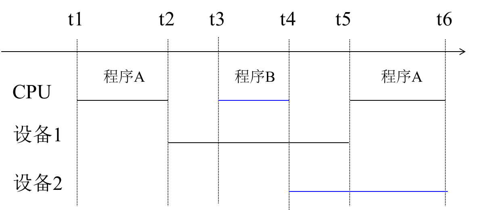
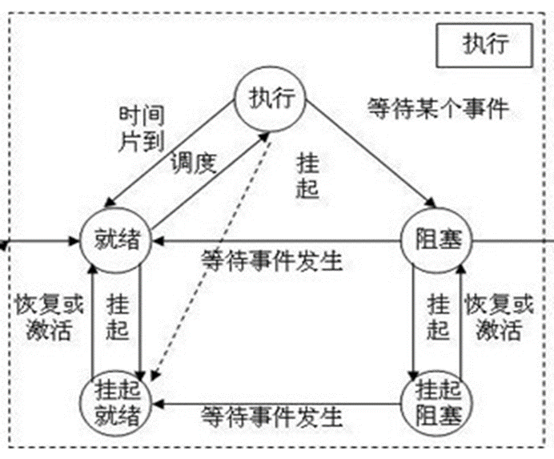
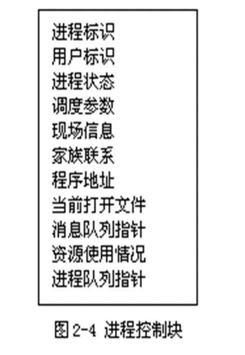
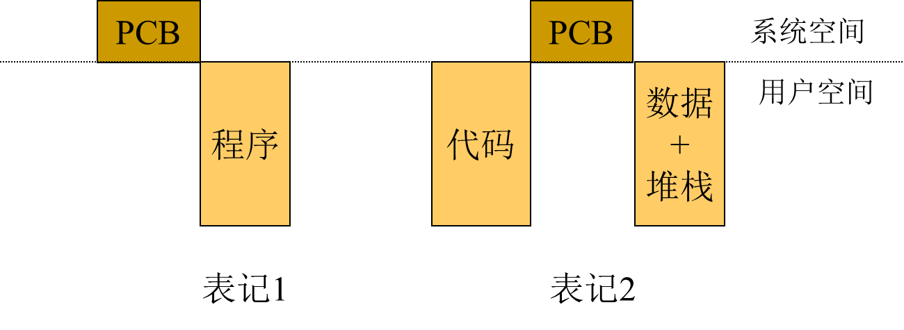
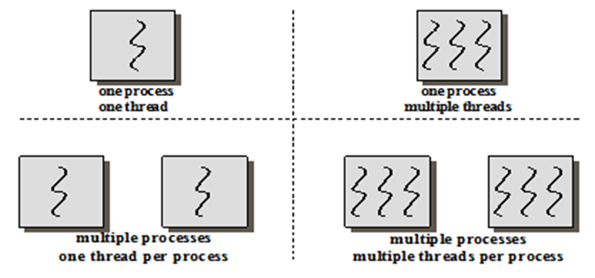
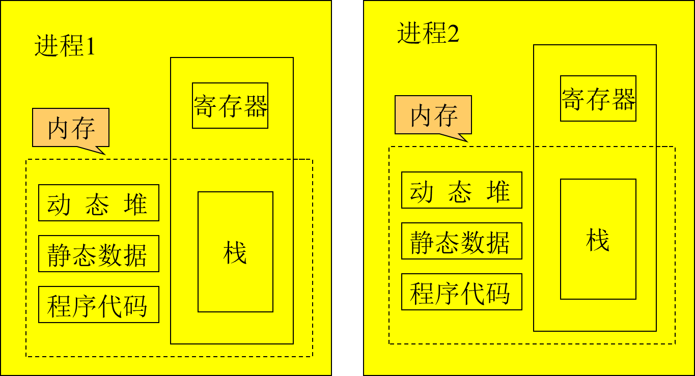

# 操作系统

[TOC]

## 第一章 操作系统概述

### 1.1 操作系统的概念

#### 1.1.2 操作系统的作用

操作系统有以下两个重要的作用：

1. 管理系统中的各种资源

   一个多道计算机系统可以同时为多个用户服务，在计算机系统中同时有多个程序在执行。这些程序在执行的过程中会要求使用系统中的各种资源。
   多个程序的资源需求经常会产生冲突，如果对程序的这些资源需求不加以管理，就会造成混乱甚至损坏设备。

   操作系统作为资源仲裁者，由它负责资源在各个程序中的调度，保证系统中的各种资源得以有效利用。

2. 为用户提供友好的界面

   随着硬件成本不断下降，计算机已经走进了家庭和办公自动化领域，计算机的使用者大多不是计算机专业人员，界面的友好性比资源的利用效率更加具有实际意义。目前商业化操作系统提供的图形用户界面（GUI）就是在此背景下的产物。

#### 1.1.3 操作系统的定义

定义1-1：操作系统是位于硬件层之上、、所有其他系统软件层之下的一个系统软件，通过它管理系统中的各种软件和硬件资源，使他们能够被充分利用，方便用户使用计算机系统。

### 1.2 操作系统的历史

**进程**：一个可并发执行的程序对某个数据集在处理机上的执行过程和分配资源的基本单位。

理解这个定义从两个方面：

1. 进程为应用程序的运行实例，是应用程序的一次动态执行。
2. 是资源分配的基本单位。

**程序**：是一个在时间上严格次序前后相继的操作，是一个静态的概念。程序是要实现功能的顺序步骤。

进程和程序的区别：

1. 只有在内存里说进程才有意义。而程序不是
2. 进程是一个动态的概念。程序是一个静态的概念。
3. 进程有并发性，而程序没有。这两个区别都和进程是一个动态的概念，而程序是一个静态的概念要联系起来。当程序运行，被调入内存，这时我们说进程才有意义。那么进程是程序在内存中运行的实例，是一次动态执行，在内存中多个进程，我们就可讨论其的并发性。而程序是一个静态的概念，并不是正在运行的实例而是个很宽泛的。自然我们也不讨论它的并发执行。因为它本身就是静态而不执行。
4. 进程是计算机资源分配的基本单位。因为只有动态执行的东西，计算机才分配给它处理机，存储器等各种资源。如果不执行，是不会分配的。
5. 不同的进程可以包含同一程序。只要该程序所对应的数据集不同。即是进程和程序不是一一对应，也就是**一个进程可顺序执行多个程序，一个程序可由多个进程共用。**

作业：是用户向计算机提交任务的任务实体。

1. 作业是用户向计算机提交的任务实体。在用户向计算机提交作业完成后，系统将它放入外存中的作业等待队列等待执行。进程则是完成用户任务的执行实体。是向系统申请分配资源的基本单位。
2. 一个作业由多个进程组成，必须至少由一个进程组成，反过来不是。
3. 作业概念主要用于批处理系统中。

#### 1.2.1 操作系统的产生

计算机操作系统从无到有的产生过程中经历了以下几个阶段：

##### 1.2.1.1 手动操作阶段（1940s）无操作系统

计算机诞生的初期没有操作系统，人们采用手动操作的方式使用计算机，典型的作业处理步骤如下：

1. 将程序和数据通过手动操作记录在穿孔纸带上；
2. 将程序穿孔纸带放到光电输入机上，出做事显示错误地址并修改指令；
3. 在电传打印机上输出运行结果。

显然这种操作方式有以下两个缺点：

1. 用户在作业处理的整个过程中独享系统中的全部资源；
2. 手动操作时间很长（人机矛盾）。

这种操作方式在计算机速度较慢的情况下是可以容忍的，但是当计算机速度大幅度提高之后，就会暴露出严重的缺点：手动操作时间远远大于程序运行时间。

因而，缩短手动操作时间在以晶体管为代表的第二代计算机出现后便成为亟待解决的问题。

汇编语言和汇编系统的出现在一定程度上减轻了用户使用计算机的负担。

##### 1.2.1.2 批处理阶段（1950s）批处理系统

**什么是批处理技术？**

批处理技术就是计算机对一批作业进行处理。
是把一批作业编成一个作业执行序列。
每一批作业将有专门编程的监督程序自动依次处理。
在这个时期的批处理是指单道批处理。

**单道批处理工作过程及单道批处理的概念**

监督程序将磁带（外存）上的第一个作业装入内存，把运行控制权交给该作业。
当作业处理完毕，又将控制权交给监督程序，再由监督程序把磁带（外存）上的第二个作业调入内存。
由于内存中始终只有一道作业。因此称为单道批处理系统。

**批处理技术有两种：**

1. 联机批处理：慢速的输入/输出设备直接和主机打交道。
2. 脱机批处理：这个方式的特征是增加一台不与主机直接相连，并且直接用于和输入/输出设备打交道的外围机，也叫卫星机。

**单道系统特点：自动性，顺序性，单道性**

为了缩短手动操作的时间，人们想到使作业到作业之间的过渡摆脱人为干预，实现自动化，如此便出现了批处理。

批处理经历了两个阶段，即联机批处理阶段和脱机批处理阶段。（是指I/O设备是否和主机相连）

1. 联机批处理

   操作员将若干作业合成一批，将其卡片依次放到读卡机上，监督程序（Monitor）通过内存将这批作业传送到磁带机上，大量作业在磁带机上排队等待处理。输入完毕，监督程序开始处理这一批作业。它自动将第一个作业读入内存，并对其进行汇编（或编译）、连接、执行、输出。第一个作业处理完立即开始处理第二个作业，如此重复，直至所有作业处理完，再处理第二批作业。

   优点：

   1. 作业自动转换，大大缩短了手动操作的时间。
   2. 出现了Monitor及相关软件的支持。

   缺点：作业由读卡机到磁带机的传输需要**处理机**完成,由于设备的传输速度远低于处理机的速度, 在此传输过程中处理机仍会浪费较多时间。即I/O设备与CPU直接相连，CPU(主机)浪费。实际上还是处理机利用monitor程序来处理I/O。

   为克服联机批处理的缺点, 引入了脱机批处理。基本思想是把**输入/输出操作**交给一个功能较为单纯的**卫星机**去做，使主机从繁琐的输入输出操作中解脱出来。 

2. 脱机批处理

   待处理的作业由**卫星机**负责经读卡机传送到输入磁带上，主机从输入磁带读入作业、加以处理，并把处理结果送到输出磁带上，最后由**卫星机**负责将输出磁带上的结果在打印机上输出。

   优点：

   1. 卫星机与主机分工明确
   2. **并行**工作，提高了CPU的利用率。

   缺点：单任务系统；人工拆装磁带。

   批处理系统是操作系统的**雏形**。

   

   为什么要产生脱机技术？

   主要是解决CPU和外围设备之间速度不匹配的矛盾，CPU快，外围设备慢，读盘写盘都是机械方式慢。因此把外围设备的输入输出处理和主机脱离，这样使得主机不用等待外围设备的输入输出。

   特点：

   减少处理机的空闲时间（因为处理机不管输入输出只负责数据处理）。提高了输入输出速度（因为专门有一个外围机负责输入输出了）。

##### 1.2.1.3 执行系统阶段（1960s初期）多道程序设计

60年代初，硬件的重要进展：通道、中断技术

**通道：（channel）**

通道，也称**I/O处理机**，它具有自己的指令系统和运控部件，可接受处理机的委托执行通道程序，完成I/O操作。通道的I/O操作可与处理机的计算工作完全**并行**，并在I/O操作完成时向处理机发出中断请求。

**中断：（Interrupt）**

中断是指当主机接到某种外部信号(如I/O设备完成信号)时，马上暂停原来的工作，转去处理这一事件，处理完毕再回到原来的断点继续工作。

**假脱机(Spooling)**：

   作业由读卡机到存储区的传输以及运行结果由存储区到打印机的传输由**通道**完成，这种方式既非联机，也非脱机（也不是依靠卫星机），称为“假脱机”或“伪脱机”。  优点：通道取代卫星机，免去了手工装卸磁带的麻烦。

   执行系统阶段，Monitor常驻内存，是OS的**初级阶段**。

#### 1.2.2 操作系统的完善

**多道系统工作流程：**

1. 用户所提交的作业都先存放在外存上并排成一个队列, 称为“后备队列”；
2. 然后, 由作业调度程序按一定的算法从后备队列中选择若干个作业调入内存，使它们共享 CPU 和系统中的各种资源。

**多道系统的基本原理：**本质上是同时把若干道程序放入内存，并使它们交替的执行。内存中同时存放几道相互独立的程序。

**多道的特点：**从它的定义中，我们就可以知道它的特点：

1. 多道：内存中同时存放几道相互独立的程序。
2. 宏观并行：多个作业调入内存，同时占有资源各自运行，但都未完成。
3. 微观串行：轮流占有处理机，交替执行。

**单道和多道的比较：**

- 在单道批处理中，当作业完成，而下一个作业还没被调入内存时，CPU空闲。
- 而多道批处理，充分利用了CPU。本质上是同时把若干道程序放入内存，并使它们交替的执行。这样始终使CPU处于忙状态，要比单道批处理复杂的多。

优点：资源利用率高，系统对作业的吞吐能力提高
缺点：平均周转时间长，无交互能力

严格的用时间区分阶段没有意义，其实有些技术的出现是早都有了。这个阶段出现了分时系统、实时系统，随着个人计算机PC的出现，产生了个人计算机上的操作系统。网络中网络操作系统，分布式操作系统，智能化操作系统等

分时系统

- 基本原理：分时系统就是把处理机的运行时间分成很短的时间片（如几个毫秒)，按照时间片轮流把处理机分配给各个联机作业使用。每个用户在使用这些联机终端，好像自己独占机器一样。如：我用过的VAX8350小型机。一个小型机带几十个终端，每个用户使用终端，就像独占这个小型机一样。
- 分时系统中实现的关键问题：
  1. 及时接受：就是要及时的接受用户输入的数据或命令。首先采用多路卡，多路卡的作用是使主机能同时接收用户从各个终端上的输入。其次为每个终端配置一个缓冲区，用来暂存用户的键入。
  2. 及时处理：就是及时处理用户的键入和控制自己作业的运行。解决方法，首先，使所有用户的作业都直接进入内存，这样不用在外存驻留等待；其次，在不长的时间内，使每个作业都运行一次。

分时系统的特征：

-  多路性：一个主机与多个终端相连，系统按分时原则为每个用户服务。宏观上，多个用户同时工作,共享系统资源；微观上，每个用户轮流运行一个时间片。
-  交互性：以对话的方式为用户服务。
-  独占性：每个终端用户仿佛拥有一台虚拟机。

 多道批处理系统和分时系统的出现标志OS已进入**完善阶段**

实时操作系统

实时系统是指系统能即时响应外部事件的请求，在规定时间内完成对事件的处理，并控制所有实时任务协调一致地运行。它分为实时信息处理系统和实时控制系统两大类。实时信息处理系统由一台或多台主机通过通信线路连接成百上千个远程终端，计算机接收从远程终端发来的服务请求，根据用户提出的问题，对信息进行检索和处理，并在很短时间内为用户做出正确的回答。

| 实时系统与分时系统的区别 | 实时系统                                       | 分时系统                                        |
| :------------- | ------------------------------------------------ | ------------------------------------------------- |
| 多路性 | 体现在对多路的现场信息进行采集、对多个对象或多个执行机构进行控制。 | 按分时原则为多个终端用户服务。                               |
| 独立性 | 每个终端用户向系统提出服务请求时，彼此独立操作，互不干扰；对信息的采集和对象的控制也彼此互不干扰。 | 每个用户各占一个终端，彼此互不干扰，独立操作。               |
| 及时性 | 以控制对象所要求的开始截止时间或完成截止时间来确定，一般为秒级。 | 用户的请求能在短时间（用户能接受的）内获得响应。             |
| 交互性 | 人与系统的交互，仅限于访问系统中某些特定的专用服务程序。     | 用户与系统进行广泛的人机对话，系统能向终端用户提供数据处理服务，资源共享等服务。 |
| 可靠性 | 高度可靠                                                     | 可靠程度较低                                                 |

传统操作系统的三大类别：

1. 多道批处理操作系统
2. 分时操作系统
3. 实时操作系统。

 一个实际的操作系统可能兼具三者或其中两者的功能。

通用操作系统(60年代后期)：将多道批处理、分时和实时等功能结合在一起构造出的多功能的操作系统，称为通用操作系统。

#### 1.2.3 操作系统的发展

目前，较优秀的实用操作系统：UNIX(美国Bell Labs)、Windows(美国微软)、Linux(自由软件)。
近30年来, OS取得了很大发展，主要表现在： 

1. 硬件体系结构由集中向分散发展，出现计算机网络，为此网络操作系统和分布式操作系统应运而生。
2. 微处理机的发展使家庭和商用的微型机得到了普及。为方便非计算机专业人员使用，OS提供了友好的操作界面。
3. 在科学和军事领域，大型计算任务要求极强的计算处理能力，多处理机并行成为必然，由此产生并行操作系统。
4. 随着处理机芯片和各种存储介质在各种控制领域的广泛应用，嵌入式和智能卡操作系统应运而生。为降低开发代价，尝试从不同应用中抽取具有共性的东西，并做成很小的操作系统核心，由此产生了微内核操作系统体系结构。

### 1.3 操作系统的特性

#### 1.3.1 并发性

程序并发指计算机系统中同时存在多个程序，宏观上，这些程序同时向前推进。

**并发**：指在计算机系统中同时存在着多道运行的程序（进程）。

宏观上：多道程序同时在执行
微观上：任何时刻只有一道程序在执行，即微观上多道程序在CPU上轮流（交替）执行（单机）

**并行**(parallel)： 与并发相似，指多道程序在同一时刻执行，但需多个硬件支持。

程序并发与程序并行的区别：

1. **程序并行**要求微观上的同时,即在绝对同一时刻有多个程序同时向前推进；
2. **程序并发**并不要求微观上的同时,只需要在宏观上看来多个程序都在向前推进。

注意：在单处理机操作系统中，通常使用并发这个术语，尽管处理机与设备之间、设备与设备之间可以并行工作。
注意：并发是操作系统最重要的特征，其他特征都是以**并发为前提**。

#### 1.3.2 共享性

**资源共享**是指操作系统程序与多个用户程序共用系统中的各种**资源**，这种共享是在操作系统的控制下实现的。

资源包括：：中央处理器，内外存储器，外部设备等。

共享有两种形式：**互斥共享**和**同时共享**。

互斥共享：系统中有一些资源，当一个进程正在访问该资源时，其他进程必须等待，直到该进程访问完并释放这些资源时，其他进程才能访问这些资源。这就是互斥共享，互斥共享的资源叫**临界资源**。如：打印机等物理设备或者表格就是临界资源，它们要求互斥共享。

同时共享：系统中有一类资源，允许在一段时间内，由多个进程同时对其访问。这就是同时共享，**本质还是宏观上时同时，微观上是交替分时的**。如，磁盘，同时可以多个进程访问磁盘。

**注意：并发和共享是OS的两个最基本特征，它们互为存在条件。**这是因为：

- 只有进程的并发执行，才可能要求资源共享。
- 也只有资源能够合理的实现共享，进程才能并发执行

#### 1.3.3 异步性

**概念：**有些课本叫做不确定性或随机性。是指操作系统控制下的多个作业的运行顺序和每个作业的运行时间是不确定的，也就是进程在执行中，其执行时间、顺序、向前推进的速度和完成的时间等都是不可预知的。因此先进入内存的作业可能比后进入的作业后完成。

**原因：**造成不确定性的原因，并发进程中资源限制等原因。例如，在单处理机环境下，由于系统中只有一个处理机，因此每次只允许一个进程占有其执行，其余进程只能等待，造成异步，这样先得到处理机或其他资源的进程先完成。

#### 1.3.4 虚拟性

虚拟(virtual)的本质含义是把物理上的一个变成逻辑上的多个。也就是把一个物理实体映射为若干个对应的逻辑实体——分时或分空间。
物理上是实际存在的；逻辑上是虚拟的。

如：多道分时技术能把一台物理CPU虚拟为多台逻辑上的CPU。还有虚拟存储器技术和虚拟设备技术等。

### 1.5 操作系统的硬件环境

#### 1.5.1 定时装置

 为实现系统管理和维护，硬件必须提供**定时装置，即实时时钟**。硬件时钟通常有两种：绝对时钟和相对时钟

##### 1.5.1.1 绝对时钟

**记载实际时间，不发中断。**
时间表示形式为：年、月、日、时、分、秒。
时间值保存于硬件寄存器中，开机时由电源供电计时，关机时由机内电池供电计时，其值可由程序设定和修改，但一般通过特权指令完成。 当然，程序可以读取它的值。
操作系统根据绝对时钟的值记录作业进入系统时间和处理时间、文件的修改和存取时间、资源占用时间、日志记录时间等。

##### 1.5.1.2 间隔时钟

定时发生中断。

也称**闹钟**，它每隔固定时间，如10ms，发生一次时钟中断。时钟中断发生后，OS获得系统的控制权，以便运行系统管理和实现程序并发。

除时钟外还有其它事件可引起中断，但那些事件是否发生、何时发生不确定，只有**时钟中断**最忠实可靠。间隔时钟是现代操作系统(多道程序设计)的基础。

利用间隔时钟可以实现逻辑时钟。例如，要实现一个50ms的逻辑时钟，可以设置一个初值为5的变量，每次时钟中断将其减1，当减至0时即达到50ms。

#### 1.5.2 系统栈

**系统栈**是内存中操作系统空间的一个固定区域（在操作系统空间）
系统栈的主要用途：

1. 中断响应时**保存中断现场**。对于嵌套中断，被中断程序的现场信息依次压入系统栈，中断返回时逆序弹出；
2. 保存操作系统子程序间相互调用的参数、返回值、返回点以及子程序的局部变量。

注意：

1. 每个运行程序都有一个对应的系统栈；
2. 进程切换的同时伴随系统栈的切换；
3. 但硬件只有一个系统栈指针作用。

#### 1.5.3 寄存器

硬件系统提供一套寄存器，由运行进程使用。程序切换时，一般需要把寄存器的当前值保存起来，再次运行前再回复，这些寄存器如下：

1. 程序状态字（PSW）

   程序状态字由16B组成，表示当前程序的运行环境，每个X表示1B（4b）：

   1. 前8位为系统屏蔽位，0~6位分别对应7个通道通道，第7位对应外中断；
   2. 12~15位为CMWP；
   3. 16~31为中断码，用于保存中断字（详细中断信息）；
   4. 36~38 为程序屏蔽位，分别对应定点溢出、十进溢出、阶下溢。

   有些中断是不可屏蔽的，如时钟、地址越界、缺页、非法指令。

2. 指令计数器（PC）

   记载运行下一条指令的地址。

3. 栈指令（SP）

   管态和目态各一个，分别保存系统栈和用户栈的栈顶位置。

4. 通用寄存器（regs）

   若干个，用于存数和计算，还可以用来保存系统调用时传给操作系统的参数，以及由操作系统传给用户的返回值。

5. 浮点寄存器（fregs）

   同上。

6. 地址映射寄存器

   一般有一对，分别记录内存区域的起始地址和长度，分别称为基础寄存器（base）和限长寄存器（limit）。

#### 1.5.4 特权指令与非特权指令

现代计算机的指令系统由特权指令集和非特权指令集两部分组成，它们的使用与系统状态有关。

1. **特权指令**（privileged instruction）

   只有在**管态**才能执行的指令。

   特权指令的执行**不仅影响运行程序本身，也影响其他程序和OS**。例如，开关中断、**置程序状态字**、修改地址映射寄存器、停机等。

   注意：一般只有OS能执行特权指令，用户程序不能执行。

2. **非特权指令**（non-privileged instruction）

   在管态和目态下均可执行的指令。

   非特权指令的执行**只与运行程序本身有关，不影响其它程序和OS**。例如数据传送指令、算术运算指令等。

#### 1.5.5 处理器状态及状态转换

处理机状态也称机器状态。处理机状态有两种：管态和目态。它由程序状态字PSW中的一位标识。

1. 管态(supervisor mode)

   也称系统态、核心态，是**操作系统运行时**所处的状态。机器处于管态时可以执行硬件提供的全部指令，包括特权指令和非特权指令。

   由于利用特权指令可以修改PSW，而机器状态位是PSW的一部分，因而在管态下可以通过修改PSW来改变机器状态，使之由管态转换为目态。

2. 目态 (object mode)

   也称用户态，是**一般用户程序运行时**所处的状态。处理机处于目态时只能执行非特权指令。

   由于“置程序状态字”为特权指令，目态程序不能执行它，从而不能将运行状态改为管态，这可防止用户有意或无意地侵入系统，从而起到保护系统的作用。
   

管态与目态之间的状态转换

在系统运行过程中，处理机的状态处于动态变化之中，时而运行于目态，时而运行于管态。

1. 管态 :arrow_right: 目态 

   管态到目态的转换由**修改程序状态字（PSW）**来实现。

   由于操作系统运行于管态，用户程序运行于目态，因而该状态转换伴随着由操作系统程序到用户程序的转换。
   
2. 目态 :arrow_right: 管态

   处理机状态由目态转为管态的**唯一途径**是**中断**。

   中断发生时，中断向量中的PSW应标识处于**管态**，这一标识由操作系统初始化程序设置。 

用户程序在目态下运行时不能直接使用I/O指令等特权指令。只有当用户程序执行到访管指令产生一次中断后，使机器在原来的目态下执行用户程序变成在管态下执行操作系统的系统调用程序。所以从目态转换成管态的唯一途径是中断。

 **产生中断意味着当前程序不能继续执行，处理机需分配执行中断服务例程，而分配CPU则是管态才能执行的**

访管指令的操作原理：

- 当源程序中有需要操作系统服务的要求时，编译程序就会在由源程序转换成的目标程序中安排一条“访管指令”并设置一些参数。当目标程序执行时，中央处理器若取到了“访管指令”就产生一个中断事件，**中断装置就会把中央处理器转换成管态，并让操作系统处理该中断事件。**
- 操作系统分析访管指令中的参数，然后让相应的“系统调用”子程序为用户服务。系统调用功能完成后，操作系统把中央处理器的管态改为目态，并返回到用户程序。
- 从程序调用的角度来看，用户应用程序中要调用一些子程序。子程序可以分为用户自己编写的子程序和软件提供的子程序，**对后者的访问即被称为访问系统程序（访管）指令，又称为陷阱（TRAP）指令。**
- 访管指令并不是特权指令。所谓特权指令，是指用于操作系统或其他系统软件的指令，一般不提供给用户使用。

#### 1.5.6 地址映射机构

在多道程序系统中，内存中同时存在多个程序，一个程序在内存中的存放位置是随机确定的，因此程序不能采用物理地址，只能采用逻辑地址。

为使每个程序的每个基本单位都能从0开始编址，硬件需要提供**地址映射机构**，它负责将运行程序产生的逻辑地址变换为内存物理地址。

地址映射机构在不同硬件环境中不尽相同。

#### 1.5.7 存储保护设施

在多道程序系统中，一个程序有意或无意产生的错误地址可能会侵犯其它程序空间甚至操作系统空间；一个程序对公共存储区域可能试图执行非法操作(越权)，这些都可能影响其他程序甚至整个系统。为防止这些情况的发生，硬件必须提供**存储保护设施**。

存储保护设施的作用：

进行地址越界检查和越权检查(对共享区域)，防止应用程序侵犯操作系统空间或其它应用程序空间。

#### 1.5.8 中断装置

发现并响应中断的硬件机构。
中断装置具有两个功能：

1. **发现中断**：中断发生时能识别，有多个中断事件同时发生时，能按优先级别响应最高者。
2. **响应中断**：先将当前进程的中断向量(PSW和PC)压入**系统栈**，再根据中断源到指定内存单元将新的中断向量取来并送到**中断向量寄存器**中, 从而转到对应的中断处理程序。

#### 1.5.9 通道与DMA控制器

##### 1.5.9.1 通道
负责I/O操作的处理机，具有自己的指令系统和运控部件，可以执行通道程序，完成CPU委托的I/O操作任务。
##### 1.5.9.2 DMA (Direct Memory Access, 直接内存访问)
DMA是与通道相似的I/O方式，DMA控制器接受CPU的委托完成数据在内存与块型设备之间的传输。与通道相比，DMA没有独立的指令系统，只能进行简单的块传输。　

### 1.7 操作系统的运行机理

操作系统是**中断驱动**的，考虑系统中并发执行的两个程序P1和P2，假若时刻t1程序P1执行，时刻t2程序P2执行，t1<t2, 则在时刻(t1,t2)之间一定发生过中断，即**中断是程序切换的必要条件**。 

实际上，程序P1不可能将CPU的使用权直接交给程序P2，将处理机的使用权由P1转交给P2只能由操作系统完成，而操作系统要完成CPU的重新分配必须首先获得CPU的使用权。**目态到管态的唯一途径是中断**

操作系统如何取代P1获得CPU的使用权？

**唯一的途径是通过中断。** 

中断将引出新的PSW并导致系统由目态转到管态，即进入操作系统。操作系统在执行完中断例程之后，也可能继续执行P1，也可能决定执行P2，这与CPU的调度原则有关。在后一种情况下，操作系统将保存P1的状态信息，然后恢复P2的状态信息并通过置PSW使系统转到目态运行P2。 

引起中断的事件有些与运行程序有关，如访管、地址越界、非法指令、溢出等；有些与运行进程无关，如系统时钟、I/O设备完成信号等。

### 1.8 研究操作系统的几种观点

#### 1.8.1 进程观点

将错做系统看成由若干个可以独立运行的程序和一个对这些程序进行协调管理的核心组成，这些运行的程序成为进程，每个进程完成某一特定任务。同时运行的进程之间可能会发生相互作用，这些相互作用表现为互斥、同步、通信、死锁、饥饿等，这些都是操作系统乃至并发程序设计中的核心问题。操作系统必须协调进程之间的相互作用，以使各个进程正常结束并得到正确的执行结果。

#### 1.8.2 资源管理观点

计算机系统中配备有多种软硬件资源，如CPU、内存、设备、文件等，这些资源通常是独占型的，即一次只能分配给一个请求者。并发执行的进程在运行过程中会使用这些资源，这些使用命令可能发生冲突，例如两个进程同时申请某一独占型设备。为此，必须有一个协调者负责管理这些资源，这个管理者就是操作系统。

这种观点认为操作系统是一个资源管理程序，所管理的资源包括硬件资源（处理器、内存、设备等）和软件资源（文件、数据等），用户在使用资源前需要向操作系统提出申请，用完后将资源归还给操作系统。为了管理这些资源，操作系统需要给出这些资源的状态描述，并基于资源状态描述给出相应的资源管理程序。在多道程序系统中，可能有多个进程同时提出某一种资源的使用申请，操作系统需要按某种策略满足这些请求。这种策略应当是公平的，同时也应当是高效的。

#### 1.8.3 虚拟机观点

这种观点认为操作系统是一个虚拟机，操作系统是硬件上运行的第一层系统软件，它对硬件功能进行第一次扩充。扩充之后的计算机系统具有功能强大、使用方便等特点。

虚拟机的思想在操作系统设计中由许多体现，例如可以在共享型设备和独占型设备的基础上构造虚拟设备，利用内存和外存储器实现虚拟存储，利用分时技术黄一个处理器改造成多个虚拟处理器。

## 第二章 进程、线程与作业

### 2.1 多道程序设计

多道程序设计是OS所采用的最基本、最重要的技术，其根本目标是提高系统的效率。衡量系统效率的一个尺度是吞吐量。

吞吐量: 单位时间内系统所处理的作业的道数。

$吞吐量=\frac{作业道数}{全部处理时间}$

#### 2.1.1 单道程序设计的缺点

1. 设备资源利用率低：

   单道程序系统中，内存中仅存在一个程序，该程序仅能用到设备集中的一个子集，未被用到的外设资源便被浪费。

2. 内存资源利用率低：

     随着硬件技术的提高，内存容量不断增加，目前已达上百兆或几个G，而一般程序的长度远小于内存容量。若采用单道程序设计，则内存空间的浪费很大。

3. 处理器资源利用率低：

     中断，通道，DMA控制器的引入，使处理器与I/O设备的可以并行。  

     如下图所示，t2时刻CPU启动了设备，t5时刻设备发出完成数据传输中断。若CPU的工作不需要等待数据传输完成，则可以提前安排在t2\~t5期间内做；若CPU进行的工作需等待I/O传输结果，在t5\~t6期间内做，则t2\~t5期间内CPU将空闲此时**应该并行提高效率**。

#### 2.1.2 多道程序设计的提出

如果允许多个程序同时进入系统，即增加资源使用者的数量，则资源利用率应能得到提高，这就引入了多道程序系统。

多道程序设计对资源利用率的影响：

1. 设备资源利用率提高

   若允许若干个搭配合理的程序同时进入内存，这些程序分别使用不同的设备资源，则系统中**各种设备资源都会被用到并经常处于忙碌状态，设备利用率将得到明显提高。**

2. 内存资源利用率提高

   允许多道程序同时进入系统可避免单道程序过短而内存空间很大所造成的存储空间浪费。

3. 处理器资源利用率提高

   在单道程序系统中，处理机资源利用率低的主要原因是当运行程序等待I/O操作完成时，处理机被闲置。若将两道程序同时放入内存，在一个程序等待I/O操作期间，处理机执行另一个程序，便可提高处理机的利用率。

如下图所示，t2时刻程序A放弃处理机，但程序B暂不具备运行条件，t3时刻程序B获得CPU并运行，t4时刻程序B启动I/O设备2，然后等待I/O传输完成。

如果增加内存中程序的道数，处理机资源的利用率可进一步提高。理论上，当内存中程序的道数充分多时，处理机的利用率可达到100%。

综上分析，多道程序设计可有效地提高系统资源的利用率，从而提高系统吞吐量。那么内存的程序数量是否越多越好呢？也就是道数是不是越多越好呢？ 

答案是否定的。

首先，**内存容量**限制了系统可同时处理的程序数量；

其次，**物理设备的数量**也是一个制约条件。如果内存中同时运行的程序过多，这些程序可能会相互等待被其它程序占用的设备资源，反而会影响系统效率；

另外，内存中过多的程序会形成对**处理机资源的激烈竞争**，既可能影响系统的响应速度，也会增加因处理机分配而带来的系统开销。

一般地，确定内存中同时容纳程序的数量，应考虑机器的配置情况。

**结论：增加同时运行程序的道数可提高系统资源利用率，从而提高系统效率，但道数应与系统资源数量相当。道数过少，系统资源利用率低；道数过多，系统开销增大，程序响应速度下降。**

#### 2.1.3多道程序设计的问题

多道程序设计改善了系统资源的利用率，增加了吞吐量，提高了系统效率，但同时也带来了新的问题：即资源竞争。

需解决以下问题：

1. 处理机资源管理问题

   如果可运行程序的个数多于处理机的个数，则需解决可运行程序与处理机资源的竞争问题，即需要对处理机资源加以管理，实现处理机资源在各个程序之间的分配和调度。

2. 内存资源管理问题

   1. 内存划分问题
   2. 逻辑地址映射到内存物理地址，即重定位
   3. 存储空间的保护。

3.  设备资源管理问题

   尽管操作系统在选择程序进入系统时可以使进入系统的程序搭配相对合理，但**由于程序使用资源的不确定性以及程序推进速度的不确定性，内存中的多道程序在使用设备时经常发生冲突**，即多个程序同时要求使用同一资源，这就要求操作系统确定适当的**分配策略**，并据此对资源加以管理。

### 2.2 进程的引入

多道程序系统中一个程序的活动规律是:

推进→暂停→推进→暂停→…

**程序暂停时需将现场信息作为断点保存起来；**

**程序推进时需恢复上次暂停时的现场信息,并从断点处继续执行。**

可见,在多道系统中运行的程序需要一个保存断点现场信息的区域, 这个区域保存的正在运行程序的现场信息。因此，**需要一个能更准确地描述多道系统中正在执行中的程序的术语**, 这就是进程 (process)。

#### 2.2.1进程的概念

 进程是操作系统乃至并发程序设计中一个非常重要的概念。什么是进程？目前尚无统一定义。 确切地说, 关于进程有许多解释, 这些解释并不完全等价, 比如:

1. 进程是程序的一次执行;
2. 进程是可参与并发执行的程序;
3. 进程是一个程序与数据一道通过处理机的执行所发生的活动;
4. 所谓进程, 就是一个程序在给定的空间和初始环境下, 在一个处理机上的执行过程。 

定义：**进程是具有一定独立功能的程序关于一个数据集合的一次运行活动。**可并发执行的程序在一个数据集合上的运行过程。

上述这些定义都强调了程序的执行, 这是进程的动态特性, 是进程与程序之间的本质差异。

进程具有并发性，可与其它进程同时运行。

#### 2.2.2 进程状态及状态转换

进程在其生存期内可能处于三种基本状态之一：

1. 运行态(RUN): 

   进程占有CPU，正在向前推进。
   显然，单处理机系统中任一时刻只能有一个进程处于运行态。

2. 就绪态(READY): 

   进程本身具备运行条件, 但未得到CPU。

   进程被创建时处于就绪态，进程创建成功，此时把该进程插入到就绪队列中 。

3. 等待态(WAIT)阻塞: 

   进程正等待某一个事件的发生，即使给它分配处理机也不能运行。

   进程等待态，也称挂起态(Suspended)、阻塞态、封锁态(Blocked)、睡眠态(Sleep)。

   进程处于等待态时，本身不具备运行条件，即使给它分配处理机也不能运行。

   此时，进程正等待某一个事件的发生,比如，等待某一资源被释放，等待与该进程相关的I/O传输完成等。

**运行、就绪、等待是进程的三种最基本的状态。对于一个具体系统来说, 为了实现某种设计目标，进程状态的数量可能多于三个。**

就绪:arrow_right:运行：获得处理机

运行:arrow_right:就绪：剥夺处理机

运行:arrow_right:等待：申请资源未得到，启动I/O传输未完成

等待:arrow_right:就绪：得到所申请资源，I/O传输完成

 进程状态转换由操作系统完成，对用户透明。

 **注意：**对于不同的处理机调度算法，上述进程转换图可能略有不同。例如**对于非剥夺调度，不存在由运行到就绪的状态转换。**

#### 2.2.3 进程控制块

多道系统中运行的程序需有一个断点现场保存区域，该区域设在进程控制块中。

进程控制块是进程存在的标志，它由一组信息构成，这些信息是系统对进程进行管理所需要的。

**定义：进程控制块是标志进程存在的数据结构，其中包含系统对进程进行管理所需要的全部信息。**

**是进程实体的一部分，是描述和控制、管理进程的记录型数据结构，是进程存在的唯一标志。**

对不同的操作系统, PCB中信息的数量和内容不尽相同。一般地，系统规模越大，功能越强，其PCB中信息的数量也越多。 

 一般操作系统中PCB所包含的项目如图2-4所示：

1. **进程标识：**通常为一整数，称为进程号，用于区分不同的进程。

2. **用户标识：**通常也为一整数，称作用户号, 用于区别不同的用户。
   一个进程号与唯一一个用户号对应，而一个用户号可与多个进程号对应，即一个用户可同时有多个进程。

3. **进程状态：**在就绪、运行、等待之间动态变化。

4. **调度参数：**用于确定下一个运行的进程。

5. **现场信息：**用于保存进程暂停的断点信息，包括通用寄存器、地址映射寄存器、PSW、PC

6. **家族联系：**记载本进程的父进程。

7. **地址信息：**记载进程所对应程序的存储位置和所占存储空间大小，具体内容与存储管理方式有关。 

8.  **当前打开文件：**用于记载进程当前使用的文件，通过它与内存文件管理表目建立联系，通过该表可找到保存在外存中的文件。 

9. **消息队列指针：**指向本进程由其它进程接收到的消息所构成的消息队列的链头。

10. **资源使用情况：**记载该进程生存期内所使用的系统资源和使用时间，用于记帐，对同一用户，他的全部进程所使用的资源都记载在该用户的帐目下。

11. **进程队列指针：**用于构建PCB队列，它是系统管理进程所需要的。

#### 2.2.4 进程的组成与上下文

进程由两部分组成：进程控制块PCB和程序，其中程序包括代码和数据等，**进程由三部分构成，PCB，操作集，数据集**。

1. 进程控制块PCB

   PCB是进程的“灵魂”。由于PCB中包含程序的地址信息，通过它可找到程序在内存或外存的存放地址。

   PCB存于**系统空间**，只有操作系统能够对其存取，用户程序不能访问。实际上用户甚至感觉不到PCB的存在。

   Linux的进程控制块为一个由结构task_struct所定义的数据结构,task_struct存放在/include/linux/sched.h  

2. 程序

   **程序**是进程的“躯体”，其中包括**代码**和**数据**两部分。

   **代码**在运行期间不修改自身，以支持程序共享。另外，在多道系统中，内存中同时存在多个程序，这些程序在内存中的存放位置**随机确定**，且在运行过程中可能会发生变化，因而代码必须能够浮动，即**不采用绝对地址**。

   **数据**一般包括静态变量、动态堆和动态栈。 **堆**用来保存动态变量，**栈**用来保存用户子程序相互调用时的参数、局部变量、返回值、断点等。

   数据一般归进程私用，当然也有系统提供进程间数据共享功能，以实现进程间的信息交换。

 进程有两种表记方法，表记1将代码和数据看作一个整体，表记2强调代码部分的可共享性。

**注意：PCB属于操作系统空间，而程序属于用户空间。进程代码与数据也称为进程映像。**

进程运行时OS需为其设置相应的**运行环境**，如系统堆栈、地址映射寄存器、打开文件表、PSW与PC、通用寄存器等。

**进程上下文：在UNIX System Ⅴ中，将进程的物理实体(PCB+程序)与支持进程运行的物理环境称为进程上下文。**

**进程切换过程就是进程上下文切换的过程。**进程切换所需时间是系统为实现并发而付出的额外代价，属于系统开销的一部分。

**系统开销**：系统开销一般指运行操作系统程序，对系统进行管理而花费的时间和空间。

#### 2.2.5 进程的队列

为实现对进程的管理，系统需按照某种策略将进程排成若干队列，由于PCB是进程的代表，因而，进程队列实际上是由进程PCB构成的队列。该队列也称PCB链，可单向，也可双向。单向链如图2-6所示：

   注意，虽然用“队列”这一术语，PCB入队列和出队列不一定完全按FIFO的次序，这与系统对进程的管理策略有关。

   通常，进程队列分为如下三类：

1. 就绪队列
   **整个系统一个**。所有处于就绪状态的进程按某种组织方式排在这一队列中，进程入队列和出队列的次序与处理机调度算法有关。
   **注意：**某些系统中就绪队列可能有多个，用以对就绪进程分类，以方便某种调度策略的实施。  
2. 等待队列
   **每个等待事件一个**。当进程等待某一事件时，进入与该事件相关的等待队列中；
   当某事件发生时，与该事件相关的一个或多个进程离开相应的等待队列，进入就绪队列。
3. 运行队列
   在单CPU系统中只有一个，在多CPU系统中**每个CPU各有一个**。
   每个队列中只有一个进程，指向运行队列头部的指针被称作**运行指示字**。

#### 2.2.6 进程的种类和特性

从OS角度，进程可分为**系统进程**和**用户进程**。

##### 2.2.6.1系统进程

系统进程属于OS的一部分，它们运行OS程序，完成OS的某些功能。一个系统进程所完成的任务一般是相对独立和具体的，且在进程的生存期内不变，因而**它们通常对应一个无限循环程序**，在系统启动后便一直存在，直到系统关闭。

现代操作系统内设置很多系统进程，完成不同的系统管理功能。**系统进程运行于管态**，可执行包括特权指令在内的所有机器指令。由于系统进程负担系统管理和维护任务，**其优先级通常高于一般用户进程的优先级。**

##### 2.2.6.2 用户进程

用户进程运行用户程序，直接为用户服务。

所谓“用户程序”，不一定是用户自己编写的程序，例如，用户在编译一个C程序时，需要运行C语言的编译程序，该**程序在目态运行**，但并不是用户自己编写的。在操作系统之上运行的所有应用程序都被称为**用户进程**。

##### 2.2.6.3 进程的特性

1. **并发性：**可与其它进程一道在宏观上同时向前推进。
2. **动态性：**进程是执行中的程序。进程的动态性还体现在如下两个方面：首先，进程是动态产生、动态消亡的；
   其次，在进程的生存期内，其状态处于动态变化之中。
3. **独立性：**进程是调度的基本单位，它可以获得处理机并参与并发执行。
4. **交往性：**进程在运行过程中可能会与其它进程发生直接或间接的相互作用。
5. **异步性：**每个进程都以其相对独立、不可预知的速度向前推进。
6. **结构性：**每个进程有一个控制块PCB。

#### 2.2.7 进程间的相互联系与相互作用

1. 相关进程：在逻辑上具有某种联系的进程称作相关进程。
   例如，进程P0在运行过程中创建了子进程P1和P2，进程P1产生的输出作为P2的输入，则P1和P2是相关进程。
   **进程P1和P2与进程P0之间存在父子关系，也是相关进程。一般地，属于同一进程家族内的所有进程都是相关的。**
2. 无关进程：**在逻辑上没有任何联系的进程称作无关进程。**
   例如，对于两个相互之间没有交往的用户来说，其进程是不相关的。
   **无关进程间虽没有逻辑关系，但有资源竞争关系，如互斥、死锁、饿死等。*

 进程间的相互作用：并发进程之间存在的相互制约关系称作进程间的相互作用。

 进程间相互作用的方式有两种：

1. 直接相互作用**直接制约**：
   进程之间不需通过中间媒介而发生的相互作用，这种相互作用通常是有意识的。例如，进程P1将一个消息发送给进程P2，进程P1的某一步骤S1需要在进程P2的某一步骤S2执行完毕之后才能继续，等等。
   直接相互作用只发生在**相关进程之间**。 
2. 间接相互作用**间接制约**：
   进程之间需通过某种中间媒介而发生的相互作用，这种相互作用通常是无意识的。例如，进程P1欲使用打印机，该设备当前被另一进程P2所占用，此时P1只好等待，待P2用完并释放该设备时，将P1唤醒。
   间接相互作用可能发生在**任意进程之间**。

#### 2.2.8 进程的创建、撤销与汇聚

用户进程常通过系统调用创建，一般至少包括两个相关的系统调用：创建进程、撤销进程。

在UNIX系统中的命令格式如下：

1. 进程创建： pid = fork()
   创建子进程所完成的工作如下：
   1. 建立一个PCB，并对其内容进行初始化。
   2. 为该进程分配必要的存储空间，并加载所要执行程序。(在UNIX系统中需通过另外一个系统调用execl实现)
   3. 将PCB送入就绪队列。
2. 进程结束**：** exit(status)
   完成使命的进程需终止自己并告知OS。这在UNIX系统中通过exit系统调用实现。
   exit命令的执行将进入OS，系统将对进程进行善后处理(收集进程状态信息、通知其父进程等)，再收回进程所占有的所有资源，最后撤销其PCB。
   除正常终止外，地址越界、非法指令、来自用户或父进程的kill信号等可能导致进程的非正常终止，非正常终止也将进入OS进行善后处理。 

体现生灭过程的进程状态转换图如图所示：

**注意：进程的创建与结束属于OS中的系统调用，而其它状态转换条件对应OS核心中的内部函数。**

#### 2.2.9 进程与程序的联系和差别

进程和程序既有联系，又有差别。

- 进程与程序的联系
  程序是构成进程的组成部分之一，一个进程存在的目的是执行其对应的程序，如果没有程序，进程就失去了其存在的意义。 

- 进程与程序的差别
  1. 程序是静态的，进程是动态的；
  2. 程序可写在纸上或在某一存储介质上长期保存，而进程具有生存期，创建后存在，撤销后消亡；
  3. 一个程序可对应多个进程，但一个进程只能对应一个程序；
  4. 另外，一个程序的多次执行也分别对应不同的进程。  

### 2.3 线程与轻进程

#### 2.3.1 线程的引入

进程的情况：**早期的OS**基于进程，一个进程只包含**一个执行流**，进程是处理机调度的基本单位。

进程切换时，**整个上下文都需要变化**，**系统开销较大**，**相关进程间的耦合关系差**。

执行流间的关系：许多应用中，一些执行流之间具有内在的逻辑关系，涉及相同的代码或数据。
如果将这些执行流放在同一进程的框架下，则执行流之间的切换**不涉及地址空间的变化**，这就**引入了线程**。

线程的情况：同一进程中的多个线程可以执行相同的代码段，也可以执行不同的代码段(逻辑上有合作关系)，这些**合作的线程可利用共享的数据成分**相互交往。   

#### 2.3.2 线程的概念

**线程(thread)也可称轻进程(LWP)，是进程内的一个相对独立的执行流。**

- 线程是进程中的实体，
- 一个进程可以拥有多个线程，一个线程必须有一个父进程，
- 这些线程执行同一程序中的相同代码段或不同代码段，共享数据区和堆。

一般认为，**进程是资源的分配单位，线程是CPU的调度单位**。线程是比进程更小的能独立运行的基本单位

##### 2.3.2.1 线程的属性

1. 轻型实体。线程只拥有必须的资源,只要能保证其运行。
2. 独立调度和分派的基本单位。因线程是能独立运行的基本单位，因为线程拥有能保证其独立运行的最小的其他资源，因此只有一旦获得CPU就可独立运行，故其是cpu调度、分派的基本单位。
3. 可并发执行。在一个进程的多个线程之间，可以并发执行。不同进程中的线程也能并发执行。
4. 共享进程资源。从前面的讲述我们就能理解，在同一进程中的各个线程，共享该进程所拥有的资源。

**共享进程的用户地址空间和其他资源，只拥有必不可少的资源，如，线程状态、寄存器上下文和栈。**

##### 2.3.2.2 线程的状态

状态参数：每个线程用线程标识符和一组状态参数描述

线程运行状态，三种基本状态：执行状态，就绪状态，阻塞状态。

##### 2.3.2.3 线程的创建和终止

线程的创建：进程在启动运行时，首先给它创建一个被称为“初始化线程”，运行的线程可根据需要再去创建若干个线程**由初始化线程创建**。

创建过程：在创建新线程时，需要利用一个线程创建函数(或系统调用)，并提供相应的参数（如主程序的入口指针、堆栈的大小、优先级等），在线程创建函数执行完后，将返回一个线程标识符供以后使用。

终止线程的方式有两种：

1. 在线程完成了自己的工作后自愿退出；
2. 线程在运行中出现错误或由于某种原因而被其它线程强行终止。

##### 2.3.2.4 线程的优点

与进程相比，线程具有如下优点：

1. 上下文切换速度快。由同一进程中的一个线程切换到另一个线程只需改变寄存器和栈，程序和数据的**地址空间不变**。
2. 系统开销小。创建线程比创建进程所需完成的工作少，因而对于客户请求，服务器动态创建线程比动态创建进程具有更高的响应速度。
3. 通讯容易。由于同一进程中的多个线程地址空间共享，一个线程写到数据空间的信息可直接被该进程中的另一线程读取。（共享数据空间）

#### 2.3.3 线程的结构

多**进程**结构（用户视图）

如果两个进程具有一定逻辑联系，比如**二者是执行相同代码的服务程序**，则可用多线程结构实现，如图所示：

#### 2.3.4 线程控制块

#### 2.3.5 线程的实现

#### 2.3.6 线程的应用

## 第三章 ⭐中断与处理器调度

## 第四章 ⭐互斥、同步与通信

## 第五章 死锁与饥饿

## 第六章 主存储器管理

## 第七章 虚拟存储系统

## 第八章 文件系统

## 第九章 设备与输入输出管理
