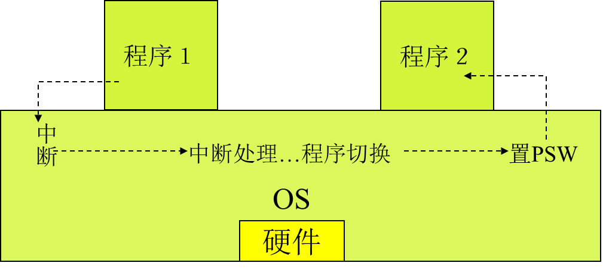
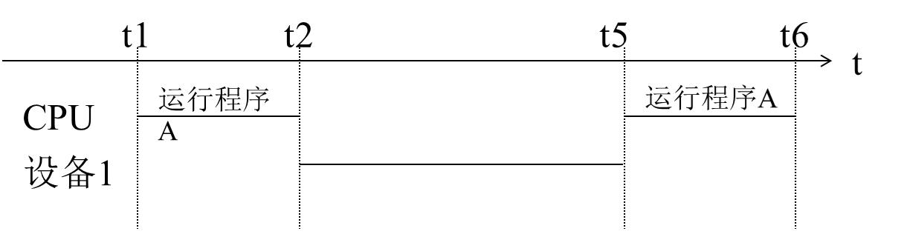
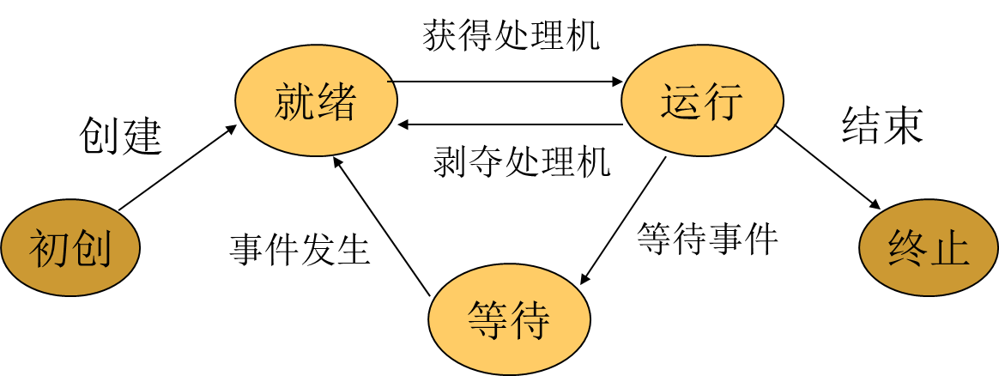
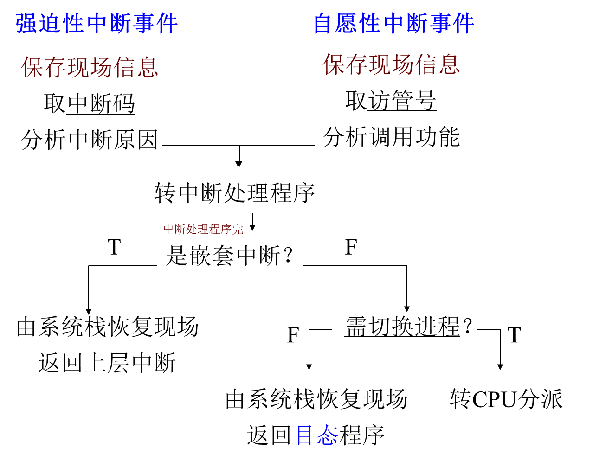
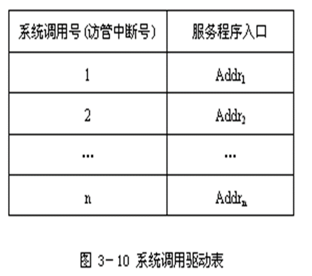

# 操作系统

[TOC]

## 第一章 操作系统概述

### 1.1 操作系统的概念

#### 1.1.2 操作系统的作用

操作系统有以下两个重要的作用：

1. 管理系统中的各种资源

   一个多道计算机系统可以同时为多个用户服务，在计算机系统中同时有多个程序在执行。这些程序在执行的过程中会要求使用系统中的各种资源。
   多个程序的资源需求经常会产生冲突，如果对程序的这些资源需求不加以管理，就会造成混乱甚至损坏设备。

   操作系统作为资源仲裁者，由它负责资源在各个程序中的调度，保证系统中的各种资源得以有效利用。

2. 为用户提供友好的界面

   随着硬件成本不断下降，计算机已经走进了家庭和办公自动化领域，计算机的使用者大多不是计算机专业人员，界面的友好性比资源的利用效率更加具有实际意义。目前商业化操作系统提供的图形用户界面（GUI）就是在此背景下的产物。

#### 1.1.3 操作系统的定义

定义1-1：操作系统是位于硬件层之上、、所有其他系统软件层之下的一个系统软件，通过它管理系统中的各种软件和硬件资源，使他们能够被充分利用，方便用户使用计算机系统。

### 1.2 操作系统的历史

作业：是用户向计算机提交任务的任务实体。

1. 作业是用户向计算机提交的任务实体。在用户向计算机提交作业完成后，系统将它放入外存中的作业等待队列等待执行。进程则是完成用户任务的执行实体。是向系统申请分配资源的基本单位。
2. 一个作业由多个进程组成，必须至少由一个进程组成，反过来不是。
3. 作业概念主要用于批处理系统中。

#### 1.2.1 操作系统的产生

计算机操作系统从无到有的产生过程中经历了以下几个阶段：

##### 1.2.1.1 手动操作阶段（1940s）无操作系统

计算机诞生的初期没有操作系统，人们采用手动操作的方式使用计算机，典型的作业处理步骤如下：

1. 将程序和数据通过手动操作记录在穿孔纸带上；
2. 将程序穿孔纸带放到光电输入机上，出做事显示错误地址并修改指令；
3. 在电传打印机上输出运行结果。

显然这种操作方式有以下两个缺点：

1. 用户在作业处理的整个过程中独享系统中的全部资源；
2. 手动操作时间很长（人机矛盾）。

这种操作方式在计算机速度较慢的情况下是可以容忍的，但是当计算机速度大幅度提高之后，就会暴露出严重的缺点：手动操作时间远远大于程序运行时间。

因而，缩短手动操作时间在以晶体管为代表的第二代计算机出现后便成为亟待解决的问题。

汇编语言和汇编系统的出现在一定程度上减轻了用户使用计算机的负担。

##### 1.2.1.2 批处理阶段（1950s）批处理系统

**什么是批处理技术？**

批处理技术就是计算机对一批作业进行处理。
是把一批作业编成一个作业执行序列。
每一批作业将有专门编程的监督程序自动依次处理。
在这个时期的批处理是指单道批处理。

**单道批处理工作过程及单道批处理的概念**

监督程序将磁带（外存）上的第一个作业装入内存，把运行控制权交给该作业。
当作业处理完毕，又将控制权交给监督程序，再由监督程序把磁带（外存）上的第二个作业调入内存。
由于内存中始终只有一道作业。因此称为单道批处理系统。

**批处理技术有两种：**

1. 联机批处理：慢速的输入/输出设备直接和主机打交道。
2. 脱机批处理：这个方式的特征是增加一台不与主机直接相连，并且直接用于和输入/输出设备打交道的外围机，也叫卫星机。

**单道系统特点：自动性，顺序性，单道性**

为了缩短手动操作的时间，人们想到使作业到作业之间的过渡摆脱人为干预，实现自动化，如此便出现了批处理。

批处理经历了两个阶段，即联机批处理阶段和脱机批处理阶段。（是指I/O设备是否和主机相连）

1. 联机批处理

   操作员将若干作业合成一批，将其卡片依次放到读卡机上，监督程序（Monitor）通过内存将这批作业传送到磁带机上，大量作业在磁带机上排队等待处理。输入完毕，监督程序开始处理这一批作业。它自动将第一个作业读入内存，并对其进行汇编（或编译）、连接、执行、输出。第一个作业处理完立即开始处理第二个作业，如此重复，直至所有作业处理完，再处理第二批作业。

   优点：

   1. 作业自动转换，大大缩短了手动操作的时间。
   2. 出现了Monitor及相关软件的支持。

   缺点：作业由读卡机到磁带机的传输需要**处理机**完成，由于设备的传输速度远低于处理机的速度， 在此传输过程中处理机仍会浪费较多时间。即I/O设备与CPU直接相连，CPU(主机)浪费。实际上还是处理机利用monitor程序来处理I/O。

   为克服联机批处理的缺点， 引入了脱机批处理。基本思想是把**输入/输出操作**交给一个功能较为单纯的**卫星机**去做，使主机从繁琐的输入输出操作中解脱出来。 

2. 脱机批处理

   待处理的作业由**卫星机**负责经读卡机传送到输入磁带上，主机从输入磁带读入作业、加以处理，并把处理结果送到输出磁带上，最后由**卫星机**负责将输出磁带上的结果在打印机上输出。

   优点：

   1. 卫星机与主机分工明确
   2. **并行**工作，提高了CPU的利用率。

   缺点：单任务系统；人工拆装磁带。

   批处理系统是操作系统的**雏形**。

   

   为什么要产生脱机技术？

   主要是解决CPU和外围设备之间速度不匹配的矛盾，CPU快，外围设备慢，读盘写盘都是机械方式慢。因此把外围设备的输入输出处理和主机脱离，这样使得主机不用等待外围设备的输入输出。

   特点：

   减少处理机的空闲时间（因为处理机不管输入输出只负责数据处理）。提高了输入输出速度（因为专门有一个外围机负责输入输出了）。

##### 1.2.1.3 执行系统阶段（1960s初期）多道程序设计

60年代初，硬件的重要进展：通道、中断技术

**通道：（channel）**

通道，也称**I/O处理机**，它具有自己的指令系统和运控部件，可接受处理机的委托执行通道程序，完成I/O操作。通道的I/O操作可与处理机的计算工作完全**并行**，并在I/O操作完成时向处理机发出中断请求。

**中断：（Interrupt）**

中断是指当主机接到某种外部信号(如I/O设备完成信号)时，马上暂停原来的工作，转去处理这一事件，处理完毕再回到原来的断点继续工作。

**假脱机(Spooling)**：

   作业由读卡机到存储区的传输以及运行结果由存储区到打印机的传输由**通道**完成，这种方式既非联机，也非脱机（也不是依靠卫星机），称为“假脱机”或“伪脱机”。  优点：通道取代卫星机，免去了手工装卸磁带的麻烦。

   执行系统阶段，Monitor常驻内存，是OS的**初级阶段**。

#### 1.2.2 操作系统的完善

**多道系统工作流程：**

1. 用户所提交的作业都先存放在外存上并排成一个队列， 称为“后备队列”；
2. 然后， 由作业调度程序按一定的算法从后备队列中选择若干个作业调入内存，使它们共享 CPU 和系统中的各种资源。

**多道系统的基本原理：**本质上是同时把若干道程序放入内存，并使它们交替的执行。内存中同时存放几道相互独立的程序。

**多道的特点：**从它的定义中，我们就可以知道它的特点：

1. 多道：内存中同时存放几道相互独立的程序。
2. 宏观并行：多个作业调入内存，同时占有资源各自运行，但都未完成。
3. 微观串行：轮流占有处理机，交替执行。

**单道和多道的比较：**

根据单道和多道批处理系统的比较和特点，总结表格如下：

| **比较项**    | **单道批处理**                                      | **多道批处理**                                               |
| ------------- | --------------------------------------------------- | ------------------------------------------------------------ |
| **CPU利用率** | 当作业完成，而下一个作业还没被调入内存时，CPU空闲。 | 充分利用CPU，多道程序放入内存，并交替执行，使CPU始终处于忙状态。 |
| **复杂度**    | 相对简单。                                          | 比单道批处理复杂得多。                                       |
| **优点**      | -                                                   | 资源利用率高，系统对作业的吞吐能力提高。                     |
| **缺点**      | -                                                   | 平均周转时间长，无交互能力。                                 |
| **技术发展**  | -                                                   | 出现了分时系统、实时系统、个人计算机上的操作系统、网络操作系统、分布式操作系统、智能化操作系统等。 |

说明：在技术发展的过程中，严格用时间区分阶段没有意义，有些技术早已出现，只是后来才得到广泛应用和发展。

**分时系统**

- 基本原理：分时系统就是把处理机的运行时间分成很短的时间片（如几个毫秒)，按照时间片轮流把处理机分配给各个联机作业使用。每个用户在使用这些联机终端，好像自己独占机器一样。如：我用过的VAX8350小型机。一个小型机带几十个终端，每个用户使用终端，就像独占这个小型机一样。
- 分时系统中实现的关键问题：
  1. 及时接受：就是要及时的接受用户输入的数据或命令。首先采用多路卡，多路卡的作用是使主机能同时接收用户从各个终端上的输入。其次为每个终端配置一个缓冲区，用来暂存用户的键入。
  2. 及时处理：就是及时处理用户的键入和控制自己作业的运行。解决方法，首先，使所有用户的作业都直接进入内存，这样不用在外存驻留等待；其次，在不长的时间内，使每个作业都运行一次。

分时系统的特征：

-  多路性：一个主机与多个终端相连，系统按分时原则为每个用户服务。宏观上，多个用户同时工作，共享系统资源；微观上，每个用户轮流运行一个时间片。
-  交互性：以对话的方式为用户服务。
-  独占性：每个终端用户仿佛拥有一台虚拟机。

 多道批处理系统和分时系统的出现标志OS已进入**完善阶段**

实时操作系统

实时系统是指系统能即时响应外部事件的请求，在规定时间内完成对事件的处理，并控制所有实时任务协调一致地运行。它分为实时信息处理系统和实时控制系统两大类。实时信息处理系统由一台或多台主机通过通信线路连接成百上千个远程终端，计算机接收从远程终端发来的服务请求，根据用户提出的问题，对信息进行检索和处理，并在很短时间内为用户做出正确的回答。

| 实时系统与分时系统的区别 | 实时系统                                       | 分时系统                                        |
| :------------- | ------------------------------------------------ | ------------------------------------------------- |
| 多路性 | 体现在对多路的现场信息进行采集、对多个对象或多个执行机构进行控制。 | 按分时原则为多个终端用户服务。                               |
| 独立性 | 每个终端用户向系统提出服务请求时，彼此独立操作，互不干扰；对信息的采集和对象的控制也彼此互不干扰。 | 每个用户各占一个终端，彼此互不干扰，独立操作。               |
| 及时性 | 以控制对象所要求的开始截止时间或完成截止时间来确定，一般为秒级。 | 用户的请求能在短时间（用户能接受的）内获得响应。             |
| 交互性 | 人与系统的交互，仅限于访问系统中某些特定的专用服务程序。     | 用户与系统进行广泛的人机对话，系统能向终端用户提供数据处理服务，资源共享等服务。 |
| 可靠性 | 高度可靠                                                     | 可靠程度较低                                                 |

传统操作系统的三大类别：

1. 多道批处理操作系统
2. 分时操作系统
3. 实时操作系统。

 一个实际的操作系统可能兼具三者或其中两者的功能。

通用操作系统(60年代后期)：将多道批处理、分时和实时等功能结合在一起构造出的多功能的操作系统，称为通用操作系统。

#### 1.2.3 操作系统的发展

目前，较优秀的实用操作系统：UNIX(美国Bell Labs)、Windows(美国微软)、Linux(自由软件)。
近30年来， OS取得了很大发展，主要表现在： 

1. 硬件体系结构由集中向分散发展，出现计算机网络，为此网络操作系统和分布式操作系统应运而生。
2. 微处理机的发展使家庭和商用的微型机得到了普及。为方便非计算机专业人员使用，OS提供了友好的操作界面。
3. 在科学和军事领域，大型计算任务要求极强的计算处理能力，多处理机并行成为必然，由此产生并行操作系统。
4. 随着处理机芯片和各种存储介质在各种控制领域的广泛应用，嵌入式和智能卡操作系统应运而生。为降低开发代价，尝试从不同应用中抽取具有共性的东西，并做成很小的操作系统核心，由此产生了微内核操作系统体系结构。

### 1.3 操作系统的特性

#### 1.3.1 并发性

程序并发指计算机系统中同时存在多个程序，宏观上，这些程序同时向前推进。

**并发**：指在计算机系统中同时存在着多道运行的程序（进程）。

宏观上：多道程序同时在执行
微观上：任何时刻只有一道程序在执行，即微观上多道程序在CPU上轮流（交替）执行（单机）

**并行**(parallel)： 与并发相似，指多道程序在同一时刻执行，但需多个硬件支持。

程序并发与程序并行的区别：

1. **程序并行**要求微观上的同时，即在绝对同一时刻有多个程序同时向前推进；
2. **程序并发**并不要求微观上的同时，只需要在宏观上看来多个程序都在向前推进。

注意：在单处理机操作系统中，通常使用并发这个术语，尽管处理机与设备之间、设备与设备之间可以并行工作。
注意：并发是操作系统最重要的特征，其他特征都是以**并发为前提**。

#### 1.3.2 共享性

**资源共享**是指操作系统程序与多个用户程序共用系统中的各种**资源**，这种共享是在操作系统的控制下实现的。

资源包括：：中央处理器，内外存储器，外部设备等。

共享有两种形式：**互斥共享**和**同时共享**。

互斥共享：系统中有一些资源，当一个进程正在访问该资源时，其他进程必须等待，直到该进程访问完并释放这些资源时，其他进程才能访问这些资源。这就是互斥共享，互斥共享的资源叫**临界资源**。如：打印机等物理设备或者表格就是临界资源，它们要求互斥共享。

同时共享：系统中有一类资源，允许在一段时间内，由多个进程同时对其访问。这就是同时共享，**本质还是宏观上时同时，微观上是交替分时的**。如，磁盘，同时可以多个进程访问磁盘。

**注意：并发和共享是OS的两个最基本特征，它们互为存在条件。**这是因为：

- 只有进程的并发执行，才可能要求资源共享。
- 也只有资源能够合理的实现共享，进程才能并发执行

#### 1.3.3 异步性

**概念：**有些课本叫做不确定性或随机性。是指操作系统控制下的多个作业的运行顺序和每个作业的运行时间是不确定的，也就是进程在执行中，其执行时间、顺序、向前推进的速度和完成的时间等都是不可预知的。因此先进入内存的作业可能比后进入的作业后完成。

**原因：**造成不确定性的原因，并发进程中资源限制等原因。例如，在单处理机环境下，由于系统中只有一个处理机，因此每次只允许一个进程占有其执行，其余进程只能等待，造成异步，这样先得到处理机或其他资源的进程先完成。

#### 1.3.4 虚拟性

虚拟(virtual)的本质含义是把物理上的一个变成逻辑上的多个。也就是把一个物理实体映射为若干个对应的逻辑实体——分时或分空间。
物理上是实际存在的；逻辑上是虚拟的。

如：多道分时技术能把一台物理CPU虚拟为多台逻辑上的CPU。还有虚拟存储器技术和虚拟设备技术等。

### 1.5 操作系统的硬件环境

#### 1.5.1 定时装置

 为实现系统管理和维护，硬件必须提供**定时装置，即实时时钟**。硬件时钟通常有两种：绝对时钟和相对时钟

根据绝对时钟和间隔时钟的定义和特点，总结表格如下：

| **时钟类型**     | **绝对时钟**                                                 | **间隔时钟**                                                 |
| ---------------- | ------------------------------------------------------------ | ------------------------------------------------------------ |
| **定义**         | 记载实际时间，不发中断。                                     | 定时发生中断，也称为闹钟，每隔固定时间（如10ms）发生一次时钟中断。 |
| **时间表示**     | 年、月、日、时、分、秒。                                     | 不直接表示时间，按固定时间间隔发生中断。                     |
| **时间值保存**   | 硬件寄存器中，开机时由电源供电，关机时由机内电池供电。       | 不适用。                                                     |
| **修改方式**     | 通过特权指令设定和修改，程序可以读取值。                     | 不适用。                                                     |
| **用途**         | 记录作业进入系统时间和处理时间、文件的修改和存取时间、资源占用时间、日志记录时间等。 | 每次中断OS获得控制权，运行系统管理和实现程序并发。           |
| **事件引发**     | 不发中断。                                                   | 定时中断，间隔时钟是现代操作系统（多道程序设计）的基础。     |
| **实现逻辑时钟** | 不适用。                                                     | 通过设定变量和每次中断减值实现逻辑时钟。                     |

**解释**

1. **绝对时钟**：记录实际的时间，**不会引发中断**，主要用于记录和追踪系统中的各种时间数据，如作业处理时间、文件修改时间等。
   时间值保存在硬件寄存器中，依靠电源和电池维持计时。
2. **间隔时钟**：也称为闹钟，会**定时引发中断**（例如每10ms），使操作系统可以在固定时间间隔获得控制权，便于进行系统管理和实现程序并发。
   间隔时钟可以通过设定变量和每次中断减值的方式实现逻辑时钟。

通过上表和解释，可以更清楚地理解绝对时钟和间隔时钟的功能和用途。

#### 1.5.2 系统栈

**系统栈**是内存中操作系统空间的一个固定区域（在操作系统空间）
系统栈的主要用途：

1. 中断响应时**保存中断现场**。对于嵌套中断，被中断程序的现场信息依次压入系统栈，中断返回时逆序弹出；
2. 保存操作系统子程序间相互调用的参数、返回值、返回点以及子程序的局部变量。

注意：

1. 每个运行程序都有一个对应的系统栈；
2. 进程切换的同时伴随系统栈的切换；
3. 但硬件只有一个系统栈指针作用。

#### 1.5.3 寄存器

硬件系统提供一套寄存器，由运行进程使用。程序切换时，一般需要把寄存器的当前值保存起来，再次运行前再恢复，这些寄存器如下：

1. **程序状态字（PSW）**

   **程序状态字**由16B组成，表示当前程序的运行环境，每个X表示1B（4b）：

   1. 前8位为**系统屏蔽位**，0~6位分别对应7个通道，第7位对应外中断；
   2. 12~15位为**CMWP**；
   3. 16~31为**中断码**，用于保存中断字（详细中断信息）；
   4. 36~38 为**程序屏蔽位**，分别对应定点溢出、十进溢出、阶下溢。

   有些中断是**不可屏蔽**的，如时钟、地址越界、缺页、非法指令。

   **注意：**PSW与PSW寄存器是两个东西

   PSW寄存器包括以下内容：

   - 程序基本状态：
     1. 下一条指令的地址；
     2. 条件码；
     3. 处理器状态；

   - 中断码：**保存程序执行时当前发生的中断事件**；

   - 中断屏蔽位：指明程序执行中发生中断事件时，是否响应出现的中断事件；

2. **指令计数器（PC）**

   记载运行下一条指令的地址。

3. **栈指令（SP）**

   **管态**和**目态**各一个，分别保存系统栈和用户栈的栈顶位置。

4. **通用寄存器（regs）**

   若干个，用于存数和计算，还可以用来保存系统调用时传给操作系统的参数，以及由操作系统传给用户的返回值。

5. **浮点寄存器（fregs）**

   同上。

6. **地址映射寄存器**

   一般有一对，分别记录内存区域的起始地址和长度，分别称为**基础寄存器（base）**和**限长寄存器（limit）**。

#### 1.5.4 特权指令与非特权指令

现代计算机的指令系统由特权指令集和非特权指令集两部分组成，它们的使用与系统状态有关。

1. **特权指令**（privileged instruction）

   只有在**管态**才能执行的指令。

   特权指令的执行**不仅影响运行程序本身，也影响其他程序和OS**。例如，开关中断、**置程序状态字**、修改地址映射寄存器、停机等。

   注意：一般只有OS能执行特权指令，用户程序不能执行。

2. **非特权指令**（non-privileged instruction）

   在管态和目态下均可执行的指令。

   非特权指令的执行**只与运行程序本身有关，不影响其它程序和OS**。例如数据传送指令、算术运算指令等。

#### 1.5.5 处理器状态及状态转换

处理机状态也称机器状态。处理机状态有两种：管态和目态。它由程序状态字PSW中的一位标识。

根据管态和目态的定义和特点，总结表格如下：

| **状态**       | **管态 (supervisor mode)**                         | **目态 (object mode)**                                 |
| -------------- | -------------------------------------------------- | ------------------------------------------------------ |
| **别名**       | 系统态、核心态                                     | 用户态                                                 |
| **适用范围**   | 操作系统运行时所处的状态                           | 一般用户程序运行时所处的状态                           |
| **可执行指令** | 可执行硬件提供的全部指令，包括特权指令和非特权指令 | 只能执行非特权指令                                     |
| **权限**       | 可以修改PSW（程序状态字），因此可以改变机器状态    | 不能执行“置程序状态字”指令，不能将运行状态改为管态     |
| **安全性**     | 具有最高权限，可以执行所有系统操作                 | 受限权限，不能修改系统关键状态，防止用户侵入系统       |
| **用途**       | 系统管理和控制，操作系统需要的特权操作             | 用户应用程序运行，保护系统不受用户程序的影响           |
| **状态转换**   | 可以通过修改PSW转换为目态                          | 无法直接转换为管态，必须通过操作系统提供的服务请求转换 |

- **管态 (supervisor mode)**：操作系统运行时所处的状态，具有最高权限。机器处于管态时，可以执行所有的硬件指令，包括特权指令和非特权指令。通过修改程序状态字（PSW），可以改变机器状态，使其转换为目态。管态用于系统管理和控制，执行需要特权的操作。

- **目态 (object mode)**：用户程序运行时所处的状态，权限受限。处理机处于目态时，只能执行非特权指令，不能执行“置程序状态字”指令，因此不能将运行状态改为管态。这种设计是为了保护系统，防止用户程序有意或无意地侵入和破坏系统。目态用于用户应用程序的运行。

通过上表和解释，可以更清楚地理解管态和目态的功能和特点，以及它们在计算机系统中的作用。

管态与目态之间的状态转换

在系统运行过程中，处理机的状态处于动态变化之中，时而运行于目态，时而运行于管态。

1. 管态 :arrow_right: 目态 

   管态到目态的转换由**修改程序状态字（PSW）**来实现。

   由于操作系统运行于管态，用户程序运行于目态，因而该状态转换伴随着由操作系统程序到用户程序的转换。
   
2. 目态 :arrow_right: 管态

   处理机状态由目态转为管态的**唯一途径**是**中断**。

   中断发生时，中断向量中的PSW应标识处于**管态**，这一标识由操作系统初始化程序设置。 

用户程序在目态下运行时不能直接使用I/O指令等特权指令。只有当用户程序执行到访管指令产生一次中断后，使机器在原来的目态下执行用户程序变成在管态下执行操作系统的系统调用程序。所以从目态转换成管态的唯一途径是中断。

 **产生中断意味着当前程序不能继续执行，处理机需分配执行中断服务例程，而分配CPU则是管态才能执行的**

访管指令的操作原理：

- 当源程序中有需要操作系统服务的要求时，编译程序就会在由源程序转换成的目标程序中安排一条“访管指令”并设置一些参数。当目标程序执行时，中央处理器若取到了“访管指令”就产生一个中断事件，**中断装置就会把中央处理器转换成管态，并让操作系统处理该中断事件。**
- 操作系统分析访管指令中的参数，然后让相应的“系统调用”子程序为用户服务。系统调用功能完成后，操作系统把中央处理器的管态改为目态，并返回到用户程序。
- 从程序调用的角度来看，用户应用程序中要调用一些子程序。子程序可以分为用户自己编写的子程序和软件提供的子程序，**对后者的访问即被称为访问系统程序（访管）指令，又称为陷阱（TRAP）指令。**
- 访管指令并不是特权指令。所谓特权指令，是指用于操作系统或其他系统软件的指令，一般不提供给用户使用。

#### 1.5.6 地址映射机构

在多道程序系统中，内存中同时存在多个程序，一个程序在内存中的存放位置是随机确定的，因此程序不能采用物理地址，只能采用逻辑地址。

为使每个程序的每个基本单位都能从0开始编址，硬件需要提供**地址映射机构**，它负责将运行程序产生的逻辑地址变换为内存物理地址。

地址映射机构在不同硬件环境中不尽相同。

#### 1.5.7 存储保护设施

在多道程序系统中，一个程序有意或无意产生的错误地址可能会侵犯其它程序空间甚至操作系统空间；一个程序对公共存储区域可能试图执行非法操作(越权)，这些都可能影响其他程序甚至整个系统。为防止这些情况的发生，硬件必须提供**存储保护设施**。

存储保护设施的作用：

进行地址越界检查和越权检查(对共享区域)，防止应用程序侵犯操作系统空间或其它应用程序空间。

#### 1.5.8 中断装置

发现并响应中断的硬件机构。
中断装置具有两个功能：

1. **发现中断**：中断发生时能识别，有多个中断事件同时发生时，能按优先级别响应最高者。
2. **响应中断**：先将当前进程的中断向量(PSW和PC)压入**系统栈**，再根据中断源到指定内存单元将新的中断向量取来并送到**中断向量寄存器**中， 从而转到对应的中断处理程序。

#### 1.5.9 通道与DMA控制器

##### 1.5.9.1 通道
负责I/O操作的处理机，具有自己的指令系统和运控部件，可以执行通道程序，完成CPU委托的I/O操作任务。
##### 1.5.9.2 DMA (Direct Memory Access， 直接内存访问)
DMA是与通道相似的I/O方式，DMA控制器接受CPU的委托完成数据在内存与块型设备之间的传输。与通道相比，DMA没有独立的指令系统，只能进行简单的块传输。　

### 1.7 操作系统的运行机理

操作系统是**中断驱动**的，考虑系统中并发执行的两个程序P1和P2，假若时刻t1程序P1执行，时刻t2程序P2执行，t1<t2， 则在时刻(t1，t2)之间一定发生过中断，即**中断是程序切换的必要条件**。 

实际上，程序P1不可能将CPU的使用权直接交给程序P2，将处理机的使用权由P1转交给P2只能由操作系统完成，而操作系统要完成CPU的重新分配必须首先获得CPU的使用权。**目态到管态的唯一途径是中断**

操作系统如何取代P1获得CPU的使用权？

**唯一的途径是通过中断。** 

中断将引出新的PSW并导致系统由目态转到管态，即进入操作系统。操作系统在执行完中断例程之后，也可能继续执行P1，也可能决定执行P2，这与CPU的调度原则有关。在后一种情况下，操作系统将保存P1的状态信息，然后恢复P2的状态信息并通过置PSW使系统转到目态运行P2。 

引起中断的事件有些与运行程序有关，如访管、地址越界、非法指令、溢出等；有些与运行进程无关，如系统时钟、I/O设备完成信号等。

### 1.8 研究操作系统的几种观点

根据进程观点、资源管理观点和虚拟机观点，总结表格如下：

| **观点**         | **描述**                                                     | **核心问题/特点**                                            | **操作系统的角色**                                           |
| ---------------- | ------------------------------------------------------------ | ------------------------------------------------------------ | ------------------------------------------------------------ |
| **进程观点**     | 将系统看成由若干个可以独立运行的程序和一个对这些程序进行协调管理的核心组成，这些运行的程序称为进程。 | 互斥、同步、通信、死锁、饥饿等。                             | 协调进程之间的相互作用，使各进程正常结束并得到正确的执行结果。 |
| **资源管理观点** | 计算机系统中配备有多种软硬件资源，这些资源通常是独占型的，并发执行的进程在运行过程中会使用这些资源。操作系统负责管理这些资源。 | 资源分配冲突，如两个进程同时申请某一独占型设备。             | 资源管理程序，管理硬件资源（处理器、内存、设备等）和软件资源（文件、数据等）。 |
| **虚拟机观点**   | 操作系统是硬件上运行的第一层系统软件，对硬件功能进行第一次扩充，使计算机系统功能强大、使用方便。 | 构造虚拟设备、实现虚拟存储、利用分时技术将一个处理器改造成多个虚拟处理器等。 | 提供虚拟机功能，扩展硬件功能，构造虚拟设备和虚拟处理器等。   |

**解释**

1. **进程观点**：操作系统被视为一个核心，负责协调多个独立运行的进程。每个进程完成特定任务，但进程之间可能发生互斥、同步、通信、死锁和饥饿等相互作用问题。操作系统的主要职责是协调这些相互作用，确保进程正常完成任务并获得正确的执行结果。

2. **资源管理观点**：操作系统是资源管理程序，负责管理计算机系统中的各种硬件和软件资源。由于资源通常是独占型的，多个并发进程可能会在运行过程中发生资源冲突。操作系统需要制定策略公平而高效地分配资源，解决资源冲突问题。

3. **虚拟机观点**：操作系统是硬件上运行的第一层系统软件，负责扩展硬件功能，构造虚拟设备和虚拟处理器等，使计算机系统功能更强大、使用更方便。通过虚拟化技术，操作系统提供了一种增强的计算机使用体验。

通过上表和解释，可以更清晰地理解操作系统的不同观点及其核心问题和特点。

## 第二章 进程、线程与作业

### 2.1 多道程序设计

多道程序设计是OS所采用的最基本、最重要的技术，其根本目标是提高系统的效率。衡量系统效率的一个尺度是吞吐量。

吞吐量: 单位时间内系统所处理的作业的道数。

$吞吐量=\frac{作业道数}{全部处理时间}$

#### 2.1.1 单道程序设计的缺点

1. 设备资源利用率低：

   单道程序系统中，内存中仅存在一个程序，该程序仅能用到设备集中的一个子集，未被用到的外设资源便被浪费。

2. 内存资源利用率低：

     随着硬件技术的提高，内存容量不断增加，目前已达上百兆或几个G，而一般程序的长度远小于内存容量。若采用单道程序设计，则内存空间的浪费很大。

3. 处理器资源利用率低：

     中断，通道，DMA控制器的引入，使处理器与I/O设备的可以并行。  

     如下图所示，t2时刻CPU启动了设备，t5时刻设备发出完成数据传输中断。若CPU的工作不需要等待数据传输完成，则可以提前安排在t2\~t5期间内做；若CPU进行的工作需等待I/O传输结果，在t5\~t6期间内做，则t2\~t5期间内CPU将空闲此时**应该并行提高效率**。

#### 2.1.2 多道程序设计的提出

如果允许多个程序同时进入系统，即增加资源使用者的数量，则资源利用率应能得到提高，这就引入了多道程序系统。

多道程序设计对资源利用率的影响：

1. 设备资源利用率提高

   若允许若干个搭配合理的程序同时进入内存，这些程序分别使用不同的设备资源，则系统中**各种设备资源都会被用到并经常处于忙碌状态，设备利用率将得到明显提高。**

2. 内存资源利用率提高

   允许多道程序同时进入系统可避免单道程序过短而内存空间很大所造成的存储空间浪费。

3. 处理器资源利用率提高

   在单道程序系统中，处理机资源利用率低的主要原因是当运行程序等待I/O操作完成时，处理机被闲置。若将两道程序同时放入内存，在一个程序等待I/O操作期间，处理机执行另一个程序，便可提高处理机的利用率。

如下图所示，t2时刻程序A放弃处理机，但程序B暂不具备运行条件，t3时刻程序B获得CPU并运行，t4时刻程序B启动I/O设备2，然后等待I/O传输完成。

如果增加内存中程序的道数，处理机资源的利用率可进一步提高。理论上，当内存中程序的道数充分多时，处理机的利用率可达到100%。

综上分析，多道程序设计可有效地提高系统资源的利用率，从而提高系统吞吐量。那么内存的程序数量是否越多越好呢？也就是道数是不是越多越好呢？ 

答案是否定的。

首先，**内存容量**限制了系统可同时处理的程序数量；

其次，**物理设备的数量**也是一个制约条件。如果内存中同时运行的程序过多，这些程序可能会相互等待被其它程序占用的设备资源，反而会影响系统效率；

另外，内存中过多的程序会形成对**处理机资源的激烈竞争**，既可能影响系统的响应速度，也会增加因处理机分配而带来的系统开销。

一般地，确定内存中同时容纳程序的数量，应考虑机器的配置情况。

**结论：增加同时运行程序的道数可提高系统资源利用率，从而提高系统效率，但道数应与系统资源数量相当。道数过少，系统资源利用率低；道数过多，系统开销增大，程序响应速度下降。**

#### 2.1.3 多道程序设计的问题

多道程序设计改善了系统资源的利用率，增加了吞吐量，提高了系统效率，但同时也带来了新的问题：即资源竞争。

需解决以下问题：

1. 处理机资源管理问题

   如果可运行程序的个数多于处理机的个数，则需解决可运行程序与处理机资源的竞争问题，即需要对处理机资源加以管理，实现处理机资源在各个程序之间的分配和调度。

2. 内存资源管理问题

   1. 内存划分问题
   2. 逻辑地址映射到内存物理地址，即重定位
   3. 存储空间的保护。

3.  设备资源管理问题

   尽管操作系统在选择程序进入系统时可以使进入系统的程序搭配相对合理，但**由于程序使用资源的不确定性以及程序推进速度的不确定性，内存中的多道程序在使用设备时经常发生冲突**，即多个程序同时要求使用同一资源，这就要求操作系统确定适当的**分配策略**，并据此对资源加以管理。

### 2.2 进程的引入

多道程序系统中一个程序的活动规律是:

推进→暂停→推进→暂停→…

**程序暂停时需将现场信息作为断点保存起来；**

**程序推进时需恢复上次暂停时的现场信息，并从断点处继续执行。**

可见，在多道系统中运行的程序需要一个保存断点现场信息的区域， 这个区域保存的正在运行程序的现场信息。因此，**需要一个能更准确地描述多道系统中正在执行中的程序的术语**， 这就是进程 (process)。

#### 2.2.1进程的概念

 进程是操作系统乃至并发程序设计中一个非常重要的概念。什么是进程？目前尚无统一定义。 确切地说， 关于进程有许多解释， 这些解释并不完全等价， 比如:

1. 进程是程序的一次执行;
2. 进程是可参与并发执行的程序;
3. 进程是一个程序与数据一道通过处理机的执行所发生的活动;
4. 所谓进程， 就是一个程序在给定的空间和初始环境下， 在一个处理机上的执行过程。 

定义：**进程是具有一定独立功能的程序关于一个数据集合的一次运行活动。**可并发执行的程序在一个数据集合上的运行过程。

上述这些定义都强调了程序的执行， 这是进程的动态特性， 是进程与程序之间的本质差异。

进程具有并发性，可与其它进程同时运行。

#### 2.2.2 进程状态及状态转换

进程在其生存期内可能处于三种基本状态之一：

1. **运行态(RUN):** 

   进程占有CPU，正在向前推进。
   显然，单处理机系统中任一时刻只能有一个进程处于运行态。

2. **就绪态(READY):** 

   进程本身具备运行条件， 但未得到CPU。

   进程被创建时处于就绪态，进程创建成功，此时把该进程插入到就绪队列中 。

3. **等待态(WAIT)阻塞:** 

   进程正等待某一个事件的发生，即使给它分配处理机也不能运行。

   进程等待态，也称挂起态(Suspended)、阻塞态、封锁态(Blocked)、睡眠态(Sleep)。

   进程处于等待态时，本身不具备运行条件，即使给它分配处理机也不能运行。

   此时，进程正等待某一个事件的发生，比如，等待某一资源被释放，等待与该进程相关的I/O传输完成等。

**运行、就绪、等待是进程的三种最基本的状态。对于一个具体系统来说， 为了实现某种设计目标，进程状态的数量可能多于三个。**

就绪:arrow_right:运行：获得处理机

运行:arrow_right:就绪：剥夺处理机

运行:arrow_right:等待：申请资源未得到，启动I/O传输未完成

等待:arrow_right:就绪：得到所申请资源，I/O传输完成

 进程状态转换由操作系统完成，对用户透明。

 **注意：**对于不同的处理机调度算法，上述进程转换图可能略有不同。例如**对于非剥夺调度，不存在由运行到就绪的状态转换。**

#### 2.2.3 进程控制块

多道系统中运行的程序需有一个断点现场保存区域，该区域设在进程控制块中。

进程控制块是进程存在的标志，它由一组信息构成，这些信息是系统对进程进行管理所需要的。

**定义：进程控制块是标志进程存在的数据结构，其中包含系统对进程进行管理所需要的全部信息。**

**是进程实体的一部分，是描述和控制、管理进程的记录型数据结构，是进程存在的唯一标志。**

对不同的操作系统， PCB中信息的数量和内容不尽相同。一般地，系统规模越大，功能越强，其PCB中信息的数量也越多。 

 一般操作系统中PCB所包含的项目如图2-4所示：

1. **进程标识：**通常为一整数，称为进程号，用于区分不同的进程。

2. **用户标识：**通常也为一整数，称作用户号， 用于区别不同的用户。
   一个进程号与唯一一个用户号对应，而一个用户号可与多个进程号对应，即一个用户可同时有多个进程。

3. **进程状态：**在就绪、运行、等待之间动态变化。

4. **调度参数：**用于确定下一个运行的进程。

5. **现场信息：**用于保存进程暂停的断点信息，包括通用寄存器、地址映射寄存器、PSW、PC

6. **家族联系：**记载本进程的父进程。

7. **地址信息：**记载进程所对应程序的存储位置和所占存储空间大小，具体内容与存储管理方式有关。 

8.  **当前打开文件：**用于记载进程当前使用的文件，通过它与内存文件管理表目建立联系，通过该表可找到保存在外存中的文件。 

9. **消息队列指针：**指向本进程由其它进程接收到的消息所构成的消息队列的链头。

10. **资源使用情况：**记载该进程生存期内所使用的系统资源和使用时间，用于记帐，对同一用户，他的全部进程所使用的资源都记载在该用户的帐目下。

11. **进程队列指针：**用于构建PCB队列，它是系统管理进程所需要的。

#### 2.2.4 进程的组成与上下文

进程由两部分组成：进程控制块PCB和程序，其中程序包括代码和数据等，**进程由三部分构成，PCB，操作集，数据集**。

1. 进程控制块PCB

   PCB是进程的“灵魂”。由于PCB中包含程序的地址信息，通过它可找到程序在内存或外存的存放地址。

   PCB存于**系统空间**，只有操作系统能够对其存取，用户程序不能访问。实际上用户甚至感觉不到PCB的存在。

   Linux的进程控制块为一个由结构task_struct所定义的数据结构，task_struct存放在/include/linux/sched.h 

2. 程序

   **程序**是进程的“躯体”，其中包括**代码**和**数据**两部分。

   **代码**在运行期间不修改自身，以支持程序共享。另外，在多道系统中，内存中同时存在多个程序，这些程序在内存中的存放位置**随机确定**，且在运行过程中可能会发生变化，因而代码必须能够浮动，即**不采用绝对地址**。

   **数据**一般包括静态变量、动态堆和动态栈。 **堆**用来保存动态变量，**栈**用来保存用户子程序相互调用时的参数、局部变量、返回值、断点等。

   数据一般归进程私用，当然也有系统提供进程间数据共享功能，以实现进程间的信息交换。

 进程有两种表记方法，表记1将代码和数据看作一个整体，表记2强调代码部分的可共享性。

**注意：PCB属于操作系统空间，而程序属于用户空间。进程代码与数据也称为进程映像。**

进程运行时OS需为其设置相应的**运行环境**，如系统堆栈、地址映射寄存器、打开文件表、PSW与PC、通用寄存器等。

**进程上下文：在UNIX System Ⅴ中，将进程的物理实体(PCB+程序)与支持进程运行的物理环境称为进程上下文。**

**进程切换过程就是进程上下文切换的过程。**进程切换所需时间是系统为实现并发而付出的额外代价，属于系统开销的一部分。

**系统开销**：系统开销一般指运行操作系统程序，对系统进行管理而花费的时间和空间。

#### 2.2.5 进程的队列

为实现对进程的管理，系统需按照某种策略将进程排成若干队列，由于PCB是进程的代表，因而，进程队列实际上是由进程PCB构成的队列。该队列也称PCB链，可单向，也可双向。单向链如图2-6所示：

   注意，虽然用“队列”这一术语，PCB入队列和出队列不一定完全按FIFO的次序，这与系统对进程的管理策略有关。

   通常，进程队列分为如下三类：

1. 就绪队列
   **整个系统一个**。所有处于就绪状态的进程按某种组织方式排在这一队列中，进程入队列和出队列的次序与处理机调度算法有关。
   **注意：**某些系统中就绪队列可能有多个，用以对就绪进程分类，以方便某种调度策略的实施。 
2. 等待队列
   **每个等待事件一个**。当进程等待某一事件时，进入与该事件相关的等待队列中；
   当某事件发生时，与该事件相关的一个或多个进程离开相应的等待队列，进入就绪队列。
3. 运行队列
   在单CPU系统中只有一个，在多CPU系统中**每个CPU各有一个**。
   每个队列中只有一个进程，指向运行队列头部的指针被称作**运行指示字**。

#### 2.2.6 进程的种类和特性

从OS角度，进程可分为**系统进程**和**用户进程**。

##### 2.2.6.1系统进程

系统进程属于OS的一部分，它们运行OS程序，完成OS的某些功能。一个系统进程所完成的任务一般是相对独立和具体的，且在进程的生存期内不变，因而**它们通常对应一个无限循环程序**，在系统启动后便一直存在，直到系统关闭。

现代操作系统内设置很多系统进程，完成不同的系统管理功能。**系统进程运行于管态**，可执行包括特权指令在内的所有机器指令。由于系统进程负担系统管理和维护任务，**其优先级通常高于一般用户进程的优先级。**

##### 2.2.6.2 用户进程

用户进程运行用户程序，直接为用户服务。

所谓“用户程序”，不一定是用户自己编写的程序，例如，用户在编译一个C程序时，需要运行C语言的编译程序，该**程序在目态运行**，但并不是用户自己编写的。在操作系统之上运行的所有应用程序都被称为**用户进程**。

##### 2.2.6.3 进程的特性

1. **并发性：**可与其它进程一道在宏观上同时向前推进。
2. **动态性：**进程是执行中的程序。进程的动态性还体现在如下两个方面：首先，进程是动态产生、动态消亡的；
   其次，在进程的生存期内，其状态处于动态变化之中。
3. **独立性：**进程是调度的基本单位，它可以获得处理机并参与并发执行。
4. **交往性：**进程在运行过程中可能会与其它进程发生直接或间接的相互作用。
5. **异步性：**每个进程都以其相对独立、不可预知的速度向前推进。
6. **结构性：**每个进程有一个控制块PCB。

#### 2.2.7 进程间的相互联系与相互作用

1. 相关进程：在逻辑上具有某种联系的进程称作相关进程。
   例如，进程P0在运行过程中创建了子进程P1和P2，进程P1产生的输出作为P2的输入，则P1和P2是相关进程。
   **进程P1和P2与进程P0之间存在父子关系，也是相关进程。一般地，属于同一进程家族内的所有进程都是相关的。**
2. 无关进程：**在逻辑上没有任何联系的进程称作无关进程。**
   例如，对于两个相互之间没有交往的用户来说，其进程是不相关的。
   **无关进程间虽没有逻辑关系，但有资源竞争关系，如互斥、死锁、饿死等。*

 进程间的相互作用：并发进程之间存在的相互制约关系称作进程间的相互作用。

 进程间相互作用的方式有两种：

1. 直接相互作用**直接制约**：
   进程之间不需通过中间媒介而发生的相互作用，这种相互作用通常是有意识的。例如，进程P1将一个消息发送给进程P2，进程P1的某一步骤S1需要在进程P2的某一步骤S2执行完毕之后才能继续，等等。
   直接相互作用只发生在**相关进程之间**。 
2. 间接相互作用**间接制约**：
   进程之间需通过某种中间媒介而发生的相互作用，这种相互作用通常是无意识的。例如，进程P1欲使用打印机，该设备当前被另一进程P2所占用，此时P1只好等待，待P2用完并释放该设备时，将P1唤醒。
   间接相互作用可能发生在**任意进程之间**。

#### 2.2.8 进程的创建、撤销与汇聚

用户进程常通过系统调用创建，一般至少包括两个相关的系统调用：创建进程、撤销进程。

在UNIX系统中的命令格式如下：

1. 进程创建： pid = fork()
   创建子进程所完成的工作如下：
   1. 建立一个PCB，并对其内容进行初始化。
   2. 为该进程分配必要的存储空间，并加载所要执行程序。(在UNIX系统中需通过另外一个系统调用execl实现)
   3. 将PCB送入就绪队列。
2. 进程结束**：** exit(status)
   完成使命的进程需终止自己并告知OS。这在UNIX系统中通过exit系统调用实现。
   exit命令的执行将进入OS，系统将对进程进行善后处理(收集进程状态信息、通知其父进程等)，再收回进程所占有的所有资源，最后撤销其PCB。
   除正常终止外，地址越界、非法指令、来自用户或父进程的kill信号等可能导致进程的非正常终止，非正常终止也将进入OS进行善后处理。 

体现生灭过程的进程状态转换图如图所示：

**注意：进程的创建与结束属于OS中的系统调用，而其它状态转换条件对应OS核心中的内部函数。**

#### 2.2.9 进程与程序的联系和差别

根据进程和程序的定义、理解以及区别，总结表格如下：

| **比较项**    | **进程**                                                     | **程序**                                                 |
| ------------- | ------------------------------------------------------------ | -------------------------------------------------------- |
| **定义**      | 一个可并发执行的程序对某个数据集在处理机上的执行过程和分配资源的基本单位。 | 一个在时间上严格次序前后相继的操作，是一个静态的概念。   |
| **实例**      | 应用程序的一次动态执行。                                     | 要实现功能的顺序步骤。                                   |
| **存在条件**  | 只有在内存里才有意义。                                       | 在内存中或硬盘上都有意义。                               |
| **动态/静态** | 动态概念。                                                   | 静态概念。                                               |
| **并发性**    | 有并发性。                                                   | 无并发性。                                               |
| **资源分配**  | 计算机资源分配的基本单位。                                   | 不是资源分配的单位。                                     |
| **关系**      | 程序在内存中运行的实例，是一次动态执行。多个进程可讨论并发性。 | 静态概念，不讨论并发执行。                               |
| **实例关系**  | 不同的进程可以包含同一程序，只要数据集不同。一个进程可顺序执行多个程序，一个程序可由多个进程共用。 | 一个程序对应的多个进程可能在不同时间、不同数据集上执行。 |

**解释**

1. **进程**：是程序的动态执行实例，是资源分配的基本单位。只有在运行时，操作系统才会为其分配处理机、存储器等资源。
2. **程序**：是静态的代码和指令，是要实现功能的顺序步骤，不涉及资源分配。
3. **区别**：进程是动态、并发性、资源分配的基本单位；程序是静态的代码和指令，不能并发执行，也不是资源分配的单位。
4. **关系**：多个进程可以运行同一个程序，每个进程可能处理不同的数据集；一个进程可以依次执行多个程序。

### 2.3 线程与轻进程

#### 2.3.1 线程的引入

进程的情况：**早期的OS**基于进程，一个进程只包含**一个执行流**，进程是处理机调度的基本单位。

进程切换时，**整个上下文都需要变化**，**系统开销较大**，**相关进程间的耦合关系差**。

执行流间的关系：许多应用中，一些执行流之间具有内在的逻辑关系，涉及相同的代码或数据。
如果将这些执行流放在同一进程的框架下，则执行流之间的切换**不涉及地址空间的变化**，这就**引入了线程**。

线程的情况：同一进程中的多个线程可以执行相同的代码段，也可以执行不同的代码段(逻辑上有合作关系)，这些**合作的线程可利用共享的数据成分**相互交往。   

#### 2.3.2 线程的概念

**线程(thread)也可称轻进程(LWP)，是进程内的一个相对独立的执行流。**

- 线程是进程中的实体，
- 一个进程可以拥有多个线程，一个线程必须有一个父进程，
- 这些线程执行同一程序中的相同代码段或不同代码段，共享数据区和堆。

一般认为，**进程是资源的分配单位，线程是CPU的调度单位**。线程是比进程更小的能独立运行的基本单位

##### 2.3.2.1 线程的属性

1. 轻型实体。线程只拥有必须的资源，只要能保证其运行。
2. 独立调度和分派的基本单位。因线程是能独立运行的基本单位，因为线程拥有能保证其独立运行的最小的其他资源，因此只有一旦获得CPU就可独立运行，故其是cpu调度、分派的基本单位。
3. 可并发执行。在一个进程的多个线程之间，可以并发执行。不同进程中的线程也能并发执行。
4. 共享进程资源。从前面的讲述我们就能理解，在同一进程中的各个线程，共享该进程所拥有的资源。

**共享进程的用户地址空间和其他资源，只拥有必不可少的资源，如，线程状态、寄存器上下文和栈。**

##### 2.3.2.2 线程的状态

状态参数：每个线程用线程标识符和一组状态参数描述

线程运行状态，三种基本状态：执行状态，就绪状态，阻塞状态。

##### 2.3.2.3 线程的创建和终止

线程的创建：进程在启动运行时，首先给它创建一个被称为“初始化线程”，运行的线程可根据需要再去创建若干个线程**由初始化线程创建**。

创建过程：在创建新线程时，需要利用一个线程创建函数(或系统调用)，并提供相应的参数（如主程序的入口指针、堆栈的大小、优先级等），在线程创建函数执行完后，将返回一个线程标识符供以后使用。

终止线程的方式有两种：

1. 在线程完成了自己的工作后自愿退出；
2. 线程在运行中出现错误或由于某种原因而被其它线程强行终止。

##### 2.3.2.4 线程的优点

与进程相比，线程具有如下优点：

1. 上下文切换速度快。由同一进程中的一个线程切换到另一个线程只需改变寄存器和栈，程序和数据的**地址空间不变**。
2. 系统开销小。创建线程比创建进程所需完成的工作少，因而对于客户请求，服务器动态创建线程比动态创建进程具有更高的响应速度。
3. 通讯容易。由于同一进程中的多个线程地址空间共享，一个线程写到数据空间的信息可直接被该进程中的另一线程读取。（共享数据空间）

#### 2.3.3 线程的结构

多**进程**结构（用户视图）

如果两个进程具有一定逻辑联系，比如**二者是执行相同代码的服务程序**，则可用多线程结构实现，如图所示：

#### 2.3.4 线程控制块

为实现线程的并发和管理，需要一个与进程控制块PCB相似的数据结构，称为线程控制块。 

**定义：线程控制块是标志线程存在的数据结构，其中包含系统对线程进行管理所需要的全部信息。**

TCB中的内容一般较少，因为有关资源分配等多数信息已记录于所属进程的PCB中。
TCB中的主要信息包括：**线程标识、线程状态、调度参数、现场、链接指针**。
其中，现场信息主要包括**通用寄存器、指令计数器PC以及用户栈指针**。
OS支持的线程的TCB中还包含**系统栈指针**。

#### 2.3.5 线程的实现

线程的实现方式有两种，决定了TCB属于操作系统空间还是属于用户进程空间：

- 用户级线程：在目态实现，TCB处于用户空间，比如，运行系统
- 核心级线程：在管态实现，TCB处于系统空间。

注意：TCB可以在系统空间也可在用户空间

##### 2.3.5.1 用户级别线程 (user level thread)
1. 用户级线程由**系统库library**支持；
2. 线程的创建、线程的撤销、线程状态的变化都由**库函数控制**并在**目态**完成；
3. TCB保存在用户空间并由运行系统维护。
4. **用户级线程对操作系统不可见**，系统调度仍以**进程**为单位，核心栈个数与进程个数相对应，即**每个进程对应一个核心栈**。

**用户级线程需借助与中间系统才能取得内核的服务**。中间系统实现的两种方式：一，运行时系统；二，内核控制线程

运行时系统：
是用于管理和控制线程的函数(过程)的集合，其中包括用于创建和撤消线程的函数、线程同步和通信的函数以及实现线程调度的函数等。
正因为有这些函数，才能使用户级线程与内核无关。运行时系统中的所有函数都驻留在用户空间，并作为用户级线程与内核之间的接口。

下图是运行时系统用户级线程

用户级别线程的优点：

1. **线程不依赖于操作系统**。可采用与问题相关的调度策略，灵活性好；
2. **线程之间的切换速度快**。同一进程中的线程之间进行切换不需进入OS（内核），因而效率较高。 

缺点：

1.  **同一进程中的多个线程不能真正并行**，即使在多处理机环境中；
2. 由于线程对操作系统不可见，**调度在进程级别进行，若某进程中的一个线程通过系统调用进入OS受阻，则该进程的其它线程也不能运行。**

用户级别线程的优势是核心级别线程所不具备的，因而多数现代操作系统都在提供了核心级别线程之后，仍支持用户级别线程。

##### 2.3.5.2 核心级别线程 (Kernel-level thread)

核心级别线程的实现方法：

1. 通过**系统调用**实现；
2. **TCB保存于操作系统空间**；
3. 线程的创建、撤销、状态转换由**操作系统完成**。

**线程是CPU调度的基本单位。**
由于系统调度以线程为单位，操作系统需为**每个线程保持一个核心栈**。

核心级线程的优点：并发性好，在多CPU环境中同一进程中的多个线程可以真正并行执行。
核心级别线程的缺点：线程控制和状态转换需要进入OS（内核）完成，**系统开销**较大。

核心级别线程示意图如下：

以下是用户级线程和系统级线程的差异表格：

| **差异**        | **用户级线程**                                          | **系统级线程**                                               |
| --------------- | ------------------------------------------------------- | ------------------------------------------------------------ |
| **创建速度**    | 用户级线程由系统库（library）在用户态创建，创建速度快。 | 系统级线程由操作系统通过系统调用创建，创建速度较慢。         |
| **切换速度**    | 用户级线程之间的切换不需要进入操作系统，切换速度快。    | 系统级线程之间的切换需要进入操作系统，系统开销较大，切换速度慢。 |
| **并行性**      | 对用户级线程，同一进程中的多个线程不能真正并行运行。    | 系统级线程在多CPU环境中可以真正并行运行。                    |
| **TCB存储位置** | 用户级线程的TCB（线程控制块）保存在用户空间。           | 系统级线程的TCB保存在系统空间。                              |

##### 2.3.5.3 混合线程(hybrid thread)

Solaris系统采用了混合线程结构。
用户级线程系统不可见，系统级线程用户不可见。
用户级线程与系统级线程（内核）之间通过轻进程(LWP)建立联系。轻进程是用户和系统都可见的实体。

Solaris中的进程被称为任务(task)。一个任务中至少包含一个轻进程，可以通过多路复用使多个用户级线程与同一个轻进程建立联系，
但只有当前与LWP相联系的线程才能与核心通讯，其余线程或阻塞或等待LWP。

每个LWP都与一个核心级线程相对应，所有核心级线程由系统统一调度。
在多CPU环境中，核心级线程可并行执行。

Solaris中的线程与轻进程之间的关系：

用户可通过**运行库**动态确定用户级线程与LWP之间的联系，而只有与LWP相联系的线程才与核心级线程相对应并通过调度获得处理机运行，因而用户可显式调度同一任务中的多个线程。

#### 2.3.6 线程的应用

**许多任务在逻辑上涉及多个控制流，这些控制流具有内在的并发性，当其中一些控制流被阻塞时，另外一些控制流仍可继续。采用单进程不能表达多控制流；采用多进程开销大；采用多线程一方面可提高应用程序的并行性，另一方面也使程序设计简洁明晰。**

例如，**考虑Word字处理程序。输入、词法检查、定时保存**。易见，该应用程序涉及三个相对独立的控制流，这三个控制流共享内存缓冲区中的文本信息。单进程或多进程模式都难于恰当地描述和处理这一问题，而同一进程中的三个线程是最恰当的模型。

**考虑Web服务器的服务模式。一个Web服务器可同时为多个Web用户服务，对应每个Web请求，Web服务器将为其建立一个相对独立的控制流。**

**以进程模式实现，则开销大、响应速度慢；**

**以线程模式实现更为方便快捷。**对应每个Web请求，系统可动态弹出一个**线程**。为使响应速度更快，可事先将线程建立起来，当请求到来时选派一个服务线程。这些服务线程执行相同的程序，因而对应同一个进程。

**引入多线程程序设计的原因：**

1. **某些应用具有内在的多控制流结构，这些控制流具有合作性质，需要共享内存。采用多线程易于对问题建模。**
2. **在需要多控制流的应用中，多线程比多进程在速度上具有绝对优势。统计表明，线程的建立速度约比进程的建立速度快100倍。**
3. **采用多线程可提高处理机与设备之间的并行性。**
4. **在多处理机的硬件环境中，多线程可并行执行，从而可提高资源利用率和进程推进速度。**

## 第三章 ⭐中断与处理器调度

### 3.1 中断与中断系统

中断是与处理机管理密切相关的一个重要概念，确切地说，**中断是实现多道程序设计的必要条件**。
没有中断，OS就无法获得系统的控制权，就不能将处理机资源分派给不同的进程。

**操作系统是中断驱动的（Interrupt driven）**

- 在计算机与外设交换信息时，存在高速CPU和慢速外设之间的矛盾，采用软件查询方式，则不但占用CPU的操作实践，而且响应速度慢。
  此外对CPU外部随机或定时（定时器发出的信号）出现的紧急事件，也常需要CPU马上响应。为解决这一问题，在计算机中引入“中断”技术

- 中断技术是计算机中重要的技术之一，它既和硬件有关，又和软件有关。正因为有了“中断”才使计算机的工作更加灵活。

#### 3.1.1 中断概念

什么是中断？

定义: 在程序运行过程中，出现了某种紧急事件，处理机必须中止当前正在运行的程序，转去处理此事件，然后再恢复原来运行的程序，这个过程称作**中断**。

中断的实现需要软件和硬件：

1. 硬件部分称作中断装置，
2. 软件部分称作中断处理程序。

什么是中断系统？
定义：中断装置和中断处理程序的统称。

**中断的作用**：

1. CPU与I/O设备并行工作：设备传输结束发中断硬件故障处理：出现故障发中断
2. 实现人机交互：干预机器运行，了解机器状态，下达临时命令
3. **实现多道程序和分时系统：进程切换**
4. 实现实时处理：以中断方式传送实时信号
5. 实现应用程序与OS联系：如软中断
6. 多处理机间的联系：以中断方式实现多处理机间的信息交流和任务切换

#### 3.1.2 中断装置

中断装置是用于发现并响应中断的**硬件机构**。

中断装置的工作过程：**发现并响应中断的步骤**:
1. **识别中断源。**
   引起中断的事件称为**中断源**。
   当有多个中断源同时存在时，中断装置可选择优先级最高的中断源并响应之。如：I/O操作的完成，用户键盘的输入等事件
2. **保存中断现场。**
    将运行进程的PSW及PC 中的内容压入系统栈(内存中)。
    **可看出保存PSW和PC是中断装置硬件干的。*
3.  **转入中断处理程序。**
    将与中断事件对应的中断向量从内存指定单元取出送入PSW及PC中， 如此便转入对应的中断处理程序。

中断向量：中断源的识别标志，可用来形成相应的中断服务程序的**（入口地址或存放中断服务程序的首地址)**称为**中断向量**

**程序计数器PC**：

计算机的基本功能是执行程序，最终被执行的程序是存储在内存中的机器指令程序。

程序计数器功能：

- 处理器根据程序计数器(PC)从内存中取指令到指令寄存器并执行它。
- PC将自动增长或改变为转移地址指明下条执行的指令。

**寄存器**
计算机系统的处理器包括一组寄存器，其个数根据机型的不同而不同，它们构成了一级存储，比主存容量小 ，但访问速度快。
这组寄存器所存储的信息与程序的执行有很大关系，构成了处理器现场。 

**中断源**:引起中断的事件称为中断源；

**中断请求**:中断源向CPU提出处理的请求；

**断点**:发生中断时被打断程序的暂停点；

**中断处理程序**:处理中断源的程序；

**中断处理**:CPU执行有关的中断处理程序；

**中断返回**:返回断点的过程；

**中断响应**:CPU暂停现行程序而转为响应中断请求的过程；

通常在中央处理器**执行完一条指令后**，硬件的中断装置立即检查有无中断事件发生，若系统中有某一个中断源提出中断申请时，则暂停现行进程的运行，而让**操作系统中中断处理程序**占用处理器，这一**过程**称为“中断响应”。
**缺页中断在指令执行中响应**

中断响应过程：

1. 中断装置(硬件)发现中断事件（源），置当前PSW的中断码，即将中断事件存入程序状态字寄存器中当前PSW的中断码位置上；
2. 保存当前PSW到约定的单元成为旧PSW把当前的PSW保存到系统栈；
3. 新PSW成为当前PSW，根据“旧PSW”中保存的中断码来分析发生的具体中断事件（原因），找出对应的新PSW，将它送入程序状态字寄存器，转相应中断处理程序进行处理。 

PSW和PC由中断装置硬件保存，在此时保存！

中断处理程序

1. 保护被中断程序的现场信息：把中断时的通用寄存器内容、控制寄存器内容以及已被中断装置保护的旧PSW保存到被中断程序的进程控制块中；
   PSW和PC已由中断装置硬件保存，在上面保存了。
2. 根据旧PSW分析中断原因：通过分析旧的PSW中的中断码，可知中断的具体原因；
3. 处理发生的中断事件：针对不同事件，进行不同的例行中断处理，即执行相应的中断服务程序。

系统栈区保存的内容除PSW和PC的值外，还有其它现场信息，如**通用寄存器**的内容等。

**其它现场信息**在中断响应后由**中断处理程序根据需要保存**，也就是说，**中断装置只保存了最基本的现场信息**。

中断响应的工作由计算机系统的硬件和软件共同协作完成。它的核心内容是**交换新旧PSW**。
即当发生中断时，系统保存当前运行PSW，引出中断处理程序的PSW，并根据“旧PSW”中保存的中断码来分析发生的具体中断事件（原因），转相应中断处理程序进行处理。

首先，区分三种PSW：

1. “当前PSW”：存放在程序状态字寄存器中的PSW是当前正占用处理器的进程的PSW。
2. “新PSW”：被引出的中断处理程序的PSW，存入该类中断处理程序的入口地址。
3. “旧PSW”：**保护起来的被中断进程的PSW**。

 中断装置响应中断后，通过**中断向量**转入中断处理程序。中断处理程序需根据**中断码**进一步分析**中断源**，再进行相应的处理，最后根据情况决定**是否需要切换进程**。

**完整的中断响应和处理的过程**：

**前面是中断响应的过程。下面是中断处理程序的过程**   

进入中断处理程序后一般需进一步保存现场，中断处理程序的结构如下：

​    **关中断**（屏蔽所有中断）

​    进一步保存现场(地址寄存器、通用寄存器等)

​    **开中断**

​    …...

​    中断处理

​    …...

​    恢复现场

​    中断返回

##### 3.1.2.1 中断类型与中断向量

  中断分为两大类: 强迫性中断、自愿性中断
  1. **强迫性中断**
     强迫性中断是正在运行程序所不期望的，运行程序事先无法预知它们是否发生、何时发生。
     强迫性中断大致可分为如下几种:

       1.  时钟中断: 如硬件实时时钟到时等
       2.  I/O中断: 如设备出错、传输结束等 
       3.  控制台中断: 如系统操作员通过控制台发出命令等
       4.  硬件故障中断: 如掉电、内存校验错误等
       5.  程序性中断: 如目态程序执行特权指令、地址越界、缺页故障、溢出、除零等    

     强迫性中断与中断装置之间的关系如图所示：

     

  2. **自愿性中断**
     自愿性中断是正在运行程序有意识安排的，它们通常由于正运行程序执行访管指令访管指令是一条可以在目态下执行的指令，用户程序中凡是要调用操作系统功能时就安排一条访管指令。即‘系统调用’而引起，目的是要求系统为其提供某种服务。
     **自愿性中断的发生具有必然性，而且发生位置确定。**

     自愿性中断与中断装置之间的关系如图所示：

     

##### 3.1.2.2 中断向量

同类中断事件的处理方法相同，因此每**类**中断事件对应一个中断处理程序。例如，系统中有4个类型相同的通道，每个通道为一个中断源，但它们可共用一个中断处理程序。

中断处理程序的入口地址(PC)及运行环境(PSW)统称为**中断向量**。

每个中断处理程序有一个入口地址(PC)及运行环境(PSW)（就是中断向量），它们**存于内存中的固定单元**。
当中断发生时，**中断装置**根据中断类别自动将对应的PSW和PC送入程序状态字寄存器和指令计数器，如此便转移到对应的中断处理程序。

中断向量与中断处理程序的存储方法如下：

注意：

1. 每**类**中断事件有一个中断向量。
2. 中断向量的存放位置是由**硬件**规定的。
3. 中断向量的内容是**OS在系统初始化时设置**的。

有一部分中断向量是系统写的，用户可以自己更改和完善系统已有的中断向量；

一部分是系统为用户保留的，用户可以将自己的中断服务程序写入这些中断向量中。

#####  **3.1.2.3** **中断优先级与中断屏蔽**

**中断优先级**：根据引起中断的事件的重要性和紧迫程度，硬件将中断源分为若干个级别，称作中断优先级。

当有多个中断同时发生时，将首先响应优先级最高的中断请求。若同时发生的多个中断优先级相同，则按事先规定好的次序依次响应。

中断嵌套是必要的，但如果不加以控制， 中断嵌套的层数会无限增长，直至系统栈溢出。
为此，**硬件提供了中断屏蔽指令**。

利用**中断屏蔽**指令可暂时**屏蔽**一个或多个中断源向CPU发出的中断请求。

中断处理过程中，程序通常**屏蔽**包括该级在内的所有低优先级的中断，但允许更高优先级的中断中途插入。
这样，发生中断嵌套时，嵌套中断事件的优先级按照响应的顺序依次递增。

**中断优先级由硬件规定**，因而不可改变，但程序可根据需要适当调整中断的响应次序。
例如，要想先响应级别为5的中断，可将优先级高于5的中断源暂时屏蔽掉。

说明：

- 在OS内核中，有些程序段的执行不允许任何中断事件的打扰，此时应屏蔽所有的中断源。
- 屏蔽所有的中断源相当于**关中断**。
- 处于关中断状态下执行的程序段应尽量短，否则会影响系统的并发性。(为什么？)
- 中断是进程切换的必要条件，如果关了中断，则操作系统无法获得处理机的控制权，也就无法使多个进程分时共享处理机。在关中断期间，一个进程独占处理机。所以说“关中断”会影响系统的并发性

#### 3.1.3 中断处理萝莉

中断装置响应中断后，通过中断向量转入中断处理程序。
中断处理程序需根据中断码进一步分析中断源，再进行相应的处理，最后根据情况决定是否需要切换进程。

中断**处理**的整个过程

中断处理程序主要工作：

1. **保护CPU现场；**
2. 处理发生的中断事件；
3. 恢复正常操作；

如下图所示：  

上图所示的中断处理过程中：

1. “返回上层中断”和“返回目态程序”，需将系统栈中的PSW和PC送入程序状态字和指令计数器；
2. “转CPU分派程序”，需将系统栈中的PSW和PC送入被中断进程的PCB中，新选中进程的PSW和PC由对应的PCB中取出，送入程序状态字和指令计数器。

无论何种情况，“将PSW和PC送入程序状态字和指令计数器”必须由一条指令完成。(为什么?)

**这样才能保证系统状态由管态转到目态的同时，控制转到上升进程的断点处继续执行**。
如果不同时恢复，则只能

1. 先恢复PSW再恢复PC，再恢复PSW后已经转到目态，操作系统恢复PC的使命无法完成；
2. 先恢复PC再恢复PSW，PC改变后转到操作系统另外区域（因为PSW仍为系统状态），PSW无法恢复。

#### 3.1.4 现场级别与保存位置

在操作系统中，现场保存和恢复（context saving and restoring）是一个关键的过程，用于在任务切换时保存当前任务的状态，并在切换回该任务时恢复其状态。操作系统中的不同级别现场保存涉及不同种类的寄存器和数据，保存的位置也各不相同。以下是详细的说明：

##### 3.1.4.1 用户级现场（User-Level Context）
用户级现场保存指的是用户态程序运行时的上下文信息。主要包括：

- **程序计数器（PC）**：保存当前正在执行的指令地址。
- **通用寄存器（General Purpose Registers）**：保存用户态程序使用的所有通用寄存器的值。
- **浮点寄存器（Floating Point Registers）**：保存浮点运算相关的寄存器值（如果有）。
- **程序状态字（PSW）或状态寄存器**：保存当前程序的状态信息，如条件码和控制位。

**保存位置**：
用户级现场信息通常保存在进程控制块（PCB，Process Control Block）中。每个进程都有一个PCB，用于存储与该进程相关的所有信息。

##### 3.1.4.2 内核级现场（Kernel-Level Context）
内核级现场保存涉及在内核态运行的任务的上下文信息。除了用户级上下文之外，还包括内核态相关的信息：

- **内核态的程序计数器（PC）**
- **内核态的通用寄存器**
- **内核态的栈指针（SP）**：指向内核态栈顶，用于保存函数调用和局部变量。
- **内核态的状态寄存器**：保存内核态运行时的状态。

**保存位置**：
内核级现场信息也保存在进程控制块（PCB）中，但通常与用户态的信息分开存储。此外，内核态信息还可能存储在专门的内核栈中。

##### 3.1.4.3 中断级现场（Interrupt-Level Context）
中断级现场保存用于处理中断时的上下文信息。当一个中断发生时，当前运行的任务必须暂停，并保存其状态以处理中断请求。

- **程序计数器（PC）**：保存发生中断时的指令地址。
- **通用寄存器**
- **状态寄存器**
- **中断号**：指示中断的类型或来源。
- **堆栈指针（SP）**：保存当前的堆栈指针，切换到中断处理程序的堆栈。

**保存位置**：
中断级现场通常保存在内核的中断栈中。每个中断可能有专用的中断栈，用于存储中断处理过程中的上下文信息。

##### 3.1.4.4 特权级现场（Privilege-Level Context）
特权级现场保存涉及特权指令和操作的上下文信息，主要在特权级别切换时使用。

- **特权级寄存器**：特定于特权级别的寄存器，如控制寄存器、系统控制寄存器等。
- **系统状态字**：保存特权级别的系统状态信息。

**保存位置**：
特权级现场信息保存在内核专用的数据结构中，通常与内核态和中断级信息一起管理。

##### 3.1.4.5 线程级现场（Thread-Level Context）
线程级现场保存涉及线程切换的上下文信息。线程是进程的细分，具有独立的执行流。

- **线程局部存储（TLS）**：线程特有的局部数据。
- **线程栈指针（SP）**：指向线程的栈顶位置。
- **通用寄存器和浮点寄存器**

**保存位置**：
线程级现场信息通常保存在线程控制块（TCB，Thread Control Block）中，每个线程有一个TCB，用于存储与该线程相关的所有信息。

##### 3.1.4.6 总结
- **用户级现场**：存储在PCB中，包含程序计数器、通用寄存器、浮点寄存器、状态寄存器。
- **内核级现场**：存储在PCB和内核栈中，包含内核态的程序计数器、通用寄存器、状态寄存器、栈指针。
- **中断级现场**：存储在中断栈中，包含程序计数器、通用寄存器、状态寄存器、中断号、堆栈指针。
- **特权级现场**：存储在内核的数据结构中，包含特权级寄存器、系统状态字。
- **线程级现场**：存储在TCB中，包含线程局部存储、线程栈指针、通用寄存器、浮点寄存器。

通过以上方式，操作系统能够在任务切换、中断处理和特权级别转换时正确保存和恢复各级别的现场信息，保证系统的稳定和高效运行。

#### 3.1.5 嵌套中断与系统栈

**中断嵌套：**系统在处理一个中断事件的过程中又响应了新的中断，则称发生了**中断嵌套**。

理论上，中断嵌套的层数没有限制；实际上，在中断事件的处理过程中，一般只容许更紧迫的(优先级更高的)中断事件打断它，而硬件中断优先级的个数有限，
因此，**中断嵌套的实际层数**一般不会超过中断优先级的个数。

中断嵌套的一般情形如图所示：

中断响应时需保存被中断程序的现场；中断返回时需恢复被中断程序的现场。

对于嵌套中断，现场恢复的次序与现场保存的次序相反，故采用**栈**来保存现场。

**系统栈** 

由于OS需要访问保存中断现场的栈区，故中断现场**栈**设在**系统空间**中。

中断发生时，被中断程序的PSW和PC的值由**硬件中断装置**压入系统栈，因而**系统栈的位置由硬件确定**。

系统栈区的内容如图所示：

 

说明：

1. 系统栈区保存的内容除PSW和PC的值外，还有其它现场信息，如通用寄存器的内容等。
   **其它现场信息**在中断响应后由**中断处理程序根据需要保存**，也就是说，**中断装置只保存了最基本的现场信息**。
2. 系统栈还有一个重要用途：**传送OS子程序间相互调用的参数、返回值及返回地址**。这与用户程序使用用户栈的用途类似。可见，中断相当于一种特殊的子程序调用，只不过它的发生时刻具有不确定性。

#### 3.1.6 进程状态转换的分解图

**创建**：当一个新程序被创建时，系统为其分配必要的资源（如内存、I/O设备等），但尚未将其加入到就绪队列中。此状态表明程序还未准备好接受调度。

**就绪**：程序已经准备好执行，等待CPU调度。此时，程序具备了所有运行所需的资源，只需等待CPU分配即可开始执行。

**执行**：程序获得了CPU资源，正在执行其指令。此状态下，程序占用CPU并运行，进行计算或其他操作。

**阻塞**：程序在执行过程中，因等待某些事件（如I/O操作完成、获取所需资源等）而暂停执行。在此状态下，程序不再占用CPU，等待事件发生后才能继续执行。

**挂起**：程序由于某种原因被暂停执行，且从内存中移至外存。挂起状态可分为就绪挂起和阻塞挂起。

**就绪挂起**：程序被挂起但具备执行条件，等待被重新调入内存以便进入就绪状态。在此状态下，程序虽然具备了执行条件，但由于内存不足等原因，被暂时存储在外存中。

**阻塞挂起**：程序被挂起且处于等待某事件发生的状态。只有当等待的事件发生后，程序才能被调入内存并进入阻塞状态，继续等待调度执行。

**终止**：程序执行完毕或被强制终止，系统回收其占用的资源。此状态表示程序生命周期的结束，程序从系统中消失。

| 事件             | 状态转换                      | 操作系统动作                                                 |
| ---------------- | ----------------------------- | ------------------------------------------------------------ |
| 创建进程         | 无:arrow_right:就绪           | 建立PCB，分配内存等必要的资源，初始化为PCB（地址映射寄存器，PSW为目态，PC=0，管态SP=栈底，目态SP=栈底，通用寄存器regs=0，浮点寄存器fregs=0） |
| 首次被调度选中   | 就绪:arrow_right:核心运行     | PCB切换，由PCB恢复地址映射寄存器、通用寄存器、浮点寄存器、目态SP、管态SP |
| 首次返回到目态   | 核心:arrow_right:运行目态运行 | 恢复PSW和PC                                                  |
| 目态发生中断     | 目态运行:arrow_right:核心运行 | 目态现场压入系统栈                                           |
| 等待某事件发生   | 核心运行:arrow_right:等待     | 保存核心级别现场到PCB（地址映射寄存器，regs，fregs，SP，PSW，PC） |
| 所等待事件发生   | 等待:arrow_right:就绪         | PCB出等待队列，入就绪队列                                    |
| 再次被调度选中   | 就绪:arrow_right:核心运行     | 由PCB恢复核心级别现场（地址映射寄存器，regs，fregs，SP，PSW，PC） |
| 非嵌套中断返回   | 核心运行:arrow_right:目态运行 | 由系统栈恢复现场，先按保存相反次序恢复中断处理程序用到的寄存器，最后恢复PSW和PC |
| 目态运行发生中断 | 目态运行:arrow_right:核心运行 | 目态级别现场压入系统栈                                       |
| 发生嵌套中断     | 核心运行:arrow_right:核心运行 | 核心级别现场压入系统栈                                       |
| 嵌套中断返回     | 核心运行:arrow_right:核心运行 | 由系统栈恢复现场，先按保存相反次序恢复中断处理程序用到的寄存器，最后恢复PSW和PC |
| 剥夺处理器       | 核心运行:arrow_right:就绪     | 保存核心级别现场到PCB（地址映射寄存器，regs，fregs，SP，PSW，PC） |
| 进程结束         | 核心运行:arrow_right:终止     | 收回占用内存等资源，撤销PCB                                  |

#### 3.1.7 中断处理例程

##### 3.1.7.1 输入/输出中断的处理

I/O中断一般由**通道**发出，通常分两种情况:

1. I/O正常结束
   I/O正常结束后，若需继续传输，则准备好数据后启动通道。若发出I/O请求的进程正等待I/O传输完成，则将其唤醒。
2. I/O传输错误
   I/O传输出现错误后，通常需进行**I/O复执**。若I/O错误由于外部干扰等因素引起，则通过一两次复执便可成功；
   若I/O错误由于设备故障引起，则任意多次复执也无效。
   因此，可规定一个复执次数的上界，比如，三次复执不成功便认为是设备故障，需通知系统操作员。

以下是具体类型的中断处理

##### 3.1.7.2 时钟中断的处理

1. **时钟类型**
   时钟分为硬件时钟和软件时钟两类。

   1. 硬件时钟。
      硬件时钟分为：绝对时钟与间隔时钟。
      1. **绝对时钟不发中断信号；**
      2. 间隔时钟定时(如每隔20ms)**产生中断信号**。
   2. 软件时钟。软件时钟利用硬件定时机构及程序实现。
      **软件时钟也不发中断信号。**

2. **时钟中断处理**

   时钟中断发生时，中断处理程序要做许多与系统管理及维护有关的工作，主要包括:

   1. 进程管理。
      采用时间片轮转调度算法的系统中，时钟中断处理程序记录进程已占用CPU时间并判断时间片是否用完；
      采用可抢占CPU、动态优先数调度算法的系统中，重新计算各进程的优先数并判断是否有高优先数进程出现。
   2. 作业管理。
      记录作业在输入井中的等待时间以及目前的优先级别，以便作业调度程序据此决定下一个将要进入系统执行的作业。
   3. 资源管理。
      动态统计运行进程占用和使用处理机等资源的时间等。  
   4. 事件处理。
      实时系统中，定时向被控制对象发控制信号等。
   5. 系统维护。
      定时运行死锁检测程序等、定时运行系统记帐程序等。
   6. 实现**软件时钟**。
      利用硬件间隔时钟和一个存储单元可实现软件时钟。

##### 3.1.7.3 控制台中断的处理

系统操作员可利用控制台向系统发出中断请求。
当按下控制台上某一个按键后，就会产生一个中断信号，该中断信号相当于一个操作命令，操作系统将转到相应的处理程序，中断请求内容及处理方法与具体系统有关。

##### 3.1.7.4 硬件故障的处理

硬件故障由硬件本身引起，排除这类故障必须有人工的干预。
中断处理程序所能做的工作是保存现场、向系统操作员报告故障信息、估价故障造成的破坏并对系统进行可能的恢复。

1. **电源故障的处理**

   电源故障发生时，如**掉电**，硬件设备能保证继续

   工作一段时间。OS利用这段时间做如下工作:

   1. 将**寄存器内容**及**内存信息**写至外存；
   2. 停止**外设**工作；
   3. 停止**处理机**工作。 

   硬件故障排除后，可进行如下系统恢复工作:

   1. 启动处理机执行恢复程序；
   2. 启动外设工作；
   3. 将断电时保存到外存中的信息取回到对应的寄存器和内存中。

   上述处理掉电中断的方法会丢失信息。理想的解决方案是预防，即保证不发生电源故障。

   不间断电源UPS

2. **内存故障的处理**

   内存故障是由于内存校验线路发现奇偶校验错误或海明校验错误而引起的中断。
   中断处理程序对错误单元进行检测并在确认其错误后可将其所在区域永久性地划分为不可用区域。

##### 3.1.7.5 程序错误性中断的处理

若中断事件只影响正运行进程自身，不影响其它进程和OS，则既可由OS处理，也可由用户自行处理；
若中断事件可能影响其它进程或OS，则只能由OS处理。

可见，程序性中断的处理策略有两种：

1. 只能由系统处理的中断
   内存**地址越界**、**执行非法特权指令**、缺页故障、缺段故障等中断由OS统一处理。
   若中断由于程序错误引起，则向系统汇报出错的进程号、出错位置和错误性质等，并要求系统的干预，如终止进程、调试；
   若错误由于缺页故障或缺段故障引起，则将所需的页或段**动态调入**内存。 

2. 可由用户处理的中断
   浮点溢出、阶码下溢、除数为零等。
   这类错误可由**用户自行处理**或**由OS按标准处理方法处理**。

   用户如何编制中断处理程序? 中断发生后系统如何转到用户自编的中断处理程序？
   **用户自编的中断处理程序**称为**中断续元**； 
   中断续元的入口地址称为**中断续元入口**。 

   一般高级语言中的转到中断处理程序的调试语句: on <中断条件> <中断续元入口>

   例如，on <devide_zero> goto LA;			// LA：除0中断续元
				on <devide_zero> goto LB;			// LB：除0中断续元

   相同中断发生在不同位置可采用不同处理方法。

   编译时，**生成**中断续元入口表：

   

   运行时，执行调试语句，**填写**中断续元表。**用调试语句填表**

   中断时，根据中断原因查中断续元表，

   - 为0，用户未规定中断处理方法，由OS按标准方法处理；
   - 非0，用户规定了中断处理方法，由用户处理。

    说明：

   1. 中断续元入口表的**表长**为系统允许用户处理中断的个数。
   2. **每个中断事件与入口表哪个表目对应是事先规定好的。**
   3. **入口表的内容初始时只有中断续元运行环境一项，且均标明为目态**，中断续元入口均为0。
   4. **执行到调试语句**时，与中断事件对应的中断续元入口才被填写到对应的表目中。

当发生可由用户自己处理的中断事件时，OS根据中断事件查中断续元入口表，若其值为0其实就是地址为0，则表明用户未规定中断处理方法，由OS按标准方法进行处理；
若其值不为0其实就是地址不为0，有实际的中断处理程序入口地址，则用户规定了中断处理方法，应根据表中查到的中断续元入口转到用户自编的中断事件处理程序。

有两个重要的实现细节问题需解决: 

1. 如何转到中断续元？
   OS将中断续元运行环境和中断续元入口一并送入硬件寄存器PSW和PC，至此，中断续元的执行如同执行一个普通的用户子程序。
2. 中断续元执行完后如何返回被中断的用户程序?
   中断发生时，被中断程序的现场信息被压入系统栈；
   而中断续元运行于目态，它执行完毕将由用户栈区中恢复现场。
   为此，OS在转到中断续元之前需将**系统栈中的现场信息**弹出并压入**用户栈**。

**一个可由用户处理的程序错误性中断的例子，用户自行处理中断的全过程**：

1. 目态程序在运行时发生溢出中断;
2. PSW和PC之值压入**系统栈**;
3. 与中断源对应的**中断向量**送入程序状态字寄存器和指令计数器;
4. 执行对应的OS中断处理程序;
5. OS根据中断事件查中断续元入口表。
   其值为0，由OS处理；
   不为0由用户处理。**假定不为0**; 
6.  **系统栈中的现场信息弹出并压入用户栈**;
7. **中断续元运行环境及入口**送入程序状态字寄存器和指令计数器; （OS中断处理完成）
8. 控制转到中断续元;
9. 中断续元执行完，遇RET指令由**用户栈**弹出现场，并送入程序状态字寄存器和指令计数器;
10. 返回断点处继续执行。

##### 3.1.7.6 自愿性中断的处理

 自愿性中断是由用户程序在目态执行访管指令引起的。
**访管指令**由指令码和访管中断号两部分组成，即 SVC  *n*	:one:

 其中，SVC(SuperVisor Call)为指令码，n为访管中断号（整数）。

 实际使用时，用户程序与OS之还需相互传递参数和返回值。用户使用访管指令的一般形式:

​	准备参数
​	SVC *n*
​	取返回值	:two:

根据具体访管要求，参数及返回值可通过寄存器传递，也可通过内存传递。对于后者，OS必须能访问进程空间。

通常将:two:称为**系统调用命令**

为使用方便，高级语言中常将其写为与过程调用类似的形式：

 返回值＝系统调用名(参数1，…， 参数m);:three:

  有些书中将:three:称为:two:的**宏指令**或**广义指令**。

**访管指令**通常分为如下几类: 

1. 与**文件**有关的系统调用:如建立文件、撤消文件、打开文件、关闭文件、读写文件、文件指针定位等。
2. 与**进程**有关的系统调用:如创建进程、撤消进程、创建线程、监督进程运行状况等。
3. 与**通讯**有关的系统调用:如发送消息、接收消息等。
4. 与**同步**有关的系统调用:如P操作、V操作等

访管指令的执行将引起自愿性中断， 由**中断向量**引导进入**系统调用总控程序**。
该程序由旧的PSW中取出中断码*n*，根据*n*的值查**系统调用驱动表**，转到访管指令对应的服务程序。

### 3.2 处理器调度

**处理机调度**指CPU资源在可运行实体之间的分配。
**不支持线程的OS将CPU分配给进程；**
**支持线程的OS，若线程是系统级的，OS将CPU分配给线程，若线程是用户级的，OS将CPU分配给进程。**

处理机资源管理**需解决三个问题:** 

1. 按什么原则分配处理机——确定**调度算法**
2. 何时分配处理机——确定**调度时机**
3. 如何分配处理机——给出**调度过程**

#### 3.2.1 处理器调度算法

计算机系统中，处于可运行状态进程的个数通常比处理机的个数多， 所以当处理机空闲时， 需从就绪进程中选择一个使其投入运行。
选择哪个进程呢? 这需要按照某种算法进行。

从**资源角度**看，该算法确定了处理机的分配策略， 故称其为**处理机调度算法**；
从**资源使用者角度**看，该算法确定了进程运行的次序，故称其为**进程调度算法**。 

处理机调度算法的选择与系统的性能、效率等有直接关系，需根据系统的设计目标认真选择。
不同类型系统的设计目标差别较大。

例如，批处理系统希望处理尽量多的计算任务，即希望吞吐量大；
分时系统要求响应及时；
实时系统要求满足任务的开始截止期和(或)完成截止期等。

一些处理机调度指标及概念： 

处理机调度啥具体考虑如下指标：

1) PU利用率：使CPU尽量处于忙碌状态; max
2) 吞吐量：单位时间处理计算任务的数量; max
3) 周转时间：从计算任务就绪到处理完毕所需的时间；min
   **带权周转时间：作业的周转时间除以运行时间。*
4) 响应时间：从计算任务就绪到开始处理所需的时间；min
5) 系统开销：系统在进行进程调度过程中所付出的时间、空间代价。min

**进程运行**需要处理机资源，**I/O操作**需要设备资源，这两类资源往往交替使的。

对处理机的一次连续使用称为**CPU阵发期**。
在CPU burst cycle，进程(线程)使用CPU计算。

对设备的一次连续使用称为**I/O阵发期**。
在I/O burst cycle，进程(线程)启动并等待I/O完成。

进程运行行为：
CPU阵发期→I/O阵发期→CPU阵发期
                   →…→I/O阵发期→CPU阵发期
**就是执行暂停执行暂停*

处于CPU阵发期的进程所需要的处理时间称为**阵发时间**(Burst Time，BT)
**在其他教材中，也叫做要求CPU服务时间，执行时间。*
阵法时间的性质：

1. 不同进程的CPU阵发时间不同；
   同一进程在不同CPU阵发期的阵发时间亦不同。
2. CPU调度考虑当前处于CPU阵发期内的进程集合，根据各个进程的CPU阵发时间，按照某种策略安排进程的执行次序。
3. 由于阵发时间只能在阵发期结束时才能确知，因而CPU调度时只能根据以前的阵发时间推断本次阵发时间，即CPU阵发时间根据以前行为推定。

 衡量**就绪任务处理效率**的度量标准：

1. **周转时间**(turnaround time)：由就绪开始时刻到处理完毕时刻的时间；
2. **平均周转时间**(average …)：所有进程的周转时间之和与进程个数的比值；
3. **等待时间**：周转时间与处理时间之差；
4. **平均等待时间**：所有进程的等待时间之和与进程个数的比值。

**非剥夺式调度与剥夺式调度**

1. **非剥夺式**(non-preemptive)
   非剥夺式调度也叫**非抢占式**调度。
   所谓**非剥夺式**，是指一个进程不能从正在运行进程那里抢占CPU。
   采用非剥夺式调度方式时，一个进程一旦被选中运行，将一直运行下去，直至出现如下情形:

   1. 该进程因某种事件而等待；
   2. 该进程运行完毕。

   优点：系统开销较小。
   缺点：不能保证当前正在运行的进程永远是系统内当前可运行进程中优先级最高的进程。

2. **剥夺式**(preemptive) 
   也叫抢占式调度。
   所谓**剥夺式**，是指一个进程**可以**从正在运行进程那里**抢占**CPU。
   采用剥夺式调度方式时，发生如下情形可能导致进程切换：**就是导致剥夺发生*

   1. **该运行进程因某种事件而等待**; 
   2. **该进程运行完毕**; 
   3. **出现了新的、优先级高于正在运行进程的就绪进程或时间片到**。新的就绪进程可能是某进程被唤醒，也可能是动态创建的新进程。

   优点：能保证正在运行的进程永远是系统内当前可运行进程中优先级最高的进程。
   缺点：CPU在进程间频繁切换，系统开销较大。

常用的处理机调度算法：

1. 先到先服务算法 (First-Come， First-Served， FCFS)
2. 短作业优先算法 (Shortest Job First，SJF)
3. 最高响应比优先算法 (Highest Response Ratio Next，HRN)
4. 优先数算法 (Highest Priority First，HPF)
5. 循环轮转算法 (Round Robin，RR)
6. 分类排队算法 (Multi Level Queues，MLQ)
7. 最短剩余时间算法 (Shortest Remaining Time Next， SRTN)
8. 反馈排队算法 (Feed Back，FB)

##### 3.2.1.1 先到先服务算法（FCFS）

FCFS算法的基本思想：
按照进程申请CPU的次序(即进程进入就绪状态的次序)进行调度。
例如：

若进程到达次序为P1， P2， P3，则Gantt图如下：**进程进度图*

平均等待时间 = (0+3+8) / 3 = 3.67 (ms)

**FCFS算法的优点：**具有公平性，不会出现饿死情况。
**FCFS算法的缺点：**短进程(线程)等待时间长，从而导致平均等待时间较长。

有利于长作业进程，而不利于短作业进程
这是因为若一个长作业先到达系统，就会使许多短作业等待很长的时间，从而引起许多短作业用户的不满。

##### 3.2.1.2 短作业优先算法（SJF）

SJF算法的基本思想：

按**CPU阵发时间**由小到大的次序调度。

例如，

Gant chart:

平均等待时间为: (0+3+8+15)/4=6.5(ms)

**SJF算法的优点：**所有任务同时到达时，其平均周转(等待)时间最短，从而最大限度地降低了平均等待时间。
**SJF算法的缺点：**具有不公平性。一个较长的就绪任务可能由于短任务的不停到达而长期得不到运行机会，甚至被饿死。  

##### 3.2.1.3 最高响应比优先算法（HRN）

最高响应比算法是FCFS算法和SJF算法的折中。
HRN算法基本思想：**按响应比由大到小的次序调度。**
响应比计算公式如下： 

$RR = \frac{BT+WT}{BT}=1+\frac{WT}{BT}$

其中，$RR$表示响应比，$BT$为CPU阵发时间，$WT$为等待时间。

可以看出，优先权随等待时间的增加而提高，因此长作业在等待一定时间后，就有机会分配到处理机执行。
对于同时到达的任务，处理时间短的将被优先调度，处理时间较长的作业将随其等待时间的增加而动态提升其响应比，因而不会出现饿死现象。

##### 3.2.1.4 最高优先数算法（HPF）

优先数法的基本思想：每个进程的PCB中有一个用数字表示的优先数。当需要进行处理机分配时，系统在可运行进程中选择优先数最高者使其投入运行。

进程优先数的大小应与进程所对应事件的紧迫程度相对应。
如果一个进程所对应事件比较紧迫，则其优先数应较高；
如果一个进程所对应事件不太紧迫，则其优先数可较低。
可见，进程的优先数反映了进程运行的优先级别，故又称为优先级法。

优先数算法尚有**两个问题**需要解决:

- **如何确定进程的优先数**
- **何时进行处理机调度**

1. **确定进程优先数的方法**有两种：

   1. 静态优先数(static priority)
      每个进程在创建时被赋予一个优先数， 该优先数在进程的整个生存期内固定不变。

      优点：比较简单， 开销较小；
      缺点：公平性差， 可能造成低优先数进程的长期等待。

      **静态优先数法适合于批处理进程。**

   2. 动态优先数(dynamic priority)
       每个进程在创建时被赋予一个优先数，该优先数在进程的生存期内可以动态变化。
       
       比如，当进程获得某种资源时，其优先级应增高。
       又如，当进程处于就绪状态时，其优先级应随着等待时间的增长而提高等。
       因此，**动态优先数算法适用于实时系统。**
       
       优点：资源利用率高，公平性好; 
       缺点：开销较大，实现较为复杂。 
   
1. 处理机的调度时刻有两种:

   1. 非剥夺式静态优先数：
      获得CPU的进程一直运行，直至**终止、等待**

   2. 剥夺式动(静)态优先数：
   
   获得CPU的进程运行，直至**终止、等待、出现高优先级的进程**

优先数法举例：UNIX系统：preemptive+dynamic priority（可抢占CPU、动态优先数）

##### 3.2.1.5 循环轮转算法（RR）

循环轮转算法的基本思想：系统为每个进程规定一个**时间片(time slice)**，所有进程按其时间片的长短轮流地运行。

采用循环轮转算法时：
所有就绪进程排成一个队列，当处理机空闲时便选择队列头部的进程使其投入运行，同时分给它一个时间片，当此时间片用完时，**如果此进程既未结束**，其CPU阵发也未因某种原因而等待，则**剥夺**此进程所占有的处理机，将其排在就绪队列的尾部，并选择就绪队列中队头的进程运行。  **可以看出是剥夺式调度*

循环轮转法在实现时分为基本轮转和改进轮转。

1. 基本轮转：
   基本轮转法分给所有进程的时间片的**长度是相同的,而且是不变的**。
   采用基本轮转法的系统,若不考虑I/O等待,所有进程以基本均等的速度向前推进。
2. 改进轮转：
   改进轮转法分给不同进程的时间片的**长度是不同的,而且(或者)是可变的**。
   采用改进轮转法的系统, 可根据不同进程的不同特性为其动态地分配不同长度的时间片, 以达到更灵活的调度效果。  

分时轮转法的时间片长短问题？

分时轮转中时间片的长短需认真加以考虑。
如果**时间片过长**,则会影响系统的响应速度;
如果**过短**,则会频繁地发生进程切换,增加系统的开销。
通常,时间片的长度为几十毫秒至几百毫秒。

循环轮转法特别**适用于分时系统**，具有**公平性且响应及时**等特点。

##### 3.2.1.6 分类排队算法（MLQ）

分类排队法又称多级队列法，它以**多个就绪进程**队列为特征。

基本原理：多个就绪队列将系统中所有可运行进程按某种原则加以分类,进程被分入不同的就绪队列中。

例如,在通用操作系统中,可将所有就绪进程排成如下三个队列:

- Q1: 实时就绪进程队列

- Q2: 分时就绪进程队列

- Q3: 批处理就绪进程队列

当处理机空闲时,
**首先选择Q1中的进程,若Q1为空，则选择Q2中的进程；**
**若Q1,Q2均为空,则选择Q3中的进程。**
每个队列内部又可分别采用不同的调度算法。

##### 3.2.1.7 最短剩余时间算法（SRTN）

SRTN算法实质上是**可剥夺**的**短作业优先**调度算法

**注意：是抢占式**

SRTN算法为**剥夺式**调度算法:

- 当CPU空闲时，选择剩余时间最短的进程或线程。

- 当一个新进程或线程到达时，若新进程比当前运行进程的的剩余运行时间短则切换运行进程**可剥夺**。

##### 3.2.1.8 反馈排队算法（FB）

**反馈排队算法的引入：**一般的分类排队法中,尽管系统中有多个进程就绪队列,但一个进程仅属于一个就绪队列,即**进程不能在不同的就绪队列之间移动**。不灵活

**反馈排队法原理：**也叫作多级反馈队列

- **有多个进程就绪队列**,每个队列中通常采用时间片轮转调度算法。
- 每个队列的时间片不同。 

- **进程可以在不同的就绪队列之间移动**。

多级反馈队列调度算法可能产生‘饿死’的解决：

问题：在反馈排队法中,如果高优先级队列一直不为空,则低优先级队列中的进程可能长时间得不到运行的机会,如此便可能会发生“饿死”现象。

解决：为解决这一问题,常根据某种原则允许将低优先级队列中的进程移到高优先级队列中去。

#### 3.2.2 处理器调度时机

什么时候会发生处理机调度？

**显然，当要调度一个进程占用处理机执行时，也就是进程切换的时候。**

什么是进程切换？

- 如果在时刻T1进程P1在运行,在时刻T2进程P2在运行,且P1≠P2,则称在时刻T1和时刻T2**之间**发生了**进程切换**,并称P1为**下降进程**,称P2为**上升进程**。
- 中断并不一定会进程切换，即中断是进程切换的必要条件而不是充分条件。
  中断发生，有可能会进行进程切换也有可能不会。

**处理机调度程序的调用方式：**
**处理机调度程序是操作系统低层中的一个模块,在系统运行过程中,除非显式调用该模块,否则系统不会发生进程切换**。
**必须显式调用处理机调度程序*

何时可能调用到处理机调度程序呢? 

- 进程切换的前提：**中断是进程切换的必要条件。**
  必须进入操作系统,即处于系统态,因为处于用户态运行的用户程序不可能直接调用操作系统中的任何模块。
  中断是系统由用户态转换为系统态的必要条件。

- 据此,假如在**时刻T1与时刻T2之间发生了进程切换,则在时刻T1与时刻T2之间一定发生过中断**。
  **中断是进程切换的前提**,也可以说，**操作系统是中断驱动的**。

中断可以嵌套,且嵌套层数原则上没有限制。
若发生中断嵌套,系统将一直处于管态。
中断返回逐层进行,仅当返回到最外层时,才退回到目态。
如图所示：

中断是否一定会导致进程切换呢? 

- 回答是否定的,就是说，**中断不是进程切换的充分条件**。

- 例如，一个进程执行一个系统调用命令将一个消息发给另一个进程。
  该命令的执行将通过中断进入操作系统,操作系统处理完消息的发送工作后可能返回原调用进程,也可能选择一个新的进程。
  在上图中,如果Pi＝Pj, 则中断未导致进程切换；如Pi≠Pj,则中断导致了进程切换。

**何时可能调用到处理机调度程序呢**? 

- **首先要中断，进入到管态。**
  **其次要发生进程切换**

**何种情况下中断可能导致进程切换，何种情况下中断不会导致进程切换呢? 何种情况会发生进程切换呢？**

- 该问题与系统选择的进程调度策略等因素有关。
- 若中断处理完后，原进程不再具备继续运行的条件,则一定会发生进程切换;如执行完或进入阻塞
  若中断处理完后，原进程仍具备继续运行的条件,则可能发生进程切换,也可能不发生进程切换,这与处理机调度策略有关。
- 例如,一个进程欲读取文件内容,通过读文件系统调用进入管态,OS做完必要的准备后启动设备进行I/O传输。
  因原进程需等待I/O传输完成,此时CPU可转去运行其它进程,发生了进程切换。
  **进程由于等待I/O而进入阻塞状态，这样就会发生进程切换。** 

再如，在采用时间片轮转处理机调度算法的系统中,一个进程在运行过程中发生了时钟中断进入管态,OS完成与时间有关的维护工作后,若原进程的时间片已用完,则发生进程切换,否则不发生进程切换。

**一定能引起进程切换的中断原因**有：

- 进程运行终止、进程等待资源、进程等待I/O传输完成等,即当前运行进程一定不能接着执行了

**可能引起进程切换的中断原因**有：

- 时钟中断、设备I/O中断信号、系统调用等

#### 3.2.3 处理器调度过程

处理机调度过程有三个主要步骤（**在关中断下完成**）:

1. **保存下降进程现场**
   **就是保存下降进程现场到其进程控制块PCB中。** (系统栈:arrow_right:PCB)
   **详细过程：**
   1. **中断响应时**,中断装置将被中断进程的中断向量压入系统栈。
   2. **中断响应后**,中断处理程序将被中断进程的其它断点信息,如寄存器内容等压入系统栈。
   3. **中断处理后,若需进程切换,则将系统栈中的现场信息弹出,送入下降进程的PCB**。

   两种特殊情形：

   - 系统初启时无下降进程，这步不执行；
   - 下降进程为终止进程时，只需将系统栈中的现场信息弹出，不需保存。

2. **选择将要运行的进程**
     按处理机调度算法在就绪队列中选择一个进程,将其投入运行。
     闲逛进程的引入：为防止就绪队列为空，系统通常安排一个特殊进程,该进程永远也进行不完,且其调度级别最低(**闲逛进程**)。
     当系统中无其它进程可运行时,就运行该闲逛进程。闲逛进程很容易构造,如一个死循环程序、一个计算π值的程序等对应的进程都可作为**闲逛进程**

3.  **恢复上升进程现场**
     由于进程下降时已将其现场信息保存在对应的PCB中,故进程上升时**由其PCB中的信息恢复现场(PCB:arrow_right:寄存器)。**
     **恢复进程现场的步骤: **

     - **先恢复通用寄存器等内容,**
     - **再恢复中断向量,**

     而且**中断向量中的PSW与PC的内容必须由一条指令同时恢复**。(为什么?)
     因为只有用一条指令同时恢复PSW和PC的内容，才能保证系统由管态转到目态时,能正确转到上升进程的断点处继续执行。

 进程调度的三个步骤需执行一定数量的CPU指令才能完成，这些指令通常用**汇编语言**编写，而且经过认真优化，以尽量节省处理机时间。 

### 3.3 调度级别与多级调度

#### 3.3.1 交换与中级调度

#### 3.3.2 作业与高级调度

### 3.4 实时调度

#### 3.4.1 最早截止期优先调度

#### 3.4.2 单调速率调度

#### 3.4.3 最小裕度优先调度

## 第四章 ⭐互斥、同步与通信

## 第五章 死锁与饥饿

## 第六章 主存储器管理

## 第七章 虚拟存储系统

## 第八章 文件系统

## 第九章 设备与输入输出管理
