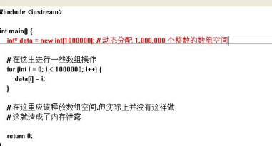

<div align="center"><strong><font size=8>BoundsChecker实验报告</font></strong></div>


<div align="center"><strong><font size=5>班级：</font></strong></div>

<div align="center"><strong><font size="5">学号：</font></strong></div>

<div align="center"><strong><font size="5">姓名：</font></strong></div>

<div align="center"><strong><font size="5">指导教师：</font></strong></div>


[TOC]
<div style="page-break-after: always;"></div>

## 1. 下载安装 BoundsChecker
1. 双击 `setup.exe`
   
2. 点击 `Install Compuware BoundsChecker`
   
3. 默认安装，点击 `Next`
   
4. 选择 `14-day Evaluation`，点击 `Next`
   
5. 选择安装路径，之后都默认安装，点击 `Next`
6. 安装成功后，打开 Visual C++ 6.0，在上方菜单栏会出现 BoundsChecker 选项，同时也多了一组工具栏上的按钮，如下图
   

## 2. BoundsChecker 的使用

使用 BoundsChecker 对程序的运行时错误进行检测，有两种使用模式可供选择。一种模式叫做 ActiveCheck，一种模式叫做 FinalCheck。下面分别进行介绍。

### 2.1 ActiveCheck模式

ActiveCheck 是 BoundsChecker 提供的一种方便、快捷的错误检测模式，它能检测的错误种类有限，只包括：内存泄露错误、资源泄露错误、API 函数使用错误。

要想使用 ActiveCheck 模式来检测程序的运行时错误，只需在 VC++ 集成开发环境中打开 BoundsChecker 功能，然后从调试状态运行程序即可。此时 ActiveCheck 会在后台自动运行，随时检测程序是否发生了错误。

现在用 ActiveCheck 模式来测试程序如下：

```cpp
#include <iostream>

int main() {
    int* data = new int[1000000]; // 动态分配 1,000,000 个整数的数组空间

    // 在这里进行一些数组操作
    for (int i = 0; i < 1000000; i++) {
        data[i] = i;
    }

    // 在这里应该释放数组空间,但实际上并没有这样做
    // 这就造成了内存泄露

    return 0;
}
```

1. 新建工程，选择 Win32 Console Application，工程名称命名为 ActiveCheck，点击确定
   
2. 选择“一个空工程”
3. 再次新建一个 C++ Source File 将其添加到之前创建的工程，并命名为 `test`
   
4. 将测试代码复制，选择 组建 -> 编译 `[test.cpp]`
   
5. 编译完成后选择 BoundsChecker -> Error Detection，同时确保下方的 `Log Events` 和 `Display Error and Pause` 也处于选中状态
   
6. 再次选择 组建 -> 开始调试 -> Go，选择“是”
   
7. 在 Summary 中可以查看程序出现的错误，可见“Memory Leaks”中存在一个问题，点击“Memory Leak”，展开“Memory Leak” -> “Leak exiting program”，下方会将导致内存泄露的代码标红，右侧也会给出具体的报错信息
   
8. 我们再次选择 BoundsChecker -> Rebuild with BoundsChecker，然后再次选择 组建 -> 开始调试 -> Go
   
9. BoundsChecker 就会展示具体的报错信息
   

“Explain”按钮：点击该按钮，会得到当前这个错误的帮助信息。

“Memory/Resource Viewer”按钮：点击该按钮，会显示当前内存的申请、使用情况。

“Suppress”按钮：点击该按钮，则将该错误添加到被忽略的错误列表中去，当再次出现这个问题时，BoundsChecker 将不会进行报告。

“Debug”按钮：点击该按钮，则会马上跳转到出现问题的代码行处。处理完问题后，点击 `[Build/ Start Debug/Go]` 菜单项，可以继续执行程序，进行检测。

“Halt”按钮：点击该按钮，则立即终止程序的执行。

10. 我们点击 Debug，跳转到代码处，并修正代码，释放内存
    ``` cpp
    #include <iostream>
    
    int main() {
        int* data = new int[1000000]; // 动态分配 1,000,000 个整数的数组空间
    
        // 在这里进行一些数组操作
        for (int i = 0; i < 1000000; i++) {
            data[i] = i;
        }
    
        delete[] data;
    
        return 0;
    }
    ```

    

修改代码后再次编译调试，发现内存泄露错误消失

### 2.2 FinalCheck模式

FinalCheck 具有 BoundsChecker 提供的所有检错功能。FinalCheck 是 ActiveCheck 的超集，它除了能够检测出 ActiveCheck 能够检测出的错误，还能发现很多 ActiveCheck 不能检测到的错误，包括：指针操作错误、内存操作溢出、使用未初始化的内存等等，并且，对于 ActiveCheck 能检测出的错误，FinalCheck 能够给出关于错误更详细的信息。所以，我们可以把 FinalCheck 认为是 ActiveCheck 的功能增强版。我们付出的代价是：程序的运行速度会变慢，有时甚至会变得很慢。

要想在 FinalCheck 模式下测试程序，不能使用 VC++ 集成开发环境提供的编译连接器来构造程序，而必须要使用 BoundsChecker 提供的编译连接器来编译连接程序。当 BoundsChecker 的编译连接器编译连接程序时，会向程序中插装一些错误检测代码，这也就是 FinalCheck 能够比 ActiveCheck 找到更多错误的原因。

来测试下面的程序：

```cpp
#include <stdio.h>

void main() {
    int i = 0;
    int a[10];
    for (i = 0; i < 11; ++i)
        a[i] = i;

    for (i = 10; i >= 0; --i)
        printf("%d", a[i]);

    printf("\n");
}
```

该程序存在数组越界的问题，也很有可能产生内存溢出的问题，这种问题只能用 FinalCheck 模式来测试。

1. 先和之前一样导入文件
2. 选择 组建 -> 配置
   
3. 在弹出的对话框中点击 “添加” 按钮。在“配置” 编辑框中添入你为 BoundsChecker 创建的文件夹的名称，这个名称是任意的，比如我们取名为 `BoundsChecker`。在 “拷贝设置从”组合框中选中 `XXX—Win32 Debug` 项，然后点击“确定”按钮，接着点击“关闭”按钮。
   

FinalCheck 的独立测试文件夹已经建立好了，下面需要激活。

4. 选择 工程 -> 设置，选择刚刚建立的 `Win33 BoundsChecker`
5. 选择 BoundsChecker -> Rebuild All with BoundsChecker，对程序重新进行编译链接。
   

配置完成后，就可以执行测试了，步骤与在 ActiveCheck 模式下相同，且最后 BoundsChecker 也会给出错误检测结果列表，该错误列表与 ActiveCheck 给出的错误列表的查看方法完全一样。


