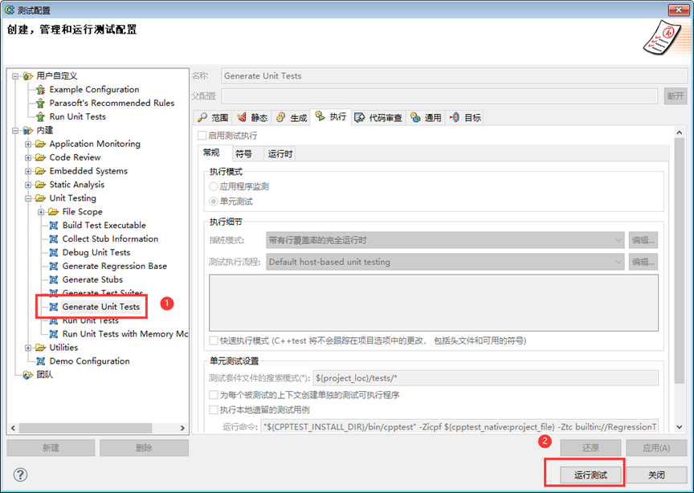
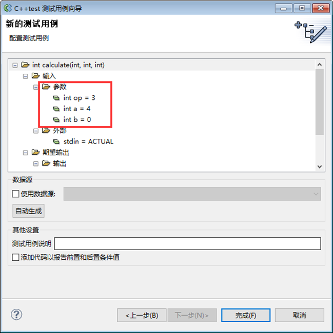

<div align="center"><strong><font size=8>C++Test实验报告</font></strong></div>


<div align="center"><strong><font size=5>班级：</font></strong></div>

<div align="center"><strong><font size="5">学号：</font></strong></div>

<div align="center"><strong><font size="5">姓名：</font></strong></div>

<div align="center"><strong><font size="5">指导教师：</font></strong></div>


[TOC]
<div style="page-break-after: always;"></div>

## 实验环境
- **软件环境：**
  - 操作系统：Windows XP Professional
  - Visual C++ 6.0
  - C++Test 9.2

## 实验步骤
### 一、软件介绍

#### Visual C++ 6.0

**Visual C++ 6.0**是由微软开发的集成开发环境（IDE），属于Microsoft Visual Studio 6.0套件的一部分，于1998年发布。它在开发Windows应用程序、系统软件和高性能的计算程序方面具有重要作用。以下是Visual C++ 6.0的一些主要特性和功能：

1. **IDE特性**：
   - **编辑器**：提供代码编辑、语法高亮和自动完成等功能。
   - **调试器**：具有强大的调试功能，包括断点设置、内存检查、变量监控等。
   - **项目管理**：支持多项目的解决方案管理，方便开发者组织和管理大型项目。

2. **编译器**：
   - 支持C和C++语言的编译。
   - 提供优化选项，提高生成代码的执行效率。

3. **MFC（Microsoft Foundation Classes）**：
   - 提供了一套用于开发Windows应用程序的类库，大大简化了Windows应用程序的开发。

4. **ATL（Active Template Library）**：
   - 用于创建轻量级的COM组件，特别适合于开发ActiveX控件和其他COM对象。

5. **向后兼容**：
   - 尽管其发布已经多年，Visual C++ 6.0仍然被一些旧系统和遗留项目所使用，主要是因为其稳定性和与旧代码的兼容性。

6. **限制**：
   - Visual C++ 6.0并不完全支持现代C++标准（如C++11及后续版本），因此在使用现代C++特性时会受到限制。
   - 调试和诊断工具相对较为原始，不如现代IDE那样强大和用户友好。

#### C++Test 9.2

**C++Test 9.2**是Parasoft公司推出的一款静态和动态分析工具，专为C和C++代码的测试和质量保证设计。它提供了一整套自动化测试解决方案，帮助开发团队提高代码质量、降低缺陷率，并确保代码符合行业标准。以下是C++Test 9.2的一些主要特性和功能：

1. **静态分析**：
   - **代码检查**：提供了丰富的代码检查规则，能够发现潜在的编程错误、违反编码标准的问题以及安全漏洞。
   - **编码标准**：支持多种行业和组织的编码标准（如MISRA、CERT等），帮助开发者编写符合规范的代码。

2. **动态分析**：
   - **单元测试**：自动生成并执行单元测试，确保各个代码模块的功能正确性。
   - **代码覆盖率**：分析代码执行情况，提供代码覆盖率报告，帮助识别未被测试的代码路径。
   - **内存分析**：检测内存泄漏、越界访问等内存相关的问题。

3. **集成与自动化**：
   - **IDE集成**：与多种开发环境（如Visual Studio、Eclipse等）集成，提供便捷的测试和分析功能。
   - **持续集成**：支持与CI工具（如Jenkins、Bamboo等）集成，实现持续测试和自动化质量保证。

4. **报告和可视化**：
   - 提供详细的分析报告和可视化图表，帮助开发团队了解代码质量状况和改进方向。

5. **合规性和标准支持**：
   - 帮助企业和开发团队确保代码符合行业标准和法规要求，降低因不合规而导致的风险。

6. **用户支持和更新**：
   - Parasoft提供技术支持和定期更新，确保工具的可靠性和有效性。

通过使用C++Test 9.2，开发团队可以大幅提高代码质量和开发效率，减少错误和安全漏洞，确保软件产品的可靠性和稳定性。

### 二、软件安装

1. Visual C++ 6.0：[Vc++安装包_Visual C++ 6.0中文版安装包下载及win11安装教程_vc++ 6.0-CSDN博客](https://blog.csdn.net/weixin_46274254/article/details/123255025)
2. C++Test 9.2：[C/C++test | Parasoft中国官网 (parasoftchina.cn)](https://www.parasoftchina.cn/products/ctest/)

### 三、实验过程

#### 1. 软件破解

我们打开C++Test软件，发现没有可用的许可证


我们需要将lic_client.jar复制到c++Test安装目录下的：\plugins\com.parasoft.xtest.libs_9.2.3.20111012\Parasoft ，覆盖原文件。


#### 2. 静态测试

##### 2.1 静态代码检测规则

点击菜单栏的 Parasoft > 测试配置，在打开的窗口中按下面图中箭头所示，调整检测规则


##### 2.2 开始进行静态测试

我们禁用所有的规则，只保留上图红框中的“初始化 [INIT]”中的[INIT-06 - 1]和[INIT-09 - 1]。

选择菜单栏 Parasoft > 执行 "Example Configuration" 测试，即可开始测试。


##### 2.3 改正代码

片刻后测试完成，点击下面标识的按钮即可查看查找到的违规：


双击消息即可快速跳转到出现违规的代码，我们对其进行改正：


#### 3. 动态测试

##### 3.1 自动化生成测试用例并

我们编写一段用于接下来测试的代码

``` C++
// extern.cpp

int add(int a, int b) {
    return a + b;
}

int dec(int a, int b) {
    return a - b;
}

int division(int a, int b) {
    return a / b;
}

int multi(int a, int b) {
    return a * b;
}


// Calculate.cpp
#include <iostream>

extern int add(int, int);

extern int dec(int, int);

extern int division(int, int);

extern int multi(int, int);

int calculate(int op, int a, int b) {
    int result = 0;
    switch (op) {
        case 1:
            result = add(a, b);
            break;
        case 2:
            result = dec(a, b);
            break;
        case 3:
            if (b != 0) {
                result = division(a, b);  // 这里的代码存在问题
            } else
                result = a;
            break;
        case 4:
            result = multi(a, b);
            break;
        default:
            break;
    }
    return result;
}

int main() {
    int operation, param1, param2;
    std::cout << "Enter the operation (1 for add, 2 for dec, 3 for division, 4 for multi): " << std::endl;
    std::cin >> operation;
    std::cout << "Enter the two parameters: ";
    std::cin >> param1 >> param2;

    int result = calculate(operation, param1, param2);
    std::cout << "The result is: " << result << std::endl;

    return 0;
}

```

选择菜单栏 Parasoft > 测试执行 > 内建 > Unit Testing >Gerenate Unit Tests

可以看到工程下面多了一个“tests”文件夹，展开，TestSuite_Account_cxx.cpp就是刚才自动生成的测试用例。


##### 3.2 执行生成的测试用例

点击 Parasoft-> 测试配置 -> 内建 -> Unit Testing ->Run Unit Tests，Parasoft C++test将会自动化执行生成的测试用例。


##### 3.3 查看测试报告

测试用例执行完毕之后，软件会自动生成测试报告：


在工具菜单中选择 Parasoft > 显示视图 > 质量任务，可以查看到更具体的测试结果。


#### 4. 覆盖率测试

**行覆盖率** **(Line Coverage–LC)**

指出多少源码的可执行受控制流影响至少一次。如果所有可执行代码107受到影响至少一次，将会获得完全的 100% 行覆盖率。

 

**块覆盖率** **(Block Coverage–BC)**

与行覆盖率类似，除了带有块覆盖率的测量代码单元是一个基本块（见前面表格中这一术语的定义）表示源码中有多少基本块受到控制流影响至少一次。

 

**路径覆盖率 ** **(Path Coverage–PC)**

表明是否一个给定的函数中每条可能的路径随后有控制流。用于挑选路径的分开点(见前面表格中这个术语的解释)与在判断（分支）覆盖率中相同。因为循环引入极多数量的路径，这个测量只考虑有限循环的可能性。

 

**判断（分支）覆盖率**  **(Design/Condition Coverage—DC/CC)**

表明源码中有多少分支控制流通过。当每一个判决在所有的分支点取得所有可能的结果至少一次时，可获取完整的，100% 覆盖。C++test 考虑源码中下列语句类型分支点：if-else, for,while, do-while和switch.。C++test 没有将这样的动态分支点当作为异常操作 (throw-catch 语句)。如果在一个文件里没有判断，C++test 报告这种度量标准不可用(使用"N/A"选项卡)。

 

**修正的条件** **/** **判断覆盖率** **(MC/DC)**

根据 DO - 178B 标准必需满足下面三个条件才能获得全部的 (100%) MC/DC覆盖率： a. 每个判断至少有一次已经产生所有可能的结果 b. 判断中的每一个条件至少有一次已经产生所有可能的结果。 c. 判断中每一个条件已经证明独立地影响判断结果。由于 C++test 认为每一个条件和判断可能只有两个 MC/DC覆盖率的结果：真或假。C++test 只检查上面列出的第三个选项（c），因为（c）中暗含条件（a）和（b）。 通过改变一些特殊条件，又固定所有其他可能的条件，来证明这种条件能够独立地影响判决结果。


##### 4.1 配置规范

点击Parasoft > 测试配置 > 内建 > Unit Testing > 右键选择Run Unit Test > 点击复制后上方的“用户自定义”下会出现Run Unit Test


##### 4.2 配置规则

点击用户自定义下的Run Unit Test > 执行 > 插桩模式 > 完全


##### 4.3 生成测试用例

对导入的工程执行内建测试Generate Unit Test，生成测试用例



然后选择最开始创建的用户自定义Run Unit Test进行覆盖率测试


在测试进程窗口中就可以看到覆盖测试的结果


##### 4.4 结果分析

打开覆盖率窗口查看覆盖率相关情况，双击报告中的覆盖率行就可以发现问题的所在位置


##### 4.5 添加测试用例


选定要添加测试用例的套件右键 > 新建 > 测试用例使用向导


接下来在该窗口中选择需要测试的方法或函数，自定义测试用例名称


选择待测试的函数模块和命名测试用例，配置测试用例，这里重点配置测试用例的输入参数的值。有效的输入参数值才能测试程序的执行路径。这里配置 b=0，op=3




运行配置好的测试规范(选择“Parasoft”->“测试执行”->“用户自定义”->“Run Unit Test” )


