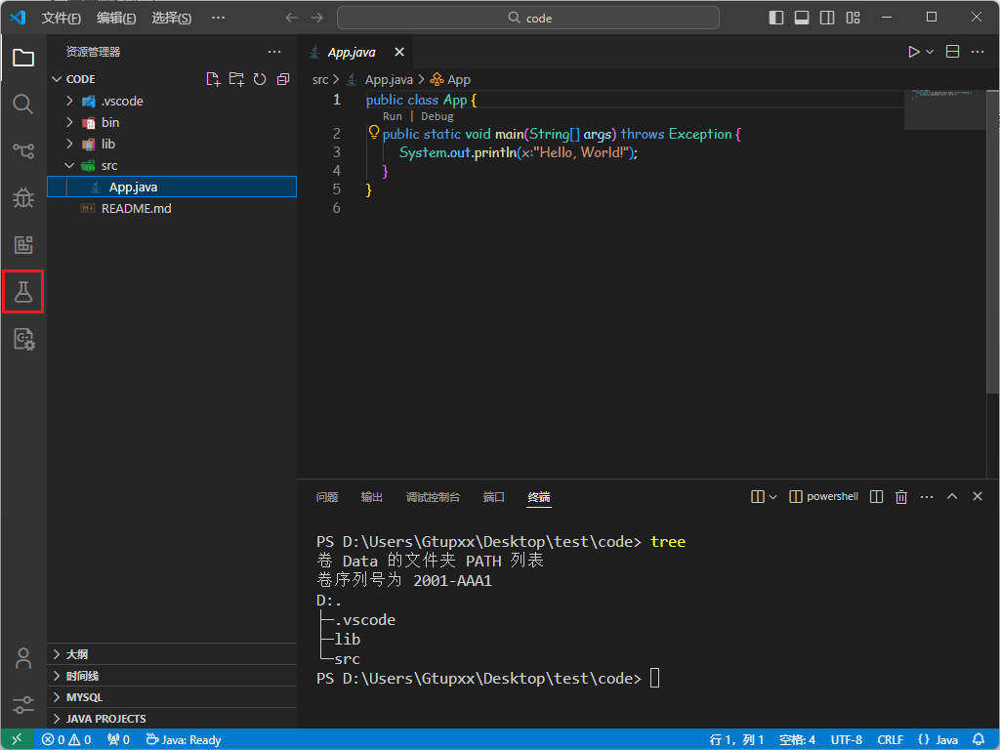
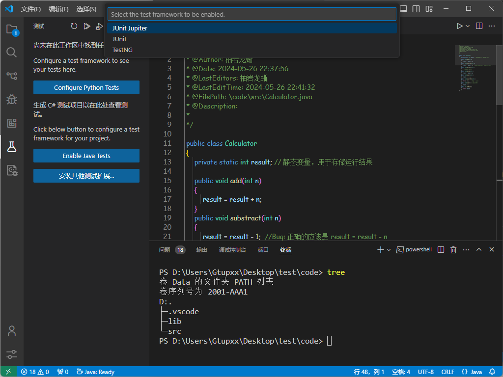
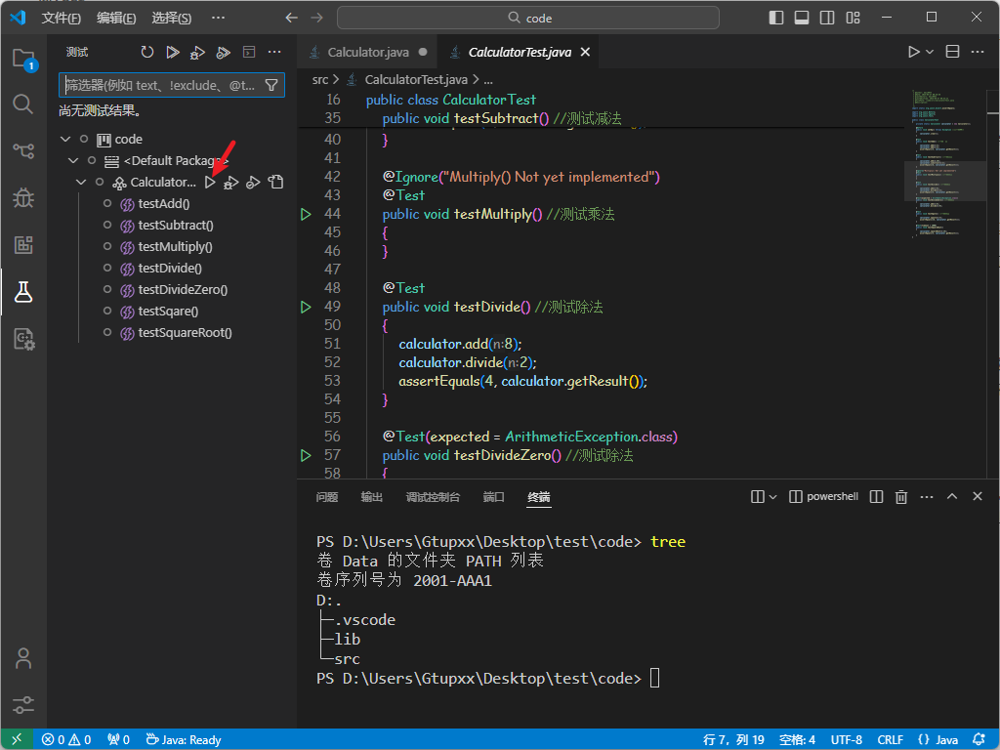
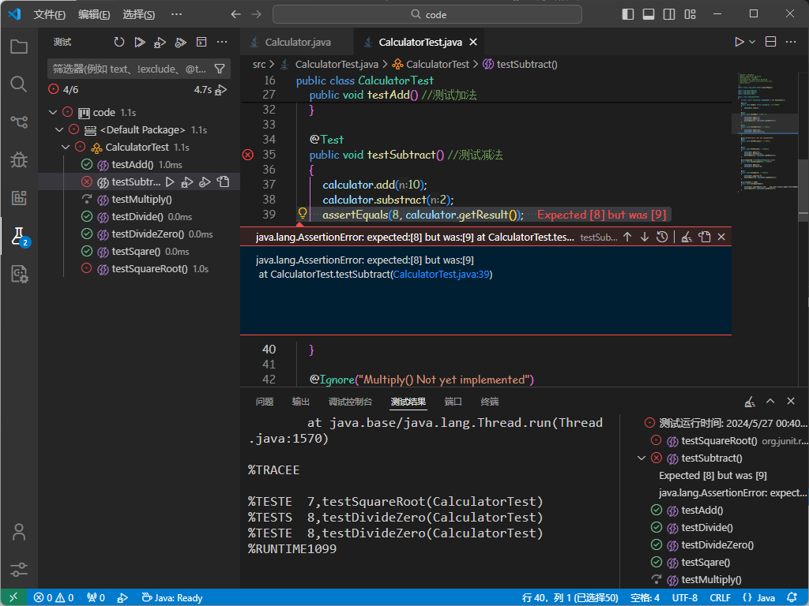

<div align="center"><strong><font size=8>JUnit实验报告</font></strong></div>


<div align="center"><strong><font size=5>班级：软件工程02</font></strong></div>

<div align="center"><strong><font size="5">学号：</font></strong></div>

<div align="center"><strong><font size="5">姓名：</font></strong></div>

<div align="center"><strong><font size="5">指导教师：</font></strong></div>


[TOC]
<div style="page-break-after: always;"></div>

## 实验环境
- **软件环境：**
  - 操作系统：Windows 11 23H2
  - IDE：VSCode
  - JDK：jdk-22
  - 其他软件：Test Runner for Java（提供JUnit）、Language Support for Java(TM) by Red Hat（Java项目构建）

## 实验步骤
### 一、软件介绍

#### Test Runner for Java

一个轻量级扩展，用于在 Visual Studio Code 中运行和调试 Java 测试用例。该扩展支持以下测试框架：

- JUnit 4 (v4.8.0+)
- JUnit 5 (v5.1.0+)
- TestNG (v6.9.13.3+)

Java 测试运行器与 Red Hat 的 Java 语言支持和 Java 调试器协同工作，提供以下功能：

- 运行/调试测试用例
- 自定义测试配置
- 查看测试报告
- 在测试资源管理器中查看测试

#### Language Support for Java(TM) by Red Hat

Language Support for Java™ by Red Hat 是为 Visual Studio Code 开发的 Java 语言支持扩展，提供了语法高亮、代码补全、调试支持等功能，帮助 Java 开发人员更轻松地在 VS Code 中编写、调试和管理 Java 代码。

- 调试支持： 集成了调试器，可以在 Visual Studio Code 中调试 Java 程序，包括设置断点、观察变量值等功能。
- 项目管理和构建支持： 可以在 Visual Studio Code 中管理 Maven 和 Gradle 项目，执行构建和依赖管理等操作。
- 集成测试框架：支持与常见的 Java 测试框架集成，如 JUnit 和 TestNG，可以轻松地运行和管理测试用例。

### 二、软件安装

1. JDK下载地址：[Java Downloads | Oracle 中国](https://www.oracle.com/cn/java/technologies/downloads/) 
2. 其余插件可从VSCode直接下载。

### 三、实验过程

#### 1.新建项目

通过Language Support for Java(TM) by Red Hat，我们可以快速构建出一个基本的java项目模板：



如果Test Runner for Java被正确安装了，可以看到左侧出现了测试的徽章（上图红框）。

我们先简单编写一个Calculator类用于充当接下来被测对象：

``` java
/*
 * @Author: 柚岩龙蜥
 * @Date: 2024-05-26 22:37:56
 * @LastEditors: 柚岩龙蜥
 * @LastEditTime: 2024-05-26 22:41:32
 * @FilePath: \code\src\Calculator.java
 * @Description:  
 * 
 */

public class Calculator 
{
	private static int result; // 静态变量，用于存储运行结果
	
    public void add(int n) 
    {
        result = result + n;
    }
    public void substract(int n) 
    {
        result = result - 1;  //Bug: 正确的应该是 result = result - n
    }
    public void multiply(int n) 
    {
    	 // 此方法尚未写好
    }         
    public void divide(int n) 
    {
        result = result / n;
    }
    public void square(int n)
    {
        result = n * n;
    }
    public void squareRoot(int n) 
    {
        for (; ;) ;      //Bug : 死循环
    }
    public void clear() // 将结果清零
    {     
        result = 0;
    }
    public int getResult()
    {
        return result;
    }
}

```

#### 2.引入JUnit相关包

我们点击进入Test界面，选择“Enable Java Tests”，并在随后的弹窗中选择JUnit，VSCode会帮我们自动下载并导入所用到的包。

在lib文件夹下可以看到新增的包为：hamcrest-core-1.3.jar和junit-4.13.2.jar。



#### 3.编写测试代码

我们新建一个CalculatorTest类，用于测试Calculator类中的各种方法。

``` java
import static org.junit.Assert.assertEquals;

import org.junit.Before;
import org.junit.Ignore;
import org.junit.Test;

public class CalculatorTest 
{
	private static Calculator calculator = new Calculator();
	
	@Before
	public void setUp() throws Exception //初始化操作
	{
		calculator.clear();
	}

	@Test
	public void testAdd() //测试加法
	{
		calculator.add(2);
        calculator.add(3);
        assertEquals(5, calculator.getResult());
	}

	@Test
	public void testSubtract() //测试减法
	{
		calculator.add(10);
        calculator.substract(2);
        assertEquals(8, calculator.getResult());
	}

	@Ignore("Multiply() Not yet implemented")
	@Test
	public void testMultiply() //测试乘法
	{
	}

	@Test
	public void testDivide() //测试除法
    {
        calculator.add(8);
        calculator.divide(2);
        assertEquals(4, calculator.getResult());
    }

    @Test(expected = ArithmeticException.class)
	public void testDivideZero() //测试除法
    {
        calculator.add(8);
        calculator.divide(0);
    }
    
    @Test
    public void testSqare() //测试平方
    {
        calculator.square(4);
        assertEquals(16, calculator.getResult());
    }

    @Test(timeout = 1000)
    public void testSquareRoot()
    {
        calculator.squareRoot(16);
        assertEquals(4, calculator.getResult());
    }
}

```
##### @Test
`@Test` 是 JUnit 框架中的一个注解，用于标记一个方法是测试方法。在 JUnit 测试类中，所有被 `@Test` 注解标记的方法都会被 JUnit 框架执行，用于测试被测试类中的某个功能或方法是否符合预期。

1. **标记测试方法：** 使用 `@Test` 注解标记的方法将被 JUnit 框架识别为一个测试方法，用于执行相应的测试任务。

2. **测试方法命名规范：** 通常，测试方法的命名应该具有描述性，清晰地表明被测试的功能或方法以及期望的行为。例如，`testAdd()`、`testSubtract()` 等。

3. **执行顺序：** JUnit 框架会按照测试方法在源代码中的顺序依次执行测试。但是，并不保证测试方法的执行顺序，因此应该避免编写依赖于测试方法执行顺序的测试用例。

4. **断言验证：** 在测试方法中，通常会使用断言方法（如 `assertEquals()`、`assertTrue()` 等）来验证被测试方法的执行结果是否符合预期。

5. **异常测试：** 除了正常情况下的测试，`@Test` 注解还支持对异常情况的测试。可以通过 `expected` 属性来指定测试方法是否会抛出特定的异常，例如 `@Test(expected = ArithmeticException.class)`。

##### @Before

`@Before` 注解标记的方法会在每个测试方法执行前执行，用于进行测试的准备工作。通常，`@Before` 方法用于初始化测试环境、准备测试数据或执行其他必要的设置操作。例如，在测试之前清除数据库、创建临时文件、初始化测试对象等。`@Before` 注解使得这些操作在每个测试方法执行前都能被正确执行，确保测试的独立性和可靠性。

##### @Ignore

`@Ignore` 注解用于标记暂时不需要执行的测试方法。当一个测试方法被 `@Ignore` 注解标记时，JUnit 框架将会跳过执行该测试方法，直接执行其他未被标记的测试方法。通常情况下，`@Ignore` 注解可以用于标记一些尚未实现或者临时不可用的测试方法，避免这些方法影响整体的测试结果。在实现完毕或者问题解决后，再移除 `@Ignore` 注解，使得该测试方法能够被正常执行。


#### 5.开始测试

进入Test界面，现在我们编写的CalculatorTest类中使用`@Test`注解的方法将会出现在测试界面中，我们点击开始测试（下图箭头）即可完成测试。



#### 6.测试结果



如上图，我们可以看到减法的测试没有通过，乘法的测试被跳过，除数为零正常通过，平方根的测试超时了，其余测试均通过。

上面是我们设计好的结果。
