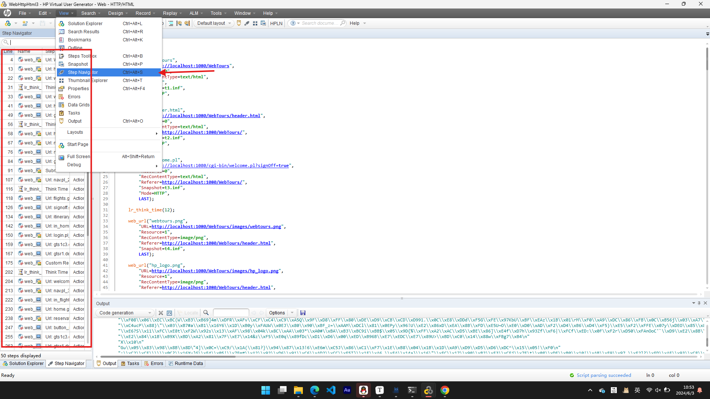
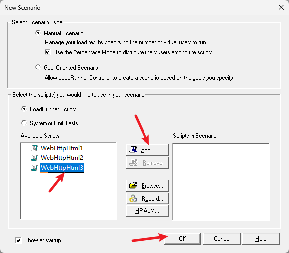
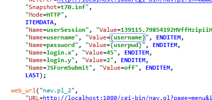
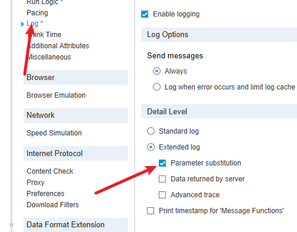

<strong>LoadRunner实验报告</strong>

<strong>班级：</strong>

<strong>学号：</strong>

<strong>姓名：</strong>

<strong>指导教师：</strong>

[TOC]

## 实验环境
- **软件环境：**
  - 操作系统：Windows 11 23H2
  - 浏览器：Chromo 125.0.6422.141（正式版本） （64 位）
  - 其他软件：LoadRunner 12

## 实验步骤
### 一、软件介绍

#### 1. Virtual User Generator (VuGen)

Virtual User Generator，简称VuGen，是LoadRunner的脚本生成器。其主要功能是录制和编辑虚拟用户脚本，这些脚本模拟实际用户的操作行为。VuGen支持多种协议，例如HTTP/HTTPS、FTP、SOAP、TCP等。用户可以通过VuGen录制脚本，之后可以对脚本进行参数化、关联、添加检查点等操作，以模拟真实用户的操作。

**主要功能：**

- **录制脚本**：捕捉用户与应用的交互过程并生成相应的脚本。
- **编辑脚本**：通过编辑器修改和增强脚本功能。
- **调试脚本**：提供调试工具帮助用户在本地环境下验证脚本的正确性。

#### 2. Controller

Controller是LoadRunner的控制中心，用于配置、管理和执行负载测试。通过Controller，用户可以指定测试场景，包括虚拟用户的数量、行为、负载模式等，并控制测试的运行。

**主要功能：**

- **场景设计**：定义测试场景，包括虚拟用户的分布、负载模式、运行时间等。
- **执行测试**：启动和监控负载测试，实时查看测试执行情况。
- **监控资源**：监控服务器、网络等资源的使用情况，以获取系统在高负载下的性能数据。

#### 3. Analysis

Analysis是LoadRunner的结果分析工具，用于分析负载测试的结果并生成报告。通过Analysis，用户可以对测试过程中收集的各种性能指标进行深入分析，找出系统性能瓶颈。

**主要功能：**

- **数据分析**：对测试数据进行多维度分析，如响应时间、吞吐量、并发用户数等。
- **生成报告**：生成各种图表和报告，帮助用户理解和展示测试结果。
- **瓶颈分析**：通过各种分析手段，识别系统性能瓶颈，提供优化建议。

#### 4. WebTours

WebTours是LoadRunner自带的一个示例应用程序，用于帮助用户学习和练习LoadRunner的使用。WebTours模拟了一个旅游预订网站，用户可以通过这个网站进行航班、酒店预订等操作。使用WebTours进行性能测试可以帮助用户快速上手LoadRunner的基本操作。

**主要功能：**

- **学习与实践**：通过一个简化的应用环境，帮助用户学习和掌握LoadRunner的功能。
- **脚本录制**：提供一个标准的录制环境，用户可以练习录制和修改脚本。
- **测试场景配置**：帮助用户理解如何配置和执行测试场景。

### 二、软件安装

1. 下载安装社区版LoadRunner 12，并通过安装引导程序完成所有组件的安装。
1. 注意安装过程中出现添加证书时需要取消勾选，否则将无法完成安装。
3. 安装完成后桌面上出现下面三个图标，表示安装过程以经正常完成。
   

### 三、实验过程

#### 1. 配置HP WebTours服务器

1. 打开软件安装目录下的`httpd.conf`,使用记事本打开。
2. 找到ServerName localhost:1080，并删除前面的`#`。
   

#### 2. 启动HP WebTours服务器

1. 通过`win`+`s`搜索“HP WebTours”，打开该应用。
   
   
2. 打开HP Web Tours Application，即可成功访问网页。 输入用户名jojo和密码bean即可登录。

#### 3. 录制脚本

1. 启动Virtual User Generator，新建脚本和解决方案，选择Web-HTTP/HTML并Create。
   

   

上图为创建成功的界面

#### 4. 准备录制

点击屏幕上的录制按钮，并在新弹出的窗口中的URL栏填写“http://localhost:1080/WebTours”，点击`Recording Options`，并按下图配置。

#### 5. 开始录制

点击`Start Recording`开始录制。

我们模拟用户进行一些操作。

#### 6. 查看、重播脚本

View > Step Navigator

Replay > Runtime Settings

设置迭代次数为10

设置步调为15s

选择无代理

点击Replay即可重播脚本

#### 7. 数据分析

打开Controller，将上面创建的脚本导入。

按下`F5`，出现下面的报错信息：

解决方案：

1. 通过ipconfig/all获取本机IP：
    
2. 添加本机IP：
    
3. 开始运行
    
4. 运行完成
    

5. 分析总结，点击Result > Analyze Results
   
   

   Running Vusers:
   
   Hits per Second
   
   Throughput
   
   Transaction Summary
   
   Average Transaction Response Time
   

#### 8. 参数化

参数化是性能测试过程中非常重要的一部分，旨在通过使用动态数据而非静态数据来提高测试脚本的真实性和灵活性。在LoadRunner中，参数化的主要作用是避免由于重复使用相同的数据而导致的缓存效果，从而模拟更真实的用户行为。

我们以登录用户名和密码为例进行参数化。

#### 9. 集合点

集合点的意思时等到特定的用户数后再一起执行某个操作，比如一起保存，一起提交（我们通常意义上的并发数并不是指一起提交或者一起保存），一般情况下使用不到集合点，不过，订票系统或者促销类需要用到，比如说某个促销品的促销时间在8点到8点30，这样的话，就可能出现在8点时很多人一起提交的场景

集合点函数可以帮助我们生成有效可控的并发操作。虽然在Controller中多用户负载的Vuser是一起开始运行脚本的，但是由于计算机的串行处理机制，脚本的运行随着时间的推移，并不能完全达到同步。这个时候需要手工的方式让用户在同一时间点上进行操作来测试系统并发处理的能力，而集合点函数就能实现这个功能。集合点只需要在脚本中插入lr_rendezvous()函数即可。

我们在代码中需要添加集合点的位置中点击右键，选择Insert >Rendezvous，代码中添加的代码段为：lr_rendezvous("jihedian");

打开Controller，并在菜单中点击 Scenario > Rendezvous，在弹出的窗口中编辑释放策略。

**集合点提供了以下3种策略：**

1．当百分之多少的用户到达集合点时脚本继续。

2．当百分之多少的运行用户到达集合点时脚本继续

3．多少个用户到达集合点时脚本继续。

这3个策略的区别在于：假设脚本由100个用户来运行，但100个用户并不是一开始就共同运行的。假设每隔1分钟添加10个用户，也就是说10分钟后系统才有100个在线用户。这里100就是指系统访问的所有用户数，而不同时间的在线用户数是不同的。设置的集合点策略百分比均为100%。

在场景运行时，当Vuser脚本运行到集合点函数时，该虚拟用户会进入集合点状态直到集合点策略满足后才释放。

策略1是指当全部用户都运行到了集合点函数才释放集合，让这100个用户并发运行后面的脚本。

策略2是指当前时间如果只有10个用户在线，那么只需要这10个用户都运行到了集合点函数就释放集合，让这10个用户并发运行后面的脚本。

策略3就比较好理解了，当到达集合点的用户数达到自己设置的数量后就释放等待，并发运行后面的脚本。

可以在多个脚本上设置相同的集合点名称来实现多个脚本同时并发的效果。

**集合点超时**

在脚本运行时，每个虚拟用户到达集合点时都会去检查一下集合点的策略设置，如果不满足，那么就在集合状态等待，直到集合点策略满足后，才运行下一步操作。但是可能存在前一个虚拟用户和后一个虚拟用户达到集合点的时间间隔非常长的情况，所以需要指定一个超时的时间，如果超过这个时间就不等待迟到的虚拟用户了。

超时时间是指虚拟用户之间的时间差，当出现两个虚拟用户到达集合点的时间差超过设定的超时时间时，所有在集合点处于等待状态中的用户将全部释放。