<div align="center"><strong><font size=8>Logiscope实验报告</font></strong></div>


<div align="center"><strong><font size=5>班级：</font></strong></div>

<div align="center"><strong><font size="5">学号：</font></strong></div>

<div align="center"><strong><font size="5">姓名：</font></strong></div>

<div align="center"><strong><font size="5">指导教师：</font></strong></div>


[TOC]
<div style="page-break-after: always;"></div>

## 1. 下载安装 Logiscope

1. 双击 `setup.exe`
2. 默认 Next，选择安装路径
3. 点击 Install
4. 再次点击 Next，安装完成！
5. 激活 Logiscope，用安装文件中的 `license.dat` 文件来激活
   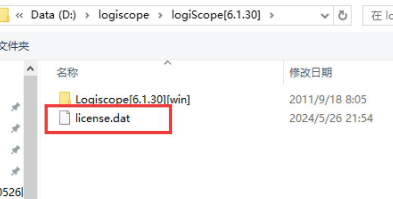

## 2. 代码评审模块 Audit

### 2.1 新建一个 Logiscope Audit 工程

这一节来新建一个 Logiscope 的测试工程，测试如下的 C 语言程序：

```c
#include <stdio.h>

void main() {
    int a = 0;
    int b = 0;

    printf("请输入两个整型数据 a 和 b: \n");
    scanf("%d%d", &a, &b);

    if (a != b) {
        if (a > b) {
            printf("a > b \n");
        } else {
            printf("a < b \n");
        }
    } else {
        printf("a = b \n");
    }
}
```

首先在 VC 里面编辑、编译、运行该段程序，没有问题后再运行 Logiscope 6.1。

#### 创建 Audit 工程

1. 选择“C Audit Project”选项。
    - Project：该工程的名称，自定义。
    - Location：该测试工程所在的路径，可以任意选择。
      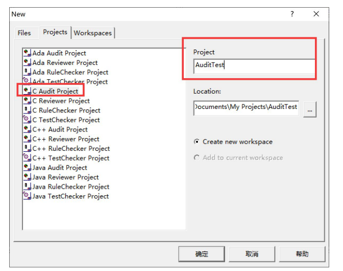
    
2. 单击“确定”按钮，进入选择源代码路径对话框。
3. 在该对话框中，需要选择刚才所创建的 VC 工程所在的路径，也就是被测程序源代码的路径。
    - Include all subdirectory：选择路径下面的所有子文件夹中的文件。
    - Do not include subdirectory：不选择子文件夹下面的文件。
    - Customize subdirectories to include：自定义需要包含的子文件夹。
      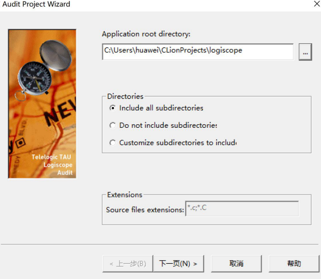
    
4. 设置完毕后，单击“下一步”按钮，进入选择编译器对话框。
5. 选择一个 C 语言的编译器，默认为 VC6.0，保持不变即可。
    - Choose a quality model：选择一个质量模型，在 Logiscope 的安装路径下面的 `Ref` 文件夹内置了一个质量模型，里面存储的各种语言的书写规范和质量评测指标，保持默认设置不变即可。
    - Choose a Logiscope repository：选择一个 Logiscope 的结果文件存储路径。注意，这个路径和在第一个页面里面选择的 location 不一样，location 是测试工程所在的路径，而这个 repository 路径是 Logiscope 的结果分析文件存放的路径，默认设置会在源代码路径下自动建一个 Logiscope 文件夹。

6. 设置完毕后，单击“下一步”按钮，进入完成确认对话框。
    - Quality Model：显示质量模型文件的存放路径。
    - Source Files：显示源代码文件。
      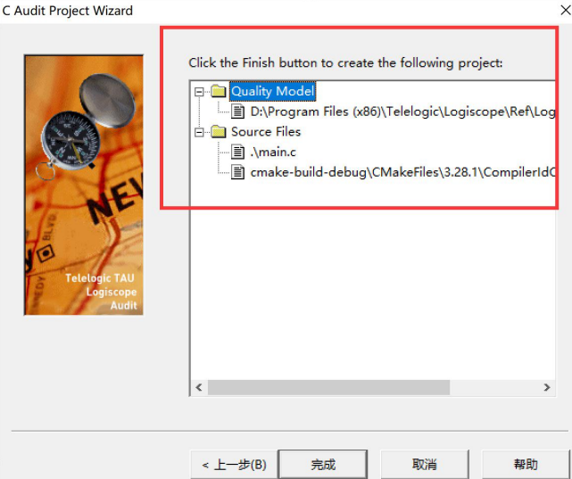
    
7. 确认信息无误后，单击“完成”按钮，弹出提示对话框。
    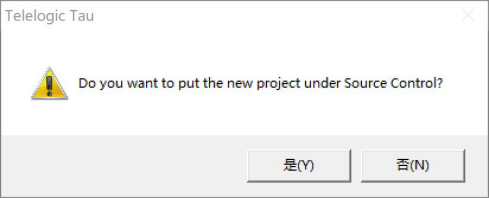
8. 询问是否将新建的工程置于配置管理工具 VSS 的管理之下，这里单击“否”按钮。

进入 Logiscope 主界面，如果左面的工程管理器出现如下图所示的界面，就表示工程添加成功。
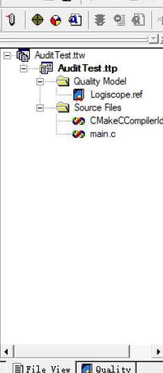

在测试之前，需要对源文件进行编译检查，选择“Project”->“Build”菜单命令。
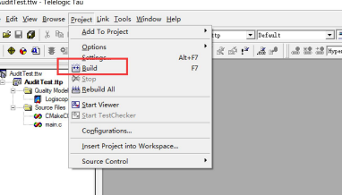

### 2.2 分析 Audit 结果

#### 2.2.1 度量元级结果分析

1. 选择“Project”->“Start Viewer”菜单命令，启动“Logiscope Viewer”。
    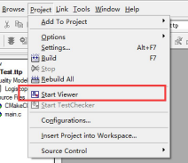
2. 界面左侧为被测程序的所有函数列表，可以选择主函数 `main` 来分析。
    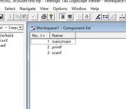
    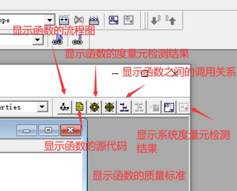
3. 介绍一些工具栏上的主要按钮：
    - 单击“显示函数的流程图”按钮，会显示函数的流程图。
      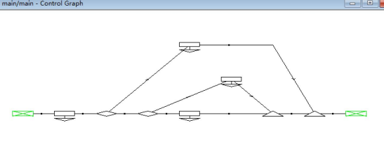
    - 单击“显示函数的源代码”按钮，会显示函数的源代码。
      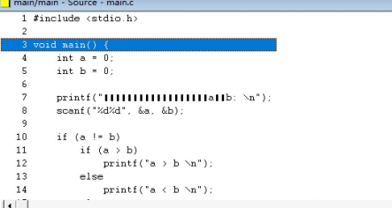
    - 单击“显示函数的度量元检测结果”按钮，会显示函数在度量元级的分析结果。
      
    - 单击“显示函数的质量标准”按钮，会显示函数在质量标准级的分析结果。
      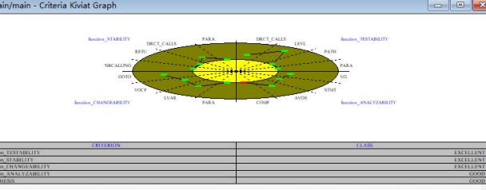
    - 单击“显示函数之间的调用关系”按钮，会显示函数之间的调用关系的分析结果。
      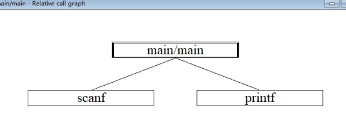

#### 2.2.2 质量标准级结果分析

1. 选择“Browse”->“Quality”->“Criteria Level”菜单命令，Logiscope 会自动生成被测程序在质量标准级的检测结果。
   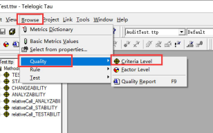
2. 单击左侧的加号，可以将某个质量标准展开。
3. 如果对某个质量标准不熟悉，可以双击这个质量标准，在右侧查看其详细解释。
   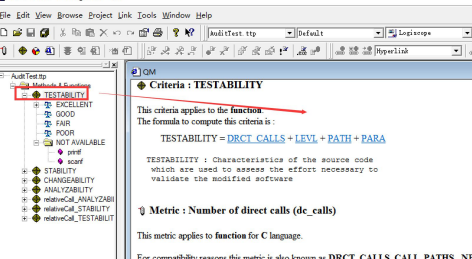

#### 2.2.3 质量因素级结果分析

1. 选择“Browse”->“Quality”->“Factor Level”菜单命令，Logiscope 会自动生成被测程序在质量因素级的检测结果。
2. 如果对某个质量因素不熟悉的话，可以双击这个质量因素，在右侧查看其详细解释。

#### 2.2.4 结果分析报告

1. Logiscope 会自动生成 Audit 检测报告。
   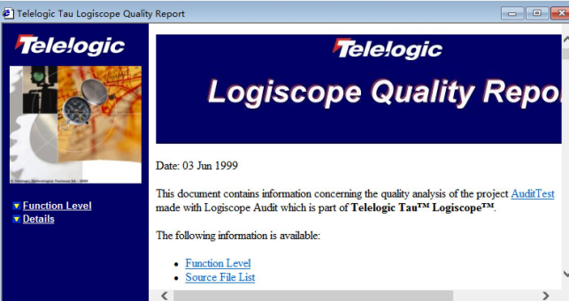
2. 选择“Browse”->“Quality”->“Quality Report”菜单命令，Logiscope 会自动生成被测程序的结果分析报告。
   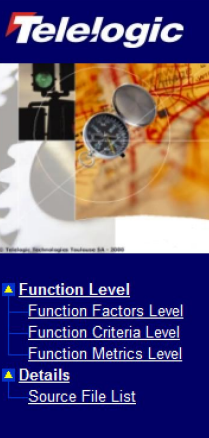
3. 单击左侧向下的三角号，可以分别查看被测函数或类在 3 种质量级别的统计图及源文件列表。

## 3. 编码规则模块 RuleChecker

RuleChecker 主要从细节上来检查代码是否符合相应的语法规范。

代码如下：

```c
#include <stdio.h>

main() {
    char a;
    printf("请输入一个字符：\n");
    scanf("%c", &a);
    if (a < 32) printf("控制字符：\n");
    else if (a >= '0' && a <= '9') printf("数字\n");
    else if (a >= 'a' && a <= 'z') printf("小写字母\n");
    else if (a >= 'A' && a <= 'Z') printf("大写字母\n");
    else printf("其他字符\n");
}
```

### 3.1 创建一个 RuleChecker 工程

1. 与创建 Audit 工程一样，首先也是在 VC6.0 里编辑，编译该段程序，保证该程序编译通过，保存该 VC 工程，然后运行 Logiscope，选择“File”->“New”。
   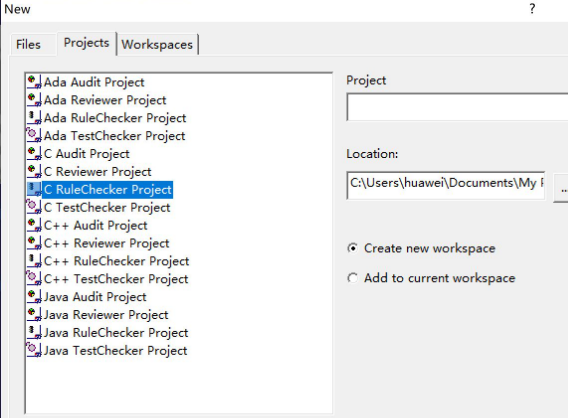
2. 选择“C RuleChecker Project”选项，输入工程名字，单击“确定”按钮，选择源代码路径对话框，其余保持默认。

3. 选择“Project”->“Build”，编译成功！

### 3.2 RuleChecker 结果分析

1. 选择“Browse”->“Rule”->“Rule Violations”菜单命令。
2. RuleChecker 就会自动将程序中所有不符合其编码规则的地方都列举出来。
3. 各文件夹的含义：
    - Violated Rules：代码未遵守的编码规则。
    - Clean Rules：代码遵守的编码规则。
    - Ignored Rules：本次检测中忽略的编码规则。

点击左侧的加号，可以将该规则展开。
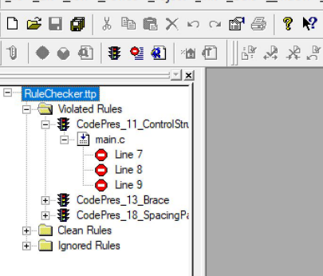

#### 修改代码如下：

```c
#include <stdio.h>

main() {
    char a;
    printf("请输入一个字符：\n");
    scanf("%c", &a);

    if (a < 32)
        printf("控制字符\n");
    else if (a >= '0' && a <= '9')
        printf("数字\n");
    else if (a >= 'a' && a <= 'z')
        printf("小写字母\n");
    else if (a >= 'A' && a <= 'Z')
        printf("大写字母\n");
    else
        printf("其他字符\n");
}
```

1. 单击工具栏上的重新编译按钮。
2. 弹出提示对话框，单击“否”按钮。
3. 编译完成后，重新选择“Rule Violations Report”，原来违反规则的地方已经没有。
4. RuleChecker 还可以自动生成统计报告，选择“Browse”->“Rule”->“Rule Violations Report”菜单命令，自动生成报告。
   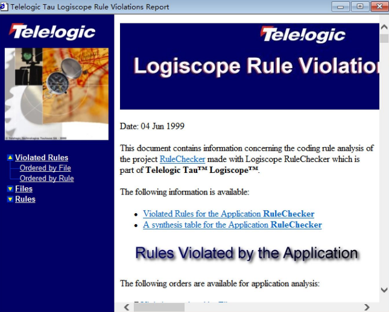

## 4. 动态测试模块 TestChecker

TestChecker 可以动态测试程序，并且能够统计测试的各种覆盖率。

### 4.1 创建一个 TestChecker 工程

测试如下 C 语言程序：

```c
#include <stdio.h>

main() {
    char a;
    printf("请输入一个字符：\n");
    scanf("%c", &a);

    if (a < 32)
        printf("控制字符\n");
    else if (a >= '0' && a <= '9')
        printf("数字\n");
    else if (a >= 'a' && a <= 'z')
        printf("小写字母\n");
    else if (a >= 'A' && a <= 'Z')
        printf("大写字母\n");
    else
        printf("其他字符\n");
}
```

1. 与之前一样，首先也是在 VC6.0 里编辑、编译该程序，保证编译通过，
   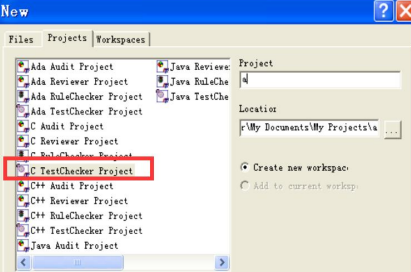

保存该 VC 工程，然后运行 Logiscope，选择“File”->“New”。
2. 选择“C TestChecker Project”选项，输入工程名字，单击“确定”按钮，选择源代码路径对话框，其余保持默认。
   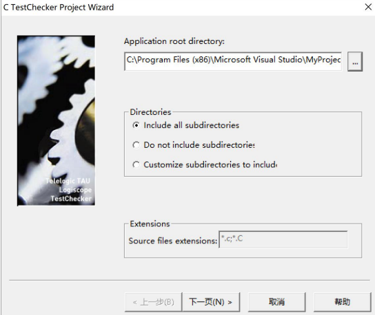
   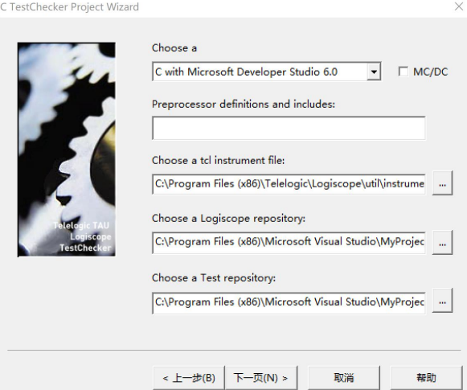

3. 选择“Project”->“Build”菜单命令，编译成功！

