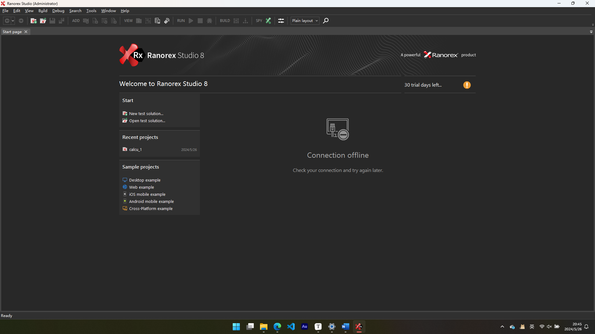
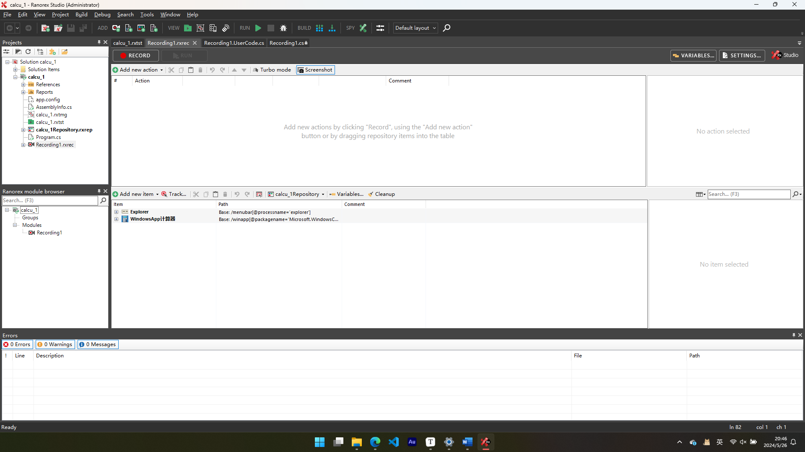
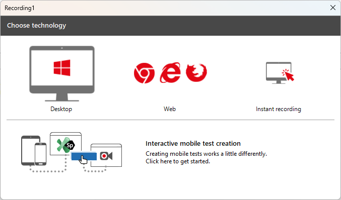
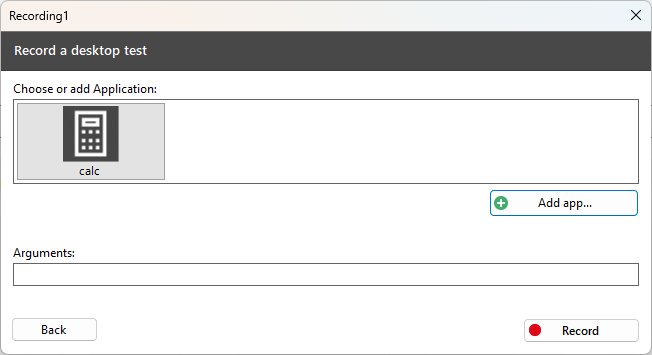
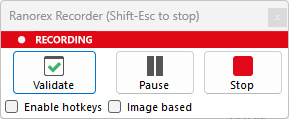
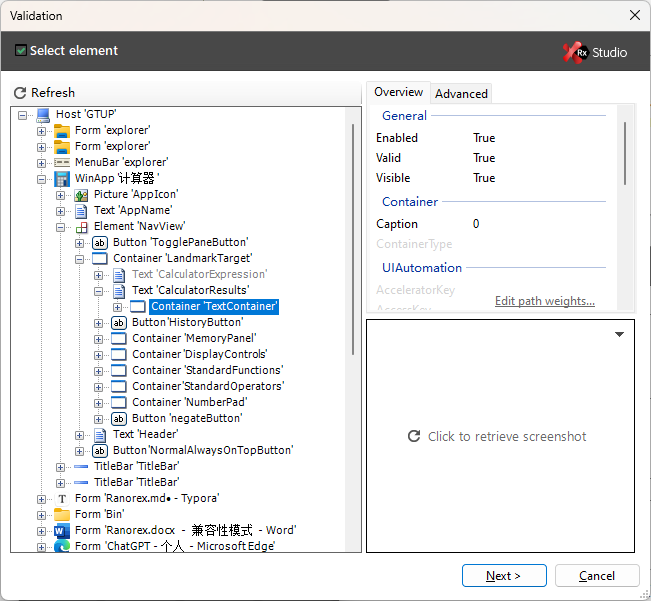
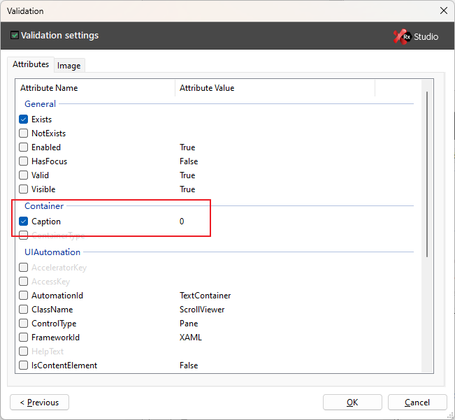
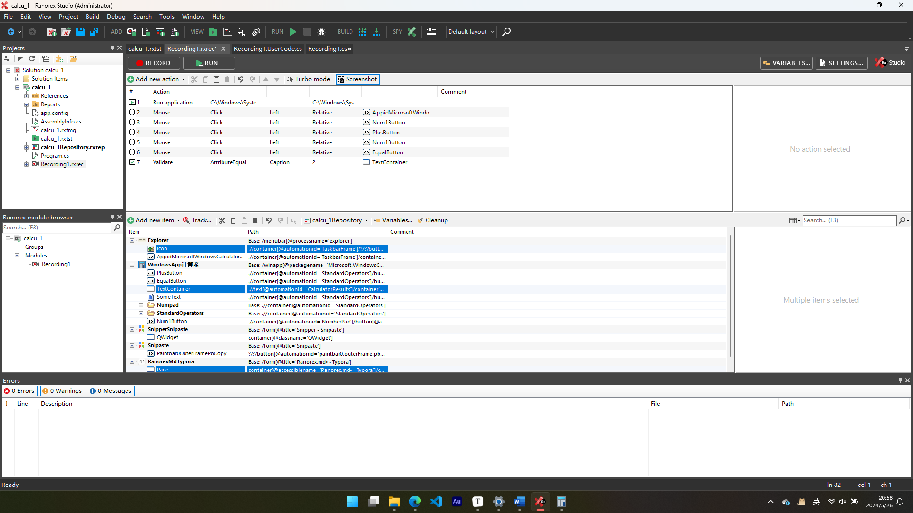
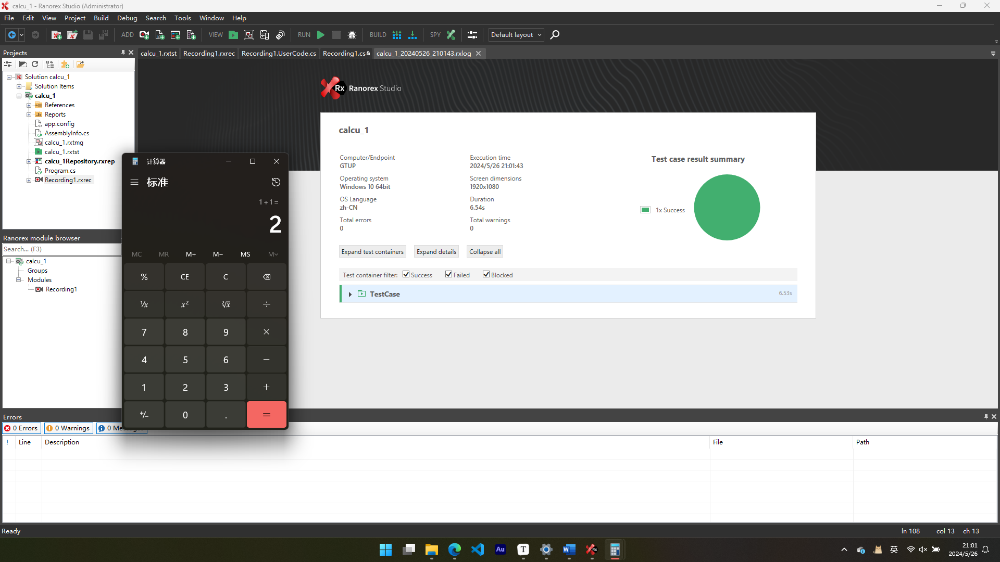
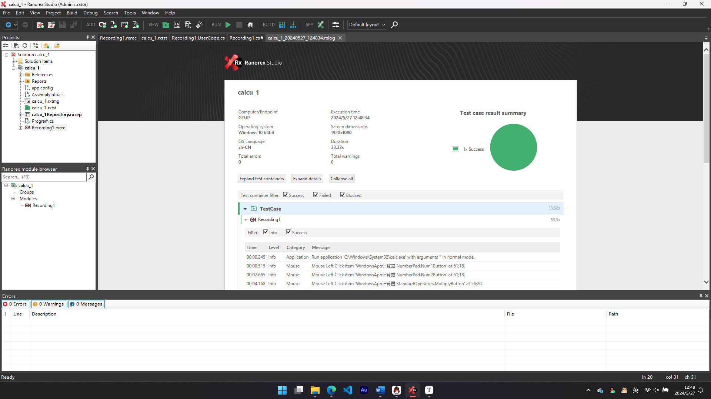

<div align="center"><strong><font size=8>Ranorex实验报告</font></strong></div>


<div align="center"><strong><font size=5>班级：</font></strong></div>

<div align="center"><strong><font size="5">学号：</font></strong></div>

<div align="center"><strong><font size="5">姓名：</font></strong></div>

<div align="center"><strong><font size="5">指导教师：</font></strong></div>


[TOC]
<div style="page-break-after: always;"></div>

## 实验环境
- **软件环境：**
  - 操作系统：Windows 11 23H2
  - Ranorex：Ranorex-8.1.1
  - 其他软件：calc.exe（win11自带计算器）

## 实验步骤
### 一、软件介绍

本次实验使用的是 Ranorex-8.1.1，包含了**Ranorex Test Suite Runner 8**、**Ranorex Spy 8**和**Ranorex Recorder 8**。

#### Ranorex-8.1.1

Ranorex是一个功能强大的测试自动化工具，广泛应用于桌面、Web和移动应用的测试自动化。本次实验使用的是Ranorex的8.1.1版本，具体包含以下组件：

##### Ranorex Test Suite Runner 8

Ranorex Test Suite Runner是用于执行测试套件的工具。它允许用户运行整个测试套件或其中的部分测试用例，并生成详细的测试报告。Test Suite Runner具有以下特点：

- **执行测试套件：** 支持运行完整的测试套件或选择性的测试用例。
- **报告生成：** 自动生成测试报告，包含测试结果的详细信息。
- **命令行支持：** 可以通过命令行参数进行测试执行，方便集成到CI/CD流水线中。

##### Ranorex Spy 8

Ranorex Spy是一个强大的对象识别工具，用于识别和分析应用程序中的UI元素。它提供了详细的元素属性信息，使得自动化脚本能够精确地与应用程序交互。Ranorex Spy具有以下特点：

- **元素识别：** 支持识别桌面、Web和移动应用中的UI元素。
- **属性查看：** 提供详细的UI元素属性信息，帮助用户理解和使用这些元素。
- **路径编辑：** 允许用户编辑元素的路径，提高自动化脚本的稳定性。

##### Ranorex Recorder 8

Ranorex Recorder是一个用户友好的录制工具，用于记录用户在应用程序中的操作，并将这些操作转化为自动化测试脚本。它具有以下特点：

- **操作录制：** 自动记录用户在应用中的操作，生成相应的测试脚本。
- **脚本编辑：** 允许用户对生成的脚本进行编辑和优化。
- **代码生成：** 生成的测试脚本可以以多种编程语言（如C#和VB.NET）保存，便于进一步开发和维护。

Ranorex-8.1.1及其组件为测试自动化提供了全面的解决方案，简化了测试脚本的创建和执行过程，提升了测试效率和质量。

### 二、软件安装

1. 可到[www.ranorex.com](http://www.ranorex.com/)官网下载安装包。
2. 运行安装向导程序，将所有组件全部安装。

### 三、实验过程

#### 1.新建项目

使用**管理员身份**打开Ranorex Studio，默认的目录为："安装目录\Ranorex 8.1\Bin\RanorexStudio.exe"，如果不以管理员权限打开，后续的脚本运行将会出现错误。打开软件的首界面如下：
  

选择`New test solution`新建项目，这里的项目名取作“calcu_1”，打开项目：
  

#### 2.录制操作

单击`RECORD`按钮，选择`Desktop`，点击`Add app...`，并在后续的窗口中找到“calc.exe”，系统默认的路径为："C:\Windows\System32\calc.exe"。点击`Record`按钮即开始录制。
  
  

在弹出的计算器界面中按顺序按下`1`、`+`、`1`、`=`按钮，并在Ranorex Recorder窗口中选择`Validate`并开始选择验证。

  注意，点击时要注意电机的是按钮，而不是按钮上的文字。
  

单击选择计算器的输出窗口，并在后续的窗口中勾选`Container`中的`Caption`，这样软件会自动判断输出是否符合预期结果。最后单击`Stop`结束录制。

  注意，要选择文本框，而不是文本框里的文本。

  
  

结束录制后的窗口如下：此时点击`RUN`即可自动开始测试。
  
  

#### 3.修改脚本

测试中主要用到了两个文件，calcu_1\Recording1.UserCode.cs和calcu_1\Recording1.cs，其中Recording1.cs中的代码不可以被修改，我们可以通过修改calcu_1\Recording1.UserCode.cs里的Init()函数来手动编写一些操作。
  编写的时候需要注意，我们调用选择的按钮组件，例如“Num1Button”的“Click()”方法时，如果不填参数将会点击按钮的中间，填写的参数为从按钮左上角开始计算的坐标。
  注意执行的时候软件会先执行我们自己编写的Init函数，然后执行之前录制的操作，为了方便，这里将前面录制的操作删除，只保留我们自己编写的函数。我们以“$12\times37=444$、$123/ 3=41$、$460-4\times9=4,104$”为例编写测试用例，代码和执行结果如下：
  

``` c#
// Recording1.UserCode.cs
private void testMutiply()
        {
        	Report.Log(ReportLevel.Info, "Application", "Run application 'C:\\Windows\\System32\\calc.exe' with arguments '' in normal mode.", new RecordItemIndex(0));
            Host.Local.RunApplication("C:\\Windows\\System32\\calc.exe", "", "C:\\Windows\\System32", false);
            Delay.Milliseconds(0);
            
            Report.Log(ReportLevel.Info, "Mouse", "Mouse Left Click item 'WindowsApp计算器.NumberPad.Num1Button' at 61;18.", repo.WindowsApp计算器.NumberPad.Num1ButtonInfo, new RecordItemIndex(1));
            repo.WindowsApp计算器.NumberPad.Num1Button.Click();
            Delay.Milliseconds(200);
            
            Report.Log(ReportLevel.Info, "Mouse", "Mouse Left Click item 'WindowsApp计算器.NumberPad.Num2Button' at 61;18.", repo.WindowsApp计算器.NumberPad.Num2ButtonInfo, new RecordItemIndex(2));
            repo.WindowsApp计算器.NumberPad.Num2Button.Click();
            Delay.Milliseconds(200);
            
            Report.Log(ReportLevel.Info, "Mouse", "Mouse Left Click item 'WindowsApp计算器.StandardOperators.MultiplyButton' at 56;20.", repo.WindowsApp计算器.StandardOperators.MultiplyButtonInfo, new RecordItemIndex(3));
            repo.WindowsApp计算器.StandardOperators.MultiplyButton.Click();
            Delay.Milliseconds(200);
            
            Report.Log(ReportLevel.Info, "Mouse", "Mouse Left Click item 'WindowsApp计算器.NumberPad.Num3Button' at 61;18.", repo.WindowsApp计算器.NumberPad.Num3ButtonInfo, new RecordItemIndex(4));
            repo.WindowsApp计算器.NumberPad.Num3Button.Click();
            Delay.Milliseconds(200);
            
            Report.Log(ReportLevel.Info, "Mouse", "Mouse Left Click item 'WindowsApp计算器.NumberPad.Num7Button' at 61;18.", repo.WindowsApp计算器.NumberPad.Num7ButtonInfo, new RecordItemIndex(5));
            repo.WindowsApp计算器.NumberPad.Num7Button.Click();
            Delay.Milliseconds(200);
            
            Report.Log(ReportLevel.Info, "Mouse", "Mouse Left Click item 'WindowsApp计算器.NumberPad.Num7Button' at 61;18.", repo.WindowsApp计算器.NumberPad.Num7ButtonInfo, new RecordItemIndex(5));
            repo.WindowsApp计算器.StandardOperators.EqualButton.Click();
            Delay.Milliseconds(200);
            
            Report.Log(ReportLevel.Info, "Validation", "Validating AttributeEqual (Caption='444') on item 'WindowsApp计算器.TextContainer'.", repo.WindowsApp计算器.TextContainerInfo, new RecordItemIndex(6));
            Validate.AttributeEqual(repo.WindowsApp计算器.TextContainerInfo, "Caption", "444");
            Delay.Milliseconds(100);
            
            Report.Log(ReportLevel.Info, "Mouse", "Mouse Left Click item 'WindowsApp计算器.Close' at 27;18.", repo.WindowsApp计算器.CloseInfo, new RecordItemIndex(7));
            repo.WindowsApp计算器.Close.Click("27;18");
            Delay.Milliseconds(200);
        }
        
        private void testDivide()
        {
        	Report.Log(ReportLevel.Info, "Application", "Run application 'C:\\Windows\\System32\\calc.exe' with arguments '' in normal mode.", new RecordItemIndex(0));
            Host.Local.RunApplication("C:\\Windows\\System32\\calc.exe", "", "C:\\Windows\\System32", false);
            Delay.Milliseconds(0);
            
            Report.Log(ReportLevel.Info, "Mouse", "Mouse Left Click item 'WindowsApp计算器.NumberPad.Num1Button' at 61;18.", repo.WindowsApp计算器.NumberPad.Num1ButtonInfo, new RecordItemIndex(1));
            repo.WindowsApp计算器.NumberPad.Num1Button.Click();
            Delay.Milliseconds(200);
            
            Report.Log(ReportLevel.Info, "Mouse", "Mouse Left Click item 'WindowsApp计算器.NumberPad.Num2Button' at 61;18.", repo.WindowsApp计算器.NumberPad.Num2ButtonInfo, new RecordItemIndex(2));
            repo.WindowsApp计算器.NumberPad.Num2Button.Click();
            Delay.Milliseconds(200);
            
            
            Report.Log(ReportLevel.Info, "Mouse", "Mouse Left Click item 'WindowsApp计算器.NumberPad.Num3Button' at 61;18.", repo.WindowsApp计算器.NumberPad.Num3ButtonInfo, new RecordItemIndex(3));
            repo.WindowsApp计算器.NumberPad.Num3Button.Click();
            Delay.Milliseconds(200);
            
            Report.Log(ReportLevel.Info, "Mouse", "Mouse Left Click item 'WindowsApp计算器.StandardOperators.DevideButton' at 56;20.", repo.WindowsApp计算器.StandardOperators.DivideButtonInfo, new RecordItemIndex(4));
            repo.WindowsApp计算器.StandardOperators.DivideButton.Click();
            Delay.Milliseconds(200);
            
            Report.Log(ReportLevel.Info, "Mouse", "Mouse Left Click item 'WindowsApp计算器.NumberPad.Num3Button' at 61;18.", repo.WindowsApp计算器.NumberPad.Num3ButtonInfo, new RecordItemIndex(5));
            repo.WindowsApp计算器.NumberPad.Num3Button.Click();
            Delay.Milliseconds(200);
            
            Report.Log(ReportLevel.Info, "Mouse", "Mouse Left Click item 'WindowsApp计算器.NumberPad.Num7Button' at 61;18.", repo.WindowsApp计算器.NumberPad.Num7ButtonInfo, new RecordItemIndex(5));
            repo.WindowsApp计算器.StandardOperators.EqualButton.Click();
            Delay.Milliseconds(200);
            
            Report.Log(ReportLevel.Info, "Validation", "Validating AttributeEqual (Caption='41') on item 'WindowsApp计算器.TextContainer'.", repo.WindowsApp计算器.TextContainerInfo, new RecordItemIndex(6));
            Validate.AttributeEqual(repo.WindowsApp计算器.TextContainerInfo, "Caption", "41");
            Delay.Milliseconds(100);
            
            Report.Log(ReportLevel.Info, "Mouse", "Mouse Left Click item 'WindowsApp计算器.Close' at 27;18.", repo.WindowsApp计算器.CloseInfo, new RecordItemIndex(7));
            repo.WindowsApp计算器.Close.Click("27;18");
            Delay.Milliseconds(200);
        }
        
        private void testMinusMutiply()
        {
        	Report.Log(ReportLevel.Info, "Application", "Run application 'C:\\Windows\\System32\\calc.exe' with arguments '' in normal mode.", new RecordItemIndex(0));
            Host.Local.RunApplication("C:\\Windows\\System32\\calc.exe", "", "C:\\Windows\\System32", false);
            Delay.Milliseconds(0);
            
            Report.Log(ReportLevel.Info, "Mouse", "Mouse Left Click item 'WindowsApp计算器.NumberPad.Num4Button' at 63;21.", repo.WindowsApp计算器.NumberPad.Num4ButtonInfo, new RecordItemIndex(2));
            repo.WindowsApp计算器.NumberPad.Num4Button.Click();
            Delay.Milliseconds(200);
            
            Report.Log(ReportLevel.Info, "Mouse", "Mouse Left Click item 'WindowsApp计算器.NumberPad.Num6Button' at 56;24.", repo.WindowsApp计算器.NumberPad.Num6ButtonInfo, new RecordItemIndex(3));
            repo.WindowsApp计算器.NumberPad.Num6Button.Click();
            Delay.Milliseconds(200);
            
            Report.Log(ReportLevel.Info, "Mouse", "Mouse Left Click item 'WindowsApp计算器.NumberPad.Num0Button' at 56;29.", repo.WindowsApp计算器.NumberPad.Num0ButtonInfo, new RecordItemIndex(4));
            repo.WindowsApp计算器.NumberPad.Num0Button.Click();
            Delay.Milliseconds(200);
            
            Report.Log(ReportLevel.Info, "Mouse", "Mouse Left Click item 'WindowsApp计算器.StandardOperators.MinusButton' at 62;26.", repo.WindowsApp计算器.StandardOperators.MinusButtonInfo, new RecordItemIndex(5));
            repo.WindowsApp计算器.StandardOperators.MinusButton.Click();
            Delay.Milliseconds(200);
            
            Report.Log(ReportLevel.Info, "Mouse", "Mouse Left Click item 'WindowsApp计算器.NumberPad.Num4Button' at 64;21.", repo.WindowsApp计算器.NumberPad.Num4ButtonInfo, new RecordItemIndex(6));
            repo.WindowsApp计算器.NumberPad.Num4Button.Click();
            Delay.Milliseconds(200);
            
            Report.Log(ReportLevel.Info, "Mouse", "Mouse Left Click item 'WindowsApp计算器.StandardOperators.MultiplyButton' at 63;28.", repo.WindowsApp计算器.StandardOperators.MultiplyButtonInfo, new RecordItemIndex(7));
            repo.WindowsApp计算器.StandardOperators.MultiplyButton.Click();
            Delay.Milliseconds(200);
            
            Report.Log(ReportLevel.Info, "Mouse", "Mouse Left Click item 'WindowsApp计算器.NumberPad.Num9Button' at 57;27.", repo.WindowsApp计算器.NumberPad.Num9ButtonInfo, new RecordItemIndex(8));
            repo.WindowsApp计算器.NumberPad.Num9Button.Click();
            Delay.Milliseconds(200);
            
            Report.Log(ReportLevel.Info, "Mouse", "Mouse Left Click item 'WindowsApp计算器.StandardOperators.EqualButton' at 65;41.", repo.WindowsApp计算器.StandardOperators.EqualButtonInfo, new RecordItemIndex(9));
            repo.WindowsApp计算器.StandardOperators.EqualButton.Click();
            Delay.Milliseconds(200);
            
            Report.Log(ReportLevel.Info, "Validation", "Validating AttributeEqual (Caption='4,104') on item 'WindowsApp计算器.TextContainer'.", repo.WindowsApp计算器.TextContainerInfo, new RecordItemIndex(10));
            Validate.AttributeEqual(repo.WindowsApp计算器.TextContainerInfo, "Caption", "4,104");
            Delay.Milliseconds(100);
            
            Report.Log(ReportLevel.Info, "Mouse", "Mouse Left Click item 'WindowsApp计算器.Close' at 22;18.", repo.WindowsApp计算器.CloseInfo, new RecordItemIndex(11));
            repo.WindowsApp计算器.Close.Click();
            Delay.Milliseconds(200);
            
        }
        
        private void Init()
        {
            // Your recording specific initialization code goes here.       
            testMutiply();
            testDivide();
            testMinusMutiply();
            
        }
```

